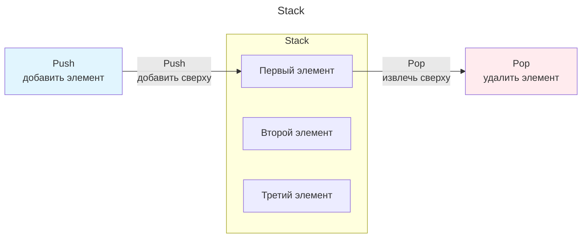
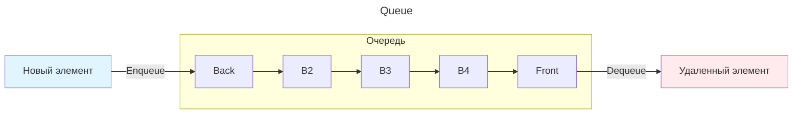
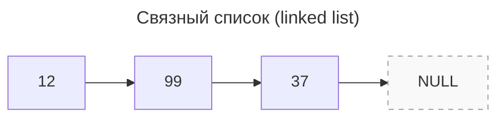
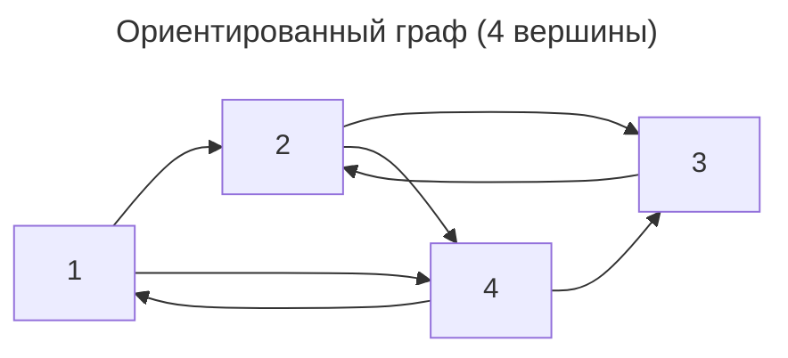

---
aliases:
  - data structures
  - immutable
  - Python collections
  - Python data structures
  - slicing
  - tuple
  - Tuples
  - unpacking
  - Генератор коллекций
  - Кортеж
  - Кортежи
  - Распаковка
  - Словари
  - Срезы
---

## Встроенные типы коллекций

Встроенные **структуры данных**:

1. Lists — списки
2. Tuples — кортежи
3. Sets — множества
4. Dictionaries — словари

### Сравнение типов коллекций

1. Если не планируется изменять последовательность после её создания, то кортеж, так как самый быстрый.
2. Если не нужно хранить дубликаты, то множество, так как поиск быстрее, чем в списке.
3. Если необходимо хранить дубликаты, то список или кортеж.

| | tuple | list | set | dict |
|---|---|---|---|---|
| дефиниция | `(3, 9, 74, 1)` | `[3, 9, 74, 1]` | `{9, 74, 3, 1}` | `{'k11': 9, 'k2': 74}` |
| обращение по индексу | ок | ок | **нет** | **нет** |
| изменение данных | immutable | `.append(val)`, `.pop()` | `.add(val)`, `.pop()` | `.update({'k':'v'})`, `.pop()` |
| операторы сочетания | `+`, `*` | `+`, `*` | `\|`, `&`, `-`, `^` | `\|`, `&`, `-`, `^` |
| сортировка | нет | `sort()` | нет | нет |
| поиск | `.index(val)` | `.index(val)` | нет | `.get(key)` |
| прочее | самый быстрый; только 2 метода: `.index(val)`, `.count(val)` | | только уникальные элементы; элементы упорядочиваются случайным образом | |

Проверка коллекций на примерах:

```python
# кортежи
tuple_num = (3, 9, 74, 74, 1)
# списки
list_num = list(tuple_num)
list_men = ['Сергей', 'Соня', 'Дима', 'Алина', 'Егор']
# множества
set_num = set(list_num)
set_men = set(list_men)
# словари
dict_men = dict(zip(list_men, set_num))
tuple_men = dict_men
# тесты
print("\nТЕСТ НА СОРТИРОВАННОСТЬ И УНИКАЛЬНОСТЬ ЭЛЕМЕНТОВ")
print('tuple_num',tuple_num)
print('tuple_men',tuple_men)
print('list_num',list_num)
print('set_num',set_num)
print('dict_men',dict_men)
# нигде сортировки не выявлено
print("\nТЕСТ НА ОБРАЩЕНИЕ ПО ИНДЕКСУ",i:=1)
print('tuple_num[i]',tuple_num[i])
print('list_num[i]',list_num[i])
print('set_num[i]','TypeError')
print('dict_men[i]','KeyError')
print("\nТЕСТ НА ПЕРЕЗАПИСЬ ПО ИНДЕКСУ",i:=2,v:=77)
print('tuple_num[i]=v','TypeError')
list_num[i]=v # доступно только для списков
print('list_num[i]=v',list_num)
print('set_num[i]=v','TypeError')
```

#### Операторы сочетания у коллекций

- `|` — union
- `&` — intersection
- `-` — difference
- `^` — symmetric difference
- `+` — addition
- `*` — multiplication

Обзор работы операторов:

```python
print('num1:',num1 := [1, 2, 3, 4, 5, 6])
print('num2:',num2 := [4, 5, 6, 7, 8, 9])
# |, &, -, ^, +, * для списков:
print('\nОПЕРАТОРЫ СОЧЕТАНИЯ СПИСКОВ')
print('list |, &, -, ^ operators:', 'TypeError')
print('list + operator:', list(num1) + list(num2))
print('list *3 operation:', list(num1) * 3)
# |, &, -, ^, +, * для кортежей:
print('\nОПЕРАТОРЫ СОЧЕТАНИЯ КОРТЕЖЕЙ')
print('set |, &, -, ^ operators:', 'TypeError')
print('tuple + operator:', tuple(num1) + tuple(num2))
print('tuple *3 operation:', tuple(num1) * 3)
# |, &, -, ^, +, * для множеств:
print('\nОПЕРАТОРЫ СОЧЕТАНИЯ МНОЖЕСТВ')
print('set | union operator:', set(num1) | set(num2))
print('set & intersection operator:', set(num1) & set(num2))
print('set - difference operator:', set(num1) - set(num2))
print('set ^ symmetric difference operator:', set(num1) ^ set(num2))
print('set +, * operators:', 'TypeError')
```

### Распаковка коллекций (unpacking)

Пример распаковки:

```python
# распаковка коллекции в переменные:
numbers = [1, 2]
a, b = numbers
a, b = b, a
print(a, b) # 2 1
# распаковка коллекции в переменные либо список:
numbers = (1, 2, 3, 4, 5, 6, 7, 8, 9)
a, *b, c = numbers # одинаково для (кортежей), [списков], {словарей}, {множеств}
print(a, b, c) # 1 [2, 3, 4, 5, 6, 7, 8] 9
```

### Генераторы коллекций (comprehensions)

Пример генерации списка или множества:

```python
# удалим гласные из слова при помощи генератора коллекции
word_list = list('awesome')
vowels_list = list('aeiou')
# можно генерировать список, либо множество
result = [i for i in word_list if i not in vowels_list]
result = {i for i in word_list if i not in vowels_list}
print(result)
# генерация коллекции с навигацией по словарю
people = [{
  "first_name": "Василий",
  "birthday": "9/25/1984"
}, {
  "first_name": "Регина",
  "birthday": "8/21/1995"
}]
birthdays = [
  person[term]
  for person in people
  for term in person
  if term == "birthday"
]
print(birthdays)
# квадраты чисел, которые делятся на 3 и 5
x = 50 # int(input())
third = [ i**2 for i in range(x) if 0 == i % 3 and 0 == i % 5 ] # [...15,..]
print ( third )
```

### Списки (list)

#### Функции списков

- `.append(item)` — добавить объект в конец списка.
- `len()` — получить длину списка.
- `.insert(index, item)` — вставляет новый элемент на любую позицию списка.
- `.index(item)` — находит первое вхождение элемента и возвращает его индекс.
- `max(list)` — возвращает максимальный элемент списка.
- `min(list)` — возвращает минимальный элемент списка.
- `list.count(item)` — подсчитывает, сколько раз элемент встречается в списке.
- `list.remove(item)` — удаляет объект из списка.
- `list.reverse()` — разворачивает элементы списка.
- …

#### Срезы списков (list slices)

Пример срезов:

```python
sqs = [0, 1, 4, 9, 16, 25, 36, 49, 64]
print(sqs[4:7]) #[16, 25, 36]
print(sqs[:7])
print(sqs[4:])
squares = [0, 1, 4, 9, 16, 25, 36, 49, 64, 81]
print(squares[::2])
print(squares[2:8:3])
squares = squares[::-1] # развернуть список
print(squares[2:-1]) # начать с конца списка
```

#### Разворот списка

Пример разворота:

```python
list = [1, 1, 2, 3, 5, 8, 13]
list = list[::-1] # список задом на перед
```

### Словари (dict)

Пример обращения по ключу и метода `.get()`:

```python
# обращения по ключу
dict = {'a':[1,2,3], "x":"yes"}
# пример .get()
books = {
    "Life of Pi": "Adventure Fiction",
    "The Three Musketeers": "Historical Adventure",
}
book = input()
# change this part to use the .get() method
print (books.get(book,"Book not found"))
```

#### Функции словарей

- `.split()`, `.join()`

Пример объединения значений через `.join()`:

```python
line = '\t'.join(str(v) for v in dev['result'].values())
```

### Множества (set)

`set_num = {1, 2, 3}`

- Не могут содержать дубликатов.

#### Функции множеств

- `in` — быстрый поиск.
- `.add(val)`
- `.remove(val)`
- …

#### Операторы множеств

`|`, `&`, `-`, `^`

Sets can be combined using mathematical operations.

- **The union operator `|`** combines two sets to form a new one containing items in either.
- **The intersection operator `&`** gets items only in both.
- **The difference operator `-`** gets items in the first set but not in the second.
- **The symmetric difference operator `^`** gets items in either set, but not both.

### Кортежи (tuple)

`numbers = (1, 2, 3, 4)`

- Нельзя менять значения.
- Быстрее, чем списки.

#### Функции кортежей

У кортежей всего лишь 2 метода:

- `.index(val)`
- `.count(val)`

## Абстрактные структуры данных

Абстрактный тип данных (АТД) — это математическая модель для типов данных, где тип данных определяется поведением (семантикой) с точки зрения пользователя данных.

Ниже — реализации `[[algorithm|Stack]]`, `Queue`, `Tree`, `Linked List`.

### Стек (stack)

Стек можно представить как стопку тарелок: чтобы взять вторую сверху, нужно снять верхнюю.

**Структура данных**: Стек (Stack)

**Принцип**: LIFO (Last In, First Out) — последний вошел, первый вышел

**Операции**:

- **Push** — добавление элемента на вершину стека
- **Pop** — извлечение (и удаление) элемента с вершины стека

Реализация в python

- Доступ к данным через `push(val)`, `pop()`



Пример реализации стека:

```python
class Stack:
    def __init__(self):
        self.items = []
    def is_empty(self):
        return self.items == []
    def push(self, item):
        self.items.insert(0, item)
    def pop(self):
        return self.items.pop(0)
    def print_stack(self):
        print(self.items)
s = Stack()
s.push('a')
s.push('b')
s.push('c')
s.print_stack()
s.pop()
s.print_stack()
```
### Очередь (queue)

- **FIFO** (first in, first out)
  - Добавление элемента называется `enqueue` — поставить в очередь, возможно лишь в конец очереди.
  - Выборка элемента только из начала очереди, `dequeue` — убрать из очереди, при этом выбранный элемент из очереди удаляется.
- The elements are inserted from one end, called the **rear**, and deleted from the other end, called the **front**.

Пример реализации очереди:

```python
class Queue:
    def __init__(self):
        self.items = []
    def is_empty(self):
        return self.items == []
    def enqueue(self, item):
        self.items.insert(0, item)
    def dequeue(self):
        return self.items.pop()
    def print_queue(self):
        print(self.items)
q = Queue()
q.enqueue('a')
q.enqueue('b')
q.enqueue('42')
q.print_queue()
q.dequeue()
q.print_queue()
```


#### Очередь с приоритетом (priority queue)

Очередь, которая поддерживает две обязательные операции — добавить элемент и извлечь максимум / минимум. Предполагается, что для каждого элемента можно вычислить его приоритет. Обычно меньшее значение ключа соответствует более высокому приоритету.

**Принцип**: FIFO (First In, First Out) — первый вошел, первый вышел

**Операции**:

- **Enqueue** — добавление элемента в конец очереди (Back)
- **Dequeue** — удаление элемента из начала очереди (Front)

**Методы**

- `insert(key, val)` — добавляет пару (ключ, значение) в хранилище.
- `extract_minimum()` — возвращает пару (ключ, значение) с минимальным значением ключа, удаляя её из хранилища.

### Связный список (linked list)

[[algorithm|Связанный список]] — это такой список, каждый элемент которого состоит из 2 ячеек: данные `data` и ссылка на следующий элемент связного списка `link`. Первый элемент такого списка называется голова `head`. Хвост списка имеет ссылку на `None`. Эта структура подходит для реализации undo/redo функции программы.



Каждый узел содержит:

1. **Данные** (значение)
2. **Указатель** на следующий узел

Пример реализации связного списка:

```python
class Node:
    def __init__(self, data, next):
        self.data = data
        self.next = next
class LinkedList:
    def __init__(self):
        self.head = None
    def add_at_front(self, data):
        self.head = Node(data, self.head)
    def add_at_end(self, data):
        if not self.head:
            self.head = Node(data, None)
            return
        curr = self.head
        while curr.next:
            curr = curr.next
        curr.next = Node(data, None)
    def get_last_node(self):
        n = self.head
        while(n.next != None):
            n = n.next
        return n.data
    def is_empty(self):
        return self.head == None
    def print_list(self):
        n = self.head
        while n != None:
            print(n.data, end = " => ")
            n = n.next
        print()
s = LinkedList()
s.add_at_front(5)
s.add_at_end(8)
s.add_at_front(9)
s.print_list()
print(s.get_last_node())
```

### Графы (graph)

**[[algorithm|Граф]]** — это множество связанных узлов, в котором каждый узел называется **вершиной** `vertex`, а связь между узлами — **ребром** `edge`.

#### Матрица смежности (adjacency matrix)

**Матрица смежности** `adjacency matrix` — один из способов представления графа в виде матрицы. Матрица смежности графа G с конечным числом вершин n (пронумерованных числами от 1 до n) — это квадратная целочисленная матрица A размера n × n, в которой значение элемента a i , j равно числу рёбер из i-й вершины графа в j-ю вершину.

**Матрица смежности**

|       | 1   | 2   | 3   | 4   |
| ----- | --- | --- | --- | --- |
| **1** | 0   | 1   | 0   | 1   |
| **2** | 0   | 0   | 1   | 1   |
| **3** | 0   | 1   | 0   | 0   |
| **4** | 1   | 0   | 1   | 0   |

**Визуализация графа**



## Анализ свойств графа

- **Количество вершин:** 4
- **Количество рёбер:** 7
- **Тип:** ориентированный (направленный), без петель (главная диагональ матрицы содержит только нули)
- **Степени вершин:**

| Вершина | Исходящие (out-degree) | Входящие (in-degree) |
|---------|------------------------|----------------------|
| 1       | 2 (→2, →4)            | 1 (←4)              |
| 2       | 2 (→3, →4)            | 2 (←1, ←3)          |
| 3       | 1 (→2)                | 2 (←2, ←4)          |
| 4       | 2 (→1, →3)            | 2 (←1, ←2)          |

- **Циклы:** присутствуют (например, `1 → 4 → 1`, `2 → 4 → 1 → 2`, `2 → 3 → 2`)
- **Связность:** граф сильно связный — из любой вершины можно достичь любую другую

Пример реализации графа:

```python
class Graph():
    def __init__(self, size):
        self.adj = [ [0] * size for i in range(size)]
        self.size = size
    def add_edge(self, orig, dest):
        if orig > self.size or dest > self.size or orig < 0 or dest < 0:
            print("Invalid Edge")
        else:
            self.adj[orig-1][dest-1] = 1
            self.adj[dest-1][orig-1] = 1
    def remove_edge(self, orig, dest):
        if orig > self.size or dest > self.size or orig < 0 or dest < 0:
            print("Invalid Edge")
        else:
            self.adj[orig-1][dest-1] = 0
            self.adj[dest-1][orig-1] = 0
    def display(self):
        for row in self.adj:
            print()
            for val in row:
                print('{:4}'.format(val),end="")
# a sample Graph
G = Graph(4)
G.add_edge(1, 3)
G.add_edge(3, 4)
G.add_edge(2, 4)
G.display()
```

### Дерево (tree)

Частный случай графа, который можно определить через граф. Дерево — это связный ацикличный граф.
