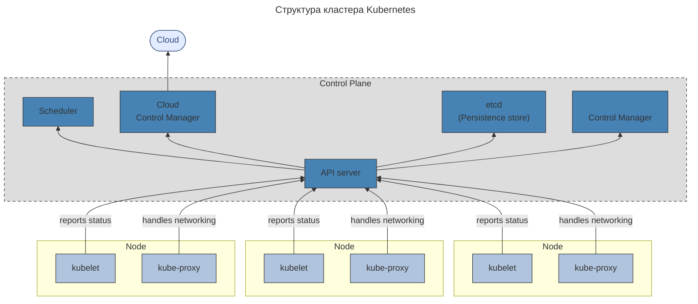

---
aliases:
  - API server
  - Container Registry
  - Container Resource Monitoring
  - IAM
  - internal DNS server
  - K8s
  - Kubernetes
  - Kubernetes API
  - Managed Service for Kubernetes
  - Yandex Cloud
  - Yandex Container Registry
  - Yandex Identity and Access Management
  - Yandex Managed Service for Kubernetes
  - внутренний DNS-сервер
  - зоны доступности
  - контроллеры основных ресурсов
---

## Оркестрация

Управление [[containerization|контейнерами]]: отслеживание работоспособности и перезапуск при сбоях, обновление, развёртывание, масштабирование, остановка. Такое управление называется **оркестрацией**.

---

## [[kubernetes|kubernetes]]

Наиболее популярная система управления контейнерами — [Kubernetes](https://kubernetes.io/)®, также известная как **K8s**. Это система с открытым исходным кодом, которая автоматизирует операции с контейнерами: мониторинг, распределение нагрузки, предоставление ресурсов и пр.

### Структура K8s

#### Под

В Kubernetes контейнеры или наборы контейнеров размещаются на **подах** (pod). Под — это логический хост.

#### Узел

Один или несколько подов, а также сервисы для управления подами образуют **узел**, или **ноду** (node).
- Узел — это рабочая машина, виртуальная либо физическая.
- Однотипные узлы образуют **группу узлов**.

#### Кластер

В свою очередь, узлы объединяются в **кластер**.

#### Панель управления

У каждого кластера есть своя панель управления (**control plane**), именно она и обеспечивает оркестрацию.

Один из узлов кластера становится главным — **мастером** (master). Он запускает управляющие процессы Kubernetes:
- сервер **Kubernetes API**,
- **планировщик**,
- **контроллеры основных ресурсов**.

#### Неймспейс

В одном физическом кластере могут находиться несколько виртуальных. Виртуальный кластер называется **[[kubernetes|пространством имён]]** (**namespace**).
- В отличие от нод и подов, которые в кластере есть всегда, пространства имён используют тогда, когда в них возникает реальная необходимость.

#### Расширения

В кластер Kubernetes можно устанавливать расширения, облегчающие управление: графический веб-интерфейс Dashboard или инструмент для мониторинга ресурсов кластера Container Resource Monitoring. Они необязательны.

Единственное обязательное расширение — внутренний DNS-сервер кластера. Он необходим для общения сервисов между собой.

---

## Что делает [[kubernetes|kubernetes]]

- **Автоматическое развёртывание.** Состояние контейнеров описывается в виде конфигурации, а Kubernetes автоматически обеспечивает заданное состояние: развёртывает и удаляет контейнеры, перераспределяет ресурсы.
- **Мониторинг сервисов и балансировка.** Kubernetes распределяет сетевой трафик так, чтобы развёртывание было стабильным.
- **Оркестрация хранилища.** Kubernetes автоматически монтирует систему хранения: локальное или облачное хранилище.
- **Самоконтроль.** Kubernetes перезапускает отказавшие контейнеры, заменяет их и завершает работу контейнеров, которые не соответствуют заданному уровню работоспособности.

---

## Yandex Managed Service for [[kubernetes|kubernetes]]

Чтобы упростить администрирование и интеграцию, в Yandex Cloud есть сервис [Managed Service for Kubernetes](https://cloud.yandex.ru/docs/managed-kubernetes/).

- При использовании Yandex Managed Service for Kubernetes создаются кластер и группы узлов. Мастер-ноды, пространство имён, сервис DNS и прочие необходимые элементы развёртываются автоматически, а за обслуживание и обновление всей инфраструктуры кластера отвечает облачный провайдер.
- Приложения, помещённые в такой кластер, автоматически масштабируются: при пиковых нагрузках ресурсы подтягиваются, при спаде — освобождаются.
- У Yandex Managed Service for Kubernetes есть собственный графический интерфейс; дополнительные расширения не требуются.
- Для хранения Docker-образов подов кластера используется [[yandex-container-registry|Yandex Container Registry]].
- Мастер-узел можно настроить так, чтобы он автоматически реплицировался во всех зонах доступности Yandex Cloud.
- Благодаря интеграции с сервисом Yandex Identity and Access Management пользователей можно добавлять в кластеры Kubernetes по учётным записям организации или адресам электронной почты.
