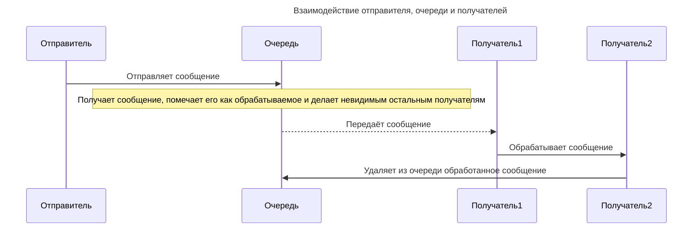

---
aliases:
  - Yandex Message Queue
  - Message retention period
  - Maximum message size
  - Delivery delay
  - Стандартный таймаут видимости
  - Таймаут видимости
  - Срок хранения сообщений
  - Максимальный размер сообщения
  - Задержка доставки
  - Время ожидания при получении сообщения
---

## Yandex Message Queue: очередь сообщений

Сообщение состоит из тела — самих данных — и метаданных, его дополнительных атрибутов.

**Жизненный цикл сообщения**

В **Базовых параметрах**, помимо имени и типа очереди, можно указать:

- **Стандартный таймаут видимости.** Это время, на которое сообщение скрывается из очереди после чтения получателем. Пока сообщение скрыто, другие получатели не могут получить сообщение из очереди. Минимальный таймаут видимости — 30 секунд, максимальный — 12 часов.
- **Срок хранения сообщений.** Можно указать, как долго каждое сообщение может храниться в очереди в ожидании чтения получателем. Значение должно быть в промежутке от 60 секунд до 14 дней.
- **Максимальный размер сообщения.** Может составлять от 1 до 256 КБ.
- **Задержка доставки.** Позволяет отложить доставку сообщения: обработчик получит его позже. Указывается время, в течение которого новое сообщение нельзя получить из очереди. Значение должно быть в промежутке от 0 секунд до 15 минут.
- **Время ожидания при получении сообщения.** В течение этого времени получатель ожидает появления сообщения в очереди. Если сообщения появятся раньше, вызов будет сделан раньше, чем указано в настройке. Если по истечении этого времени сообщения не появились, будет возвращён пустой список.
