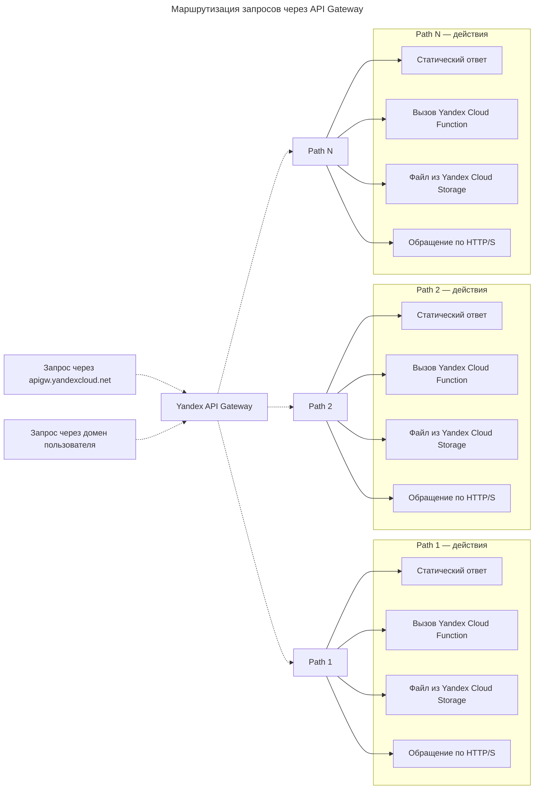

---
aliases:
  - 3scale
  - Amazon S3 API
  - API Gateway
  - API-шлюз
  - Apigee
  - AWS DynamoDB API
  - Axway
  - Cloud Functions
  - Cloud Logging
  - Distributed SQL
  - Document API
  - EventRouter
  - FaaS
  - free tier
  - Free tier
  - IoT Core
  - Message Queuing Telemetry Transport
  - MQTT
  - NGINX
  - Notification Service
  - Object Storage
  - OpenAPI
  - OpenAPI 3.0
  - PaaS
  - Postbox
  - Push
  - Push-уведомления
  - RESTful API
  - S3 API
  - Serverless Containers
  - Serverless integrations
  - SMS
  - Workflows
  - Yandex API Gateway
  - Yandex Cloud Functions
  - Yandex Cloud Logging
  - Yandex Cloud Notification Service
  - Yandex Cloud Postbox
  - Yandex Data Streams
  - Yandex IoT Core
  - Yandex Message Queue
  - Yandex Object Storage
  - Yandex Query
  - Yandex Serverless Containers
  - Yandex Serverless Integrations
  - Yandex Workflows Language
  - YaWL
  - YDB
  - бессерверные интеграции
  - интернет вещей
---

## Yandex Serverless Integrations

**Yandex Serverless Integrations** — это сервис для настройки интеграций и управления [[serverless|FaaS]] с помощью serverless-технологий. Он содержит три сервиса:

### Workflows, EventRouter, API Gateway

- **Workflows** — позволяет выстраивать и автоматизировать рабочие процессы при помощи декларативной спецификации Yandex Workflows Language (YaWL).
- **EventRouter** — осуществляет обмен событиями между сервисами пользователя и сервисами Yandex Cloud с возможностью их фильтрации, трансформации и маршрутизации.
- **API Gateway** — используется для создания API-шлюзов, которые поддерживают спецификацию OpenAPI 3.0 и набор расширений для взаимодействия из интернета с сервисами Yandex Cloud.
  - **Yandex API Gateway** — управляемое RESTful API, единая точка входа, которая позволяет объединить публикацию функций, объектов и интерфейсов к другим облачным сервисам в единый комплекс. API Gateway находится между внешним пользователем и сервисами облака и обрабатывает пользовательские запросы.
  - На рынке существует много готовых API-шлюзов, в том числе NGINX, Apigee, Axway, 3scale, которые можно развернуть на виртуальных машинах в облаке. Удобнее использовать готовое serverless-решение — Yandex API Gateway.

---

## Serverless-компоненты Yandex Cloud

### Yandex Message Queue

Когда на запрос клиента нужно ответить быстро, а обработка запроса требует времени, её можно сделать асинхронной и параллельной, используя [[message-queueing|очереди сообщений]] на базе **[[yandex-message-queue|Yandex Message Queue]]**.

### YDB

Набор serverless-сервисов полноценен, если в нём есть базы данных. В Yandex Cloud это **YDB** — распределённая отказоустойчивая Distributed SQL база данных с возможностью использовать SQL или Document API (AWS DynamoDB API).

### Yandex Object Storage

**Yandex Object Storage** — масштабируемое облачное [[S3|объектное хранилище]] данных, совместимое с Amazon S3 API. У Object Storage есть ряд преимуществ перед обычным сервером, на который можно писать данные в произвольную папку.

### Yandex Serverless Containers

**Yandex Serverless Containers** — сервис для запуска Docker-контейнеров без создания виртуальных машин и кластеров [[kubernetes|Kubernetes]]. Serverless Containers сам использует функции Yandex Cloud Functions для развёртывания контейнеров. Это даёт ряд преимуществ: функции автоматически масштабируются, нет необходимости настраивать балансировщик нагрузки, функцию можно развернуть за секунды.

### Yandex Cloud Logging

**Yandex Cloud Logging** — сервис для агрегации и чтения логов пользовательских приложений и ресурсов Yandex Cloud. Можно создать свою лог-группу, объединяющую несколько облачных сервисов. Это удобно для отладки, например, микросервисного приложения. Объединив логи Cloud Functions, API Gateway и Message Queue, в консоли управления можно видеть запросы к API-шлюзу, действия с событиями в очереди и журнал исполнения программного кода.

### Yandex IoT Core

**Yandex IoT Core** — сервис интернета вещей для двустороннего обмена сообщениями между реестрами и устройствами. Этот сервис использует протокол Message Queuing Telemetry Transport (MQTT), который применяется в автоиндустрии, логистике, платформах умных домов, умных бытовых устройствах и т. д.

### Yandex Data Streams

**Yandex Data Streams** — масштабируемый сервис для управления потоками данных в режиме реального времени.

### Yandex Query

**Yandex Query** — сервис для аналитики данных. Он способен выполнять федеративные запросы к объектному хранилищу и управляемым базам данных в облаке.

### Yandex Cloud Postbox

**Yandex Cloud Postbox** — платформа электронной почты, которая предоставляет простой и экономичный способ отправки электронных писем.

### Yandex Cloud Notification Service

**Yandex Cloud Notification Service** — сервис для мультиканальной отправки SMS- и Push-уведомлений пользователям на мобильные устройства iOS и Android.

В Yandex Cloud есть так называемый **Free tier** — свободный уровень, уровень нетарифицируемого использования. В определённых пределах каждый пользователь может использовать сервис бесплатно. Это позволяет попробовать serverless-экосистему в деле и даже успешно эксплуатировать в облаке приложения с небольшой нагрузкой.

---

## API Gateway

**Yandex Serverless Integrations**, в составе которого есть **API Gateway**, работающий по модели PaaS. Сервис предоставляет:

- функциональность прокси-сервера, масштабируемость и отказоустойчивость инфраструктуры;
- возможность описывать API в стандартном виде с помощью спецификации OpenAPI;
- возможность применять интеграционные решения на основе расширений OpenAPI.

