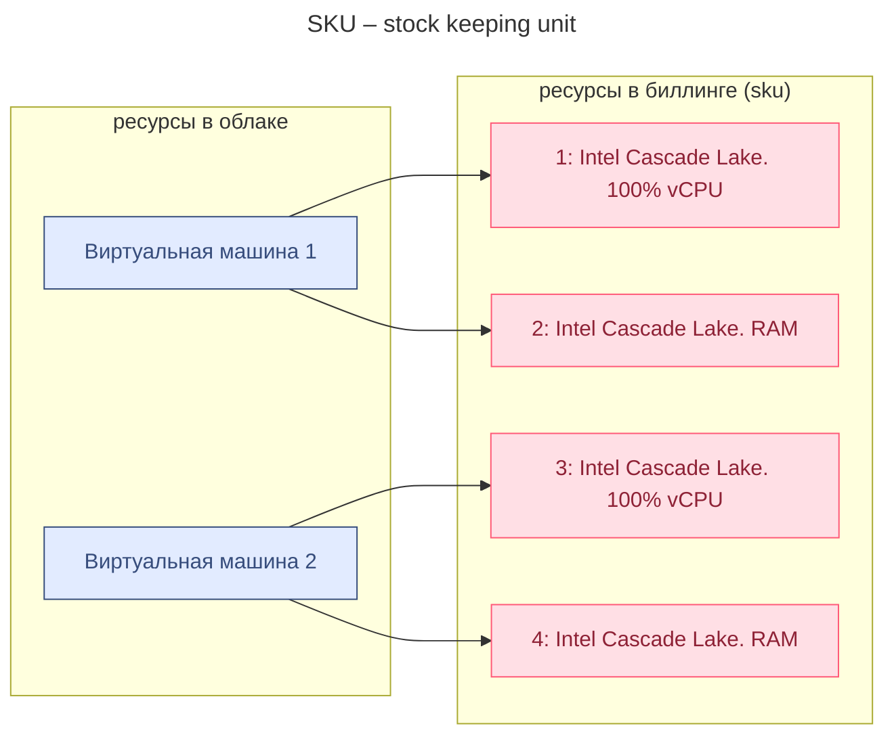
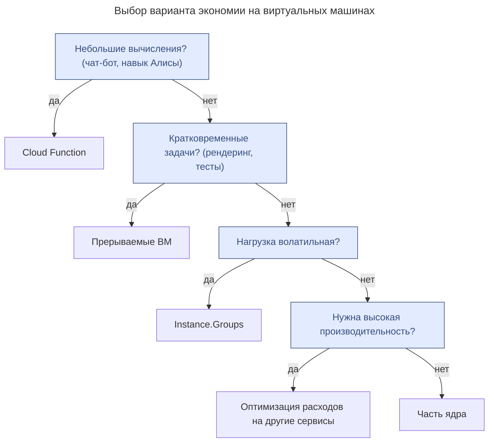

---
aliases:
  - billing
  - Cloud Function
  - cost breakdown
  - cost optimization
  - DataLens
  - Fractional vCPU
  - Instance Groups
  - Instance.Groups
  - Pay as you go
  - PAYG
  - Preemptible VM
  - SKU
  - stock keeping unit
  - Yandex Cloud
  - ycloud
  - биллинг
  - виртуальная машина
  - детализация затрат
  - затраты
  - оплата по мере использования
  - оптимизация затрат
  - прерываемые ВМ
---

## Модель оплаты Pay as you go (PAYG)

«Плати, пока пользуешься». Аналогия с каршерингом: пока едешь на арендованной машине — платишь, поездка закончилась — платёж прекращается.

> 👉 Затраты в Yandex Cloud зависят от количества потреблённых ресурсов и времени их использования.

## SKU (stock keeping unit)

Соответствие ресурсов облака и позиций SKU в биллинге:

## Биллинг Yandex Cloud

- Yandex Cloud доступен только резидентам РФ.
- Для расчёта стоимости по SKU предусмотрен калькулятор.

Три способа контролировать затраты в Yandex Cloud:

1. Детализация затрат в консоли.
2. Использование [DataLens](https://datalens.yandex.ru/).
  - DataLens — сервис визуализации данных. Для биллинга он позволяет следить за каждым ресурсом, например за конкретной виртуальной машиной.
1. Отгрузка детализации в формате CSV.

### Оптимизация затрат

Схема выбора варианта экономии в зависимости от [[highload|нагрузки]]:

