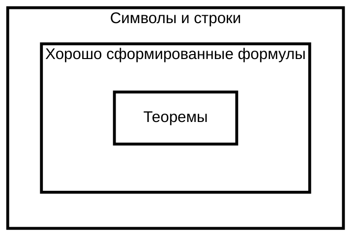

## Бинарное отношение

Бинарное (двуместное) отношение — любое отношение между двумя множествами A и B, которое будетм являеться `подмножеством декартового произведения` этих множеств.

### Декартово произведение множеств

Множество, элементами которого являются все возможные упорядоченные пары элементов исходных множеств

### Свойства бинарных отношений

Бинарное отношение $R$ на некотором множестве $M$ может обладать различными свойствами:

**рефлексивность**: ${\displaystyle \forall x\in M:(xRx)}$, **антирефлексивность** (иррефлексивность): ${\displaystyle \forall x\in M:\neg (xRx)}$, **корефлексивность** ${\displaystyle \forall x,y\in M:(xRy\Rightarrow x=y)}$ **симметричность** ${\displaystyle \forall x,\;y\in M:(xRy\Rightarrow yRx)}$ **антисимметричность** ${\displaystyle \forall x,\;y\in M:(xRy\wedge yRx\Rightarrow x=y)}$, **асимметричность** ${\displaystyle \forall x,\;y\in M:(xRy\Rightarrow \neg (yRx))}$ **транзитивность** ${\displaystyle \forall x,\;y,\;z\in M:(xRy\wedge yRz\Rightarrow xRz)}$ **евклидовость** ${\displaystyle \forall x,y,z\in M:(xRy\wedge xRz\Rightarrow yRz)}$ **полнота** (или связность) ${\displaystyle \forall x,y\in M:(x\neq y\Rightarrow xRy\lor yRx)}$ **трихотомия** $∀ x, y ∈ M \forall x,y\in M\ верно ровно\ одно\ из\ трех\ утверждений:\ xRy,\ yRx\ или\ x=y$

## Отношение порядка

`бинарное отношение` (далее обозначаемое $\preccurlyeq$ или $\prec$ ) между элементами данного множества. Аналоги отношений меньше и меньше либо равно.

### Строгий и нестрогий порядок

Бинарное отношение порядка называется `строгим`, если он антирефлексивного.

- Строгий** порядок $=$ антрефлексивный $<$
    - Свойства строгого порядка:
        1. антрефлексивный — ${\displaystyle a\not \prec a}$
        2. антисимметричный — $если\ a≺b,\ то\ b⊀a$
        3. транзитивность — $если\ {\displaystyle a\prec b}\ и\ {\displaystyle b\prec c},\ то\ {\displaystyle a\prec c}$
- Нестрогий порядок $=$ рефлексивный $≤$
    - Свойства строгого порядка:
        1. рефлексивный :: ${\displaystyle a\preccurlyeq a}$
        2. антисимметричный :: $если\ {\displaystyle a\preccurlyeq b}\ и\ {\displaystyle b\preccurlyeq a},\ то\ {\displaystyle a=b}$
        3. транзитивный :: $если\ {\displaystyle a\preccurlyeq b}\ и\ {\displaystyle b\preccurlyeq c},\ то\ {\displaystyle a\preccurlyeq c}$

### Полный и частичный порядок

Множество, все элементы которого сравнимы заданным отношением порядка (то есть для любых ${\displaystyle a\neq b}$ либо ${\displaystyle a\preccurlyeq b}$, либо ${\displaystyle b\preccurlyeq a}$), называется `линейно упорядоченным`, а отношение порядка называется `линейным порядком` либо `отношением полного порядка`.

Если же сравнимы не все неравные элементы, порядок называется частичным, а множество — `частично упорядоченным`, либо отношением частичного порядка

- Полный порядок $=$ линейный порядок
- Неполный порядок $=$ частичный порядок

## Битовая операция

**Битовая операция** в программировании — операция над цепочками битов, как правило в этот класс включаются логические побитовые операции и битовые сдвиги. Применяются в языках программирования и цифровой технике, изучаются в _дискретной математике_.

**Дискретная математика** — неклассифицируемое объединение нескольких разделов математики, изучающее дискретные математические структуры, такие как _графы_ и _утверждения в логике_.

**Конечный граф** — граф, содержащий конечное число вершин и рёбер.

**Высказывание** в математической логике — предложение, выражающее суждение. Если суждение, составляющее содержание (смысл) некоторого высказывания, истинно, то и о данном высказывании говорят, что оно истинно. Сходным образом ложным называют такое высказывание, которое является выражением ложного суждения. Истинность и ложность называются логическими, или истинностными, значениями высказываний

**Математическая логика** (теоретическая логика, символическая логика) — раздел математики, изучающий математические обозначения, формальные системы, доказуемость математических суждений, природу математического доказательства в целом, вычислимость и прочие аспекты оснований математики. «_логика, развиваемая с помощью математических методов_»

**Логические константы**

| Cимвол         | Значение                      |
| -------------- | ----------------------------- |
| **$T$**        | «истина»                      |
| **$F$**        | «ложь»                        |
| **$¬$**        | «не»                          |
| **$∧$**        | «и»                           |
| **$∨$**        | «или»                         |
| **$→$**        | «следует», «если…то»          |
| **$∀$**        | «для всех»                    |
| **$∃$**        | «существует», «для некоторых» |
| **$=$**        | «равно»                       |
| **$\Box$**     | «необходимо»                  |
| **$\Diamond$** | «возможно»                    |

## Логика предикатов

`Логика предикатов = Логика первого порядка`

**Логика первого порядка** — _формальное исчисление_, допускающее высказывания относительно переменных, фиксированных функций и _предикатов_. Расширяет логику высказываний.

**Логика второго порядка** в математической логике — формальная система, расширяющая логику первого порядка возможностью квантификации общности и существования не только над переменными, но и над предикатами и функциональными символами. Логика второго порядка несводима к логике первого порядка. В свою очередь, она расширяется логикой высших порядков и теорией типов.

**Логика высказываний = логика нулевого порядка**

это раздел символической логики, изучающий сложные высказывания, образованные из простых, и их взаимоотношения. В отличие от логики предикатов, пропозициональная логика не рассматривает внутреннюю структуру простых высказываний, она лишь учитывает, с помощью каких союзов и в каком порядке простые высказывания сочленяются в сложны

**Грамматика хомского** = пораждающая грамматика
## Язык логики первого порядка

Язык логики первого порядка строится на основе _сигнатуры_, состоящей из

- `множества функциональных символов` — ${\mathcal {F}}$
    - sin(), max(), …
- `множества предикатных символов` — ${\mathcal {P}}$
    - С каждым функциональным и предикатным символом связана _арность_, то есть число возможных аргументов. Функциональные символы нулевой арности выделают в `множество констант`
    - =, >, +, *
- `символы переменных`    
    - напр. $x, y, z, x_{1}, y_1, z_{1}, x_{2}, y_2, z_{2}$ и т. д.
- `логические операции`
	- $\neg$ -- Отрицание («не»)
	- $\land$ , ${\displaystyle \&}$ -- Конъюнкция («и»)
	- $\lor$ -- Дизъюнкция («или»)
	- $\to,\ \supset$ -- Импликация («если …, то …»)
- `кванторы`
    **Квантор** — общее название для логических операций, ограничивающих область истинности какого-либо предиката и создающих высказывание
	- $\forall$ -- Квантор всеобщности
	- $\exists$ -- Квантор существования
    

Язык логки первого порядка образует синтаксические конструкции:

- **Терм** есть символ переменной, либо имеет вид $f(t_{1},\ldots ,t_{n})$, где $f$ — функциональный символ арности $n$, а $t_{1} , … , t{n}$ — термы.
- **Атом** (атомарная формула) имеет вид $p(t_{1},\ldots ,t_{n})$, где $p$ — предикатный символ арности $n$, а $t_{1},\ldots ,t_{n}$ — термы
- **Формула** — это либо атом, либо одна из следующих конструкций: $\neg F, F_{1}\lor F_{2}, F_{1}\land F_{2}, F_{1}\to F_{2}, \forall xF, \exists xF$, где ${\displaystyle F,F_{1},F_{2}}$ — формулы, а $x$ — переменная

## Сигнатура

**Сигнатура** в _математической логике_ и _универсальной алгебре_ — набор символов, специфических для конкретной системы и определяющих её _формальный язык_. Формально, сигнатура определаятся как $Σ=(R,F,C,ρ)$, где:

$R$ — множество символов для отношений (предикатов), $F$ — множество функциональных символов, Функция $\rho$ , сопоставляющая элементам $R$ и $F$ их арность $C$ — множество символов констант

## Универсальная алгебра

Универсальная алгебра — раздел математики, изучающий общие свойства _алгебраических систем_, использующий сходства между различными алгебраическими структурами — группами, кольцами, модулями, решётками, вводящий присущие им всем понятия и устанавливающий общие для всех них утверждения. Занимает промежуточное положение между математической логикой и общей алгеброй, как реализующий аппарат математической логики в применении к общеалгебраическим структурам.

Центральное понятие — алгебраическая система[⇨], объект максимальной общности, объемлющий значительную часть вариантов алгебраических структур; над этим объектом могут быть построены понятия _гомоморфизма_ и _факторсистемы_, обобщающие соответствующие конструкции из теорий групп, колец, решёток и так далее

## Формальный язык

Формальный язык в математической логике, информатике и лингвистике — множество конечных слов (строк, цепочек) над конечным алфавитом.

В теории моделей язык строится из множеств символов, функций и отношений вместе с их арностью, а также множества переменных. Каждое из этих множеств может быть бесконечным. Из языка вместе с универсальными логическими символами составляются логические высказывания.

Формальный язык может быть определён по-разному, напр.:

- Простым перечислением слов, входящих в данный язык
- Словами, порождёнными некоторой _формальной грамматикой_
    - Формальная грамматика — способ описания формального языка, то есть выделения некоторого подмножества из множества всех слов некоторого конечного алфавита
- Словами, порождёнными регулярным выражением.
    - вв
- Словами, распознаваемыми некоторым конечным автоматом
- Словами, порождёнными БНФ-конструкцией.
    - Форма Бэкуса-Наура — формальная система описания синтаксиса, в которой одни синтаксические категории последовательно определяются через другие категории.

### Арность

**Арность предиката**, операции или функции в математике — количество их аргументов или операндов. Слово образовалось из названий предикатов небольшой арности (унарный — один аргумент, бинарный — два, тернарный — три). Для этих целей употребляется также термин валентность. В общем случае предикат с n n аргументами называют n n-арным. Также употребляются термины местность ( n n-местный) и, соответственно, вместимость.

Примеры: Нульарный означает 0-арный. Унарный означает 1-арный. Бинарный означает 2-арный. Тернарный означает 3-арный. Кватернарный означает 4-арный. Полиадический, мультарный или мультиарный означает любое количество операндов (или параметров). n-арный

### Битовые операция

#### Побитовое отрицание $\neg$

| НЕ    | 01     |
| ----- | ------ |
| **=** | **10** |

#### Побитовое И ^

| И     | 0011     |
| ----- | -------- |
|       | 0101     |
| **=** | **0001** |

#### Побитовое ИЛИ $\lor$

| ИЛИ | 0011     |
| --- | -------- |
|     | 0101     |
| =   | **0111** |

#### Побитовое исключающее ИЛИ

| Искл. ИЛИ | 0011     |
| --------- | -------- |
|           | 0101     |
| **=**     | **0110** |

## Полнота по Тьюрингу

Полнота по Тьюрингу — характеристика исполнителя (множества вычисляющих элементов) в `теории вычислимости`, означающая возможность реализовать на нём любую вычислимую функцию, а также воссоздание себя самого.

### Теория вычислимости

Теория вычислимости, также известная как теория рекурсивных функций, — это раздел современной математики, лежащий на стыке математической логики, теории алгоритмов и информатики, возникшей в результате изучения понятий вычислимости и невычислимости. Изначально теория была посвящена вычислимым и невычислимым функциям и сравнению различных моделей вычислений. В наши дни поле исследования теории вычислимости расширилось — появляются новые определения понятия вычислимости и идёт слияние с математической логикой, где вместо вычислимости и невычислимости идёт речь о доказуемости и недоказуемости (выводимости и невыводимости) утверждений в рамках каких-либо теорий.
## Ассемблер

Ассемблер (англ. **`assembler`** — сборщик) — транслятор программы из текста на `языке ассемблера`, в программу на машинном языке.
### Язык ассемблера

Язык ассемблера (англ. `assembly language`) — представление команд процессора в виде, доступном для чтения человеком. Язык ассемблера считается языком программирования низкого уровня, в противовес высокоуровневым языкам, не привязанным к конкретной реализации вычислительной системы. Программы, написанные на языке ассемблера однозначным образом переводятся в инструкции конкретного процессора и в большинстве случаев не могут быть перенесены без значительных изменений для запуска на машине с другой системой команд.

---

Микрокод
Низкоуровневый язык программирования
Высокоуровневый язык программирования
Сверхвысокоуровневый язык программирования