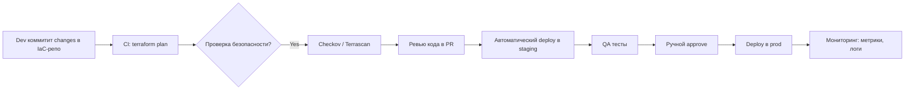
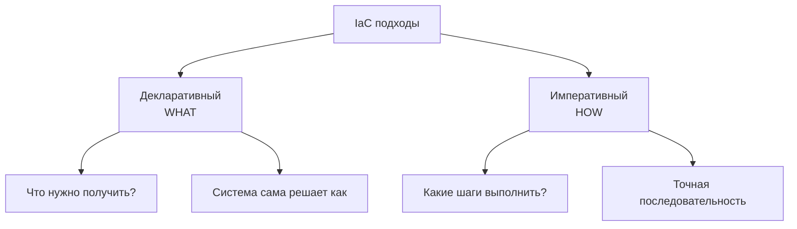
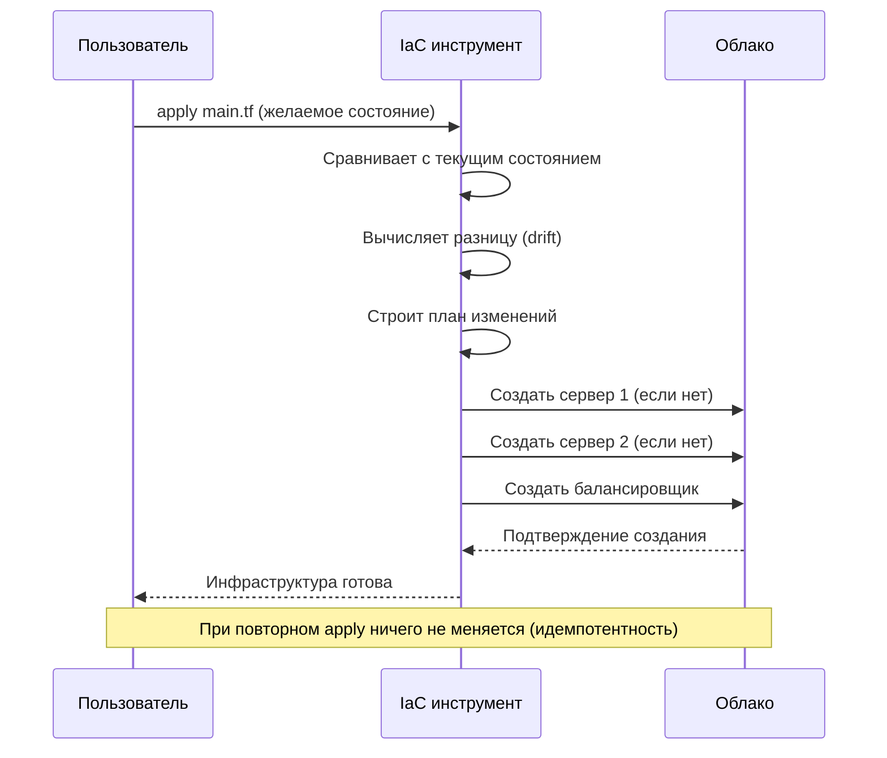
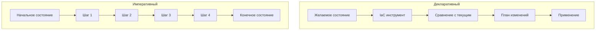

---
aliases:
  - IaC
  - Infrastructure as Code
  - Императивный
  - Декларативный
---
**Infrastructure as Code (IaC)** — это одна из фундаментальных практик современной DevOps и cloud-native-разработки. 
## ✅ Что такое **Infrastructure as Code (IaC)**?

### 🔹 Определение:
> **Infrastructure as Code (IaC)** — это практика управления и provisioning IT-инфраструктуры (серверы, сети, балансировщики, базы данных, облачные ресурсы) с помощью **машинно-читаемых файлов кода**, а не через ручное взаимодействие или графические интерфейсы.

> 💡 То есть: **вместо того чтобы кликать в AWS Console — вы пишете код на YAML/JSON/HCL, который автоматически создаёт и настраивает всё, что нужно вашему приложению.**

---

## 🆚 IaC vs Традиционный подход

| Аспект                              | **Традиционный подход**                                                              | **Infrastructure as Code**                                     |
| ----------------------------------- | ------------------------------------------------------------------------------------ | -------------------------------------------------------------- |
| **Как создавать сервер?**           | Клик в AWS Console → выбрать AMI → настроить Security Group → SSH → установить Nginx | Файл `main.tf` → `terraform apply` → всё создано автоматически |
| **Кто отвечает за инфраструктуру?** | SysAdmin / DevOps вручную                                                            | Разработчик / инженер через код                                |
| **Повторяемость**                   | ❌ Нет — каждый раз по-разному                                                        | ✅ Да — один код → всегда одинаковая инфраструктура             |
| **Версионность**                    | ❌ Инфраструктура не хранится в Git                                                   | ✅ Всё хранится в Git — как код приложения                      |
| **Откат изменений**                 | ❌ Очень сложно — "что я там накликал?"                                               | ✅ Просто `git checkout old-commit` + `apply`                   |
| **Автоматизация**                   | ❌ Ручная настройка                                                                   | ✅ Полная автоматизация: тестирование, проверка, деплой         |
| **Согласованность сред**            | ❌ Dev, Staging, Prod — различаются                                                   | ✅ Все среды идентичны — нет "а у меня на локалке работает!"    |
| **Аудит и безопасность**            | ❌ Никто не знает, что было сделано                                                   | ✅ Все изменения — в Git, с review, комментариями, историями    |

> 🔥 **IaC превращает инфраструктуру из "черного ящика" в часть вашего продукта.**

---

## ✅ Почему IaC важен?

### 1. **Устраняет "древнюю проблему":**
> _«На моём компьютере всё работает»_  
→ Теперь: _«Код инфраструктуры в Git — значит, всё работает у всех»._

### 2. **Позволяет масштабироваться**
- Создать 100 одинаковых серверов — одной командой.
- Развернуть новую среду за 5 минут — вместо 5 дней.

### 3. **Снижает риск человеческой ошибки**
- Никто не забудет открыть порт 80.
- Никто не настроит неверный security group.

### 4. **Интегрируется с CI/CD**
- При пуше в Git → автоматически запускается `terraform plan` → проверка → `apply` → деплой.
- Можно тестировать инфраструктуру, как код!

### 5. **Поддерживает GitOps**
- Изменения в инфраструктуре = pull request
- Review, CI-проверки, автоматический деплой
- Полная прозрачность и контроль

---

## 🧩 Основные принципы IaC

| Принцип                        | Объяснение                                                                                                                                                               |
| ------------------------------ | ------------------------------------------------------------------------------------------------------------------------------------------------------------------------ |
| **Декларативность**            | Вы описываете **каким должен быть результат**, а не *как его достичь*. Например: *"должна быть 1 [[EC2]]-машина с Ubuntu 22.04"* — Terraform сам решит, как это сделать. |
| **Идемпотентность**            | Запуск одного и того же кода **несколько раз** даёт **одинаковый результат** — без дублей и ошибок.                                                                      |
| **Версионность**               | Код инфраструктуры хранится в **Git**, как код приложения — можно откатиться, сравнить, ревью.                                                                           |
| **Автоматизация**              | Не нужно руками входить в облако — всё делается через CLI/API.                                                                                                           |
| **Проверка перед применением** | Можно выполнить `plan`, чтобы увидеть, **что именно изменится**, прежде чем применять.                                                                                   |

---

## 🔧 Популярные инструменты IaC

| Инструмент                           | Язык                                   | Особенности                                                                                          | Где используется                                       |
| ------------------------------------ | -------------------------------------- | ---------------------------------------------------------------------------------------------------- | ------------------------------------------------------ |
| **[[Terraform\|Terraform]]** | HCL (HashiCorp Configuration Language) | **Мультиоблачный** — поддерживает AWS, Azure, GCP, Kubernetes, Cloudflare и т.д. Самый популярный.   | Большинство компаний (Netflix, Spotify, Airbnb)        |
| **AWS CloudFormation**               | JSON/YAML                              | Только для AWS. Встроенный в AWS.                                                                    | Компании, полностью в AWS                              |
| **Pulumi**                           | Python, JavaScript, Go, C#             | Использует **реальные языки программирования** — мощнее, гибче.                                      | Современные команды, предпочитающие код на Python/JS   |
| **Ansible**                          | YAML                                   | **Программный подход** — императивный (описывает шаги). Чаще для конфигурации, но может и provision. | Для управления конфигами после создания инфраструктуры |
| **Chef / Puppet**                    | Ruby / DSL                             | Устаревшие, сложные, требуют агентов на серверах.                                                    | Legacy-системы                                         |
| **Kubernetes manifests**             | YAML                                   | Считаются IaC для **K8s-ресурсов** (Deployment, Service, Ingress)                                    | Все, кто использует Kubernetes                         |

> ⚠️ **Ansible, Chef, Puppet — это не чистый IaC**, а **Configuration Management**.  
> Они **настраивают** уже созданные серверы, а не **создают** их.  
> **Terraform/Pulumi — создают**, а **Ansible — настраивает**. Часто используют вместе.

---

## ✅ Пример: IaC с Terraform

### 📄 Файл: `main.tf`
```hcl
provider "aws" {
  region = "eu-west-1"
}

resource "aws_vpc" "main" {
  cidr_block = "10.0.0.0/16"
  tags = {
    Name = "my-vpc"
  }
}

resource "aws_internet_gateway" "igw" {
  vpc_id = aws_vpc.main.id
}

resource "aws_subnet" "public" {
  count             = 2
  cidr_block        = cidrsubnet(aws_vpc.main.cidr_block, 8, count.index)
  availability_zone = data.aws_availability_zones.available.names[count.index]
  vpc_id            = aws_vpc.main.id
  tags = {
    Name = "public-subnet-${count.index}"
  }
}

resource "aws_instance" "web" {
  ami           = "ami-0c55b159cbfafe1f0" # Ubuntu 22.04
  instance_type = "t3.micro"
  subnet_id     = aws_subnet.public[0].id
  security_groups = [aws_security_group.web.id]

  tags = {
    Name = "web-server"
  }
}

resource "aws_security_group" "web" {
  name        = "allow_http"
  description = "Allow HTTP inbound traffic"
  vpc_id      = aws_vpc.main.id

  ingress {
    from_port   = 80
    to_port     = 80
    protocol    = "tcp"
    cidr_blocks = ["0.0.0.0/0"]
  }

  egress {
    from_port   = 0
    to_port     = 0
    protocol    = "-1"
    cidr_blocks = ["0.0.0.0/0"]
  }
}
```

### 🛠️ Как использовать:
```bash
# Проверить, что будет сделано
terraform plan

# Применить изменения (создать VPC, EC2, SG...)
terraform apply

# Удалить всё
terraform destroy
```

→ **За 10 секунд** вы получаете полностью рабочую инфраструктуру — **в любом регионе, в любой среде**.

---

## ✅ Пример: IaC для [[software-engineer/технологии/kubernetes/Kubernetes]] (YAML)

Файл: `deployment.yaml`
```yaml
apiVersion: apps/v1
kind: Deployment
metadata:
  name: my-app
spec:
  replicas: 3
  selector:
    matchLabels:
      app: my-app
  template:
    metadata:
      labels:
        app: my-app
    spec:
      containers:
      - name: app
        image: my-registry/my-app:v1.2.3
        ports:
        - containerPort: 80
---
apiVersion: v1
kind: Service
metadata:
  name: my-app-service
spec:
  selector:
    app: my-app
  ports:
    - protocol: TCP
      port: 80
      targetPort: 80
  type: LoadBalancer
```

→ Этот файл — **IaC для Kubernetes**. Его можно:
- Хранить в Git
- Проверять через CI
- Применять через `kubectl apply -f deployment.yaml`
- Откатывать через `git revert`

---

## 🔄 IaC в CI/CD пайплайне



> ✅ **IaC — это часть [[CI-CD|CI/CD]]!**  
> Без него вы не можете говорить о настоящем [[DevOps]].

---

## ✅ Преимущества IaC (резюме)

| Преимущество | Объяснение |
|--------------|------------|
| ✅ **Повторяемость** | Одна и та же инфраструктура в Dev/Staging/Prod |
| ✅ **Скорость** | Развернуть окружение за минуты, а не недели |
| ✅ **Надёжность** | Нет ручных ошибок |
| ✅ **Безопасность** | Правила доступа, шифрование, аудит через Git |
| ✅ **Сотрудничество** | Все видят, что изменилось — review, комментарии, история |
| ✅ **Откаты** | Вернуться к прошлой версии — как в коде приложения |
| ✅ **Экономия** | Автоматизированная инфраструктура = меньше людей, меньше ошибок, меньше простоев |

---

## ❌ Когда IaC **не нужен**?

| Сценарий | Почему не нужен |
|----------|------------------|
| ✅ Локальный проект на одном ноутбуке | Не нужны облака — достаточно Docker |
| ✅ Очень маленький стартап, MVP | Можно вручную в AWS — пока не растёте |
| ✅ Legacy-системы без API | Если нельзя автоматизировать — придётся ручками |

> Но как только вы начинаете **масштабироваться** — IaC становится **не опцией, а обязательством**.

---

## 📚 Лучшие практики IaC

| Практика | Объяснение |
|---------|------------|
| **Храните IaC в Git** | Как код приложения — с PR, review, history |
| **Используйте модули** | Разбейте инфраструктуру на reusable блоки (VPC, RDS, EKS) |
| **Тестируйте IaC** | Используйте `terratest`, `kitchen-terraform` |
| **Проверяйте безопасность** | `checkov`, `tfsec`, `terrascan` — находят уязвимости до применения |
| **Используйте state-файлы осторожно** | `.tfstate` содержит секреты — храните в S3 + KMS + lock |
| **Не смешивайте IaC и Configuration Management** | Terraform — создаёт, Ansible — настраивает |
| **Используйте GitOps** | Argo CD / Flux — автоматически применяют изменения из Git в кластер |

---

## 💬 Цитата от эксперта:

> _“If you’re still clicking in the AWS console, you’re not a DevOps engineer — you’re a sysadmin with a fancy job title.”_  
> — **Unknown DevOps Guru**

---

## ✅ Финальный вывод: IaC — это **основа современного облака**

| Без IaC | С IaC |
|--------|-------|
| Инфраструктура — “черный ящик” | Инфраструктура — часть вашего продукта |
| Меняется вручную | Меняется через Git, CI/CD |
| Один человек знает, как всё работает | Весь team знает — код документирует всё |
| Риск сбоев — высокий | Риск сбоев — минимальный |
| Дорого и медленно | Быстро, надёжно, дешево |

> 🔥 **IaC — это когда вы перестаёте думать: «Как поставить сервер?» — и начинаете думать: «Какой сервис мне нужен?»**  
> И всё остальное — автоматически.

---

## 📚 Где учиться дальше?

- [Terraform Official Docs](https://developer.hashicorp.com/terraform/tutorials/aws-get-started)
- [Pulumi Getting Started](https://www.pulumi.com/docs/get-started/)
- Book: **“Terraform Up & Running” by Yevgeniy Brikman**
- Course: **“Infrastructure as Code with Terraform” on Udemy**
- Tool: **Checkov** — сканируй свой IaC на уязвимости: https://github.com/bridgecrewio/checkov

---

💡 **Если вы работаете с облаком — вы обязаны знать IaC.**  
**Если вы не используете IaC — вы не DevOps. Вы просто админ с клавиатурой.**


# Подходы IaC

# Подходы IaC: Декларативный vs Императивный

## 🎯 Основное отличие



### **Ключевое различие:**
```yaml
Декларативный: "Хочу 3 сервера с nginx" 
              (система сама решает как это сделать)

Императивный: "Создай сервер, установи nginx, 
              настрой конфиг, включи сервис" 
              (ты указываешь каждый шаг)
```

## 📊 Сравнительная таблица

| **Аспект**                 | **Декларативный**                  | **Императивный**                |
| -------------------------- | ---------------------------------- | ------------------------------- |
| **Фокус**                  | ЧТО нужно получить                 | КАК это получить                |
| **Состояние**              | Описывает желаемое состояние       | Описывает шаги для достижения   |
| **Идемпотентность**        | Встроена                           | Нужно реализовывать             |
| **Управление изменениями** | Автоматическое                     | Ручное                          |
| **Сложность**              | Проще для чтения                   | Сложнее для понимания           |
| **Гибкость**               | Меньше                             | Больше                          |
| **Примеры**                | [[Terraform]], CloudFormation, ARM | [[Ansible]], Chef, Puppet, Bash |
| **Обучение**               | Легче для новичков                 | Требует понимания процессов     |

## 🏗️ Декларативный подход

### **Что это?**
Вы описываете **конечное состояние** системы, а инструмент сам определяет, как его достичь.

### **Пример: [[Terraform]] (декларативный)**
```hcl
# main.tf - Декларативное описание инфраструктуры
provider "aws" {
  region = "us-east-1"
}

# Описываем ЧТО нужно: 3 EC2 инстанса
resource "aws_instance" "web" {
  count         = 3
  ami           = "ami-0c55b159cbfafe1f0"
  instance_type = "t2.micro"
  
  tags = {
    Name = "web-server-${count.index + 1}"
    Environment = "production"
    ManagedBy   = "terraform"
  }
  
  user_data = <<-EOF
              #!/bin/bash
              apt-get update
              apt-get install -y nginx
              systemctl enable nginx
              EOF
}

# Описываем балансировщик
resource "aws_lb" "web" {
  name               = "web-lb"
  internal           = false
  load_balancer_type = "application"
  
  subnets = aws_subnet.public[*].id
  
  tags = {
    Name = "web-load-balancer"
  }
}

# Результат: Terraform сам создаст ресурсы в правильном порядке
```

### **Как работает декларативный подход:**


## 🔧 Императивный подход

### **Что это?**
Вы описываете **последовательность шагов**, которые нужно выполнить для достижения цели.

### **Пример: Bash скрипт (императивный)**
```bash
#!/bin/bash
# provision.sh - Императивное создание инфраструктуры

# Шаг 1: Создаем сеть
echo "Создаем VPC..."
VPC_ID=$(aws ec2 create-vpc --cidr-block 10.0.0.0/16 --query 'Vpc.VpcId' --output text)
aws ec2 create-tags --resources $VPC_ID --tags Key=Name,Value=web-vpc

# Шаг 2: Создаем подсети
echo "Создаем подсети..."
SUBNET1_ID=$(aws ec2 create-subnet --vpc-id $VPC_ID --cidr-block 10.0.1.0/24 --availability-zone us-east-1a --query 'Subnet.SubnetId' --output text)
SUBNET2_ID=$(aws ec2 create-subnet --vpc-id $VPC_ID --cidr-block 10.0.2.0/24 --availability-zone us-east-1b --query 'Subnet.SubnetId' --output text)

# Шаг 3: Создаем Internet Gateway
echo "Создаем Internet Gateway..."
IGW_ID=$(aws ec2 create-internet-gateway --query 'InternetGateway.InternetGatewayId' --output text)
aws ec2 attach-internet-gateway --internet-gateway-id $IGW_ID --vpc-id $VPC_ID

# Шаг 4: Создаем таблицу маршрутизации
echo "Настраиваем маршрутизацию..."
RT_ID=$(aws ec2 create-route-table --vpc-id $VPC_ID --query 'RouteTable.RouteTableId' --output text)
aws ec2 create-route --route-table-id $RT_ID --destination-cidr-block 0.0.0.0/0 --gateway-id $IGW_ID

# Шаг 5: Создаем серверы
echo "Создаем EC2 инстансы..."
for i in 1 2 3; do
    INSTANCE_ID=$(aws ec2 run-instances \
        --image-id ami-0c55b159cbfafe1f0 \
        --instance-type t2.micro \
        --subnet-id $SUBNET1_ID \
        --query 'Instances[0].InstanceId' \
        --output text)
    
    aws ec2 create-tags --resources $INSTANCE_ID --tags Key=Name,Value=web-server-$i
    echo "Создан инстанс web-server-$i"
done

# Шаг 6: Устанавливаем nginx (отдельный скрипт)
./setup_nginx.sh $INSTANCE_IDS

echo "Инфраструктура готова!"
```

### **Проблема идемпотентности:**
```bash
#!/bin/bash
# Приходится вручную проверять состояние

create_server_if_not_exists() {
    local server_name=$1
    
    # Проверяем, существует ли сервер
    SERVER_ID=$(aws ec2 describe-instances \
        --filters "Name=tag:Name,Values=$server_name" \
        --query 'Reservations[0].Instances[0].InstanceId' \
        --output text)
    
    if [[ "$SERVER_ID" == "None" ]]; then
        # Создаем если не существует
        aws ec2 run-instances ...
        echo "Создан сервер $server_name"
    else
        echo "Сервер $server_name уже существует"
    fi
}

# Для каждого сервера нужно писать такую проверку
create_server_if_not_exists "web-server-1"
create_server_if_not_exists "web-server-2"
create_server_if_not_exists "web-server-3"
```

## 🔍 Глубокое сравнение

### **1. Управление изменениями**

#### **Декларативный (Terraform):**
```hcl
# Изменяем количество серверов с 3 на 5
resource "aws_instance" "web" {
  count         = 5  # Просто меняем число
  ami           = "ami-0c55b159cbfafe1f0"
  instance_type = "t2.micro"
}

# Terraform сам определит:
# - 3 существующих сервера оставить
# - 2 новых сервера создать
# - Порядок создания/удаления
```

#### **Императивный (Bash):**
```bash
# Нужно написать сложную логику
current_servers=$(aws ec2 describe-instances ... | jq '. | length')
target_servers=5

if [[ $current_servers -lt $target_servers ]]; then
    # Нужно добавить серверы
    for i in $(seq $((current_servers + 1)) $target_servers); do
        aws ec2 run-instances ...
    done
elif [[ $current_servers -gt $target_servers ]]; then
    # Нужно удалить лишние
    servers_to_remove=$((current_servers - target_servers))
    aws ec2 terminate-instances --instance-ids $(get_oldest_instances $servers_to_remove)
fi
```

### **2. Обработка дрифта (drift)**

#### **Декларативный подход:**
```hcl
# Кто-то вручную изменил сервер
# При следующем apply Terraform вернет его к желаемому состоянию

resource "aws_instance" "web" {
  instance_type = "t2.micro"  # Если кто-то изменил на t3.micro
  
  # Terraform увидит разницу и исправит обратно
}
```

#### **Императивный подход:**
```bash
# Нужно постоянно проверять и исправлять
check_and_fix() {
    current_type=$(aws ec2 describe-instances ... --query 'InstanceType')
    if [[ "$current_type" != "t2.micro" ]]; then
        # Придется пересоздавать инстанс
        echo "Instance type changed! Recreating..."
        aws ec2 terminate-instances ...
        aws ec2 run-instances --instance-type t2.micro ...
    fi
}
```

## 🛠️ Инструменты и их подходы

### **Декларативные инструменты:**
```yaml
Terraform:
  - Язык: HCL (HashiCorp Configuration Language)
  - Подход: Декларативный
  - Особенности: State management, планы изменений
  
AWS CloudFormation:
  - Язык: JSON/YAML
  - Подход: Декларативный
  - Особенности: Интеграция с AWS, стековая организация
  
Azure ARM:
  - Язык: JSON
  - Подход: Декларативный
  - Особенности: Нативная интеграция с Azure
  
Google Deployment Manager:
  - Язык: YAML/Python/Jinja2
  - Подход: Декларативный
  - Особенности: Шаблоны, GCP нативный
```

### **Императивные инструменты:**
```yaml
Ansible:
  - Язык: YAML (playbooks)
  - Подход: Императивный (но с декларативными чертами)
  - Особенности: Agentless, push модель
  
Puppet:
  - Язык: Puppet DSL
  - Подход: Декларативный (но с императивными элементами)
  - Особенности: Agent-based, pull модель
  
Chef:
  - Язык: Ruby DSL
  - Подход: Императивный
  - Особенности: Рецепты, кукбуки
  
SaltStack:
  - Язык: YAML/Jinja2
  - Подход: Гибридный
  - Особенности: Быстрый, event-driven
  
Bash/PowerShell:
  - Язык: Скриптовые
  - Подход: Полностью императивный
  - Особенности: Максимальная гибкость
```

## 📈 Диаграмма сравнения



## 🎯 Когда что использовать

### **Используйте Декларативный подход когда:**
```yaml
use_declarative:
  - "Инфраструктура в облаке (AWS, GCP, Azure)"
  - "Хотите автоматическое управление дрифтом"
  - "Нужна идемпотентность из коробки"
  - "Команда разного уровня"
  - "Важно повторяемое развертывание"
  - "CI/CD интеграция"
```

### **Используйте Императивный подход когда:**
```yaml
use_imperative:
  - "Одноразовые задачи"
  - "Сложная логика с условиями"
  - "Тонкая настройка последовательности"
  - "Прототипирование и эксперименты"
  - "Интеграция с существующими скриптами"
  - "Локальная разработка"
```

## 🔄 Гибридный подход

### **Ansible как гибрид:**
```yaml
# Ansible playbook (в основном императивный, но с декларативными чертами)
---
- name: Настройка веб-сервера
  hosts: webservers
  become: yes
  
  tasks:
    # Декларативная часть: описываем состояние
    - name: Убедиться что nginx установлен
      apt:
        name: nginx
        state: present  # Декларативно: должен быть установлен
    
    - name: Убедиться что nginx запущен
      service:
        name: nginx
        state: started
        enabled: yes
    
    # Императивная часть: последовательность действий
    - name: Создать директорию для сайта
      file:
        path: /var/www/mysite
        state: directory
        mode: '0755'
    
    - name: Скопировать файлы сайта
      copy:
        src: ./site/
        dest: /var/www/mysite/
      
    - name: Настроить виртуальный хост
      template:
        src: nginx.conf.j2
        dest: /etc/nginx/sites-available/mysite
      notify: restart nginx
```

### **Terraform + Ansible:**
```hcl
# Terraform (декларативно создает инфраструктуру)
resource "aws_instance" "web" {
  count         = 3
  ami           = "ami-0c55b159cbfafe1f0"
  instance_type = "t2.micro"
  
  # Передаем данные в Ansible
  provisioner "remote-exec" {
    inline = [
      "sudo apt-get update",
      "sudo apt-get install -y python3"
    ]
  }
  
  provisioner "local-exec" {
    command = "ansible-playbook -i '${self.public_ip},' configure.yml"
  }
}

# Ansible (императивно настраивает ПО)
# configure.yml
---
- hosts: all
  tasks:
    - name: Установка пакетов
      apt:
        name: "{{ item }}"
        state: present
      loop:
        - nginx
        - python3-pip
        - git
    
    - name: Клонирование репозитория
      git:
        repo: "https://github.com/myapp.git"
        dest: /opt/myapp
    
    - name: Запуск приложения
      command: python3 /opt/myapp/app.py
```

## 📊 Примеры кода: одна задача разными подходами

### **Задача: Создать 3 сервера с балансировщиком**

#### **Декларативно (Terraform):**
```hcl
resource "aws_instance" "app" {
  count         = 3
  ami           = "ami-0c55b159cbfafe1f0"
  instance_type = "t2.micro"
  
  tags = {
    Name = "app-server-${count.index + 1}"
  }
}

resource "aws_lb" "app" {
  name               = "app-lb"
  internal           = false
  load_balancer_type = "application"
  
  subnets = aws_subnet.public[*].id
}

resource "aws_lb_target_group" "app" {
  name     = "app-tg"
  port     = 80
  protocol = "HTTP"
  vpc_id   = aws_vpc.main.id
}

resource "aws_lb_target_group_attachment" "app" {
  count            = 3
  target_group_arn = aws_lb_target_group.app.arn
  target_id        = aws_instance.app[count.index].id
  port             = 80
}
```

#### **Императивно (Bash):**
```bash
#!/bin/bash
# create-infra.sh - Императивное создание

set -e

echo "=== Создание инфраструктуры ==="

# 1. Создаем VPC
echo "Создание VPC..."
VPC_ID=$(aws ec2 create-vpc --cidr-block 10.0.0.0/16 --query 'Vpc.VpcId' --output text)
aws ec2 create-tags --resources $VPC_ID --tags Key=Name,Value=app-vpc

# 2. Создаем подсети
echo "Создание подсетей..."
SUBNET1_ID=$(aws ec2 create-subnet --vpc-id $VPC_ID --cidr-block 10.0.1.0/24 --availability-zone us-east-1a --query 'Subnet.SubnetId' --output text)
SUBNET2_ID=$(aws ec2 create-subnet --vpc-id $VPC_ID --cidr-block 10.0.2.0/24 --availability-zone us-east-1b --query 'Subnet.SubnetId' --output text)

# 3. Создаем Internet Gateway
echo "Создание Internet Gateway..."
IGW_ID=$(aws ec2 create-internet-gateway --query 'InternetGateway.InternetGatewayId' --output text)
aws ec2 attach-internet-gateway --internet-gateway-id $IGW_ID --vpc-id $VPC_ID

# 4. Настраиваем маршрутизацию
echo "Настройка маршрутизации..."
RT_ID=$(aws ec2 create-route-table --vpc-id $VPC_ID --query 'RouteTable.RouteTableId' --output text)
aws ec2 create-route --route-table-id $RT_ID --destination-cidr-block 0.0.0.0/0 --gateway-id $IGW_ID

# 5. Создаем security group
echo "Создание Security Group..."
SG_ID=$(aws ec2 create-security-group \
    --group-name app-sg \
    --description "App security group" \
    --vpc-id $VPC_ID \
    --query 'GroupId' \
    --output text)

aws ec2 authorize-security-group-ingress \
    --group-id $SG_ID \
    --protocol tcp \
    --port 80 \
    --cidr 0.0.0.0/0

# 6. Создаем серверы
echo "Создание EC2 инстансов..."
for i in 1 2 3; do
    INSTANCE_ID=$(aws ec2 run-instances \
        --image-id ami-0c55b159cbfafe1f0 \
        --instance-type t2.micro \
        --subnet-id $SUBNET1_ID \
        --security-group-ids $SG_ID \
        --associate-public-ip-address \
        --query 'Instances[0].InstanceId' \
        --output text)
    
    aws ec2 create-tags --resources $INSTANCE_ID --tags Key=Name,Value=app-server-$i
    
    # Сохраняем ID для балансировщика
    INSTANCE_IDS[$i]=$INSTANCE_ID
    echo "  Создан app-server-$i ($INSTANCE_ID)"
    
    # Ждем запуска
    aws ec2 wait instance-running --instance-ids $INSTANCE_ID
done

# 7. Создаем балансировщик
echo "Создание Load Balancer..."
LB_ARN=$(aws elbv2 create-load-balancer \
    --name app-lb \
    --subnets $SUBNET1_ID $SUBNET2_ID \
    --security-groups $SG_ID \
    --query 'LoadBalancers[0].LoadBalancerArn' \
    --output text)

# 8. Создаем target group
echo "Создание Target Group..."
TG_ARN=$(aws elbv2 create-target-group \
    --name app-tg \
    --protocol HTTP \
    --port 80 \
    --vpc-id $VPC_ID \
    --query 'TargetGroups[0].TargetGroupArn' \
    --output text)

# 9. Регистрируем серверы
echo "Регистрация серверов..."
for INSTANCE_ID in "${INSTANCE_IDS[@]}"; do
    aws elbv2 register-targets \
        --target-group-arn $TG_ARN \
        --targets Id=$INSTANCE_ID,Port=80
done

# 10. Создаем listener
echo "Создание Listener..."
aws elbv2 create-listener \
    --load-balancer-arn $LB_ARN \
    --protocol HTTP \
    --port 80 \
    --default-actions Type=forward,TargetGroupArn=$TG_ARN

echo "✅ Инфраструктура создана!"
echo "Load Balancer DNS: $(aws elbv2 describe-load-balancers --load-balancer-arns $LB_ARN --query 'LoadBalancers[0].DNSName' --output text)"
```

## 🏆 Итоговое сравнение

### **Декларативный подход:**
```
✅ Плюсы:
  • Простота описания
  • Автоматическое управление состоянием
  • Идемпотентность из коробки
  • Легкий code review
  • Меньше ошибок

❌ Минусы:
  • Меньше контроля над порядком
  • Ограниченная гибкость
  • Сложнее отлаживать
  • Зависимость от инструмента
```

### **Императивный подход:**
```
✅ Плюсы:
  • Полный контроль над процессом
  • Максимальная гибкость
  • Легко отлаживать
  • Можно реализовать любую логику
  • Не требует специальных инструментов

❌ Минусы:
  • Сложно поддерживать
  • Нужно вручную управлять идемпотентностью
  • Легко ошибиться
  • Трудно читать большие скрипты
```

## 💡 Золотое правило

**"Декларативно для инфраструктуры, императивно для конфигурации"**

```yaml
recommendation:
  infrastructure:
    approach: "Декларативный"
    tools: ["Terraform", "CloudFormation"]
    reason: "Инфраструктура редко меняется, важна идемпотентность"
  
  configuration:
    approach: "Императивный"
    tools: ["Ansible", "Bash"]
    reason: "Конфигурация часто требует условной логики"
  
  hybrid:
    approach: "Декларативный + Императивный"
    example: "Terraform создает инфраструктуру, Ansible настраивает ПО"
    reason: "Лучшее из двух миров"
```

В современном DevOps обычно используется **комбинация обоих подходов**: декларативный для создания инфраструктуры и императивный для детальной настройки и оркестрации процессов.