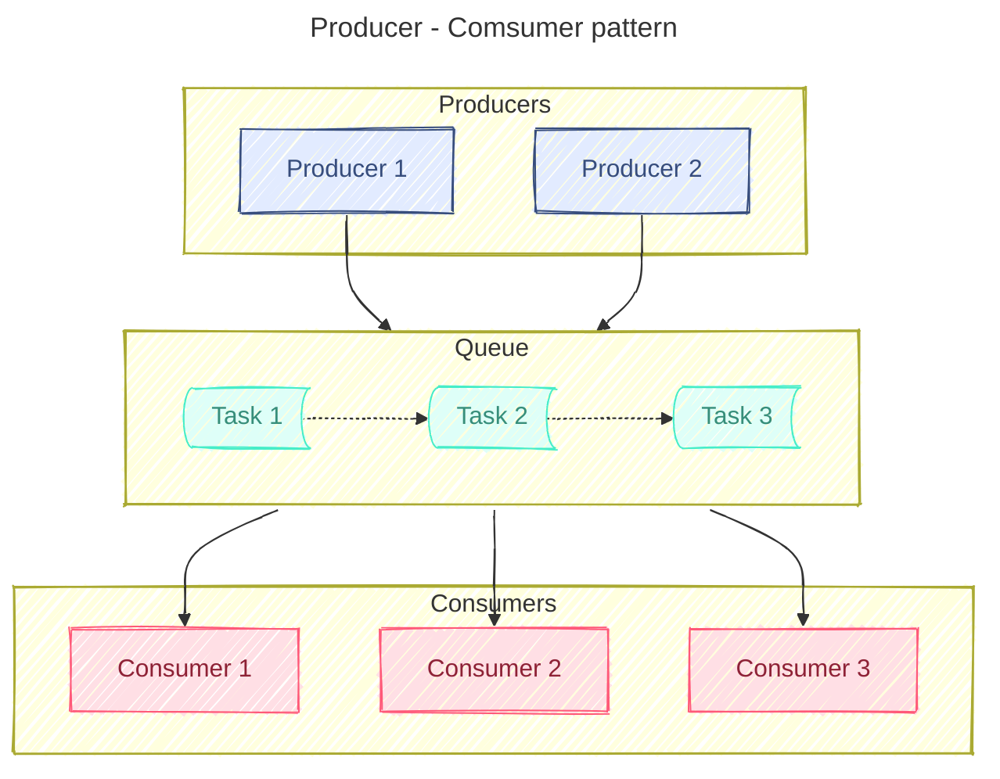

**Enterprise Patterns** — это **проверенные архитектурные, организационные и процессные шаблоны**, которые помогают **крупным компаниям (enterprise)** строить **надёжные, масштабируемые, гибкие и безопасные системы**.

Они охватывают **архитектуру приложений, данные, инфраструктуру, культуру команды, управление рисками и взаимодействие с клиентами**.

---

### 🔹 1. **Архитектурные паттерны**

| Паттерн                                                 | Описание                                                                                                            |
| ------------------------------------------------------- | ------------------------------------------------------------------------------------------------------------------- |
| **[[Layered Architecture]]**                            | Разделение на слои: Presentation → Business Logic → Data Access → DB. Самый распространённый в монолитах.           |
| **Microservices Architecture**                          | Система разбита на независимые сервисы, каждый со своим стеком и жизненным циклом.                                  |
| **Event-Driven Architecture ([[Event-Driven Architecture]])**                 | Компоненты общаются через события (асинхронно). Уменьшает зависимость.                                              |
| **[[CQRS]] (Command Query Responsibility Segregation)** | Отдельная модель для записи (Write) и чтения (Read). Улучшает производительность и надёжность.                      |
| **[[Event Sourcing]]**                                  | Состояние системы хранится как последовательность событий. Идеально для аудита и восстановления.                    |
| **Hexagonal Architecture (Ports & Adapters)**           | Ядро бизнес-логики + адаптеры для внешних систем (HTTP, DB, Kafka). Защищает домен от изменений.                    |
| **[[Service Mesh]]**                                    | Инфраструктурный слой (например, Istio) для управления сетью между микросервисами: mTLS, retries, circuit breaking. |

---

### 🔹 2. **Паттерны взаимодействия и интеграции**

| Паттерн                                                             | Описание                                                                                  |
| ------------------------------------------------------------------- | ----------------------------------------------------------------------------------------- |
| **[[API Gateway]]**                                                 | Единая точка входа для всех API-вызовов. Маршрутизация, аутентификация, лимитирование.    |
| **[[Message Queueing]] / [[Publish-Subscribe\|Publish/Subscribe]]** | Асинхронное общение через очереди (Kafka, RabbitMQ). Декуплинг, отказоустойчивость.       |
| **[[Service Bus]]**                                                 | Централизованный брокер сообщений (например, Azure Service Bus, Amazon SQS).              |
| **[[Event bus]]**                                                   | Реализация EDA — транспорт для событий (часто Kafka).                                     |
| **[[Anti-Corruption Layer]] (ACL)**                                 | Обёртка вокруг legacy-системы, чтобы не "заразить" новую архитектуру старыми ошибками.    |
| **[[Strangler Fig]] Pattern**                                       | Постепенная замена монолита новыми микросервисами. Старый код "задыхается", новый растёт. |
| **[[Backend for Frontend]] (BFF)**                                  | Отдельный бэкенд для каждого клиента: mobile, web, IoT — оптимизирован под нужды UI.      |
| **Contract Testing (Pact)**                                         | Гарантия совместимости между сервисами без полного деплоя.                                |

---

### 🔹 3. **Паттерны устойчивости и отказоустойчивости**

| Паттерн                            | Описание                                                                                    |
| ---------------------------------- | ------------------------------------------------------------------------------------------- |
| **[[Circuit Breaker]]**            | Если сервис недоступен — перестать его вызывать на время. Избегает каскадных сбоев.         |
| **Retry with Exponential Backoff** | Повторять запросы с возрастающей задержкой. Снижает нагрузку.                               |
| **Bulkhead**                       | Изоляция ресурсов (потоки, соединения) — чтобы сбой одного компонента не убил весь процесс. |
| **Health Check / Liveness Probe**  | `/health`, `/ready` — проверка состояния сервиса (Kubernetes использует).                   |
| **Graceful Degradation**           | При сбое — отключить часть функций, но сохранить основную работу.                           |
| **Timeouts**                       | Никогда не ждать бесконечно — установите `read_timeout=5s`.                                 |
| **Idempotency**                    | Повтор операции не должен создавать побочных эффектов. Критично для retry и messaging.      |

---

### 🔹 4. **Паттерны безопасности и доступности**

| Паттерн                              | Описание                                                              |
| ------------------------------------ | --------------------------------------------------------------------- |
| **[[TLS]] (mutual TLS)**            | Взаимная аутентификация между сервисами. Используется в Service Mesh. |
| **OAuth2 / OpenID Connect**          | Авторизация и аутентификация пользователей и сервисов.                |
| **[[JWT]] (JSON Web Token)**         | Токен, содержащий информацию о пользователе. Без состояния.           |
| **Rate Limiting**                    | Ограничение числа запросов — защита от DDoS и злоупотреблений.        |
| **Role-Based Access Control (RBAC)** | Доступ по ролям: admin, user, guest.                                  |
| **Audit Logging**                    | Все действия записываются — можно отследить, кто и что делал.         |
| **Data Encryption at Rest/Transit**  | Шифрование данных в БД и по сети (TLS).                               |

---

### 🔹 5. **Паттерны CI/CD и DevOps**

| Паттерн                              | Описание                                                                    |
| ------------------------------------ | --------------------------------------------------------------------------- |
| **CI/CD Pipeline**                   | Автоматическая сборка, тестирование, деплой.                                |
| **GitOps**                           | Управление инфраструктурой через Git. Argo CD, Flux.                        |
| **[[IaC]] (IaC)** | Terraform, Ansible — всё в коде.                                            |
| **Blue-Green Deployment**            | Два окружения. Переключаем трафик после успешного тестирования.             |
| **[[Canary release]]**               | Запускаем новую версию для 1% пользователей → если всё хорошо → 10% → 100%. |
| **[[Feature Flagging]]**             | Включение/выключение функций в runtime. Без деплоя.                         |
| **Shadow Traffic**                   | Дублирование трафика на новую версию — для сравнения.                       |

---

### 🔹 6. **Паттерны данных и хранилищ**

| Паттерн                       | Описание                                                                     |
| ----------------------------- | ---------------------------------------------------------------------------- |
| **Database per Service**      | Каждый микросервис имеет свою БД. Изолирует данные.                          |
| **Shared Database**           | Устаревший подход — все используют одну БД. Высокая связность.               |
| **Event Store**               | Хранение всех событий (например, Kafka). Основа [[Event Sourcing]].          |
| **Materialized View**         | Представление, рассчитанное заранее — для быстрого чтения.                   |
| **[[CQRS]]**                  | Отдельные модели для записи и чтения.                                        |
| **[[Saga]] Pattern**          | Распределённая транзакция из локальных транзакций + компенсирующие действия. |
| **Change Data Capture (CDC)** | Отслеживание изменений в БД — отправка в Kafka.                              |
| **Schema Registry**           | Хранение и управление схемами Avro/Protobuf — для совместимости.             |

---

### 🔹 7. **Паттерны распределённых систем**

| Паттерн                          | Описание                                                            |
| -------------------------------- | ------------------------------------------------------------------- |
| **Distributed Tracing**          | Jaeger, Zipkin — трассировка запросов между сервисами.              |
| **Observability**                | Логи, метрики, трейсы — три кита наблюдаемости.                     |
| **Service Discovery**            | Находит, где работает сервис (Consul, Eureka, DNS).                 |
| **Sidecar Pattern**              | Дополнительный контейнер рядом с основным ([[Envoy]], [[Fluentd]]). |
| **Ambassador Pattern**           | Прокси, который скрывает сложность внешнего мира.                   |
| **Backends for Frontends (BFF)** | Отдельный backend под каждый frontend (web, mobile).                |
| **Gateway Aggregation**          | Один запрос → несколько backend-сервисов → один ответ.              |

---

### 🔹 8. **Паттерны бизнес-процессов и анализа**

| Паттерн | Описание |
|--------|----------|
| **Business Capability Map** | Карта способностей компании: «Что она умеет делать?» |
| **IT Landscape Map** | Карта всех IT-систем, их владельцев, зависимостей. |
| **Stakeholder Map** | Кто влияет на проект и кто заинтересован. |
| **Use Case** | Подробное описание взаимодействия пользователя с системой. |
| **User Story** | Краткая фраза: *«Как [роль], я хочу [цель], чтобы [причина]»* |
| **FURPS+** | Фреймворк качества ПО: Functionality, Usability, Reliability, Performance, Supportability + Security |
| **BPMN (Business Process Model and Notation)** | Диаграммы бизнес-процессов — кто, когда, что делает. |
| **C4 Diagrams** | Четыре уровня диаграмм: Context → Containers → Components → Code |

---

### 🔹 9. **Паттерны безопасности и соответствия**

| Паттерн | Описание |
|--------|----------|
| **Zero Trust** | Никому не доверяй. Даже внутри сети. |
| **Principle of Least Privilege** | Минимальные права. |
| **Defense in Depth** | Много уровней защиты. |
| **Security by Design** | Безопасность с самого начала, а не потом. |
| **GDPR / PCI-DSS / HIPAA Compliance** | Соответствие законам и стандартам. |
| **Immutable Infrastructure** | Серверы не меняются — только заменяются. |

---

### 🔹 10. **Паттерны масштабируемости и производительности**

| Паттерн | Описание |
|--------|----------|
| **Load Balancing** | Распределение трафика между серверами. |
| **Caching** | Redis, Memcached — снижают нагрузку на БД. |
| **Sharding** | Разбиение БД по частям (по регионам, ID). |
| **Partitioning** | Kafka, PostgreSQL — делят данные на части. |
| **Replication** | Горячее резервирование. |
| **Autoscaling** | Kubernetes, AWS Auto Scaling — автоматически добавляют инстансы. |

---

### 🔹 11. **Паттерны управления изменениями и качеством**

| Паттерн | Описание |
|--------|----------|
| **Change Management** | Процесс утверждения изменений (ITIL). |
| **Incident Management** | Быстрое восстановление после сбоя. |
| **Problem Management** | Поиск корневой причины инцидентов. |
| **SLA / SLO / SLI** | Уровни обслуживания: доступность, latency, uptime. |
| **Postmortem** | Анализ инцидентов без виноватых — только факты и улучшения. |

---

### 🔹 12. **Паттерны культурные и организационные**

| Паттерн | Описание |
|--------|----------|
| **DevOps Culture** | Разработка и эксплуатация работают вместе. |
| **Blameless Culture** | После сбоя — ищут причину, а не виноватого. |
| **Continuous Improvement** | Регулярные ретроспективы, улучшение процессов. |
| **Two Pizza Team (Amazon)** | Команды до 8 человек — легко коммуницировать. |
| **You Build It, You Run It (Amazon)** | Команда отвечает за сервис 24/7. |

---

## ✅ Когда использовать эти паттерны?

| Сценарий | Рекомендуемые паттерны |
|----------|-------------------------|
| ✅ Монолит → микросервисы | Microservices, Strangler Fig, BFF, CQRS, Event Sourcing |
| ✅ Нужна высокая надёжность | Circuit Breaker, Retry, Bulkhead, Health Checks |
| ✅ Система часто падает | Monitoring, Observability, Incident Management |
| ✅ Хотите выпускать чаще | CI/CD, Feature Flags, Canary, Blue-Green |
| ✅ Есть legacy-системы | Anti-Corruption Layer, ACL, Integration Broker |
| ✅ Много команд | Service Mesh, API Gateway, Contract Testing |
| ✅ Нужно соответствие GDPR | Audit Logging, Data Encryption, Zero Trust |
| ✅ Не знаете, что ломается | Distributed Tracing, Log Correlation |
| ✅ Хотите понять бизнес | Business Capability Map, Stakeholder Map, FURPS+ |
| ✅ Нужна документация | C4, BPMN, Use Cases, Mermaid/UML |

---

## ✅ Как выбрать правильный паттерн?

| Проблема | Паттерн |
|--------|--------|
| ❌ Система медленно реагирует | ➤ **Caching, Load Balancing, Sharding** |
| ❌ Система падает при нагрузке | ➤ **Autoscaling, Circuit Breaker, Retry** |
| ❌ Сложно менять | ➤ **Microservices, Hexagonal, Strangler Fig** |
| ❌ Много сбоев | ➤ **Monitoring, Health Checks, Postmortem** |
| ❌ Нет связи с бизнесом | ➤ **Business Capability Map, Stakeholder Map** |
| ❌ Нет документации | ➤ **C4, BPMN, Use Cases** |
| ❌ Медленные релизы | ➤ **CI/CD, Feature Flags, Canary** |
| ❌ Legacy-системы мешают | ➤ **Anti-Corruption Layer, ACL** |
| ❌ Данные теряются | ➤ **Event Sourcing, CDC, Backup** |
| ❌ Пользователи не довольны | ➤ **User Stories, The Mom Test, UX Research** |

---

## ✅ Книги, где описаны эти паттерны

| Книга | Автор | О чём |
|-------|-------|------|
| **Patterns of Enterprise Application Architecture** | Martin Fowler | Архитектура, ORM, Transaction Script, Active Record |
| **Domain-Driven Design** | Eric Evans | Стратегические паттерны: Bounded Context, Aggregate, Anti-Corruption Layer |
| **Designing Data-Intensive Applications** | Martin Kleppmann | CQRS, Event Sourcing, Kafka, Replication |
| **Accelerate** | Nicole Forsgren | CI/CD, DevOps, Four Key Metrics |
| **The Mom Test** | Rob Fitzpatrick | Как правильно общаться с клиентами |
| **Site Reliability Engineering** | Google | Observability, SLA, Error Budgets, Toil |
| **Building Microservices** | Sam Newman | Service Discovery, Circuit Breaker, Contracts |
| **Team Topologies** | Matthew Skelton | Типы команд: Stream-Aligned, Platform, Enabling |
| **ITIL 4 / COBIT / TOGAF** | AXELOS / ISACA / Open Group | Управление ИТ-сервисами, рисками, архитектурой |

---

## ✅ Финальный вывод:  
> **Enterprise Patterns — это не мода. Это опыт тысяч компаний.**

> ✅ Они решают:
- **технические проблемы** (падает, медленно, не масштабируется)
- **организационные проблемы** (нет связи с бизнесом, много команд, legacy)
- **культурные проблемы** (страх сбоев, нет автономии)

> 💡 **Вы не обязаны использовать все паттерны.**  
> Но вы **обязаны знать их**, чтобы **выбрать нужные**.

---

## 📚 Где учиться дальше?

| Ресурс | Ссылка |
|--------|--------|
| **Martin Fowler — Articles** | https://martinfowler.com |
| **Google SRE Handbook** | https://sre.google/sre-book/table-of-contents/ |
| **Microsoft Cloud Design Patterns** | https://learn.microsoft.com/en-us/azure/architecture/patterns/ |
| **Microservices.io** | https://microservices.io/patterns/index.html |
| **C4 Model** | https://c4model.com |
| **The Mom Test** | https://www.themomtest.com |

---

✅ **Enterprise Patterns — это ваш «навигатор» в мире сложных систем.**  
Используйте их — и вы перестанете спрашивать:  
> _«Почему снова упало?»_  
> _«Почему никто не знал про эту зависимость?»_  
> _«Почему пользователи говорили, что хотят, а теперь не пользуются?»_

> 💬 **Знание паттернов — признак зрелого архитектора.**


___

## Enterprise patterns
### [[Service Mesh]]

архитектурный паттерн, который обеспечивает быстрое, безопасное, надежное, взаимодействие между сервисами. Архитектурный слой, который решает проблемы микро сервисного приложения.

Service Mesh лучше чем ESB — Enterprise Service Bus тем что нет посредника при взамодействии между сервисами. Выше производительность.
Service Mesh реализован на примере **openShift и решает задачи**
- маршрутизация запросов
- управление нагрузкой (оркестрация контейнеров)
- безопасность
- мониторинг
### Enterprise Service Bus

Интеграционный паттерн. Есть общая шина, через которую взаимодействую все сервисы. Применимо для SOA, сервис-оиентированной архитектуре. Имеет ограниченное масштабирование и производительность.
### Service Locator — Локатор служб

Локатор служб (англ. service locator) — это шаблон проектирования, используемый в разработке программного обеспечения для инкапсуляции процессов, связанных с получением какого-либо сервиса с сильным уровнем абстракции. Этот шаблон использует ==центральный реестр, известный как «локатор сервисов»==, который по запросу возвращает информацию (как правило это объекты), необходимую для выполнения определенной задачи.
### Factory — фабрика
Похож на паттерн FactoryMethod, за исключением того, что возвращает экземпляр нужного типа, по контексту.
```Java
public class ImageReaderFactory {
    public static ImageReader createImageReader(ImageInputStreamProcessor iisp) {
        if (iisp.isGIF()) {
            return new GifReader(iisp.getInputStream());
        }
        else if (iisp.isJPEG()) {
            return new JpegReader(iisp.getInputStream());
        }
        else {
            throw new IllegalArgumentException("Unknown image type.");
        }
    }
}
```
### Producer, Consumer
Смысл паттерна producer-consumer (производитель-потребитель). Представьте себе два типа задач, разделяющих очередь. Задача A производит данные и помещает их в очередь, а задача B извлекает данные из очереди для обработки. Это и есть модель "производитель-потребитель", где задача A - производитель, а задача B - потребитель.
Пример: супермаркет. Покупатели являются производителями, кассиры - потребителями, а очередь покупателей представляет собой очередь.
Когда нужно:
Иногда потребители обрабатывают данные быстро, а производители — медленно. Это приводит к тому, что потребители ждут, пока производители сгенерируют данные, прежде чем продолжить работу. Для баланса между производителями и потребителями необходима очередь, в которой хранятся данные, произведенные производителем. Очередь выполняет роль буфера и разделяет производителей и потребителей.


### DTO — Data Transfer Object
Data Transfer Object (DTO) — один из шаблонов проектирования, используется для передачи данных между подсистемами приложения.
DTO объект - объект, который не содержит методы и не может содержать внешних связей.
Data Transfer Object - объект, передающий данные. Данные - это и есть поля в классе.
### DAO — Data Access Object
- Промежуточный слой между данными и клиентом.
- Служит для того, чтобы предоставить интерфейс доступа к данным, который не будет зависеть от структуры данных и от механизмов доступа к данным.
- Относится к **Core J2EE Patterns — Data Access Object**
- Распространенный пример реализации паттерна DAO — **JpaRepository**
