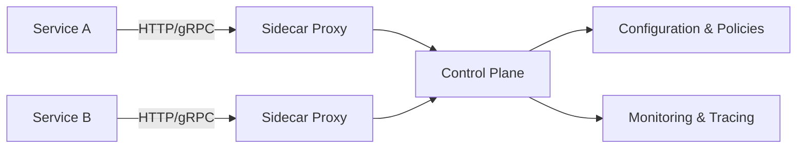

# Service Mesh (сервисная сетка)

**Service Mesh** — это паттерн, который представляет собой выделенный слой инфраструктуры для управления сетевыми взаимодействиями между микросервисами. Он обеспечивает надёжное и безопасное общение между сервисами, позволяя автоматизировать маршрутизацию запросов, балансировку нагрузки, управление трафиком и мониторинг.

Service Mesh – ==это инфраструктурный слой, который управляет сетевым взаимодействием между микросервисами, обеспечивая их безопасность==, надежность и наблюдаемость. Он перехватывает сетевой трафик с помощью прокси-сервисов, называемых [сайдкарами](Sidecar.md), которые развертываются рядом с каждым микросервисом. Это позволяет централизованно управлять такими функциями, как балансировка нагрузки, шифрование, аутентификация, авторизация, логирование и мониторинг, не меняя код самих сервисов. 

**Основные функции и возможности Service Mesh:**
- Балансировка нагрузки: Распределение трафика между несколькими экземплярами сервиса для повышения производительности и отказоустойчивости. 
- Безопасность: Реализация шифрования трафика (например, mTLS), аутентификация и авторизация запросов, что повышает безопасность взаимодействия между сервисами. 
- Управление трафиком: Динамическая маршрутизация, развертывание новых версий сервисов ("сине-зеленое" или "канареечное") с поэтапным разделением трафика. 
- Наблюдаемость (Observability): Сбор метрик, трассировка запросов и ведение логов для полного контроля над работой распределенной системы. 
- Отказоустойчивость: Автоматическое отключение сбойных экземпляров сервиса и их повторное подключение при восстановлении работоспособности. 

**Как работает Service Mesh:**
	
1. **Сайдкары ([[Sidecar]]):** Рядом с каждым микросервисом разворачивается легковесный прокси-контейнер (сайдкар), например, на базе [[Envoy]].
	1. [[Envoy]] — это высокопроизводительный прокси-сервер с открытым исходным кодом, являющийся основой для многих современных service mesh (сервисных сеток)

- **Перехват трафика:** Все входящие и исходящие сетевые запросы микросервиса перехватываются сайдкаром.
- **Управление трафиком:** Сайдкар маршрутизирует запросы, выполняет шифрование/дешифрование, балансировку нагрузки и другие операции в соответствии с политиками, заданными в контрольной панели (Control Plane).
- **Контрольная панель (Control Plane):** Управляет сайдкарами, настраивает правила маршрутизации и распространяет их по сети. 

**Преимущества использования Service Mesh:**

- Упрощение для разработчиков: Разработчики могут сосредоточиться на бизнес-логике приложения, освобождаясь от задач по управлению сетевыми взаимодействиями. - Централизованное управление: Единая точка для настройки и мониторинга всей сетевой инфраструктуры микросервисов. 

- Улучшение производительности и надежности: За счет умной балансировки нагрузки, отказоустойчивости и оптимизации соединений

[[Istio]] – один из инструементов, который позволяет организовать [[Service Mesh]] в среде [[software-engineer/технологии/kubernetes/Kubernetes|Kubernetes]]

## ✅ 1. Что такое **Service Mesh**?

🔹 Определение:
> **Service Mesh** — это **инфраструктурный слой**, предназначенный для **управления, наблюдения и защиты сетевого взаимодействия между микросервисами**.

Он **не является частью вашего кода** — он работает **вне приложений**, как “сетевой транспорт”, который автоматически добавляется к вашим сервисам.

💡 Основные цели Service Mesh:

| Цель                                            | Объяснение                                                                   |
| ----------------------------------------------- | ---------------------------------------------------------------------------- |
| **Декуплинг логики приложения и сетевых задач** | Не нужно писать retry, timeout, circuit breaker в коде — всё делает mesh     |
| **Наблюдаемость (Observability)**               | Автоматическая сборка метрик, трассировка, логи всех вызовов между сервисами |
| **Безопасность**                                | mTLS (шифрование трафика), политики доступа, аутентификация сервисов         |
| **Управление трафиком**                         | Canary-развертывания, A/B тесты, балансировка нагрузки, fault injection      |
| **Политики**                                    | Rate limiting, quotas, circuit breaking — без изменения кода                 |

🧩 Архитектура Service Mesh

🔸 Компоненты:

| Часть             | Описание                                                                                                  |
| ----------------- | --------------------------------------------------------------------------------------------------------- |
| **Data Plane**    | Сеть **sidecar-прокси** (например, Envoy), которые обрабатывают входящий/исходящий трафик каждого сервиса |
| **Control Plane** | Центральный компонент, который **конфигурирует** прокси (политики, маршруты, сертификаты)                 |
| **Sidecar Proxy** | Маленький прокси-сервер, запущенный **вместе с каждым микросервисом** в одном поде (в Kubernetes)         |

> 💬 Это как если бы у каждого автомобиля был **автоматический диспетчер дорожного движения**, который:
> - Запоминает, куда он ездил
> - Проверяет, не перегружен ли путь
> - Шифрует все сообщения между машинами
> - Автоматически перенаправляет, если дорога забита
