---
aliases:
  - Swiss Cheese Model
  - Модель Швейцарский сыр
  - Швейцарский сыр
  - Модель швейцарского сыра
---
## 🧀 Swiss Cheese Model (Модель швейцарского сыра)

### 📌 Что это такое?

**Swiss Cheese Model** (Модель швейцарского сыра) — это модель причинности происшествий, предложенная **Джеймсом Ризоном (1990)**. Она объясняет, как аварии происходят в сложных системах.

> **Основная идея:** Инцидент происходит не из-за одной ошибки, а когда **слабые места ("дыры") в нескольких слоях защиты выравниваются**, позволяя угрозе пройти сквозь все барьеры.

---

## 🧩 Ключевые элементы модели

| Элемент | Описание | Пример в IT |
|---------|----------|-------------|
| **🧀 Слои сыра** | Барьеры защиты (процессы, инструменты, люди) | Code Review, CI/Tests, Staging, Monitoring |
| **🕳️ Дыры** | Слабые места или ошибки в слое | Усталость разработчика, баг в тесте, лаг мониторинга |
| **🔴 Траектория** | Путь угрозы через все дыры | Баг попадает в Production |
| **💥 Инцидент** | Результат прохождения угрозы | Продакшен упал, утечка данных |

---

## 🛠️ Зачем нужна в разработке и CI/CD?

| Цель | Описание |
|------|----------|
| **Blameless Culture** | Не искать виноватого (dev), а искать дыры в процессах |
| **Defense in Depth** | Понимать, что одного барьера недостаточно |
| **Post-Mortem анализ** | Структурировать разбор инцидентов |
| **Управление рисками** | Видеть, где нужно добавить новые слои защиты |

---

## 📐 Mermaid диаграмма: Swiss Cheese в IT

```mermaid
flowchart LR
    subgraph Hazard["⚠️ Угроза (Баг/Ошибка)"]
        direction TB
        H1[" "]
    end

    subgraph Layer1["🧀 Слой 1: Разработка"]
        direction TB
        L1_Solid["✅ Стандарты кода"]
        L1_Hole["🕳️ Ошибка в логике"]
    end

    subgraph Layer2["🧀 Слой 2: Code Review"]
        direction TB
        L2_Solid["✅ Чек-лист ревью"]
        L2_Hole["🕳️ Ревьюер пропустил"]
    end

    subgraph Layer3["🧀 Слой 3: CI/Tests"]
        direction TB
        L3_Solid["✅ Автотесты"]
        L3_Hole["🕳️ Нет покрытия кейса"]
    end

    subgraph Layer4["🧀 Слой 4: Production"]
        direction TB
        L4_Solid["✅ Мониторинг"]
        L4_Hole["🕳️ Алерт не сработал"]
    end

    subgraph Incident["💥 ИНЦИДЕНТ"]
        direction TB
        I1["Продакшен упал"]
    end

    Hazard --> L1_Hole
    L1_Hole --> L2_Hole
    L2_Hole --> L3_Hole
    L3_Hole --> L4_Hole
    L4_Hole --> Incident

    style Hazard fill:#ff6b6b,stroke:#333,color:white
    style Layer1 fill:#ffe066,stroke:#333
    style Layer2 fill:#ffe066,stroke:#333
    style Layer3 fill:#ffe066,stroke:#333
    style Layer4 fill:#ffe066,stroke:#333
    style Incident fill:#ff6b6b,stroke:#333,color:white
    
    style L1_Hole fill:#ff8787,stroke:#333,stroke-dasharray: 5 5
    style L2_Hole fill:#ff8787,stroke:#333,stroke-dasharray: 5 5
    style L3_Hole fill:#ff8787,stroke:#333,stroke-dasharray: 5 5
    style L4_Hole fill:#ff8787,stroke:#333,stroke-dasharray: 5 5
```



---

## 🧪 Пример реального инцидента

### Сценарий: **Утечка чувствительных данных в логи**

| Слой защиты | Норма (Сыр) | Дыра (Слабость) |
|-------------|-------------|-----------------|
| **1. Разработка** | Не логировать пароли | Разработчик добавил `log.debug(user)` |
| **2. Code Review** | Проверка на безопасность | Ревьюер не заметил (усталость) |
| **3. SAST/Security** | Сканирование кода | Правило не настроено для этого класса |
| **4. Log Aggregator** | Маскирование данных | Маскировка не включена для этого поля |
| **5. Monitoring** | Алерт на утечки | Алерт сработал слишком поздно |

### 🔴 Траектория инцидента:
> Ошибка в коде → Пропущена на ревью → Не поймана сканером → Не замаскирована в логах → **Данные утекли**.

---

## 📋 Как использовать (Пошагово)

### Шаг 1: **Постройте слои защиты**
Определите, какие барьеры стоят между ошибкой и инцидентом.
```
Разработка → Review → CI → Staging → Production → Monitoring
```

### Шаг 2: **Найдите "дыры" после инцидента**
На ретроспективе (Post-Mortem) спросите:
- Где была дыра в слое разработки?
- Почему Review не сработал?
- Почему тесты пропустили?
- Почему мониторинг не увидел?

### Шаг 3: **Уменьшите дыры или добавьте слои**
| Действие | Пример |
|----------|--------|
| **Уменьшить дыру** | Добавить чек-лист для ревьюера |
| **Добавить слой** | Внедрить SAST-сканирование в CI |
| **Усилить слой** | Настроить алерты на аномалии в логах |

### Шаг 4: **Примите неизбежность дыр**
> **Люди ошибаются.** Нельзя сделать слой идеальным. Нужно делать систему устойчивой к ошибкам.

---

## 🔄 Сравнение: Fishbone vs Swiss Cheese

| Критерий | **Fishbone (Исикава)** | **Swiss Cheese (Ризон)** |
|----------|------------------------|--------------------------|
| **Фокус** | Поиск **корневой причины** | Анализ **слоев защиты** |
| **Вопрос** | "Почему это случилось?" | "Почему защита не сработала?" |
| **Результат** | Список причин | План укрепления барьеров |
| **Культура** | Анализ проблемы | **Blameless** (без обвинений) |
| **Когда** | После инцидента | До и после инцидента (риск-менеджмент) |

> **💡 Идеально использовать вместе:**  
> **Fishbone** → Найти причину.  
> **Swiss Cheese** → Построить защиту от повторения.

---

## ✅ Принципы безопасности (на основе модели)

1.  **Никогда не надейтесь на один слой.** (Один тест не спасёт).
2.  **Дыры будут всегда.** (Люди устают, инструменты багуют).
3.  **Дыры двигаются.** (Сегодня тест работает, завтра нет).
4.  **Задача — не убрать все дыры** (невозможно), а **не дать им выстроиться в линию**.

---

## 📌 Памятка

> **Swiss Cheese Model учит: не вини человека, вини систему.**  
> **Если разработчик допустил ошибку — это дыра в сыре.**  
> **Если ошибка попала в прод — значит, все остальные слои тоже имели дыры.**

---

## 🚀 Пример действий после инцидента

| Было | Стало (после анализа) |
|------|-----------------------|
| **Виноват:** Вася (разработчик) | **Виновата система:** Нет автоматической проверки |
| **Действие:** Наказать Васю | **Действие:** Добавить SAST в CI |
| **Риск:** Вася уволится, ошибка повторится | **Риск:** Снижен, даже новичок не пропустит |

---

Если хочешь — могу показать:

- Шаблон [[Post-Mortem на основе Swiss Cheese]].
- Как внедрить [[Blameless Culture]] в команду.
- Примеры слоев защиты для микросервисов.

Пишите — сделаю! 🚀