---
aliases:
  - GoF
  - gof
  - gang of four patterns
  - gang of four
  - Creational Patterns
  - Abstract Factory
  - Builder
  - Factory Method
  - Prototype
  - Singleton
  - Structural Patterns
  - Adapter
  - Bridge
  - Composite
  - Decorator
  - Facade
  - Flyweight
  - Proxy
  - Behavioral Patterns
  - Chain of Responsibility
  - Command
  - Iterator
  - Mediator
  - Memento
  - Observer
  - State
  - Strategy
  - Template Method
  - Visitor
  - Interpreter

---
# GoF patterns

Эти паттерны решают **часто встречающиеся проблемы проектирования** и делятся на **три категории**:

1. **Порождающие (Creational)** — как создавать объекты.
2. **Структурные (Structural)** — как компоновать объекты и классы.
3. **Поведенческие (Behavioral)** — как организовать взаимодействие и распределение ответственности.

**GoF Patterns List**
1. Creational Patterns
	1. Abstract Factory
	2. Builder
	3. Factory Method
	4. Prototype
	5. Singleton
2. Structural Patterns
	1. Adapter
	2. Bridge
	3. Composite
	4. Decorator
	5. Facade
	6. Flyweight
	7. Proxy
3. Behavioral Patterns
	1. Chain of Responsibility
	2. Command
	3. Iterator
	4. Mediator
	5. Memento
	6. Observer
	7. State
	8. Strategy
	9. Template Method
	10. Visitor
	11. Interpreter

---

## Creational Patterns
> Порождающие паттерны

Решают задачи **создания объектов** гибко, без жёсткой привязки к конкретным классам.

| №   | Паттерн              | Назначение                                                                                                | Пример использования                                                                   |
| --- | -------------------- | --------------------------------------------------------------------------------------------------------- | -------------------------------------------------------------------------------------- |
| 1   | **Abstract Factory** | Создаёт семейства связанных объектов без указания их конкретных классов.                                  | GUI-фреймворк: `WinFactory` vs `MacFactory` для кнопок, окон.                          |
| 2   | **Builder**          | Позволяет создавать сложные объекты пошагово.                                                             | `StringBuilder`, `HttpRequest.Builder`, конфигурация объектов с множеством параметров. |
| 3   | **Factory Method**   | Определяет интерфейс для создания объекта, но позволяет подклассам выбрать класс создаваемого экземпляра. | `Document.createPage()` → `Resume.createPage()` возвращает `SkillsPage`.               |
| 4   | **Prototype**        | Позволяет копировать объекты, не вдаваясь в детали их реализации.                                         | Клонирование сложных объектов (например, в играх: копия врага).                        |
| 5   | **Singleton**        | Гарантирует, что у класса есть только один экземпляр, и предоставляет к нему глобальную точку доступа.    | Логгер, менеджер конфигурации, пул соединений.                                         |

> 💡 **Главная идея**: отделить **логику создания** от **логики использования**.

### Abstract Factory
**Цель**: Создавать семейства связанных объектов без привязки к конкретным классам.

Как работает:
Фабрика определяет интерфейс для создания набора связанных продуктов. Конкретные фабрики реализуют этот интерфейс для определённой платформы.

Пример:
GUI-библиотека: одна фабрика создаёт кнопки и окна для Windows, другая — для macOS.

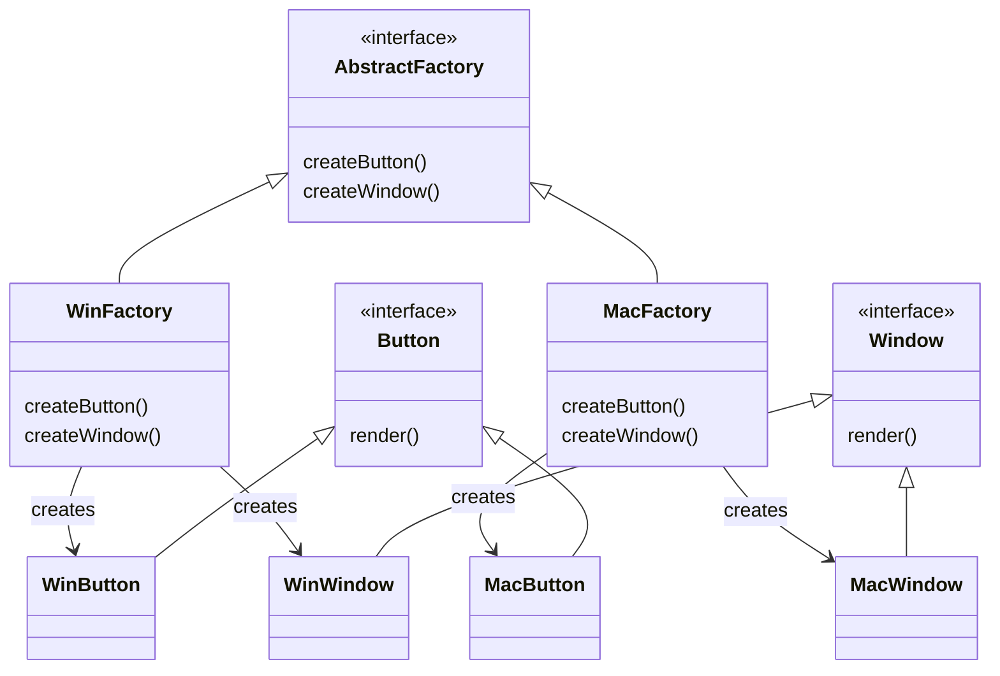
```mermaid
classDiagram
class AbstractFactory {
<<interface>>
createButton()
createWindow()
}
class WinFactory {
createButton()
createWindow()
}
class MacFactory {
createButton()
createWindow()
}
class Button {
<<interface>>
render()
}
class Window {
<<interface>>
render()
}
class WinButton
class WinWindow
class MacButton
class MacWindow

AbstractFactory <|-- WinFactory
AbstractFactory <|-- MacFactory
WinFactory --> WinButton : creates
WinFactory --> WinWindow : creates
MacFactory --> MacButton : creates
MacFactory --> MacWindow : creates
Button <|-- WinButton
Button <|-- MacButton
Window <|-- WinWindow
Window <|-- MacWindow
```

---

### Builder
**Цель**: Пошаговое создание сложного объекта с возможностью варьировать представление.

Как работает:
`Director` управляет процессом построения, вызывая методы `Builder`. Конкретный `Builder` реализует шаги и возвращает готовый объект.

Пример:
Создание отчёта в разных форматах (PDF, HTML, TXT) из одних и тех же данных.

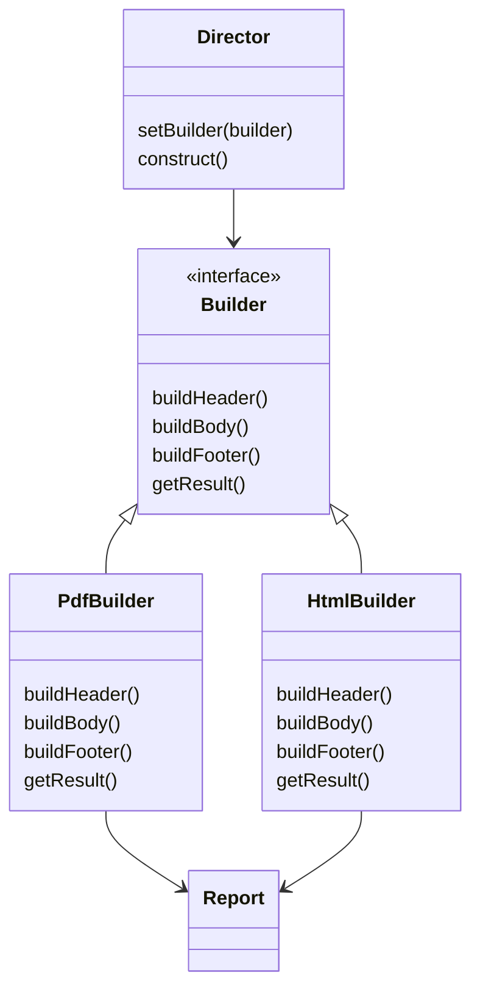
```mermaid
classDiagram
	class Director {
		setBuilder(builder)
		construct()
	}
	class Builder {
		<<interface>>
		buildHeader()
		buildBody()
		buildFooter()
		getResult()
	}
	class PdfBuilder {
		buildHeader()
		buildBody()
		buildFooter()
		getResult()
	}
	class HtmlBuilder {
		buildHeader()
		buildBody()
		buildFooter()
		getResult()
	}
	class Report {
	}
	
	Director --> Builder
	Builder <|-- PdfBuilder
	Builder <|-- HtmlBuilder
	PdfBuilder --> Report
	HtmlBuilder --> Report
```

---

### Factory Method
**Цель**: Делегировать создание объекта подклассам.

Как работает:
Базовый класс объявляет фабричный метод как абстрактный. Подклассы реализуют его, возвращая нужный тип продукта.

Пример:
Фреймворк для документов: `Resume` создаёт `SkillsPage`, `CV` создаёт `ExperiencePage`.

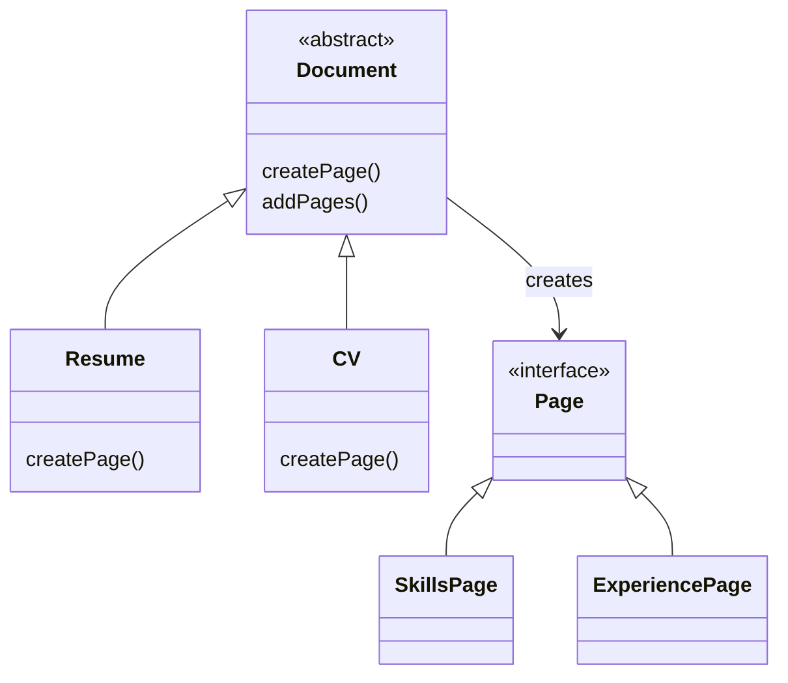
```mermaid
classDiagram
class Document {
<<abstract>>
createPage()
addPages()
}
class Resume {
createPage()
}
class CV {
createPage()
}
class Page {
<<interface>>
}
class SkillsPage
class ExperiencePage

Document <|-- Resume
Document <|-- CV
Document --> Page : creates
Page <|-- SkillsPage
Page <|-- ExperiencePage
```

---

### Prototype
**Цель**: Клонировать существующий объект вместо создания нового.

Как работает:
Объект реализует метод `clone()`, который копирует его состояние. Клиент вызывает `clone()` вместо `new`.

Пример:
Копирование сложных объектов в играх (враги, NPC) без повторной инициализации.

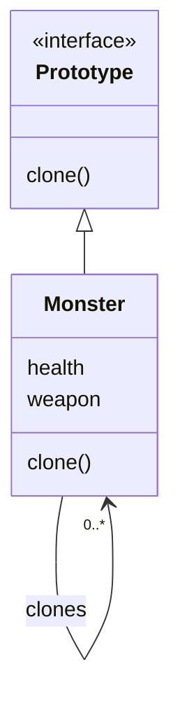
```mermaid
classDiagram
class Prototype {
<<interface>>
clone()
}
class Monster {
health
weapon
clone()
}

Prototype <|-- Monster
Monster --> "0..*" Monster : clones
```

---

### Singleton
**Цель**: Гарантировать единственный экземпляр класса и глобальную точку доступа к нему.

Как работает:
Конструктор приватный, экземпляр создаётся при первом вызове `getInstance()`.

Пример:
Логгер, менеджер конфигурации, пул соединений к БД.

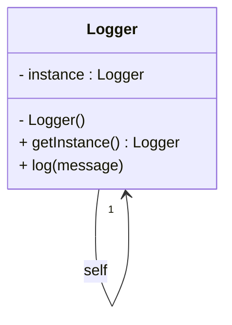
```mermaid
classDiagram
class Logger {
- instance : Logger
- Logger()
+ getInstance() Logger
+ log(message)
}

Logger --> "1" Logger : self
```

---

## Structural Patterns
> Структурные паттерны

Решают задачи **композиции классов и объектов** для построения сложных структур.

| №   | Паттерн       | Назначение                                                                           | Пример использования                                                                   |
| --- | ------------- | ------------------------------------------------------------------------------------ | -------------------------------------------------------------------------------------- |
| 6   | **Adapter**   | Позволяет объектам с несовместимыми интерфейсами работать вместе.                    | Адаптер `List` → `Enumeration` в Java, интеграция legacy-кода.                         |
| 7   | **Bridge**    | Отделяет абстракцию от реализации, чтобы то и другое можно было изменять независимо. | `Shape` (абстракция) и `DrawingAPI` (реализация: Cairo, OpenGL).                       |
| 8   | **Composite** | Позволяет обращаться с группой объектов так же, как и с одним объектом.              | Дерево файловой системы (`File` и `Directory`), UI-компоненты (контейнеры и элементы). |
| 9   | **Decorator** | Добавляет новые поведения к объекту, оборачивая его в обёртки.                       | `InputStream` → `BufferedInputStream` → `DataInputStream` в Java.                      |
| 10  | **Facade**    | Предоставляет простой интерфейс к сложной подсистеме.                                | `HttpURLConnection` скрывает сложность TCP/HTTP, фасад для работы с библиотекой.       |
| 11  | **Flyweight** | Экономит память, разделяя общее состояние между множеством мелких объектов.          | Символы в текстовом редакторе, иконки в GUI.                                           |
| 12  | **Proxy**     | Представляет объект-заместитель, контролирующий доступ к другому объекту.            | `java.lang.reflect.Proxy`, lazy loading, защита, логирование.                          |

> 💡 **Главная идея**: построить **гибкие и переиспользуемые структуры** через композицию, а не наследование.

---
### Adapter
**Цель**: Сделать несовместимые интерфейсы совместимыми.

Как работает:
`Adapter` реализует целевой интерфейс и оборачивает адаптируемый объект, преобразуя вызовы.

Пример:
Интеграция старой библиотеки с новым API (например, `List` → `Enumeration` в Java).

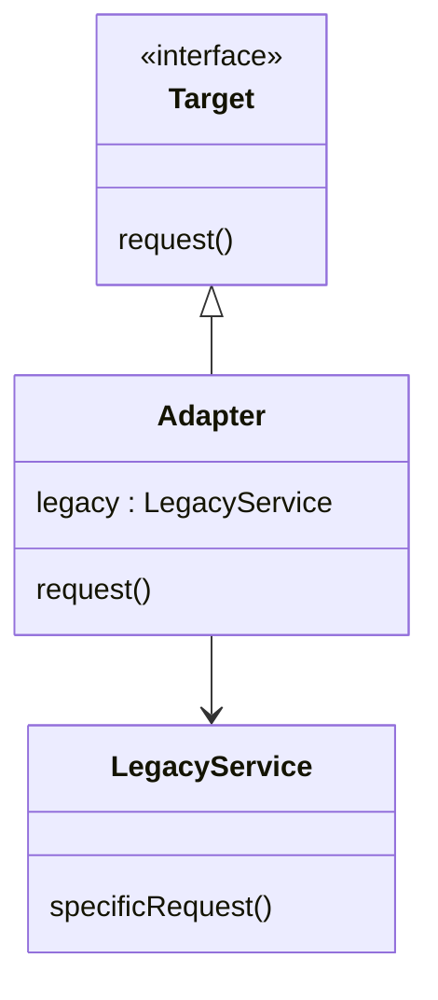
```mermaid
classDiagram
class Target {
<<interface>>
request()
}
class LegacyService {
specificRequest()
}
class Adapter {
legacy : LegacyService
request()
}

Target <|-- Adapter
Adapter --> LegacyService
```

---

### Bridge
**Цель**: Отделить абстракцию от реализации, чтобы их можно было изменять независимо.

Как работает:
Абстракция содержит ссылку на реализацию. Обе иерархии могут развиваться отдельно.

Пример:
Фигуры (`Circle`, `Square`) и API для рисования (`OpenGL`, `Vulkan`).

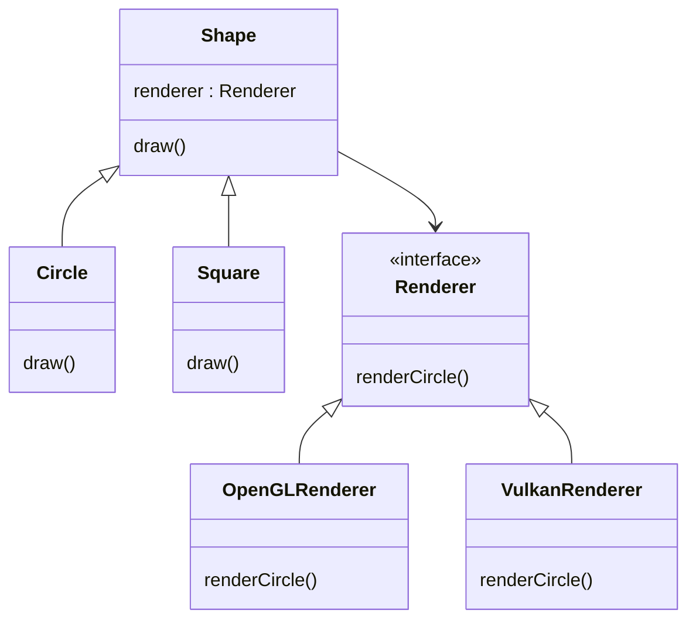
```mermaid
classDiagram
class Shape {
renderer : Renderer
draw()
}
class Circle {
draw()
}
class Square {
draw()
}
class Renderer {
<<interface>>
renderCircle()
}
class OpenGLRenderer {
renderCircle()
}
class VulkanRenderer {
renderCircle()
}

Shape <|-- Circle
Shape <|-- Square
Shape --> Renderer
Renderer <|-- OpenGLRenderer
Renderer <|-- VulkanRenderer
```

---

### Composite
**Цель**: Обрабатывать отдельные объекты и составные одинаково.

Как работает:
Компоненты и составные объекты реализуют общий интерфейс. Составной объект содержит дочерние компоненты.

Пример:
Файловая система: `File` и `Directory` имеют метод `getSize()`.

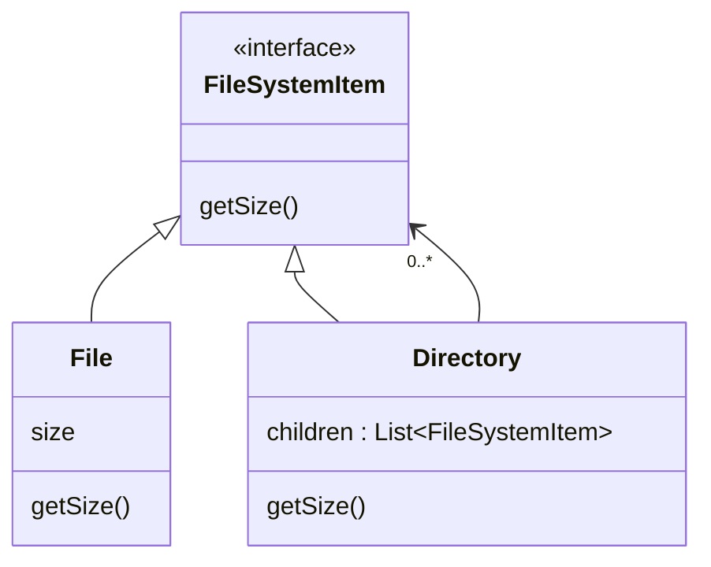
```mermaid
classDiagram
class FileSystemItem {
<<interface>>
getSize()
}
class File {
size
getSize()
}
class Directory {
children : List~FileSystemItem~
getSize()
}

FileSystemItem <|-- File
FileSystemItem <|-- Directory
Directory --> "0..*" FileSystemItem
```

---

### Decorator
**Цель**: Динамически добавлять обязанности объекту.

Как работает:
Декоратор реализует тот же интерфейс, что и оборачиваемый объект, и делегирует вызовы, добавляя своё поведение.

Пример:
Потоки в Java: `BufferedInputStream` оборачивает `FileInputStream`.

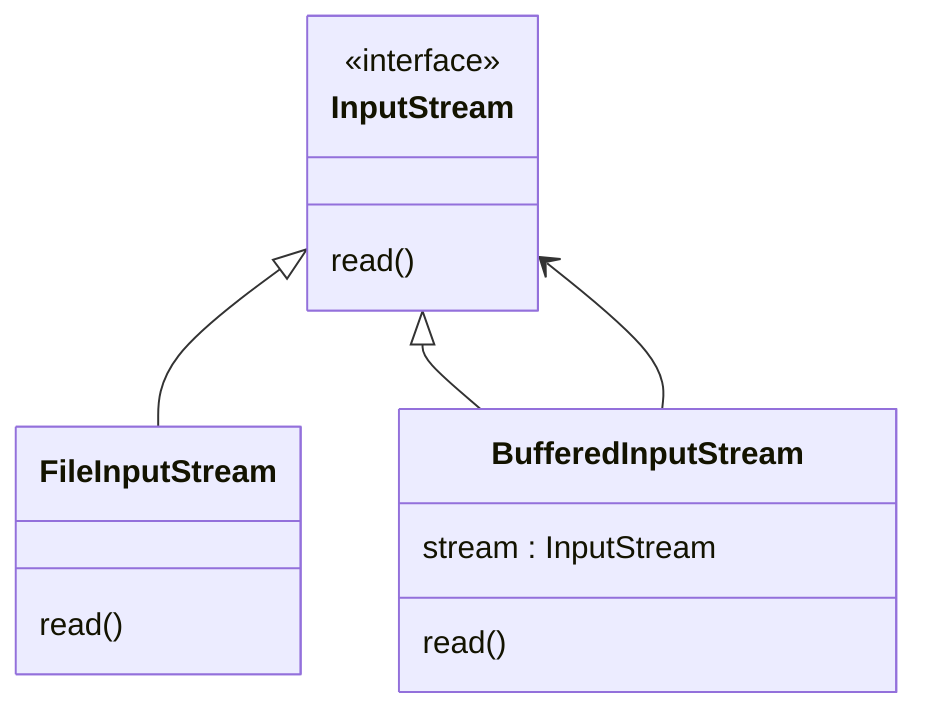
```mermaid
classDiagram
class InputStream {
<<interface>>
read()
}
class FileInputStream {
read()
}
class BufferedInputStream {
stream : InputStream
read()
}

InputStream <|-- FileInputStream
InputStream <|-- BufferedInputStream
BufferedInputStream --> InputStream
```

---

### Facade
**Цель**: Предоставить простой интерфейс к сложной подсистеме.

Как работает:
Фасад делегирует запросы компонентам подсистемы, скрывая их сложность.

Пример:
`HttpURLConnection` скрывает детали TCP, DNS, TLS, HTTP.

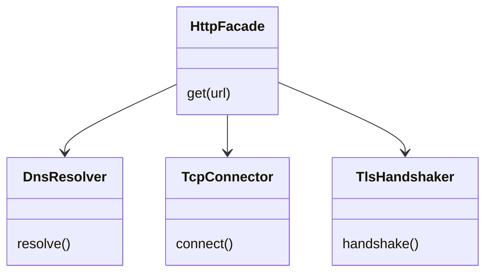
```mermaid
classDiagram
class HttpFacade {
get(url)
}
class DnsResolver {
resolve()
}
class TcpConnector {
connect()
}
class TlsHandshaker {
handshake()
}

HttpFacade --> DnsResolver
HttpFacade --> TcpConnector
HttpFacade --> TlsHandshaker
```

---

### Flyweight
>Приспособленец

**Цель**: Экономить память, разделяя общее состояние между объектами.

Как работает:
Лёгковесные объекты хранят внутреннее состояние (разделяемое), внешнее передаётся при вызове.

Пример:
Символы в текстовом редакторе: один объект на букву `A`, используется много раз.

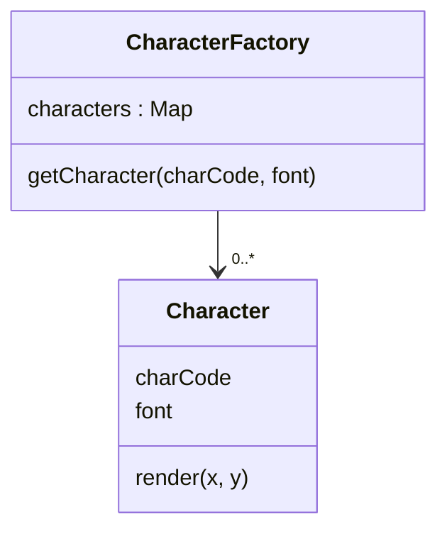
```mermaid
classDiagram
class Character {
charCode
font
render(x, y)
}
class CharacterFactory {
characters : Map
getCharacter(charCode, font)
}

CharacterFactory --> "0..*" Character
```

---

### Proxy
**Цель**: Контролировать доступ к объекту.

Как работает:
Прокси реализует тот же интерфейс, что и реальный объект, и может добавлять логику до/после вызова.

Пример:
Lazy loading: прокси загружает тяжёлый объект только при первом обращении.

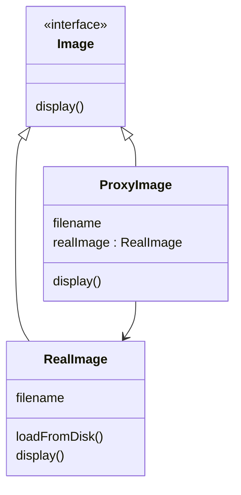
```mermaid
classDiagram
class Image {
<<interface>>
display()
}
class RealImage {
filename
loadFromDisk()
display()
}
class ProxyImage {
filename
realImage : RealImage
display()
}

Image <|-- RealImage
Image <|-- ProxyImage
ProxyImage --> RealImage
```

---

## Behavioral Patterns
> Поведенческие паттерны

Решают задачи **взаимодействия объектов**, распределения ответственности и коммуникации.

| №   | Паттерн                     | Назначение                                                                                                            | Пример использования                                                    |
| --- | --------------------------- | --------------------------------------------------------------------------------------------------------------------- | ----------------------------------------------------------------------- |
| 13  | **Chain of Responsibility** | Передаёт запрос по цепочке обработчиков. Каждый обработчик решает: обработать или передать дальше.                    | Логирование (`DEBUG` → `INFO` → `ERROR`), middleware в веб-фреймворках. |
| 14  | **Command**                 | Инкапсулирует запрос как объект, позволяя параметризовать клиенты с различными запросами.                             | Отмена/повтор действий (Undo/Redo), очередь задач.                      |
| 15  | **Iterator**                | Предоставляет способ последовательного доступа ко всем элементам коллекции, не раскрывая её внутреннее представление. | `for-each` в Java, `Iterable` интерфейс.                                |
| 16  | **Mediator**                | Инкапсулирует взаимодействие множества объектов, уменьшая связанность.                                                | Чат-комната (все общаются через `ChatRoom`), UI-контроллер.             |
| 17  | **Memento**                 | Фиксирует и сохраняет внутреннее состояние объекта без нарушения инкапсуляции.                                        | Сохранение состояния игры, undo-стек.                                   |
| 18  | **Observer**                | Определяет зависимость "один-ко-многим": при изменении состояния одного объекта все зависящие от него уведомляются.   | `java.util.Observer`, реактивные потоки (`Flux`, `RxJava`), события.    |
| 19  | **State**                   | Позволяет объекту изменять своё поведение в зависимости от внутреннего состояния.                                     | Автомат (состояния: `Idle`, `Processing`, `Error`), TCP-соединение.     |
| 20  | **Strategy**                | Определяет семейство алгоритмов, инкапсулирует каждый из них и делает их взаимозаменяемыми.                           | Сортировка (`QuickSort`, `MergeSort`), алгоритмы маршрутизации.         |
| 21  | **Template Method**         | Определяет скелет алгоритма в базовом классе, делегируя некоторые шаги подклассам.                                    | Фреймворки (Spring `JdbcTemplate`, `RestTemplate`).                     |
| 22  | **Visitor**                 | Позволяет добавлять новую операцию к иерархии классов, не изменяя сами классы.                                        | Генерация отчётов (XML, JSON, PDF) по дереву объектов.                  |
| 23  | **Interpreter**             | Определяет грамматику простого языка и интерпретатор для неё.                                                         | Регулярные выражения, DSL (Domain-Specific Languages).                  |

> 💡 **Главная идея**: **делегировать поведение**, а не жёстко кодировать его.

---
### Chain of Responsibility
**Цель**: Передавать запрос по цепочке обработчиков.

Как работает:
Каждый обработчик решает: обработать запрос или передать следующему.

Пример:
Middleware в веб-фреймворках (аутентификация → логирование → сжатие).

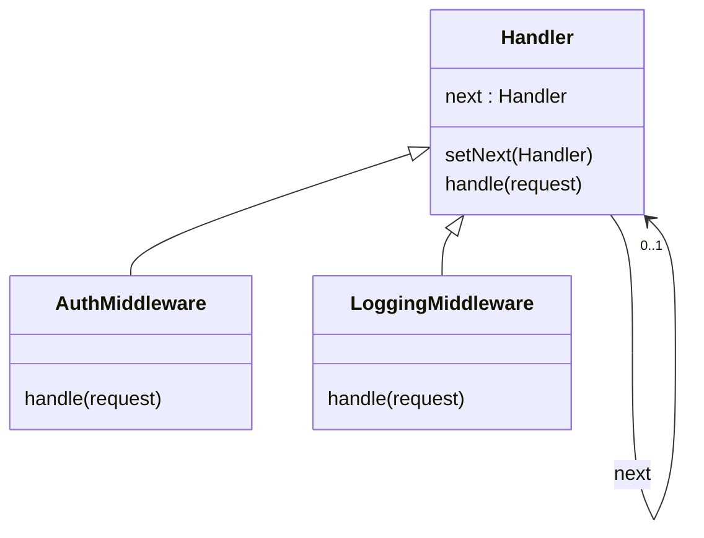
```mermaid
classDiagram
class Handler {
next : Handler
setNext(Handler)
handle(request)
}
class AuthMiddleware {
handle(request)
}
class LoggingMiddleware {
handle(request)
}

Handler <|-- AuthMiddleware
Handler <|-- LoggingMiddleware
Handler --> "0..1" Handler : next
```

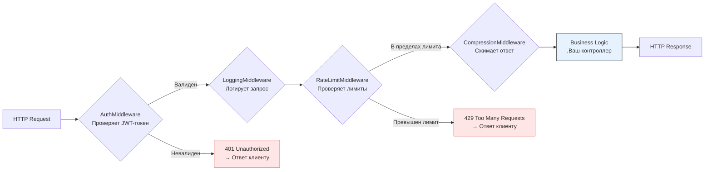
```mermaid
flowchart LR
    A["HTTP Request"] --> B{"AuthMiddleware<br>Проверяет JWT-токен"}
    B -- Валиден --> C{"LoggingMiddleware<br>Логирует запрос"}
    B -- Невалиден --> Z["401 Unauthorized<br>→ Ответ клиенту"]
    C --> D{"RateLimitMiddleware<br>Проверяет лимиты"}
    D -- В пределах лимита --> E{"CompressionMiddleware<br>Сжимает ответ"}
    D -- Превышен лимит --> Y["429 Too Many Requests<br>→ Ответ клиенту"]
    E --> F["Business Logic<br>,Ваш контроллер"]
    F --> G["HTTP Response"]

    style Z fill:#ffe6e6,stroke:#c00
    style Y fill:#ffe6e6,stroke:#c00
    style F fill:#e6f3ff,stroke:#333
```

---

### Command
**Цель**: Инкапсулировать запрос как объект.

Как работает:
Команда содержит получателя и вызывает его метод. Позволяет отмену, очередь, логирование.

Пример:
Undo/Redo в текстовом редакторе.

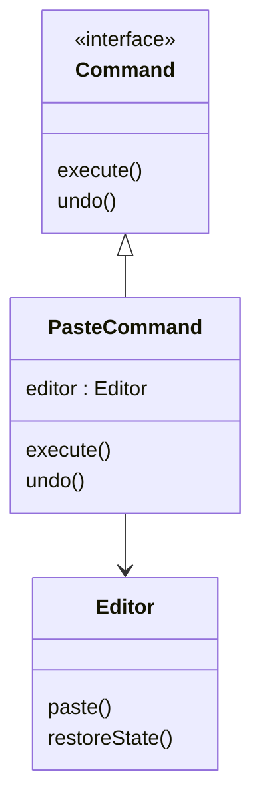
```mermaid
classDiagram
class Command {
<<interface>>
execute()
undo()
}
class PasteCommand {
editor : Editor
execute()
undo()
}
class Editor {
paste()
restoreState()
}

Command <|-- PasteCommand
PasteCommand --> Editor
```

---

### Iterator
**Цель**: Обеспечить последовательный доступ к элементам коллекции.

Как работает:
Итератор инкапсулирует обход коллекции, скрывая её структуру.

Пример:
`for (item : list)` в Java использует `Iterator`.

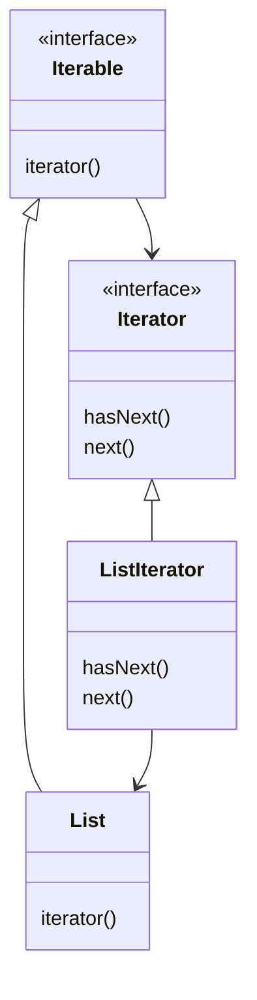
```mermaid
classDiagram
class Iterable {
<<interface>>
iterator()
}
class List {
iterator()
}
class Iterator {
<<interface>>
hasNext()
next()
}
class ListIterator {
hasNext()
next()
}

Iterable <|-- List
Iterable --> Iterator
Iterator <|-- ListIterator
ListIterator --> List
```

---

### Mediator
**Цель**: Уменьшить связанность между объектами, заставив их общаться через посредника.

Как работает:
Компоненты не общаются напрямую, а через `Mediator`, который координирует взаимодействие.

Пример:
Чат-комната: пользователи отправляют сообщения через `ChatRoom`.

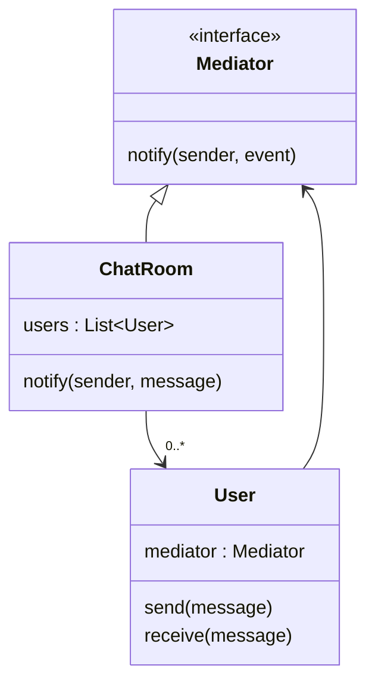
```mermaid
classDiagram
class Mediator {
<<interface>>
notify(sender, event)
}
class ChatRoom {
users : List~User~
notify(sender, message)
}
class User {
mediator : Mediator
send(message)
receive(message)
}

Mediator <|-- ChatRoom
ChatRoom --> "0..*" User
User --> Mediator
```

---

### Memento
**Цель**: Сохранять и восстанавливать внутреннее состояние объекта.

Как работает:
`Originator` создаёт `Memento` с состоянием. `Caretaker` хранит мементо, но не может его читать.

Пример:
Undo в редакторе: сохранение снапшотов состояния.

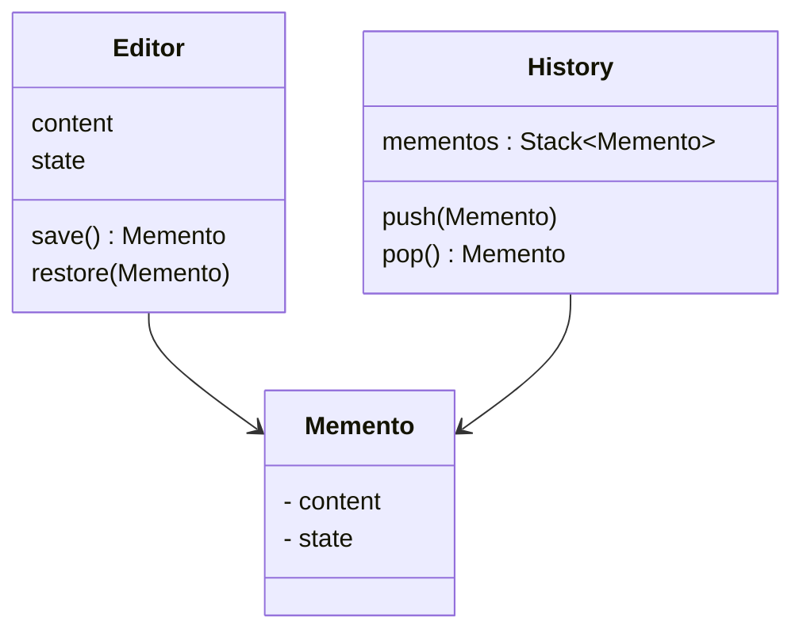
```mermaid
classDiagram
class Editor {
content
state
save() Memento
restore(Memento)
}
class Memento {
- content
- state
}
class History {
mementos : Stack~Memento~
push(Memento)
pop() Memento
}

Editor --> Memento
History --> Memento
```

---

### Observer
**Цель**: Оповещать множество объектов об изменениях состояния.

Как работает:
Субъект хранит список наблюдателей и уведомляет их при изменении.

Пример:
Реактивные потоки (`Flux`, `RxJava`), события в UI.

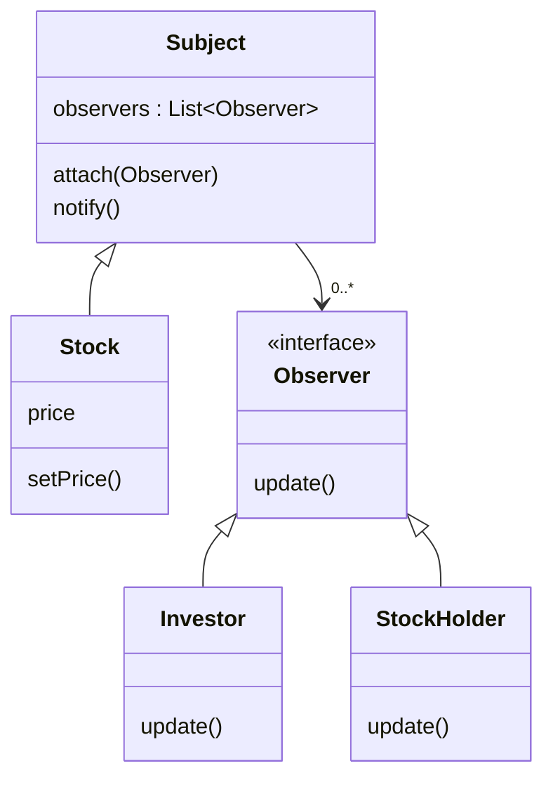
```mermaid
classDiagram
class Subject {
	observers : List~Observer~
	attach(Observer)
	notify()
}
class Stock {
	price
	setPrice()
}
class Observer {
	<<interface>>
	update()
}
class Investor {
	update()
}
class StockHolder {
	update()
}

Subject <|-- Stock
Subject --> "0..*" Observer
Observer <|-- Investor
Observer <|-- StockHolder
```

---

### State
**Цель**: Изменять поведение объекта при изменении его состояния.

Как работает:
Контекст делегирует поведение текущему состоянию. Состояния реализуют общий интерфейс.

Пример:
TCP-соединение: состояния `Established`, `Listen`, `Closed`.

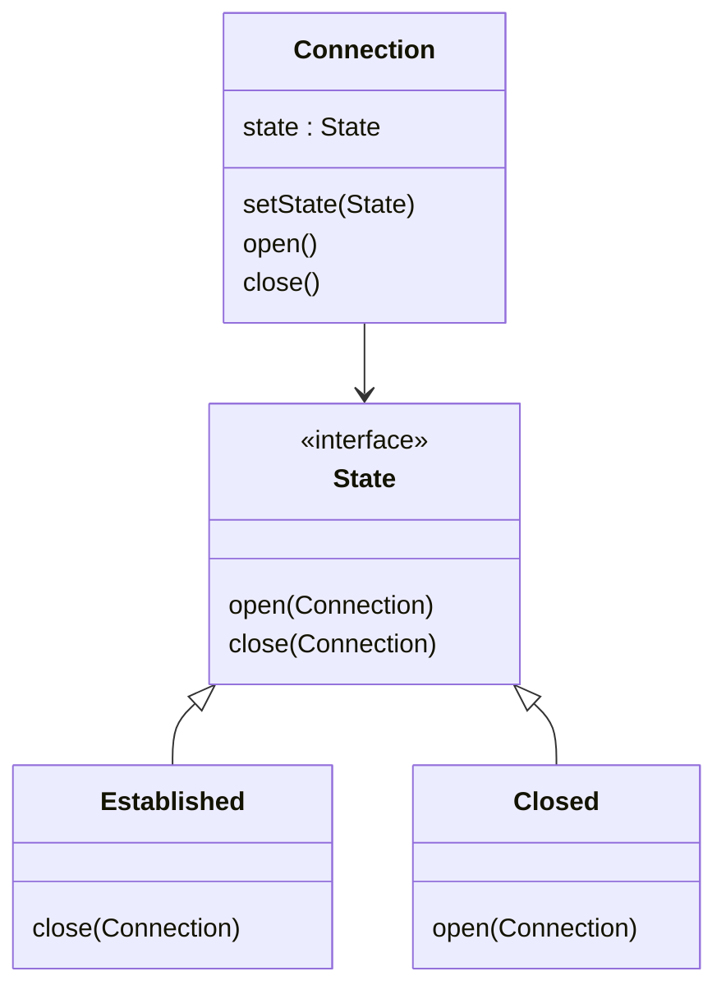
```mermaid
classDiagram
class Connection {
state : State
setState(State)
open()
close()
}
class State {
<<interface>>
open(Connection)
close(Connection)
}
class Established {
close(Connection)
}
class Closed {
open(Connection)
}

Connection --> State
State <|-- Established
State <|-- Closed
```

---

### Strategy
**Цель**: Определить семейство алгоритмов и сделать их взаимозаменяемыми.

Как работает:
Контекст использует стратегию через интерфейс. Конкретные стратегии реализуют алгоритм.

Пример:
Сортировка: `QuickSort`, `MergeSort`, `BubbleSort`.

```mermaid
classDiagram
class Sorter {
strategy : SortingStrategy
setStrategy(SortingStrategy)
sort(data)
}
class SortingStrategy {
<<interface>>
sort(data)
}
class QuickSort {
sort(data)
}
class MergeSort {
sort(data)
}

Sorter --> SortingStrategy
SortingStrategy <|-- QuickSort
SortingStrategy <|-- MergeSort
```

---

### Template Method
**Цель**: Определить скелет алгоритма, отложив реализацию шагов в подклассы.

Как работает:
Абстрактный класс содержит шаблонный метод и абстрактные примитивные операции.

Пример:
`JdbcTemplate` в Spring: `execute()` — шаблон, `doInStatement()` — реализация.

```mermaid
classDiagram
class AbstractTask {
<<abstract>>
execute()
connect()
run()
disconnect()
}
class DbTask {
run()
}

AbstractTask <|-- DbTask
```

---

### Visitor
**Цель**: Добавлять новую операцию к иерархии классов без изменения их кода.

Как работает:
Посетитель имеет методы для каждого типа элемента. Элементы принимают посетителя.

Пример:
Генерация отчётов (XML, JSON) по дереву объектов.

```mermaid
classDiagram
class Visitor {
	<<interface>>
	visit(Shape)
	visit(Group)
}
class XmlVisitor {
	visit(Shape)
	visit(Group)
}
class JsonVisitor {
	visit(Shape)
	visit(Group)
}
class Element {
	<<interface>>
	accept(Visitor)
}
class Shape {
	accept(Visitor)
}
class Group {
	children : List~Element~
	accept(Visitor)
}

Visitor <|-- XmlVisitor
Visitor <|-- JsonVisitor
Element <|-- Shape
Element <|-- Group
Shape --> Visitor
Group --> Visitor
```

---

### Interpreter
**Цель**: Определить грамматику языка и интерпретатор для неё.

Как работает:
Каждое правило грамматики — класс. Интерпретация — рекурсивный обход дерева.

Пример:
Регулярные выражения, SQL-парсеры.

```mermaid
classDiagram
class Expression {
<<interface>>
interpret(context)
}
class TerminalExpression {
interpret(context)
}
class AndExpression {
expr1 : Expression
expr2 : Expression
interpret(context)
}
class Context {
data
}

Expression <|-- TerminalExpression
Expression <|-- AndExpression
AndExpression --> "2" Expression
```

---

---

## tree
```mermaid
---
title: GoF patterns tree
---
mindmap
  root((GoF patterns))
    Creational Patterns
      Abstract Factory
      Builder
      Factory Method
      Prototype
      Singleton
    Structural Patterns
      Adapter
      Bridge
      Composite
      Decorator
      Facade
      Flyweight
      Proxy
    Behavioral Patterns
      Chain of Responsibility
      Command
      Iterator
      Mediator
      Memento
      Observer
      State
      Strategy
      Template Method
      Visitor
      Interpreter
```
## история
Книга **«Design [[Pattern]]s: Elements of Reusable Object-Oriented Software»** (1994), написанная «Бандой четырёх» (**GoF — Gamma, Helm, Johnson, Vlissides**), — это **фундаментальная работа**, определившая 23 классических паттерна проектирования. #👨 #📘 

