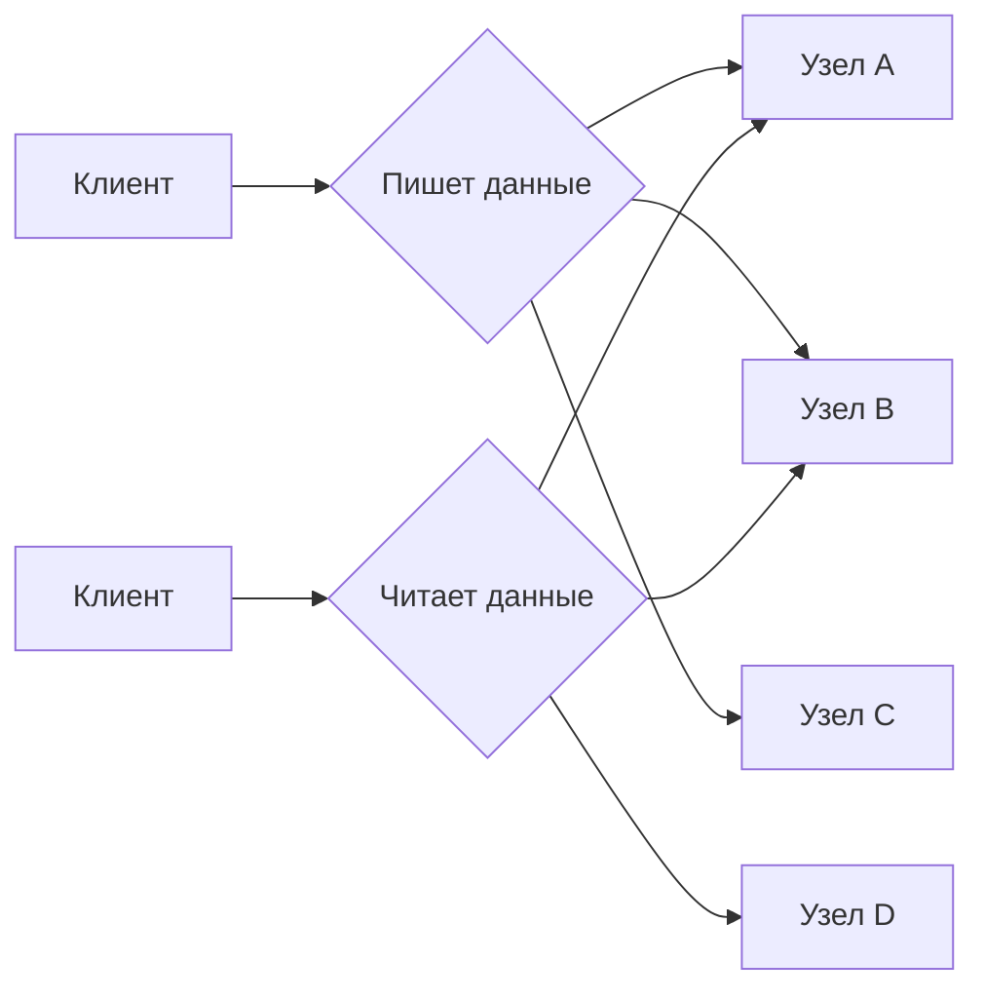
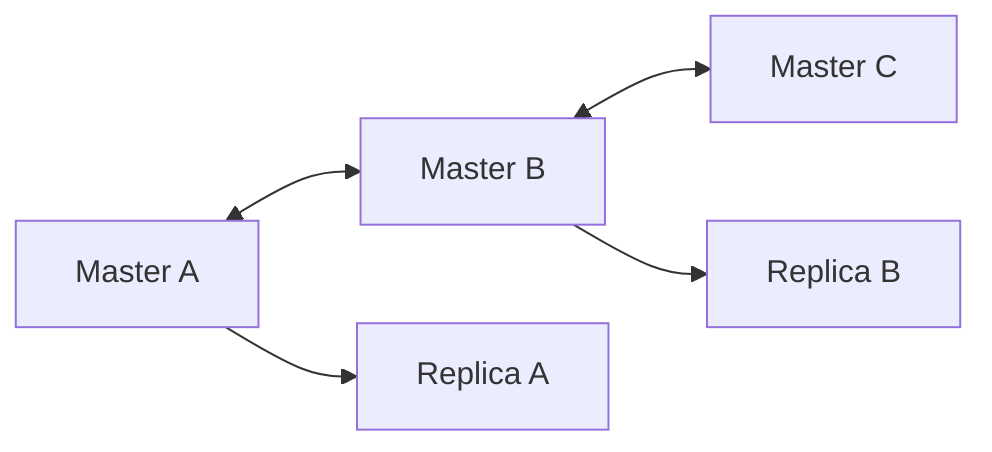
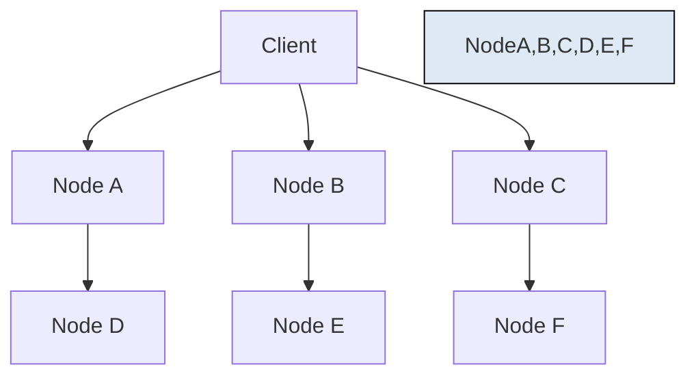
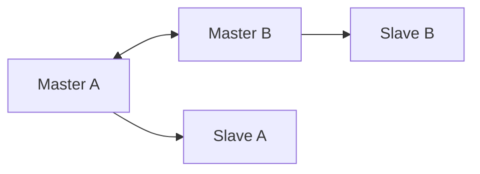
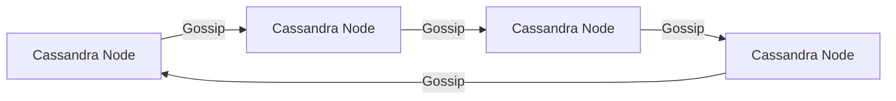

**Leaderless-архитектура** — это **современный подход к построению распределённых систем**, в котором **нет центрального управляющего узла (лидера)**. В отличие от традиционных архитектур с лидером (например, Raft, Paxos), здесь **все узлы равны**.

---

## ✅ Что такое Leaderless-архитектура?

> **Leaderless-архитектура** — это система, где **никакой узел не является "мастером" или "координатором"**, и каждый может принимать запросы на чтение/запись.

Вместо одного лидера, который управляет согласованием, используется **децентрализованная логика**:
- Кворумы
- Версионирование данных
- Сравнение версий (vector clocks, version vectors)
- Разрешение конфликтов на клиенте

---

## 🔁 Традиционная архитектура vs Leaderless

| Характеристика                | **С лидером (Leader-based)**    | **Без лидера (Leaderless)**        |
| ----------------------------- | ------------------------------- | ---------------------------------- |
| **Есть master-узел?**         | ✅ Да (например, `etcd-0`)       | ❌ Нет — все узлы равноправны       |
| **Кто обрабатывает запись?**  | Только лидер → реплики          | Любой узел может принять запись    |
| **Сложность согласования**    | Высокая (Raft, Paxos)           | Умеренная (quorum, timestamps)     |
| **Производительность записи** | Ограничена одним узлом          | Выше — параллельные записи         |
| **Задержка**                  | Может быть высокой (жду лидера) | Ниже — можно писать ближе к себе   |
| **Геораспределение**          | Сложное (лидер в одном регионе) | Легче — нет зависимости от региона |
| **Failover**                  | Нужно выбрать нового лидера     | Не нужен — все узлы уже работают   |
| **Примеры**                   | etcd, ZooKeeper, Consul         | DynamoDB, Cassandra, Riak          |

> ✅ **Leaderless = больше гибкости, меньше контроля.**

---

## ✅ Как работает Leaderless-архитектура?

### 🔄 Принцип: **Quorum + eventual consistency**

Допустим, у вас 5 узлов (`N = 5`)

Вы устанавливаете:
- `W = 3` — нужно **3 подтверждения записи**
- `R = 3` — нужно **3 узла для чтения**



→ Запись считается успешной, если **3 из 5** ответили `OK`  
→ Чтение — если **3 из 5** дали одинаковый ответ

> Если есть **конфликт** (разные версии) — клиент решает, какую взять (last write wins, merge strategy).

---

## ✅ Ключевые механизмы

| Механизм | Объяснение |
|---------|------------|
| **Quorum (кворум)** | Большинство узлов должно подтвердить операцию: `W + R > N` → гарантия согласованности |
| **Vector Clocks / Version Vectors** | Отслеживают порядок изменений между узлами без общего времени |
| **Last Write Wins (LWW)** | При конфликте — побеждает последняя запись (по timestamp) |
| **CRDTs (Conflict-free Replicated Data Types)** | Данные, которые не могут конфликтовать (например, счётчики) |
| **Gossip Protocol** | Узлы обмениваются данными «по слухам» — постепенно распространяют изменения |
| **Hinted Handoff** | Если узел недоступен — другой временно хранит его данные |
| **Read Repair** | При чтении обнаруживает разные версии → исправляет их |
| **Sloppy Quorum** | Позволяет временно использовать другие узлы при отказе основных |

---

## ✅ Пример: AWS DynamoDB

DynamoDB — одна из первых систем, реализующих leaderless-архитектуру (описана в [Dynamo Paper](https://www.allthingsdistributed.com/files/amazon-dynamo-sosp2007.pdf))

### 🔧 Как работает:
- 10+ узлов
- `N=3`, `W=2`, `R=2`
- Запись: любой узел может её принять
- Конфликты: через vector clocks
- Чтение: с 2 узлов → если разные — клиент получает обе версии → должен решить, какую оставить

> ✅ **Нет single point of failure**  
> ✅ **Можно писать даже при частичном отказе сети**

---

## ✅ Пример: Apache Cassandra

- Все узлы равны
- Использует **gossip** для обмена состоянием
- Запись может быть на любом узле → он становится **coordinator**
- Реплицируется по кольцу (consistent hashing)
- Поддерживает **eventual consistency**

```bash
# Можно отправить INSERT на любой узел
INSERT INTO users(id, name) VALUES (1, 'Alice');
```

→ Этот узел перешлёт данные тем, кто должен хранить

---

## ✅ Преимущества Leaderless-архитектуры

| Плюс | Объяснение |
|------|------------|
| ✅ **Нет single point of failure** | Не нужно выбирать лидера |
| ✅ **Высокая доступность** | Работает даже при сетевых разделениях |
| ✅ **Лучшая производительность записи** | Можно писать в любой узел |
| ✅ **Идеальна для геораспределённых систем** | Узлы в разных регионах — никто не ждёт "мастера" в США |
| ✅ **Автоматический failover** | Не нужно переизбирать лидера |
| ✅ **Гибкость** | Можно добавлять/удалять узлы |

---

## ⚠️ Недостатки

| Минус | Объяснение |
|-------|------------|
| ❌ **Eventual Consistency** | Данные могут быть устаревшими |
| ❌ **Конфликты** | Нужно решать на стороне клиента |
| ❌ **Сложнее понять** | Особенно для новичков |
| ❌ **Требует idempotent операций** | Чтобы не было дублей |
| ❌ **Ограниченная поддержка ACID** | Почти всегда BASE, а не ACID |

---

## ✅ Когда использовать?

| Сценарий | Рекомендация |
|----------|--------------|
| ✅ IoT, мобильные приложения | ✅ Да — низкие задержки, высокая доступность |
| ✅ Глобальные системы (SaaS) | ✅ Да — например, DynamoDB, Cassandra |
| ✅ Вам нужно 99.99% uptime | ✅ Да — leaderless хорошо справляется |
| ✅ Финансовые транзакции | ❌ Нет — используйте строгую согласованность |
| ✅ Вам нужно strong consistency | ❌ Leader-based лучше (например, PostgreSQL) |
| ✅ Частые сетевые сбои | ✅ Да — leaderless продолжает работать |

---

## ✅ Сравнение: Leaderless vs Leader-based

| Критерий | Leaderless | Leader-based |
|--------|-----------|-------------|
| **Single Point of Failure** | ❌ Нет | ✅ Есть (если лидер упал) |
| **Write Performance** | ✅ Высокая | ⚠️ Ограничена лидером |
| **Consistency Model** | Eventual | Strong / Linearizable |
| **Latency (гео)** | ✅ Низкая | ❌ Высокая (ждём лидера) |
| **Failover** | ✅ Автоматический | ✅ Но требует времени |
| **Сложность реализации** | ✅ Высокая | ✅ Средняя |
| **Примеры** | DynamoDB, Cassandra, Riak | etcd, ZooKeeper, Consul |

---

## ✅ Финальный вывод

> **Leaderless-архитектура — это когда вы говорите:**  
> _«Никто не командует. Мы договорились сами.»_

> Она отлично подходит:
- Для систем, где важна **доступность**
- Для геораспределённых сервисов
- Когда можно позволить **временную несогласованность**

> Но не подходит:
- Для банковских проводок
- Где требуется **ACID**, **строгая согласованность**

---

## 💬 Цитата из Dynamo Paper:

> _“We are willing to sacrifice strong consistency for high availability.”_

> 🔑 Это философия всех leaderless-систем.

---

## 📚 Где учиться дальше?

- 📘 [Amazon Dynamo Paper](https://www.allthingsdistributed.com/files/amazon-dynamo-sosp2007.pdf)
- Book: *“Designing Data-Intensive Applications”* — Martin Kleppmann
- YouTube: *“Leaderless Architecture Explained”* — TechWorld with Nana
- Docs: [Apache Cassandra](https://cassandra.apache.org/), [AWS DynamoDB](https://aws.amazon.com/dynamodb/)

---

✅ **Leaderless-архитектура — выбор тех, кто ставит доступность выше согласованности.**  
Она позволяет системам **работать почти всегда**, даже если мир вокруг рушится.

> 💡 **Не просто "не имеет лидера". Она не нуждается в нём.**

# multi-master vs leaderless
Отличный и тонкий вопрос!  
**Leaderless** и **Multi-Master** — это **близкие, но не одинаковые понятия**.  
Они оба означают, что **запись возможна на нескольких узлах**, но **отличаются по архитектуре, согласованности и поведению при конфликтах**.

---

## ✅ Краткий ответ:

| Характеристика                           | **Multi-Master**                                    | **Leaderless**                                |
| ---------------------------------------- | --------------------------------------------------- | --------------------------------------------- |
| **Есть ли координация между мастерами?** | ✅ Да (иногда)                                       | ❌ Нет — все узлы независимы                   |
| **Типичная согласованность**             | Eventual или Strong                                 | Почти всегда **Eventual Consistency**         |
| **Как разрешаются конфликты?**           | Централизованно, через логику БД или внешний сервис | На клиенте: `vector clock`, `last write wins` |
| **Управление репликацией**               | Часто синхронная/полусинхронная                     | Асинхронная, gossip-based                     |
| **Примеры**                              | MySQL Cluster, PostgreSQL BDR, Oracle RAC           | DynamoDB, Cassandra, Riak                     |
| **Кто решает, кто лидер?**               | Иногда есть временный координатор                   | ❌ Никто — нет лидера                          |

> 🔑 **Multi-Master может быть leaderless, но не обязан.**  
> **Leaderless — это частный случай Multi-Master с максимальной децентрализацией.**

---

## ✅ 1. Что такое **Multi-Master Replication**?

### 🔹 Определение:
> **Multi-Master** — это архитектура, где **несколько узлов могут принимать операции записи**, в отличие от классического Master-Slave.

### 💡 Пример:
- Узел A → принимает `INSERT`
- Узел B → принимает `UPDATE`
- Оба рассылают изменения другим

### 🔄 Как работает:


→ Данные реплицируются между мастерами (например, через binlog)

### ✅ Преимущества:
- Высокая доступность
- Можно писать ближе к пользователю
- Лучше масштабируется по записи

### ⚠️ Недостатки:
- Возможны **конфликты**
- Требуется **механизм разрешения**:  
  - Last Write Wins (LWW)
  - Application-level merge
  - Timestamp-based resolution
- Сложнее мониторить
- Может потребовать **координатора**

> ✅ **Multi-Master — это "много мастеров", но они могут использовать протоколы, похожие на Raft, для синхронизации.**

---

## ✅ 2. Что такое **Leaderless Architecture**?

### 🔹 Определение:
> **Leaderless** — это архитектура, где **нет ни одного лидера**, **нет центрального координатора**, и **все узлы равноправны**.

Работает на основе:
- **Quorum** (`W + R > N`)
- **Vector Clocks / Version Vectors**
- **Gossip Protocol**
- **Hinted Handoff**
- **Read Repair**

### 💡 Пример: AWS DynamoDB, Apache Cassandra



→ Любой узел может принять запись  
→ Использует **quorum** и **eventual consistency**  
→ Конфликты решает **клиент**

---

## 🆚 Подробное сравнение

| Критерий | **Multi-Master** | **Leaderless** |
|----------|------------------|---------------|
| **Цель** | Распределённая запись | Максимальная доступность |
| **Согласованность** | Может быть strong | Почти всегда eventual |
| **Конфликты** | Решаются внутри системы | Передаются клиенту |
| **Координация** | Есть (частично) | Нет — только gossip |
| **Модель данных** | Часто SQL, ACID | NoSQL, BASE |
| **Примеры** | MySQL Cluster, PostgreSQL BDR | DynamoDB, Cassandra, Riak |
| **Время задержки** | Может быть высоким (синхронизация мастера) | Ниже — асинхронно |
| **Геодистрибуция** | Ограниченная | Отличная — подходит для глобальных систем |
| **Failover** | Автоматический (если один мастер упал) | Не нужен — все узлы работают |
| **Управление репликацией** | Через binlog, WAL | Gossip, hinted handoff |

---

## ✅ Визуальное сравнение

### Multi-Master:


→ Мастера общаются напрямую  
→ Есть протокол репликации  
→ Может быть **временный координатор**

### Leaderless:


→ Нет главного узла  
→ Все узлы обмениваются данными «по слухам»  
→ Клиент выбирает, куда писать

---

## ✅ Пример: Запись в Multi-Master vs Leaderless

### Сценарий:  
Пользователь A и B одновременно меняют профиль

#### 🔹 Multi-Master (MySQL Cluster):
- Оба пишут → система сравнивает `timestamp`
- Если конфликт → использует **встроенный механизм разрешения**
- Результат: `last write wins`

#### 🔹 Leaderless (Cassandra):
- Узел A: `name = Alice`, version = 1, timestamp = T1  
- Узел B: `name = Alisa`, version = 1, timestamp = T2  
- Клиент читает → получает **обе версии**
- Клиент должен **решить**, какую оставить
- Или использовать `LWW`

> ✅ **Leaderless передаёт ответственность клиенту**  
> ✅ **Multi-Master может решить сам**

---

## ✅ Когда использовать каждый?

| Сценарий | Рекомендация |
|----------|--------------|
| ✅ Вам нужно много записывающих узлов | → **Multi-Master** |
| ✅ Глобальная система, низкая задержка | → **Leaderless** |
| ✅ Хотите простое решение | → **Multi-Master** |
| ✅ Нужна максимальная отказоустойчивость | → **Leaderless** |
| ✅ Используете SQL | → **Multi-Master** |
| ✅ Используете NoSQL | → **Leaderless** |
| ✅ Нельзя потерять данные | → **Multi-Master** |
| ✅ Можно позволить временную несогласованность | → **Leaderless** |

---

## ✅ Финальный вывод

| | **Multi-Master** | **Leaderless** |
|--|------------------|----------------|
| **Что общего?** | Оба позволяют запись на несколько узлов | ✅ |
| **Кто управляет?** | Иногда есть координатор | ❌ Никто |
| **Где разрешаются конфликты?** | Внутри базы данных | На клиенте |
| **Сложность** | Средняя | Высокая |
| **Идеален для** | SQL, enterprise | NoSQL, cloud-native, IoT |

> 🔥 **Leaderless — это крайняя степень Multi-Master**, где **нет даже намёка на централизацию**.

---

## 💬 Цитата из Dynamo Paper:

> _“We are moving away from master-slave replication towards a more peer-to-peer system.”_  
> — Amazon Dynamo

---

## ✅ Итог: Главное отличие

| Вопрос | Ответ |
|--------|-------|
| **Все leaderless-системы — multi-master?** | ✅ Да — потому что позволяют запись на любом узле |
| **Все multi-master системы — leaderless?** | ❌ Нет — многие используют координатора или временного лидера |
| **Leaderless — это более радикальная форма multi-master** | ✅ Да |

> ✅ **Leaderless = Multi-Master + полная децентрализация + eventual consistency + gossip**

---

## 📚 Где учиться дальше?

- [Amazon Dynamo Paper](https://www.allthingsdistributed.com/files/amazon-dynamo-sosp2007.pdf)
- Book: *“Designing Data-Intensive Applications”* — Martin Kleppmann
- Docs: [Apache Cassandra](https://cassandra.apache.org/)
- YouTube: *“Leaderless Architecture Explained”* — TechWorld with Nana

---

✅ **Leaderless — когда вы говорите:**  
> _«Нам не нужен командир. Мы договоримся сами.»_

А **Multi-Master** — это:
> _«У нас несколько командиров. Но они всё равно советуются.»_

Выбирайте осознанно — в зависимости от требований к **согласованности**, **задержкам**, **географии** и **сложности**.