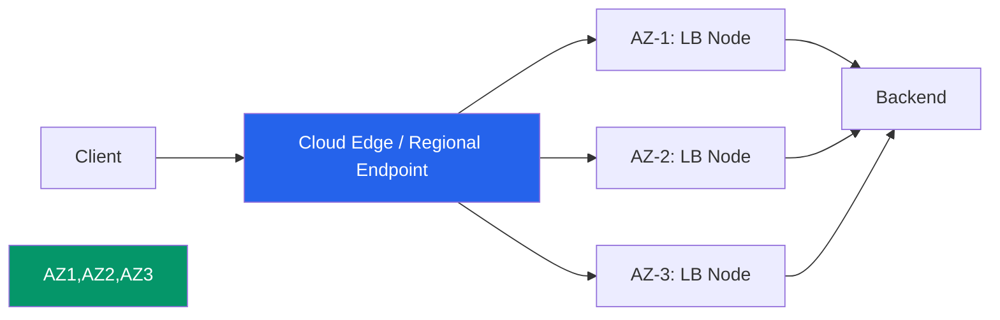
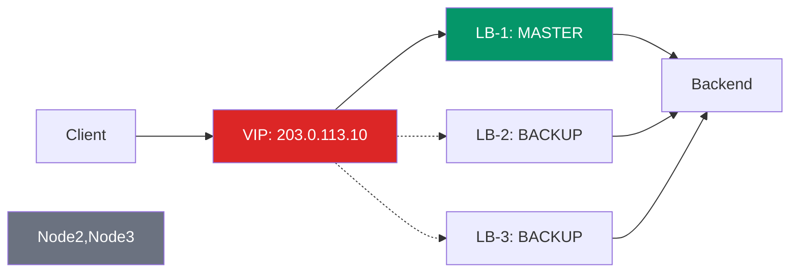
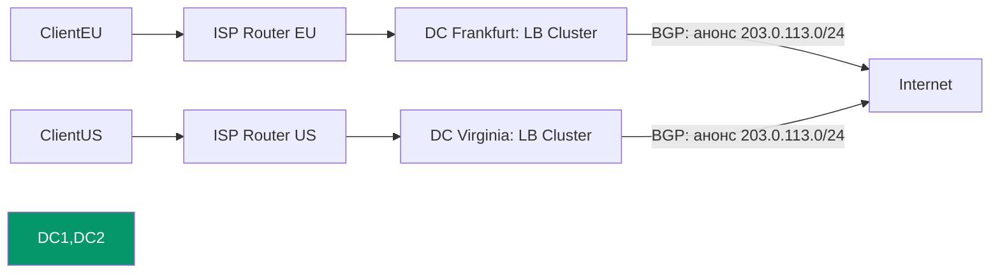

## 🔄 Как обеспечить отказоустойчивость самого внешнего Load Balancer?

Это классическая проблема: **«Кто балансирует балансировщик?»**  
Если внешний LB (с вашим публичным IP) падает — клиенты теряют доступ, даже если бэкенды здоровы.

Решение зависит от инфраструктуры. Ниже — проверенные подходы для разных сценариев.

---

## 🎯 Главный принцип

> **Внешний IP-адрес не должен быть привязан к одному физическому или виртуальному устройству.**  
> Он должен «плавать» между узлами или маршрутизироваться на ближайший живой инстанс.

---

## 📊 Сравнение подходов

| Подход                   | Как работает                                                                                | Failover time    | Сложность     | Когда применять                         |
| ------------------------ | ------------------------------------------------------------------------------------------- | ---------------- | ------------- | --------------------------------------- |
| **1. Managed Cloud LB**  | Провайдер (AWS NLB, GCP Global LB, Yandex ALB) сам обеспечивает HA на уровне инфраструктуры | < 1 сек          | Низкая        | Облака — **рекомендуется по умолчанию** |
| **2. Anycast + BGP**     | Один IP анонсируется из нескольких точек; BGP маршрутизирует к ближайшему живому узлу       | < 1 сек          | Высокая       | CDN, крупные SaaS, телеком              |
| **3. VRRP / Keepalived** | Виртуальный IP «плавает» между узлами в L2-сегменте через протокол приоритетов              | < 1 сек          | Средняя       | On-premise, bare-metal, собственные ЦОД |
| **4. DNS Failover**      | Несколько внешних IP в DNS; провайдер меняет запись при недоступности                       | 30–300 сек (TTL) | Низкая        | Когда допустима задержка, нет L2-сети   |
| **5. ECMP + BGP**        | Несколько LB с одним anycast-IP; маршрутизатор распределяет потоки                          | < 1 сек          | Очень высокая | Крупные дата-центры, ISP                |

---

## 🏗️ Детальная реализация по сценариям

### ✅ Сценарий 1: Облако (AWS / GCP / Yandex / Azure) — **рекомендуемый**

**Как работает**:  
Управляемый LB (NLB, ALB, Global LB) — это **не один сервер**, а распределённая служба:
- Развёрнут в нескольких зонах доступности (AZ)
- Имеет несколько точек входа (edge locations)
- Автоматически перемаршрутизирует трафик при сбое узла
- Внешний IP привязан к **сервису**, а не к инстансу



**Что делать вам**:
```yaml
# Пример: Yandex Cloud ALB с мультизональным развёртыванием
resource "yandex_alb_target_group" "main" {
  name = "backend-tg"
  dynamic "target" {
    for_each = var.instances
    content {
      subnet_id = target.value.subnet_id  # Разные подсети = разные AZ
      address   = target.value.private_ip
    }
  }
}

resource "yandex_alb_load_balancer" "main" {
  name = "public-lb"
  location {
    zone      = "ru-central1-a"
    subnet_id = yandex_vpc_subnet.a.id
  }
  location {
    zone      = "ru-central1-b"
    subnet_id = yandex_vpc_subnet.b.id
  }
  # При падении одной зоны трафик автоматически уходит в другую
}
```

✅ **Преимущества**:  
- Не нужно управлять failover'ом вручную  
- Автоматическое масштабирование под нагрузку  
- Встроенные health-check'и и DDoS-защита  

---

### ✅ Сценарий 2: On-premise / Bare-metal — VRRP + Keepalived

**Как работает**:  
Несколько серверов с Nginx/HAProxy образуют кластер. Один — `MASTER`, остальные — `BACKUP`. Виртуальный IP (VIP) привязан к мастеру. При его падении — один из бэкапов становится мастером и забирает VIP.



**Конфигурация Keepalived (`/etc/keepalived/keepalived.conf`)**:
```conf
vrrp_instance VI_1 {
    state MASTER              # На BACKUP-узлах: state BACKUP
    interface eth0
    virtual_router_id 51
    priority 100              # MASTER: 100, BACKUP: 90, 80...
    advert_int 1
    
    authentication {
        auth_type PASS
        auth_pass mysecret
    }
    
    virtual_ipaddress {
        203.0.113.10/32 dev eth0  # Ваш публичный VIP
    }
    
    # Проверка, что сам прокси жив (не только хост)
    track_script {
        check_nginx
    }
}

vrrp_script check_nginx {
    script "/usr/local/bin/check_nginx.sh"
    interval 2
    fall 3
    rise 2
}
```

**Скрипт проверки (`/usr/local/bin/check_nginx.sh`)**:
```bash
#!/bin/bash
# Возвращает 0 = ок, 1 = сбой
curl -sf http://127.0.0.1:80/health || exit 1
# Дополнительно: проверить доступность бэкендов
nc -z -w2 backend-1 8080 || exit 1
```

✅ **Преимущества**:  
- Работает на любом железе  
- Полный контроль над логикой failover  
- <1 сек переключение  

⚠️ **Ограничения**:  
- Требует L2-связности между узлами (одна подсеть)  
- Не масштабируется за пределы одного дата-центра без BGP  

---

### ✅ Сценарий 3: Глобальная доступность — Anycast + [[BGP]]

**Как работает**:  
Несколько дата-центров анонсируют **один и тот же IP-префикс** через BGP. Маршрутизаторы интернета направляют трафик к ближайшему (по метрике AS-path) живому анонсу.



**Что нужно**:
- Собственный AS номер и префикс IP-адресов (через RIPE / ARIN)
- BGP-сессии с несколькими апстримами (транзит-провайдерами)
- Маршрутизаторы с поддержкой BGP (Cisco, Juniper, FRRouting)
- Синхронизация конфигурации и сертификатов между ЦОД

✅ **Преимущества**:  
- Глобальная отказоустойчивость и низкая задержка  
- Автоматическое переключение при падении целого ЦОД  
- Защита от DDoS (трафик «распыляется»)  

⚠️ **Ограничения**:  
- Высокий порог входа (стоимость, экспертиза)  
- Сложность отладки маршрутизации  

---

### ✅ Сценарий 4: Простой и дешёвый — DNS Failover

**Как работает**:  
В DNS-записи `A` указаны несколько внешних IP. При недоступности одного из них (проверяется монитором) провайдер удаляет его из ответа.

```dns
# Пример записи в Route53 / Cloudflare / Yandex DNS
lb.example.com.  300  IN  A  203.0.113.10  ; LB-1, Frankfurt
lb.example.com.  300  IN  A  198.51.100.20  ; LB-2, Amsterdam
lb.example.com.  300  IN  A  192.0.2.30     ; LB-3, London
```

**Настройка в Cloudflare**:
```yaml
# healthcheck.tf (Terraform пример)
resource "cloudflare_healthcheck" "lb" {
  account_id  = var.account_id
  name        = "lb-global-check"
  description = "Проверка доступности внешних LB"
  
  address     = "203.0.113.10"  # Будет в цикле для каждого IP
  port        = 443
  type        = "HTTPS"
  
  http_config {
    method  = "GET"
    path    = "/health"
    expected_codes = ["200", "201", "204"]
  }
  
  timeout       = 5
  retries       = 3
  check_frequency = 30  # секунд
}
```

✅ **Преимущества**:  
- Работает с любым хостингом  
- Не требует изменений в инфраструктуре  
- Дёшево и быстро настраивается  

⚠️ **Ограничения**:  
- Задержка переключения = TTL + время обнаружения (30–300 сек)  
- Клиенты с кешированным DNS могут попасть на упавший узел  
- Не подходит для сессий с сохранением состояния  

---

## 🧰 Чек-лист отказоустойчивого внешнего LB

- [ ] ≥ 2 узла/инстанса/зоны с одним внешним IP (через VRRP / Anycast / Cloud LB)
- [ ] Health-check проверяет **работоспособность приложения**, а не только порт (`/health` с проверкой бэкендов)
- [ ] Конфигурация синхронизирована (Git, Ansible, Consul) — чтобы после failover новый мастер работал корректно
- [ ] Сессии и state вынесены за пределы LB (Redis, JWT) — чтобы переключение было прозрачным для клиентов
- [ ] Мониторинг: алерты на `vrrp_state_change`, `lb_unhealthy`, `dns_failover_triggered`
- [ ] Регулярные тесты: `chaos-mesh` / `kubectl delete pod` / отключение сети — проверяйте, что failover работает

---

## 💡 Итог: что выбрать?

| Ваша инфраструктура | Рекомендуемое решение |
|---------------------|-----------------------|
| **Облако (любой провайдер)** | ✅ Managed Cloud LB (ALB/NLB/Global LB) — не изобретайте велосипед |
| **Собственный ЦОД / bare-metal** | ✅ VRRP + Keepalived + 2–3 узла в одной подсети |
| **Глобальный сервис с низкими latency-требованиями** | ✅ Anycast + BGP (или используйте Cloudflare / AWS Global Accelerator) |
| **Бюджетный проект / MVP** | ✅ DNS Failover с низким TTL (60 сек) + мониторинг |

> 📌 **Золотое правило**:  
> *«Не делайте то, что уже сделал провайдер. Если есть управляемый LB с SLA 99.99% — используйте его.»*

---

✅ **Финальный совет**:  
Начните с **управляемого облачного LB** — это даст отказоустойчивость «из коробки».  
Если позже понадобится перейти on-premise — у вас уже будет отлаженная логика health-check'ов, синхронизации конфигов и мониторинга, которую можно перенести на VRRP/Keepalived.

Если уточните ваш стек (провайдер, прокси-софт, требования к latency/SLA), смогу дать готовый Terraform/Ansible-модуль под вашу задачу.