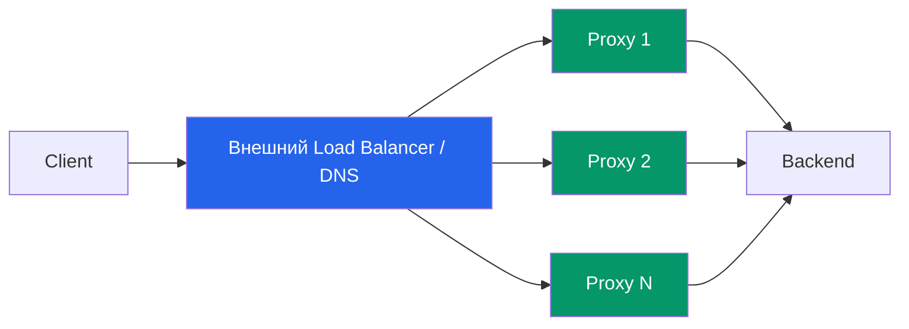

---
aliases:
  - DNS-based failover
  - Ingress Controller
  - Ingress
  - API Gateway
---
DNS-based failover

Чтобы обратный прокси-шлюз (Ingress Controller, API Gateway, Nginx/HAProxy и т.п.) выдерживал падение одного узла и продолжал обрабатывать запросы, необходимо убрать **единую точку отказа** и обеспечить **быстрое переключение трафика**. Ниже приведена проверенная архитектура и пошаговый план реализации.

---

## 🔑 Главный принцип
**Прокси-шлюз должен быть stateless + находиться за балансировщиком нагрузки с активными health-check'ами.**



---

## 🛠️ 4 рабочих подхода к отказоустойчивому масштабированию

| Подход                              | Как работает                                                                             | Время failover              | Когда применять                                       |
| ----------------------------------- | ---------------------------------------------------------------------------------------- | --------------------------- | ----------------------------------------------------- |
| **1. Cloud / Внешний L4-L7 LB**     | Единый VIP → health-check → маршрутизация на здоровые узлы                               | 1–5 сек                     | Облака (AWS, GCP, YC, Azure), большинство продакшенов |
| **2. [[DNS-based failover]]**       | Несколько внешних IP, DNS провайдер проверяет доступность и меняет запись                | 30–300 сек (зависит от TTL) | Когда нет облачного LB, допустима задержка            |
| **3. [[Anycast\|Anycast IP]]**      | Один IP анонсируется из нескольких точек через BGP. Трафик идёт к ближайшему живому узлу | <1 сек                      | Крупные SaaS, CDN, телеком                            |
| **4. [[VRRP]] / Keepalived / CARP** | Виртуальный IP "плавает" между узлами в L2-сети                                          | <1 сек                      | On-premise, bare-metal, собственные ЦОД               |

> ✅ **Рекомендация для 95% сценариев**: Managed Cloud Load Balancer + N stateless прокси-инстансов.

---

## 📋 Обязательные требования для горизонтального масштабирования

### 1. Полная statelessness шлюза
- ❌ Не хранить сессии, токены, rate-limit счётчики в памяти узла
- ✅ Выносить состояние в: Redis, PostgreSQL, внешние сервисы аутентификации
- ✅ Использовать JWT / подписанные cookies для сессий

### 2. Синхронизация конфигурации
- ❌ Ручное копирование `nginx.conf` / `traefik.yml`
- ✅ GitOps (ArgoCD/Flux), Consul, etcd, S3 + init-контейнер, или централизованный control-plane (Kong, APISIX, Tyk)

### 3. Корректные health-check'и
- TCP-порт (`:80/:443`) **недостаточен** (прокси может принимать соединения, но backend/конфиг сломаны)
- ✅ HTTP-эндпоинт `/health` или `/ready`, который проверяет:
  - Доступность upstream'ов
  - Валидность конфигурации
  - Готовность к приёму трафика

### 4. Graceful shutdown & connection draining
- При остановке узла шлюз должен:
  1. Перестать принимать новые соединения
  2. Дождаться завершения активных запросов (таймаут 10–30 сек)
  3. Только после этого завершать процесс
- В Nginx: `worker_shutdown_timeout 30s;`
- В Kubernetes: `terminationGracePeriodSeconds: 30` + preStop hook

### 5. Синхронизация TLS-сертификатов
- ❌ Генерировать сертификаты локально на каждом узле
- ✅ Хранить в HashiCorp Vault, AWS ACM, cert-manager (K8s), или централизованном хранилище с автоматическим обновлением

---

## 🧩 Пошаговая реализация (на примере Kubernetes + Cloud LB)

```yaml
# 1. Деплой нескольких реплик Ingress Controller
apiVersion: apps/v1
kind: Deployment
metadata:
  name: ingress-controller
spec:
  replicas: 3
  selector:
    matchLabels:
      app: ingress
  template:
    metadata:
      labels:
        app: ingress
    spec:
      terminationGracePeriodSeconds: 30
      containers:
      - name: nginx-ingress
        image: nginx/nginx-ingress:3.5
        readinessProbe:
          httpGet:
            path: /nginx-ready
            port: 8081
          initialDelaySeconds: 5
          periodSeconds: 5
        livenessProbe:
          httpGet:
            path: /nginx-health
            port: 8081
          initialDelaySeconds: 10
          periodSeconds: 10
        lifecycle:
          preStop:
            exec:
              command: ["/bin/sh", "-c", "sleep 10"] # draining

---
# 2. Service типа LoadBalancer (облачный LB автоматически создаст VIP)
apiVersion: v1
kind: Service
metadata:
  name: ingress-lb
  annotations:
    service.beta.kubernetes.io/aws-load-balancer-type: "nlb" # или alb, gcp, yandex
spec:
  type: LoadBalancer
  selector:
    app: ingress
  ports:
  - port: 80
    targetPort: 80
  - port: 443
    targetPort: 443
  externalTrafficPolicy: Local # сохраняет source IP, включает health-check на уровне node
```

### Что происходит при падении одного узла:
1. Cloud LB перестаёт получать ответы на `/nginx-ready` → помечает узел `UNHEALTHY`
2. Новые запросы мгновенно направляются на оставшиеся 2 узла
3. Активные соединения на упавшем узле завершаются или таймаутятся (клиент получит retry)
4. При восстановлении узла health-check проходит → трафик возвращается

---

## ⚠️ Частые ошибки и как их избежать

| Ошибка | Последствие | Решение |
|--------|-------------|---------|
| Health-check только по TCP 443 | LB считает узел живым, хотя конфигурация сломана | HTTP `/ready` с проверкой upstream |
| Сессии хранятся в памяти прокси | При failover пользователи "вылетают" из аккаунта | Redis/JWT, sticky sessions только как fallback |
| Разные версии конфигов на узлах | Непредсказуемое поведение, 502/404 на части трафика | GitOps, централизованный control-plane |
| Нет graceful shutdown | Обрыв активных запросов, таймауты у клиентов | `terminationGracePeriodSeconds` + preStop sleep |
| Один TLS-сертификат на узел, ручное обновление | Просрочка на части узлов, ошибки SSL | cert-manager, Vault, ACM |

---

## 📊 Метрики для мониторинга отказоустойчивости

| Метрика | Норма | Инструменты |
|---------|-------|-------------|
| `nginx_ingress_controller_nginx_process_connections{state="active"}` | Равномерное распределение по подам | Prometheus + Grafana |
| `kube_pod_status_ready` | Все реплики `True` | Kubernetes metrics |
| LB health-check success rate | > 99.9% | Cloud provider dashboard |
| P99 latency на шлюзе | < 50 мс (без backend) | OpenTelemetry / Jaeger |
| Connection drain time | < terminationGracePeriodSeconds | Логи прокси |

---

## ✅ Чек-лист production-готовности

- [ ] ≥ 2 реплики прокси-шлюза в разных зонах доступности
- [ ] Внешний LB с HTTP health-check'ами (`/ready`)
- [ ] Statelessness: сессии, rate-limit, auth → внешние хранилища
- [ ] Конфигурация синхронизирована (GitOps / etcd / S3)
- [ ] TLS-сертификаты централизованно управляются и обновляются
- [ ] Graceful shutdown настроен (draining + terminationGracePeriodSeconds)
- [ ] Проведён chaos-тест: `kill -9` одного узла → трафик переключается без 5xx для новых запросов
- [ ] Мониторинг + алерты на `unhealthy_backends`, `5xx_rate`, `drain_timeout`

---

## 💡 Итог

Горизонтальное масштабирование с отказоустойчивостью обратного прокси сводится к трём столпам:
1. **Stateless-архитектура** шлюза
2. **Внешний балансировщик** с активными health-check'ами
3. **Автоматическое управление состоянием** (конфиги, сертификаты, сессии)

При такой схеме падение одного (или даже нескольких) узлов шлюза **не прервёт обработку запросов**, а клиенты получат ответы от оставшихся здоровых инстансов без вмешательства операторов.

Если уточните стек (K8s, VM, bare-metal, конкретный прокси: Nginx, Traefik, Kong, HAProxy), смогу дать готовый конфиг или Terraform-модуль под вашу инфраструктуру.