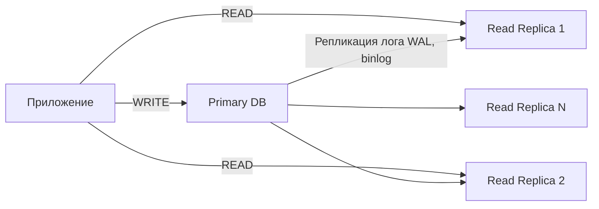

---
aliases:
  - Read Replica
---
**Паттерн Read Replica (реплика для чтения)** — это **ключевой подход к повышению производительности, масштабируемости и отказоустойчивости баз данных**. Он используется во всех серьёзных системах: от банков до соцсетей.

---

## ✅ Что такое **Read Replica**?

> **Read Replica** — это **копия основной (primary) базы данных**, настроенная **только для операций чтения (SELECT)**.

Она получает данные с **master-узла (primary)** через **асинхронную репликацию** и позволяет:
- Разгрузить основной сервер
- Увеличить пропускную способность
- Повысить доступность

---

## 🔄 Как работает паттерн?



### 🔧 Процесс:
1. **Запись (write)** → только в **Primary**
2. Primary записывает изменения в **журнал транзакций** (WAL, binlog)
3. Реплики **читают журнал** и применяют изменения у себя
4. **Чтение (read)** → можно направлять на любую реплику

---

## ✅ Преимущества

| Плюс | Объяснение |
|------|------------|
| ✅ **Масштабирование чтения** | Можно добавить 10+ реплик — увеличить throughput |
| ✅ **Защита Primary** | Главный сервер не парализован аналитикой |
| ✅ **Геодистрибуция** | Реплика в AWS EU-West → европейские пользователи читают быстро |
| ✅ **Отказоустойчивость** | Если primary упал — одна из реплик может стать новым primary |
| ✅ **Резервное копирование без блокировок** | Бэкапы делаем с реплики — не грузим primary |
| ✅ **Аналитика и BI** | Power BI, Tableau — читают с реплики |

---

## ⚠️ Недостатки и ограничения

| Минус | Объяснение |
|-------|------------|
| ❌ **Задержка (replication lag)** | Изменения на реплике появляются с задержкой (от 10 мс до секунд) |
| ❌ **Данные могут быть устаревшими** | Например, вы создали заказ → сразу захотели прочитать → а его нет на реплике |
| ❌ **Только чтение** | На реплику нельзя отправлять `INSERT`, `UPDATE`, `DELETE` |
| ❌ **Управление сложнее** | Нужно следить за lag, health, failover |
| ❌ **Ресурсы** | Каждая реплика — полноценный сервер (CPU, RAM, storage) |

---

## ✅ Где используется?

| Компания     | Как использует                                                |
| ------------ | ------------------------------------------------------------- |
| **Netflix**  | Реплики в каждом регионе — для быстрого чтения профилей       |
| **Uber**     | Реплики в городах — чтобы водители видели заказы без задержек |
| **Spotify**  | Чтение треков и плейлистов — с реплик                         |
| **Банки**    | Операции — на primary, баланс — с реплики                     |
| **Facebook** | Тысячи реплик — для ленты новостей                            |

---

## ✅ Пример: Реализация в PostgreSQL

### 1. Настройка Streaming Replication

На **Primary** (`postgresql.conf`):
```conf
wal_level = replica
max_wal_senders = 5
archive_mode = on
```

В `pg_hba.conf`:
```conf
host replication replicator 192.168.1.2/32 md5
```

### 2. На **Replica** — восстановление из backup + standby mode

```bash
pg_basebackup -h primary-host -D /var/lib/postgresql/data -U replicator -P --wal-method=stream
```

Файл `recovery.conf`:
```conf
standby_mode = 'on'
primary_conninfo = 'host=primary-host port=5432 user=replicator password=secret'
trigger_file = '/tmp/promote-trigger'
```

→ Реплика запускается как read-only.

---

## ✅ Пример: Использование в приложении

```java
// DataSource для записи
@Primary
@Bean(name = "writeDataSource")
public DataSource writeDataSource() {
    return createDataSource("jdbc:postgresql://primary:5432/mydb", true);
}

// DataSource для чтения
@Bean(name = "readDataSource")
public DataSource readDataSource() {
    // Список реплик
    List<String> replicas = Arrays.asList(
        "jdbc:postgresql://replica1:5432/mydb",
        "jdbc:postgresql://replica2:5432/mydb"
    );
    return new RoundRobinDataSource(replicas);
}
```

### В Spring Boot:

```yaml
spring:
  datasource:
    write:
      url: jdbc:postgresql://primary:5432/app
      username: admin
      password: pass
    read:
      urls: 
        - jdbc:postgresql://replica1:5432/app
        - jdbc:postgresql://replica2:5432/app
```

Используйте аннотацию:
```java
@ReadOnly
public List<Order> getOrders() { ... }

@Write
public void createOrder(Order o) { ... }
```

---

## ✅ Альтернативы и продвинутые версии

| Паттерн | Описание |
|--------|----------|
| **Multi-AZ RDS** | AWS автоматически создаёт реплики |
| **Read/Write Splitting Proxy** | Прокси (например, **PgBouncer**, **HAProxy**) разделяет запросы |
| **Logical Replication** | Репликация не по WAL, а по таблицам — более гибкая (PostgreSQL 10+) |
| **Active-Active Replication** | Несколько узлов принимают запись — сложно, но для HFT |
| **Sharding + Read Replicas** | Шардирование + реплики внутри шарда — для сверхмасштабирования |

---

## ✅ Когда использовать Read Replica?

| Сценарий | Рекомендация |
|----------|--------------|
| ✅ Высокая нагрузка на чтение | ✅ Да — обязательно |
| ✅ Медленные отчёты | ✅ Да — пусть работают на реплике |
| ✅ Геораспределение | ✅ Да — реплики в регионах |
| ✅ Вам нужно делать бэкапы | ✅ Да — снимайте с реплики |
| ✅ Низкий бюджет | ❌ Подумайте о **кэшировании (Redis)** — дешевле |
| ✅ Только один пользователь | ❌ Не нужно — избыточно |

---

## ✅ Лучшие практики

| Практика | Объяснение |
|---------|------------|
| ✅ **Измеряйте replication lag** | Prometheus + `pg_stat_replication` |
| ✅ **Не используйте реплику для критичных чтений** | Например, после `CREATE ORDER` → читайте с primary |
| ✅ **Равномерная балансировка между репликами** | Round-robin или least connections |
| ✅ **Health checks** | Проверяйте, что реплика не отстаёт |
| ✅ **Failover-план** | Автоматический переход к реплике при падении primary |
| ✅ **Logical vs Physical Replication** | Logical — если нужно фильтровать таблицы |

---

## ✅ Финальный вывод: Read Replica — это не опция, а необходимость

| Без Read Replica             | С Read Replica                                 |
| ---------------------------- | ---------------------------------------------- |
| Primary падает под нагрузкой | Primary спокоен — реплики берут на себя чтение |
| Отчёты тормозят сервис       | Отчёты — на отдельном сервере                  |
| Пользователи ждут            | Читаю с ближайшей реплики                      |
| Нет отказоустойчивости       | Можно переключиться на реплику                 |

> ✅ **Read Replica — стандарт де-факто для любой системы с высокой нагрузкой.**

---

## 💬 Цитата от эксперта

> _“If your database is slow, you have two options: cache or read replicas.  
> Cache for speed. Read replicas for scale.”_

---

## ✅ Итог: Когда выбирать Read Replica?

| Признак | Делайте Read Replica |
|--------|---------------------|
| Задержки при чтении > 100 мс | ✅ Да |
| CPU на БД > 70% | ✅ Да |
| Есть медленные отчёты | ✅ Да |
| Пользователи в разных регионах | ✅ Да |
| Нужны SLA ≥ 99.9% | ✅ Да |

---

## 📚 Где учиться дальше?

- [PostgreSQL Replication](https://www.postgresql.org/docs/current/warm-standby.html)
- [AWS RDS Read Replicas](https://docs.aws.amazon.com/AmazonRDS/latest/UserGuide/USER_ReadRepl.html)
- [MySQL Replication](https://dev.mysql.com/doc/refman/8.0/en/replication.html)
- YouTube: *“Read Replicas Explained”* — TechWorld with Nana

---

✅ **Read Replica — это когда ваша база данных перестаёт быть «одним сервером» и становится «системой».**  
Она масштабируется, живёт дольше, работает быстрее.

> 💡 **Если вы не используете реплики — вы строите дом на одном столбе.**