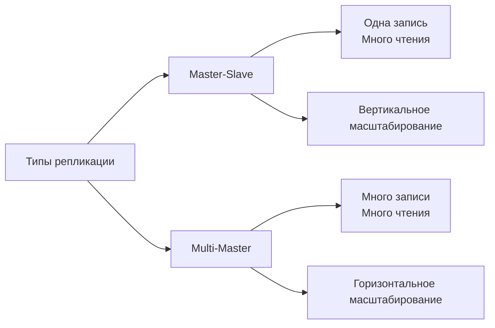
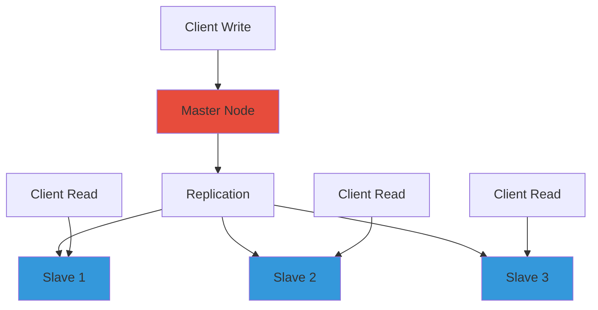
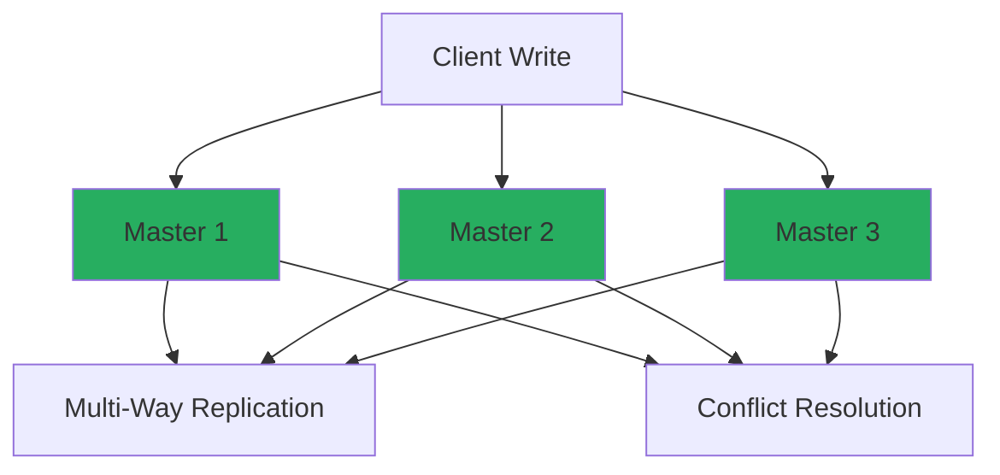
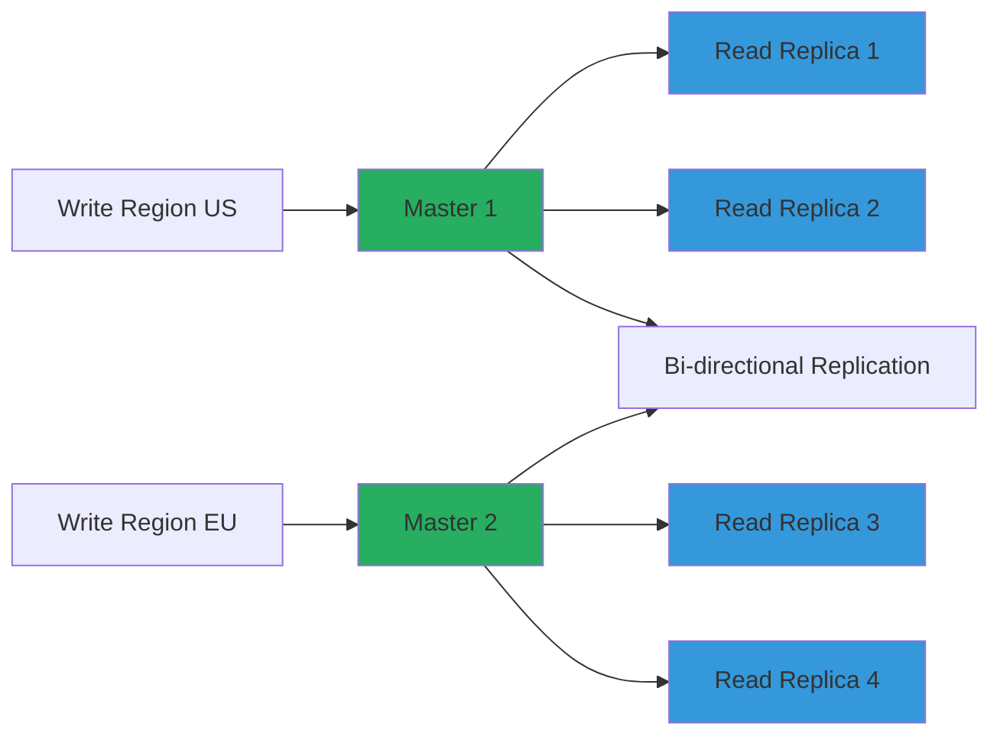

---
aliases:
  - репликация
---
## replication 

Репликация (англ. [[replication]]) — это создание и поддержание копий базы данных на нескольких серверах.

Существует два основных типа репликации: 
1. master-slave
2. multi-master

критерии оценки целесообразности репликации
1. **Требования к доступности**
2. **Нагрузка на чтение**
3. **Географическое распределение пользователей**
4. **Критичность данных**




**Сравнительная таблица**

| Аспект                 | **Master-Slave**                            | **Multi-Master**                            |
| ---------------------- | ------------------------------------------- | ------------------------------------------- |
| **Архитектура**        | Один master для записи, N slaves для чтения | Все узлы равноправны, читают и пишут        |
| **Масштабирование**    | Вертикальное (усиление master)              | Горизонтальное (добавление узлов)           |
| **Отказоустойчивость** | Single point of failure (master)            | Высокая, несколько узлов записи             |
| **Сложность**          | Простая                                     | Сложная                                     |
| **Конфликты**          | Нет конфликтов записи                       | Возможны конфликты при одновременной записи |
| **Задержка**           | Низкая на запись                            | Выше из-за синхронизации                    |
| **Использование**      | Чтение-интенсивные workload'ы               | Распределенные системы                      |


## master-slave репликация

**Главный, первичный узел (master),** ответственный за обработку всех операций записи и управление данными.

**Подчинённый, вторичный узел, или реплика, слейв (англ. slave).** Таких узлов может быть несколько. Они пассивно реплицируют данные от главного узла и обслуживают запросы на чтение в случае применения паттерна read-replica.

Когда на главном узле происходит операция записи, он регистрирует изменения в журнале транзакций (WAL). Затем ведомые узлы извлекают эти журналы и применяют изменения к своим копиям данных. В зависимости от требований к согласованности, ведомые узлы могут:
- приостановить свою работу до получения обновлений от ведущего;
- продолжать обслуживать возможно устаревшие данные, одновременно применяя последние изменения в фоновом режиме.

В случае «потери» мастера, следующим мастером становится кто-то из подчинённых узлов, в зависимости от настройки.

Этот подход помогает применять паттерн [[read-replica]] — в случае явного перенаправления трафика на чтение с реплики. Это можно сделать как средствами настройки, так и программно на уровне сервиса.

**Архитектура**


## multi-master репликация

**Multi-master, мульти-мастер** — это тип репликации данных, при котором несколько узлов выполняют роль главных, то есть мастеров.

Данные синхронизируются между узлами, а запись может происходить на любом из мастер-узлов. В результате создаётся несколько копий данных. Система решает проблему конфликтов между одновременными изменениями.

**Архитектура**


**Обработка конфликтов**
```sql
-- Стратегии разрешения конфликтов
-- 1. Last Write Wins (LWW)
CREATE TABLE users (
    id SERIAL PRIMARY KEY,
    email VARCHAR UNIQUE,
    last_updated TIMESTAMP DEFAULT NOW()
);

-- 2. Автоматическое разрешение
CREATE OR REPLACE FUNCTION resolve_update_conflict()
RETURNS TRIGGER AS $$
BEGIN
    IF NEW.last_updated > OLD.last_updated THEN
        RETURN NEW;
    ELSE
        RETURN OLD;
    END IF;
END;
$$ LANGUAGE plpgsql;
```

## гибридные подходы репликации

**Multi-Master с выделенными узлами для чтения**


## multi-master vs master-slave репликация

Детально разберем эти две архитектуры репликации баз данных.

**Когда использовать Master-Slave:**
```yaml
# Сценарий: E-commerce платформа
database_architecture: "master-slave"
reasoning:
  - "Высокая нагрузка чтения (каталог товаров)"
  - "Низкая нагрузка записи (заказы)"
  - "Простота администрирования"
  - "Предсказуемая производительность"
configuration:
  master: "db-master-large"
  slaves:
    - "db-slave-read-1"
    - "db-slave-read-2"
    - "db-slave-read-3"
  read_splitting: "round-robin"
```


**Когда использовать Multi-Master:**
```yaml
# Сценарий: Глобальное приложение
database_architecture: "multi-master"
reasoning:
  - "Географическое распределение"
  - "Требуется запись в разных регионах"
  - "Высокие требования к доступности"
  - "Горизонтальное масштабирование записи"
configuration:
  nodes:
    - "us-east-1-db"
    - "eu-west-1-db" 
    - "ap-southeast-1-db"
  conflict_resolution: "last-write-wins"
  replication: "async-with-conflict-detection"
```


## мониторинг и управление репликациями

**метрики для мониторинга репликаций**
```python
class ReplicationMetrics:
    MASTER_SLAVE_METRICS = [
        "seconds_behind_master",
        "slave_io_running", 
        "slave_sql_running",
        "master_log_file",
        "read_master_connections"
    ]
    
    MULTI_MASTER_METRICS = [
        "wsrep_cluster_size",
        "wsrep_ready",
        "wsrep_flow_control_paused",
        "conflicts_detected",
        "replication_lag_between_nodes"
    ]
    
    def alert_conditions(self):
        return {
            "replication_lag_gt_30s": "CRITICAL",
            "cluster_size_changed": "WARNING", 
            "conflicts_high": "WARNING",
            "node_not_ready": "CRITICAL"
        }
```

## выбор типа репликации

**✅ Выбирайте Master-Slave если:**
- 80%+ операций - чтение
- Простота администрирования важнее максимальной доступности
- Бюджет ограничен
- Команда имеет средний уровень экспертизы

**✅ Выбирайте Multi-Master если:**
- Требуется высокая доступность записи
- Географическое распределение обязательно
- Команда имеет экспертизу в распределенных системах
- Бюджет позволяет (требует больше ресурсов)

**🔄 Комбинированный подход:**
- **Multi-Master** для критичных к доступности данных
- **[[read-replica|Read replicas]]** для масштабирования чтения
- **Cache layers** для снижения нагрузки
