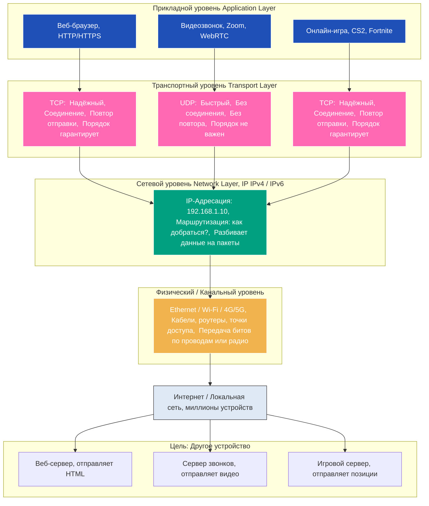

---
aliases:
  - TCP
  - IP
  - UDP
  - TCP/IP
  - Transmission Control Protocol
---

## ✅ **TCP/IP — это целая система**

📌 Что такое TCP/IP?
**TCP/IP** — это **набор протоколов**, лежащий в основе **всего интернета**. Это не один протокол, а **модель из нескольких уровней**, которая описывает, как данные передаются по сети.

Она состоит из 4 основных уровней:

| Уровень                    | Протоколы                   |
| -------------------------- | --------------------------- |
| **Приложения**             | HTTP, FTP, SMTP, DNS, SSH   |
| **Транспорт**              | **TCP**, **UDP** ← вот они! |
| **Интернет (сетевой)**     | **IP** (IPv4, IPv6)         |
| **Ссылки (доступ к сети)** | Ethernet, Wi-Fi, PPP        |

> 🔹 **TCP/IP = [[Internet Protocol|IP]] + TCP + UDP + другие протоколы + правила их взаимодействия**

👉 То есть:  
**TCP и UDP — это части TCP/IP**.  
**[[IP TCP UDP|IP]] — тоже часть TCP/IP**.

> 💡 **TCP/IP — это "язык", на котором говорит весь интернет.**  
> А TCP и UDP — это два “диалекта” этого языка для передачи данных.

---

## ✅ **TCP — Transmission Control Protocol**

📌 Что это?
Протокол **транспортного уровня** в модели TCP/IP.  
Он обеспечивает **надёжную, ориентированную на соединение** передачу данных.

🔑 Основные особенности:

| Характеристика         | TCP                                              |
| ---------------------- | ------------------------------------------------ |
| **Надёжность**         | ✅ Да — гарантирует доставку                      |
| **Соединение**         | ✅ Есть ("рукопожатие" 3-way handshake)           |
| **Порядок**            | ✅ Пакеты приходят в правильном порядке           |
| **Повторная отправка** | ✅ Если пакет потерялся — отправит заново         |
| **Скорость**           | ❌ Медленнее (из-за проверок)                     |
| **Используется в**     | Веб (HTTP/HTTPS), почта (SMTP), файлы (FTP), SSH |

💡 Пример:
Вы отправляете письмо по почте с уведомлением о вручении:  
— Вы пишете письмо → отправляете → получаете подтверждение, что его вручили → если не вручили — отправляете снова.  
→ Это **TCP**.

---

## ✅ **UDP — User Datagram Protocol**

📌 Что это?
Тоже протокол **транспортного уровня** в модели TCP/IP.  
Но он **ненадёжный** и **без соединения** — зато **быстрый**.

🔑 Основные особенности:

| Характеристика         | UDP                                                                 |
| ---------------------- | ------------------------------------------------------------------- |
| **Надёжность**         | ❌ Нет — пакеты могут потеряться                                     |
| **Соединение**         | ❌ Нет — просто отправил и забыл                                     |
| **Порядок**            | ❌ Пакеты могут прийти в другом порядке                              |
| **Повторная отправка** | ❌ Нет — если потерял — пропало                                      |
| **Скорость**           | ✅ Очень быстрая (минимум накладных расходов)                        |
| **Используется в**     | Видеозвонки (Zoom), стриминг (YouTube Live), онлайн-игры, DNS, VoIP |

💡 Пример:
Вы кричите через окно соседу:  
— "Эй, выключи свет!" → Он может не услышать, или ответить позже, или вообще не ответить — вам не важно.  
→ Это **UDP**.

---

## 🆚 Сравнение: TCP vs UDP vs TCP/IP

| Критерий           | **TCP**                                           | **UDP**                       | **TCP/IP**                                                   |
| ------------------ | ------------------------------------------------- | ----------------------------- | ------------------------------------------------------------ |
| **Что это?**       | Протокол транспортного уровня (4 уровень [[OSI]]) | Протокол транспортного уровня | **Семейство протоколов** (модель сети)                       |
| **Уровень**        | Транспортный                                      | Транспортный                  | Многоуровневая модель (включает TCP, UDP, IP и др.)          |
| **Надёжность**     | ✅ Высокая                                         | ❌ Низкая                      | ✅ Обеспечивает надёжность через TCP (или быстроту через UDP) |
| **Соединение**     | ✅ Есть (3-way handshake)                          | ❌ Нет                         | Поддерживает оба варианта                                    |
| **Скорость**       | ❌ Медленнее                                       | ✅ Быстрее                     | Зависит от выбранного протокола (TCP/UDP)                    |
| **Порядок данных** | ✅ Гарантируется                                   | ❌ Не гарантируется            | Зависит от выбора TCP/UDP                                    |
| **Используется в** | Веб, почта, файлы                                 | Видео, игры, DNS              | **Всё в интернете** — без TCP/IP нет интернета               |
| **Аналогия**       | Почта с уведомлением о вручении                   | Крик через окно               | Язык, на котором говорят все в интернете                     |

---

## 🧠 Простая аналогия: «Сеть как городская телефонная система»

| Компонент  | Аналогия                                                                                               |
| ---------- | ------------------------------------------------------------------------------------------------------ |
| **TCP/IP** | Вся телефонная сеть города — провода, станции, правила подключения, номера абонентов.                  |
| **IP**     | **Номер телефона** — кто кому звонит (например, 555-1234).                                             |
| **TCP**    | **Звонок по стационарному телефону**: вы набираете, ждёте ответа, говорите, уверены, что вас услышали. |
| **UDP**    | **Крик через окно**: вы кричите "Эй!", но не знаете, услышал ли вас сосед — и не ждёте ответа.         |

> 👉 **TCP и UDP — это два способа позвонить.**  
> **TCP/IP — это вся система, которая позволяет вам вообще звонить.**

---

## ✅ Когда что использовать?

| Задача                               | Лучший выбор                                              |
| ------------------------------------ | --------------------------------------------------------- |
| Открыть сайт (HTTP)                  | ✅ **TCP** (нужна надёжность)                              |
| Скачать файл                         | ✅ **TCP** (не хочешь битый архив!)                        |
| Видеозвонок (Zoom, FaceTime)         | ✅ **UDP** (лучше пропустить кадр, чем ждать)              |
| Онлайн-игра (CS2, Fortnite)          | ✅ **UDP** (задержка = поражение)                          |
| DNS-запрос (перевод google.com → IP) | ✅ **UDP** (быстро, коротко, не критично, если потеряется) |
| Передача данных в интернете вообще   | ✅ **TCP/IP** — без него ничего не работает                |

---

## 🔚 Вывод: простыми словами

| Термин | Что это? |
|--------|----------|
| **TCP** | Надёжный, но медленный способ передать данные — как письмо с уведомлением. |
| **UDP** | Быстрый, но рискованный способ — как крик в толпе. |
| **TCP/IP** | **Целая система**, которая позволяет использовать и TCP, и UDP, и IP-адреса, и маршрутизацию — то есть, **весь интернет**. |

> ✅ **TCP и UDP — это два инструмента внутри системы TCP/IP.**  
> Без TCP/IP — ни TCP, ни UDP не работают.  
> Без TCP/UDP — TCP/IP не мог бы передавать данные.

---

💡 **Запомните легко:**
> **TCP/IP — это семья.**  
> **TCP — старший сын (ответственный, надёжный).**  
> **UDP — младший брат (быстрый, дерзкий, иногда забывает, что делал).**

И они оба живут в одном доме — **TCP/IP**.

---

Если хотите — могу нарисовать схему, как пакеты движутся по TCP/IP с TCP и UDP, или показать пример кода на Python с использованием TCP и UDP сокетов 😊

Конечно! Вот **визуальная схема**, как работают **TCP**, **UDP** и **TCP/IP** вместе — в виде понятной, текстовой (но структурированной) диаграммы, которую легко представить или перерисовать на бумаге.

---

## 🖼️ **Схема: Как TCP, UDP и TCP/IP работают вместе**

---

## 🔗 Как данные движутся (на примере загрузки сайта)

📥 Вы заходите на `https://google.com` → используете **TCP**

1. **Приложение**: Браузер → запрашивает `https://google.com`
2. **Транспортный уровень**:  
   → Использует **TCP** → устанавливает соединение с сервером (`3-way handshake`)  
   → Разбивает HTML на пакеты, нумерует их, ждёт подтверждений
3. **Сетевой уровень**:  
   → Каждый пакет обёртывается в **IP-заголовок** с адресами:  
   `От: 192.168.1.10 → Кому: 142.250.189.206`
4. **Физический уровень**:  
   → Пакеты идут через Wi-Fi → роутер → интернет-провайдер → сервер Google
5. **На сервере**:  
   → Обратный путь: сервер отвечает по тому же пути, используя **TCP**  
   → Браузер собирает все пакеты в правильном порядке → показывает сайт

> ✅ Это **TCP поверх IP** = **TCP/IP**

---

## 📡 А теперь — видеозвонок (использует **UDP**)

1. **Приложение**: Zoom → начинает запись микрофона и камеры
2. **Транспортный уровень**:  
   → Использует **UDP** → отправляет поток аудио/видео **без ожидания подтверждения**  
   → Если один кадр потерялся — пропущен, не ждёт повтора!
3. **Сетевой уровень**:  
   → Все пакеты тоже обёрнуты в **IP** (по-прежнему используется IP!)
4. **Физический уровень**:  
   → Передаются так же — через Wi-Fi, роутер, интернет
5. **На другом конце**:  
   → Видеоплеер получает поток — игнорирует потерянные кадры, но **не ждёт**  
   → Задержка минимальна → разговор идёт живо

> ✅ Это **UDP поверх IP** = тоже **TCP/IP**!  
> (Да, UDP — часть TCP/IP, даже если не использует TCP!)

---

> ✅ **[[IP TCP UDP|TCP/IP]] = Система доставки писем в мире**  
> ✅ **TCP = Почта с уведомлением о вручении**  
> ✅ **UDP = Курьер-экспресс, который бросает посылку и убегает**
