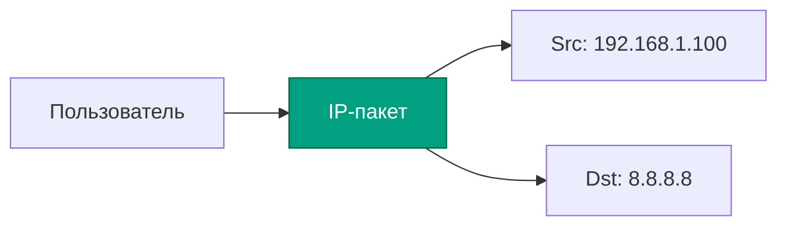

---
aliases:
  - IP
  - Internet Protocol
---
🌐 Что такое **IP**?

✅ Простое определение:
> **IP (Internet Protocol)** — это **правило**, по которому устройства в сети **обмениваются данными**, используя **уникальные адреса**.

Это как **почтовый индекс + система доставки писем**, но для компьютеров, телефонов, серверов и роутеров в интернете.

---

## 🔢 IP-адрес — "телефонный номер" интернета

Каждое устройство, подключённое к сети (ваш телефон, ноутбук, сервер YouTube), имеет **IP-адрес** — уникальный идентификатор, похожий на домашний адрес:

| Примеры IP-адресов |
|--------------------|
| `192.168.1.10`     | → ваш домашний роутер или компьютер в локальной сети |
| `8.8.8.8`          | → DNS-сервер Google |
| `142.250.189.206`  | → один из серверов Google.com |

> 💡 Это **числа в формате `xxx.xxx.xxx.xxx`** — так называемый **IPv4** (самый распространённый).

Но есть и новый вариант — **IPv6**, выглядит так:  
`2001:0db8:85a3:0000:0000:8a2e:0370:7334`

---

## 🧩 Как работает IP?

Представьте, что вы отправляете письмо другу:

| Что делаете? | Аналог в IP |
|--------------|-------------|
| Пишете адрес получателя | → Указываете **IP-адрес** (например, `8.8.8.8`) |
| Пишете свой адрес | → Указываете свой **IP-адрес** (например, `192.168.1.10`) |
| Отдаёте письмо почтальону | → Компьютер отдаёт данные **роутеру** |
| Почтальон знает дорогу | → Роутеры в интернете **маршрутизируют** пакеты по IP-адресам |
| Письмо доходит | → Данные приходят к нужному устройству |

👉 **IP отвечает за то, чтобы данные попали туда, куда нужно — как GPS для интернета.**

---

## 📦 IP работает вместе с пакетами

Данные в интернете не передаются целиком — они **разбиваются на маленькие части**, называемые **пакетами**.

Каждый пакет содержит:
- **Заголовок IP** — где написано:  
  - `Откуда:` (источник) — например, `192.168.1.10`  
  - `Куда:` (назначение) — например, `142.250.189.206`
- **Тело пакета** — сама часть данных (фрагмент веб-страницы, кадр видео и т.д.)

Роутеры читают только **IP-заголовок**, и **пересылают пакет дальше**, как почтовое отделение, которое перенаправляет письмо в другой город.

> 🔁 Пакеты могут идти разными путями, прийти в разном порядке — но это уже задача **TCP** (или игнорируется при **UDP**).

---

## ⚙️ Основные функции IP

| Функция           | Что делает                                                                        |
| ----------------- | --------------------------------------------------------------------------------- |
| **Адресация**     | Даёт каждому устройству уникальный "домашний адрес" в сети                        |
| **Маршрутизация** | Решает: «Как добраться от А до Б?» — через какие роутеры пройти                   |
| **Фрагментация**  | Разбивает большие данные на мелкие пакеты, если сеть не может их сразу пропустить |
| **Сборка**        | Не занимается! → Это задача [[IP TCP UDP\|TCP]]/UDP (IP просто доставляет пакеты) |

> ❗ **IP не гарантирует доставку!**  
> Он говорит: *«Я сделаю всё возможное, чтобы донести пакет»* — но **не обещает**, что он придёт, или придёт в нужном порядке.

→ Именно поэтому нужен **TCP** (для надёжности) или можно использовать **UDP** (если скорость важнее).

---

## 🆚 IPv4 vs IPv6

| Характеристика | IPv4 | IPv6 |
|----------------|------|------|
| **Формат** | `192.168.1.1` (4 числа от 0–255) | `2001:db8::1` (8 групп шестнадцатеричных цифр) |
| **Длина адреса** | 32 бита (~4.3 млрд адресов) | 128 бита (~340 undecillion адресов — почти бесконечно!) |
| **Проблема** | Кончились адреса! | Решает проблему исчерпания |
| **Поддержка** | Широко используется | Всё больше внедряется (особенно в мобильных сетях) |
| **Пример** | `8.8.8.8` | `2001:4860:4860::8888` |

> 💡 **IPv4 — как старые телефонные номера (7 цифр).**  
> **IPv6 — как современные номера с кодами, префиксами и миллионами вариантов.**

---

## 🔍 Дополнительно: Как узнать свой IP?

| На Windows | `cmd` → `ipconfig` → найдите "IPv4 Address" |
|-----------|-----------------------------------------------|
| На Mac/Linux | `Terminal` → `ifconfig` или `ip a` |
| В браузере | Зайдите на [https://whatismyipaddress.com](https://whatismyipaddress.com) — покажет ваш **публичный IP** |

> 👉 Ваш **публичный IP** — тот, который видит внешний мир (например, сайт, куда вы зашли).  
> Ваш **локальный IP** (`192.168.x.x`) — виден только внутри вашей сети (дома, в офисе).

---

## ✅ Вывод: Что такое IP — одним предложением

> **IP (Internet Protocol) — это система, которая позволяет устройствам находить друг друга в сети, используя уникальные числовые адреса, и доставлять данные между ними — как почтовая система для интернета.**

---

## 🎯 Запоминаем легко:

| Термин | Что делает? |
|-------|-------------|
| **IP** | **Кто? Где?** — определяет адреса устройств |
| **TCP** | **Доставлено ли?** — проверяет, пришли ли данные |
| **UDP** | **Быстро или нет?** — не проверяет, просто шлёт |
| **TCP/IP** | **Вся система**: IP + TCP + правила работы |

> 💡 **IP — это основа. Без него ни TCP, ни UDP не работают.**

---

