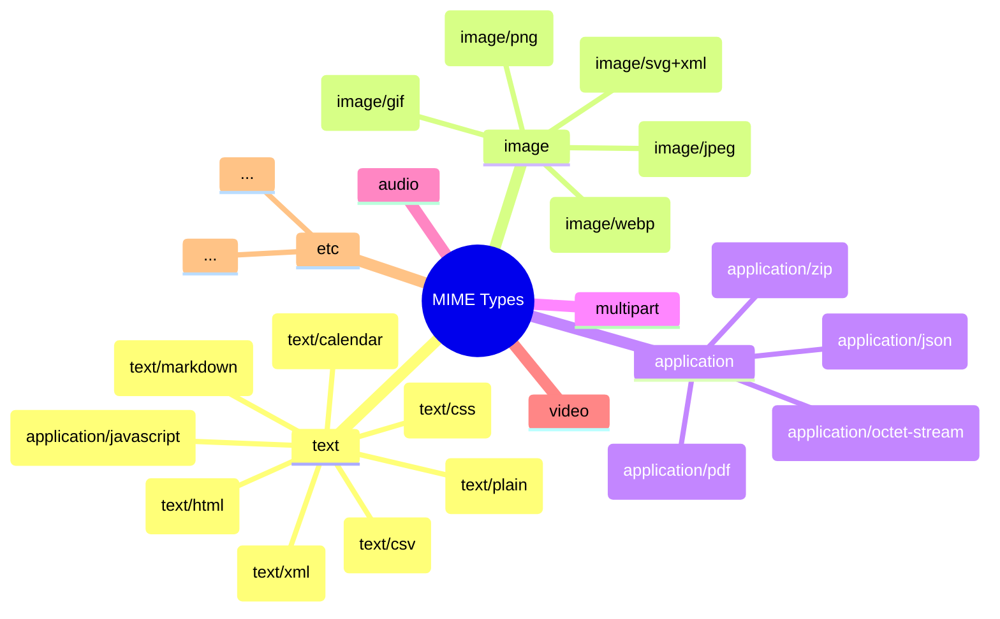

# MIME (Multipurpose Internet Mail Extensions)
>Multipurpose Internet Mail Extensions

## 🎯 Что такое MIME?

**MIME** — это стандарт, который расширяет возможности интернета по передаче различных типов данных. Первоначально создан для электронной почты, но сейчас используется повсеместно.

### **Простая аналогия:**
```
Без MIME: "Вот тебе письмо" (только текст)
С MIME: "Вот тебе письмо + картинка + документ + видео" (любые данные)
```

## 🔧 Для чего нужен MIME?

### **1. Передача нетекстовых данных по email**
```mime
До MIME (1980-е): Только ASCII текст
После MIME: Картинки, документы, видео, программы
```

### **2. Определение типов содержимого в вебе**
```http
HTTP/1.1 200 OK
Content-Type: text/html; charset=utf-8
Content-Type: application/json
Content-Type: image/png
```

### **3. Указание кодировок и языков**
```mime
Content-Type: text/html; charset=UTF-8
Content-Language: ru-RU
```

## 📊 Основные компоненты MIME

### **Content-Type (Тип содержимого)**
Самый важный заголовок MIME:
```
Content-Type: [тип]/[подтип]; [параметры]
```

### **Основные типы:**


## 💡 Примеры использования MIME

### **1. В электронной почте**
```mime
From: ivan@example.com
To: petr@example.com
Subject: Письмо с вложениями
MIME-Version: 1.0
Content-Type: multipart/mixed; boundary="unique-boundary-string"

--unique-boundary-string
Content-Type: text/plain; charset="utf-8"
Content-Transfer-Encoding: quoted-printable

Привет, Петр!

Это текстовое сообщение с двумя вложениями.

--unique-boundary-string
Content-Type: image/jpeg
Content-Disposition: attachment; filename="photo.jpg"
Content-Transfer-Encoding: base64

/9j/4AAQSkZJRgABAQEASABIAAD/2wBDAAYEBQYFBAYGBQYHBwYIChAKCgkJChQODwwQFxQYGBcU
FhYaHSUfGhsjHBYWICwgIyYnKSopGR8tMC0oMCUoKSj/2wBDAQcHBwoIChMKChMoGhYaKCgoKCgo
...

--unique-boundary-string
Content-Type: application/pdf
Content-Disposition: attachment; filename="document.pdf"
Content-Transfer-Encoding: base64

JVBERi0xLjQKJeLjz9MKMSAwIG9iago8PC9UeXBlL1hPYmplY3QvQ29sb3JTcGFjZS9EZXZpY2VS
...

--unique-boundary-string--
```

### **2. В HTTP запросах и ответах**
```http
# HTTP запрос с multipart/form-data (загрузка файла)
POST /upload HTTP/1.1
Host: example.com
Content-Type: multipart/form-data; boundary=----WebKitFormBoundary7MA4YWxkTrZu0gW
Content-Length: 12345

------WebKitFormBoundary7MA4YWxkTrZu0gW
Content-Disposition: form-data; name="username"

Иван Петров
------WebKitFormBoundary7MA4YWxkTrZu0gW
Content-Disposition: form-data; name="avatar"; filename="avatar.jpg"
Content-Type: image/jpeg

... бинарные данные изображения ...
------WebKitFormBoundary7MA4YWxkTrZu0gW--
```

### **3. В веб-приложениях**
```html
<!-- HTML с указанием MIME типов -->
<!DOCTYPE html>
<html lang="ru">
<head>
    <meta charset="UTF-8">
    <!-- Браузер по MIME типу понимает как обрабатывать -->
    <link rel="stylesheet" type="text/css" href="style.css">
    <script type="application/javascript" src="app.js"></script>
    <link rel="icon" type="image/x-icon" href="favicon.ico">
</head>
<body>
    
    <video controls type="video/mp4" src="video.mp4"></video>
    <a href="document.pdf" type="application/pdf">PDF документ</a>
</body>
</html>
```

### **4. В REST API**
```json
// JSON API с правильными Content-Type
// Запрос:
POST /api/users HTTP/1.1
Content-Type: application/json
Accept: application/json

{
    "name": "Иван Петров",
    "email": "ivan@example.com"
}

// Ответ:
HTTP/1.1 201 Created
Content-Type: application/json; charset=utf-8

{
    "id": 123,
    "name": "Иван Петров",
    "email": "ivan@example.com",
    "created_at": "2024-01-15T10:30:00Z"
}
```

## 🛠️ Content-Disposition

### **Вложение (attachment)**
```http
Content-Disposition: attachment; filename="report.pdf"
# Браузер предложит скачать файл
```

### **Встроенное отображение (inline)**
```http
Content-Disposition: inline; filename="photo.jpg"
# Браузер попытается отобразить файл
```

## 🔄 Content-Transfer-Encoding

### **Методы кодирования:**
```python
# Base64 (для бинарных данных)
import base64
data = b"Hello World"
encoded = base64.b64encode(data)  # SGVsbG8gV29ybGQ=

# Quoted-Printable (для текста с спецсимволами)
# Привет мир! → =D0=9F=D1=80=D0=B8=D0=B2=D0=B5=D1=82 =D0=BC=D0=B8=D1=80!

# 7bit/8bit/binary (для простого текста)
```

## 📁 Полные примеры MIME

### **1. Email с HTML и альтернативным текстом**
```mime
From: no-reply@example.com
To: user@example.com
Subject: Еженедельная рассылка
MIME-Version: 1.0
Content-Type: multipart/alternative; boundary="boundary123"

--boundary123
Content-Type: text/plain; charset="utf-8"
Content-Transfer-Encoding: quoted-printable

=D0=94=D0=BE=D0=B1=D1=80=D1=8B=D0=B9 =D0=B4=D0=B5=D0=BD=D1=8C!
=D0=9F=D1=80=D0=B5=D0=B4=D0=BB=D0=B0=D0=B3=D0=B0=D0=B5=D0=BC =D0=B2=D0=B0=
=D0=BC =D0=BD=D0=BE=D0=B2=D1=8B=D0=B5 =D1=82=D0=BE=D0=B2=D0=B0=D1=80=D1=8B.

--boundary123
Content-Type: text/html; charset="utf-8"
Content-Transfer-Encoding: quoted-printable

<!DOCTYPE html>
<html>
<head>
    <meta charset=3D"UTF-8">
    <title>=D0=A0=D0=B0=D1=81=D1=81=D1=8B=D0=BB=D0=BA=D0=B0</title>
</head>
<body>
    <h1>=D0=94=D0=BE=D0=B1=D1=80=D1=8B=D0=B9 =D0=B4=D0=B5=D0=BD=D1=8C!</h1>
    <p>=D0=9F=D1=80=D0=B5=D0=B4=D0=BB=D0=B0=D0=B3=D0=B0=D0=B5=D0=BC =D0=B2=
=D0=B0=D0=BC =D0=BD=D0=BE=D0=B2=D1=8B=D0=B5 =D1=82=D0=BE=D0=B2=D0=B0=D1=80=
=D1=8B.</p>
    
</body>
</html>

--boundary123
Content-Type: image/jpeg
Content-ID: <promo-image>
Content-Disposition: inline
Content-Transfer-Encoding: base64

/9j/4AAQSkZJRgABAQEAYABgAAD/2wBDAAYEBQYFBAYGBQYHBwYIChAKCgkJChQODwwQFxQYGBcU
...

--boundary123--
```

### **2. Веб-страница с ресурсами**
```http
HTTP/1.1 200 OK
Content-Type: text/html; charset=utf-8

<!DOCTYPE html>
<html>
<head>
    <!-- Браузер запросит эти ресурсы с соответствующими Accept заголовками -->
    <link rel="stylesheet" href="/style.css">  # Accept: text/css
    <script src="/app.js"></script>           # Accept: application/javascript
</head>
<body>
               # Accept: image/png, image/webp
</body>
</html>
```

### **3. REST API с различными форматами**
```http
# Клиент может запросить разные форматы
GET /api/users/123 HTTP/1.1
Accept: application/json, application/xml; q=0.9, text/html; q=0.8

# Сервер выбирает подходящий формат
HTTP/1.1 200 OK
Content-Type: application/json; charset=utf-8

{
    "id": 123,
    "name": "Иван Петров",
    "email": "ivan@example.com"
}
```

## 🛡️ Безопасность и MIME

### **MIME sniffing (определение типа)**
```http
# Браузеры пытаются определить реальный тип файла
# Опасность: файл может быть маскирован под другой тип

# Защита - явное указание типа:
X-Content-Type-Options: nosniff
Content-Type: application/octet-stream
Content-Disposition: attachment; filename="file.exe"
```

### **Опасные MIME типы:**
```yaml
dangerous_types:
  - "application/x-msdownload"  # Windows executables
  - "application/x-dosexec"     # DOS executables
  - "application/x-sh"          # Shell scripts
  - "application/x-perl"        # Perl scripts
  - "application/x-python"      # Python scripts
  
protection_measures:
  - "Валидация загружаемых файлов"
  - "Сканирование антивирусом"
  - "Ограничение разрешенных типов"
  - "Серверное переименование файлов"
```

## 🔧 Работа с MIME в программировании

### **Python примеры**
```python
import mimetypes
import email
from email.mime.multipart import MIMEMultipart
from email.mime.text import MIMEText
from email.mime.image import MIMEImage
import magic  # python-magic

# 1. Определение MIME типа файла
def get_mime_type(file_path):
    # Способ 1: По расширению
    mime_type, encoding = mimetypes.guess_type(file_path)
    
    # Способ 2: По содержимому (точнее)
    mime = magic.Magic(mime=True)
    actual_type = mime.from_file(file_path)
    
    return actual_type or mime_type or 'application/octet-stream'

# 2. Создание email с MIME
def create_email_with_attachments():
    msg = MIMEMultipart('mixed')
    msg['From'] = 'sender@example.com'
    msg['To'] = 'recipient@example.com'
    msg['Subject'] = 'Письмо с вложениями'
    
    # Текстовое сообщение
    text_part = MIMEText('Привет! Это текстовое сообщение.', 'plain', 'utf-8')
    msg.attach(text_part)
    
    # HTML версия
    html_part = MIMEText('<h1>Привет!</h1><p>Это HTML сообщение.</p>', 'html', 'utf-8')
    msg.attach(html_part)
    
    # Вложение - изображение
    with open('photo.jpg', 'rb') as f:
        img_part = MIMEImage(f.read())
        img_part.add_header('Content-Disposition', 'attachment', filename='photo.jpg')
        msg.attach(img_part)
    
    # Вложение - PDF
    with open('document.pdf', 'rb') as f:
        pdf_part = MIMEText(f.read(), 'base64')
        pdf_part['Content-Type'] = 'application/pdf'
        pdf_part['Content-Disposition'] = 'attachment; filename="document.pdf"'
        pdf_part['Content-Transfer-Encoding'] = 'base64'
        msg.attach(pdf_part)
    
    return msg

# 3. Парсинг MIME сообщения
def parse_email(raw_email):
    msg = email.message_from_bytes(raw_email)
    
    print(f"Content-Type: {msg.get_content_type()}")
    print(f"Charset: {msg.get_content_charset()}")
    
    # Обработка multipart
    if msg.is_multipart():
        for part in msg.walk():
            content_type = part.get_content_type()
            content_disposition = str(part.get('Content-Disposition'))
            
            if "attachment" in content_disposition:
                filename = part.get_filename()
                payload = part.get_payload(decode=True)
                # Сохраняем вложение
                with open(filename, 'wb') as f:
                    f.write(payload)
            elif content_type == 'text/plain':
                print(f"Текст: {part.get_payload(decode=True).decode()}")
            elif content_type == 'text/html':
                print(f"HTML: {part.get_payload(decode=True).decode()}")
```

### **JavaScript примеры**
```javascript
// 1. Определение MIME типа в браузере
const fileInput = document.getElementById('file-input');
fileInput.addEventListener('change', (e) => {
    const file = e.target.files[0];
    
    console.log('File type (from extension):', file.type);
    console.log('File name:', file.name);
    console.log('File size:', file.size);
    
    // Проверка допустимых типов
    const allowedTypes = ['image/jpeg', 'image/png', 'application/pdf'];
    if (!allowedTypes.includes(file.type)) {
        alert('Недопустимый тип файла');
        return;
    }
});

// 2. Отправка multipart/form-data
async function uploadFile(file) {
    const formData = new FormData();
    formData.append('file', file);
    formData.append('description', 'Мой файл');
    
    const response = await fetch('/upload', {
        method: 'POST',
        body: formData
        // Заголовок Content-Type установится автоматически как multipart/form-data
    });
    
    return response.json();
}

// 3. Определение MIME по содержимому (Blob)
function detectMimeType(arrayBuffer) {
    const bytes = new Uint8Array(arrayBuffer);
    
    // Проверка сигнатур (магических чисел)
    if (bytes.length >= 4) {
        // PNG
        if (bytes[0] === 0x89 && bytes[1] === 0x50 && bytes[2] === 0x4E && bytes[3] === 0x47) {
            return 'image/png';
        }
        // JPEG
        if (bytes[0] === 0xFF && bytes[1] === 0xD8 && bytes[2] === 0xFF) {
            return 'image/jpeg';
        }
        // PDF
        if (bytes[0] === 0x25 && bytes[1] === 0x50 && bytes[2] === 0x44 && bytes[3] === 0x46) {
            return 'application/pdf';
        }
    }
    
    return 'application/octet-stream';
}

// 4. Создание Data URL с правильным MIME
function createDataURL(file) {
    return new Promise((resolve) => {
        const reader = new FileReader();
        reader.onload = (e) => {
            // data:[<mediatype>][;base64],<data>
            const dataURL = `data:${file.type};base64,${btoa(
                new Uint8Array(e.target.result).reduce(
                    (data, byte) => data + String.fromCharCode(byte), ''
                )
            )}`;
            resolve(dataURL);
        };
        reader.readAsArrayBuffer(file);
    });
}
```

## 📚 База данных MIME типов

### **Распространенные MIME типы:**
```yaml
# Текстовые типы
text/plain: .txt, .log, .csv
text/html: .html, .htm
text/css: .css
text/javascript: .js
text/markdown: .md, .markdown
text/xml: .xml
text/csv: .csv
text/calendar: .ics

# Изображения
image/jpeg: .jpg, .jpeg
image/png: .png
image/gif: .gif
image/svg+xml: .svg
image/webp: .webp
image/x-icon: .ico
image/bmp: .bmp

# Аудио
audio/mpeg: .mp3
audio/ogg: .ogg, .oga
audio/wav: .wav
audio/webm: .weba
audio/aac: .aac
audio/flac: .flac

# Видео
video/mp4: .mp4
video/webm: .webm
video/ogg: .ogv
video/quicktime: .mov
video/x-msvideo: .avi
video/x-matroska: .mkv

# Приложения
application/json: .json
application/xml: .xml
application/pdf: .pdf
application/zip: .zip
application/x-tar: .tar
application/x-rar-compressed: .rar
application/x-7z-compressed: .7z
application/octet-stream: .bin, .exe, .dll

# Документы
application/msword: .doc
application/vnd.openxmlformats-officedocument.wordprocessingml.document: .docx
application/vnd.ms-excel: .xls
application/vnd.openxmlformats-officedocument.spreadsheetml.sheet: .xlsx
application/vnd.ms-powerpoint: .ppt
application/vnd.openxmlformats-officedocument.presentationml.presentation: .pptx

# Фронтенд
application/wasm: .wasm
application/manifest+json: .webmanifest
```

## 🎯 Важность правильного MIME типа

### **Последствия неправильного MIME:**
```yaml
security_issues:
  - "XSS атаки (текст исполняется как HTML)"
  - "Загрузка вредоносных файлов"
  - "Утечка данных"

functionality_issues:
  - "Некорректное отображение контента"
  - "Ошибки загрузки ресурсов"
  - "Проблемы с кэшированием"

seo_issues:
  - "Понижение в поисковой выдаче"
  - "Некорректная индексация"
  - "Проблемы с социальными сетями"
```

### **Проверка MIME типов на сервере:**
```python
from flask import Flask, request, jsonify
import magic
import os

app = Flask(__name__)

ALLOWED_MIME_TYPES = {
    'image/jpeg', 'image/png', 'image/gif',
    'application/pdf', 'text/plain'
}

@app.route('/upload', methods=['POST'])
def upload_file():
    if 'file' not in request.files:
        return jsonify({'error': 'No file provided'}), 400
    
    file = request.files['file']
    
    # 1. Проверка по расширению
    filename = file.filename.lower()
    if not any(filename.endswith(ext) for ext in ['.jpg', '.png', '.gif', '.pdf', '.txt']):
        return jsonify({'error': 'Invalid file extension'}), 400
    
    # 2. Проверка по содержимому
    file_content = file.read()
    file.seek(0)  # Возвращаем курсор
    
    mime = magic.Magic(mime=True)
    detected_type = mime.from_buffer(file_content)
    
    if detected_type not in ALLOWED_MIME_TYPES:
        return jsonify({'error': f'Invalid file type: {detected_type}'}), 400
    
    # 3. Дополнительная проверка
    if detected_type.startswith('image/'):
        from PIL import Image
        try:
            img = Image.open(file)
            img.verify()  # Проверка целостности
            img.close()
        except Exception as e:
            return jsonify({'error': 'Invalid image file'}), 400
    
    # Файл безопасен, можно сохранять
    file.save(os.path.join('uploads', filename))
    
    return jsonify({'success': True, 'filename': filename}), 200
```

## 📊 MIME в разных протоколах

### **HTTP**
```http
# Запрос
GET /image.jpg HTTP/1.1
Accept: image/webp,image/apng,image/*,*/*;q=0.8

# Ответ
HTTP/1.1 200 OK
Content-Type: image/jpeg
Content-Length: 12345
Content-Disposition: inline; filename="image.jpg"
```

### **SMTP (Email)**
```mime
MIME-Version: 1.0
Content-Type: multipart/mixed; boundary="boundary"
Content-Transfer-Encoding: 7bit
```

### **WebSocket**
```javascript
// MIME в WebSocket не используется напрямую,
// но тип данных можно указать в сообщении
const blob = new Blob(['Hello'], {type: 'text/plain'});
websocket.send(blob);
```

## 🏆 Итог

**MIME — это фундаментальный стандарт, который позволяет:**
1. **Передавать любые типы данных** по интернет-протоколам
2. **Определять как обрабатывать** полученные данные
3. **Обеспечивать совместимость** между разными системами
4. **Повышать безопасность** за счет явного указания типов

**Без MIME интернет был бы ограничен только текстовыми сообщениями.** Благодаря MIME мы можем отправлять фото, видео, документы, программы и любые другие данные через email и веб.