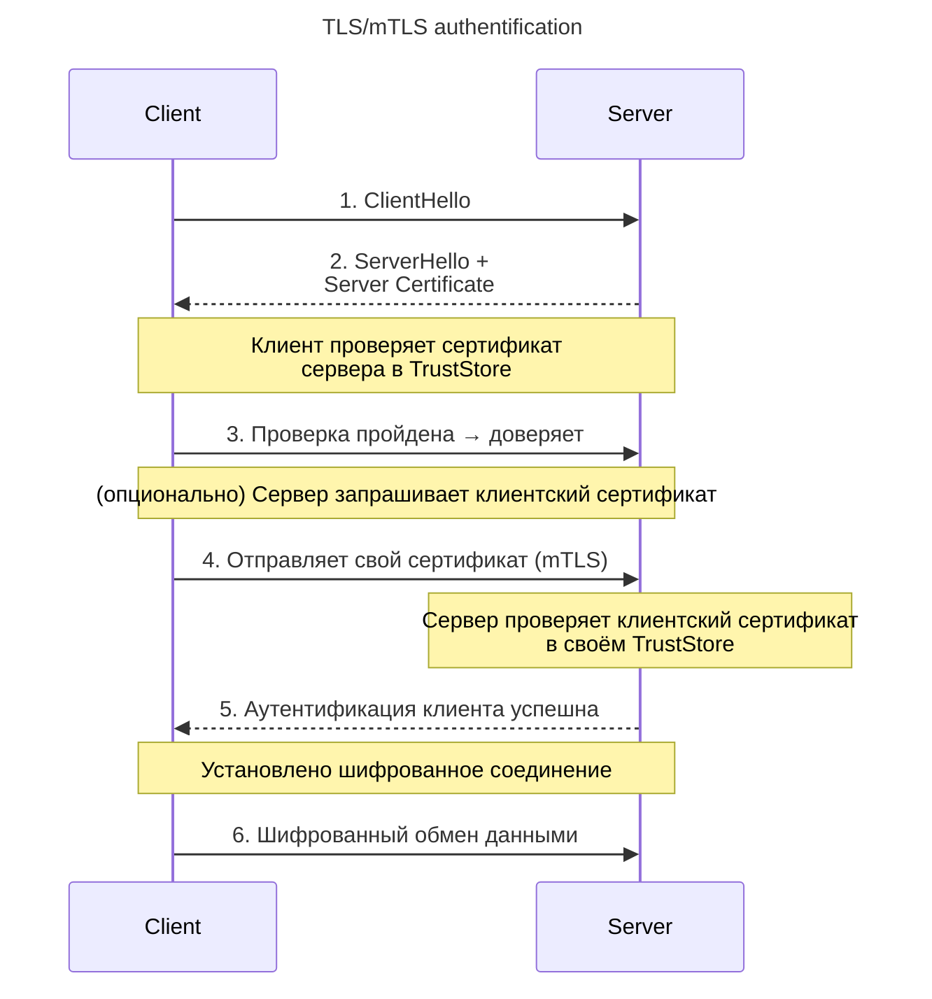
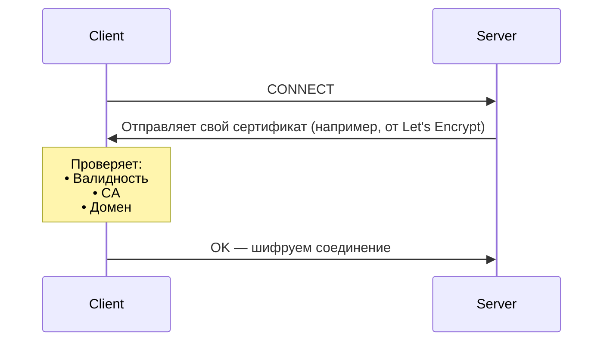
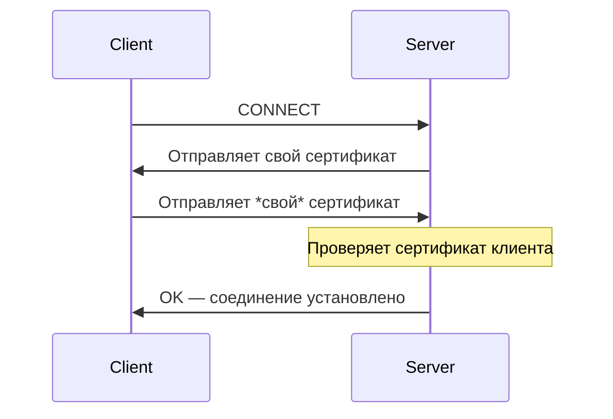
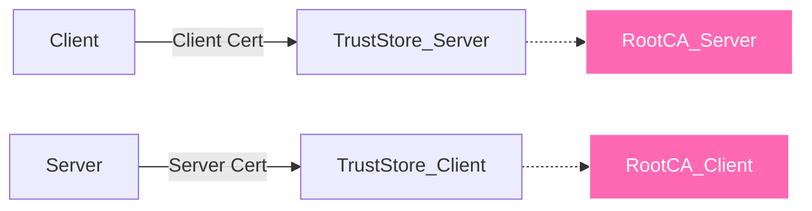
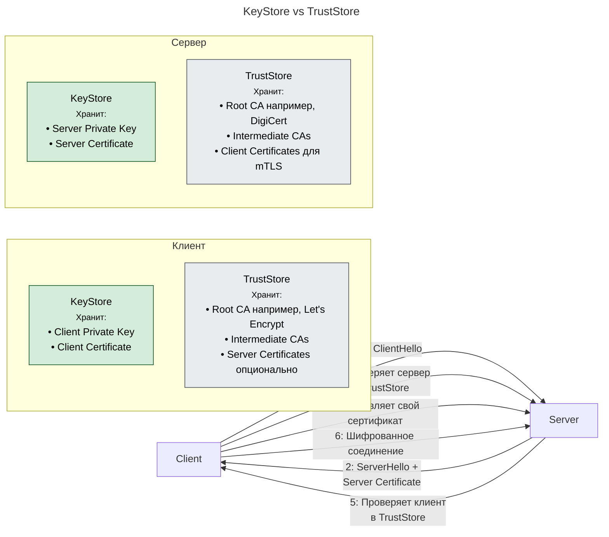

---
aliases:
  - TLS
  - mTLS
  - Transport Layer Security
  - mutual Transport Layer Security
  - KeyStore
  - TrustStore
---
## ✅ Что такое **TLS**?

🔹 Определение:
> **TLS (Transport Layer Security)** — это криптографический протокол, который обеспечивает **безопасность, конфиденциальность и целостность** данных при передаче по сети.

Он используется для **HTTPS**, SMTP, FTPS и других безопасных соединений.





🔧 Как работает TLS для сайтов:



✅ Что делает TLS?
- Шифрует трафик между клиентом и сервером
- Гарантирует, что вы говорите с настоящим `api.example.com`, а не с поддельным сайтом
- Защищает от MITM-атак (Man-in-the-Middle)

📌 Примеры:
- `https://bank.com`
- `https://github.com`
- `https://your-app.com`

> ✅ **Клиент проверяет сервер. Сервер не проверяет клиента.**

---

## ✅ Что такое **mTLS (Mutual TLS)**?

🔹 Определение:
> **mTLS (Mutual TLS)** — это расширение TLS, при котором **не только клиент проверяет сервер, но и сервер проверяет клиента**.

Оба участника должны иметь **валидный сертификат**, подписанный **доверенным центром сертификации (CA)**
> 🔑 **TLS = "Я доверяю тебе"**  
> **mTLS = "Ты мне доверяешь, я — тебе"**

🔧 Как работает mTLS:



✅ Что добавляет mTLS?
- **Двусторонняя аутентификация**
- **Высокий уровень доверия**
- **Подходит для внутренних систем**, где нужно знать: *"Кто ты?"*

📌 Примеры:
- Kubernetes Pod → Database: mTLS вместо логин/пароля
- Istio / Linkerd: все сервисы в mesh используют mTLS

---

## 🆚 TLS vs mTLS

| Критерий                                | **TLS**                               | **mTLS**                                                       |
| --------------------------------------- | ------------------------------------- | -------------------------------------------------------------- |
| **Направление аутентификации**          | Одностороннее (сервер → клиент)       | Двустороннее (клиент ↔ сервер)                                 |
| **Типичные пользователи**               | Браузеры, мобильные приложения        | Микросервисы, бэкенд-вызовы                                    |
| **Требуется ли клиентский сертификат?** | ❌ Нет                                 | ✅ Да                                                           |
| **Где применяется**                     | Внешние HTTPS-сайты                   | Внутренние системы, API, Service Mesh                          |
| **Безопасность**                        | Высокая                               | ✅ Ещё выше                                                     |
| **Сложность управления**                | Умеренная (один сертификат на сервер) | Высокая (нужно выдавать и управлять тысячами сертификатов)     |
| **Поддержка в браузерах**               | ✅ Полная                              | ❌ Почти нет (только enterprise-браузеры)                       |
| **Поддержка в API**                     | ✅ Да                                  | ✅ Да (gRPC, REST)                                              |
| **Пример URL**                          | `https://example.com`                 | `https://internal-api.company.com` (с клиентским сертификатом) |

---

✅ Когда использовать TLS?

| Сценарий                     | Рекомендация                                 |
| ---------------------------- | -------------------------------------------- |
| ✅ Веб-сайт, открытый всем    | → **TLS**                                    |
| ✅ Мобильное приложение → API | → **TLS + JWT/OAuth**                        |
| ✅ SaaS-сервис                | → **TLS + аутентификация через API Key/JWT** |
| ✅ Публичный API              | → **TLS + OAuth2**                           |

> ✅ **TLS — стандарт для всего, что доступно извне.**

---

✅ Когда использовать mTLS?

| Сценарий | Рекомендация |
|----------|--------------|
| ✅ Микросервисы внутри кластера | → **mTLS (через Istio, Linkerd, Consul)** |
| ✅ Backend → Backend вызовы | → **mTLS вместо API-ключей** |
| ✅ Высокие требования к безопасности | → **mTLS** (финансы, медицина) |
| ✅ Zero Trust Architecture | → **mTLS — обязательный компонент** |
| ✅ Service Mesh (Istio, Linkerd) | → **Автоматически включают mTLS** |
| ✅ Вы хотите заменить пароли/ключи на сертификаты | → **mTLS** |

> ✅ **mTLS — стандарт для внутреннего взаимодействия в secure-сетях.**

---

## 💡 Пример: Безопасность без mTLS vs с mTLS

❌ Без mTLS:
```http
GET https://payments.internal/api/v1/balance?id=123
```
→ Аутентификация: `Authorization: Bearer token`  
→ Токен может быть скомпрометирован, перехвачен, просрочен

✅ С mTLS:
```http
GET https://payments.internal/api/v1/balance?id=123
```
→ Соединение зашифровано **и** клиент аутентифицирован через **сертификат**  
→ Никаких токенов, никаких API-ключей — только **доверенные сертификаты**

> ✅ Это **[[zero trust|Zero Trust]]**: даже если злоумышленник попал в сеть — он не сможет подключиться без сертификата.

---

## 🔐 Преимущества mTLS

| Плюс | Объяснение |
|------|------------|
| ✅ **Высокая безопасность** | Только доверенные клиенты могут подключаться |
| ✅ **Шифрование + аутентификация** | Данные зашифрованы, и вы знаете, кто клиент |
| ✅ **Не нужно хранить API-ключи** | Замена `token` на `certificate` |
| ✅ **Автоматическое управление** | Istio автоматически выдаёт, обновляет, отзывает сертификаты |
| ✅ **Поддержка в gRPC** | gRPC использует mTLS как основу безопасности |

---

## ⚠️ Недостатки mTLS

| Минус                                         | Объяснение                                              |
| --------------------------------------------- | ------------------------------------------------------- |
| ❌ **Сложность управления**                    | Нужно выдавать, обновлять, отзывать тысячи сертификатов |
| ❌ **Требует PKI (Public Key Infrastructure)** | Нужен CA (Vault, Istiod, Step CA, Venafi)               |
| ❌ **Сложно тестировать**                      | При разработке нужен mock или test CA                   |
| ❌ **Не поддерживается браузерами**            | Только для backend-to-backend                           |

---

## ✅ Как реализовать mTLS?

1. **Вручную (редко)**
- Создаёте свой **CA** (например, OpenSSL)
- Выдаёте сертификаты каждому сервису
- Настраиваете каждый сервис на использование `client.crt`, `client.key`, `ca.crt`

2. **Через Service Mesh (лучший способ)**

🟦 **Istio**
- Автоматически включает mTLS между сервисами
- `istiod` — выступает как **CA**
- Сертификаты живут в контейнере, обновляются каждые 24 часа

```yaml
# PeerAuthentication — включает mTLS
apiVersion: security.istio.io/v1beta1
kind: PeerAuthentication
meta
  name: default
spec:
  mtls:
    mode: STRICT
```

→ Все сервисы в mesh используют **mTLS** автоматически.

🟨 **Linkerd**
- Легковесный Service Mesh
- Автоматически добавляет mTLS между Pod'ами

🟥 **Consul Connect**
- HashiCorp
- Поддерживает mTLS + sidecar proxy

---

💬 Цитата от эксперта
> _“In a microservices world, if you're not using mTLS, you're just pretending to be secure.”_  
> — **Google Cloud Security Team**

💡 **Лучшая практика:**  
> **Внешний мир → TLS + OAuth2**  
> **Внутренняя сеть → mTLS + Service Mesh**

Тогда ваша система будет **и открытой, и безопасной**.

___
## 🔐 Цепочка доверия



**🔧 Как проверяется сертификат?**

1. Получили сертификат
2. Найдите Issuer (например, `DigiCert`)
3. Ищите корневой сертификат в **TrustStore**
4. Проверьте подпись
5. Проверьте срок действия, отозван ли?
6. Если всё ок → доверяйте

**📁 Где хранятся хранилища?**

| ОС/Язык | Файл по умолчанию |
|--------|------------------|
| **Java** | `cacerts` (TrustStore)<br>`keystore.jks` (KeyStore) |
| **Linux** | `/etc/ssl/certs/ca-certificates.crt` |
| **Windows** | Certificate Store |
| **macOS** | Keychain |
| **Nginx** | `ssl_certificate`, `ssl_trusted_certificate` |
| **OpenSSL** | `ca-bundle.crt` |

---

## KeyStore vs TrustStore
