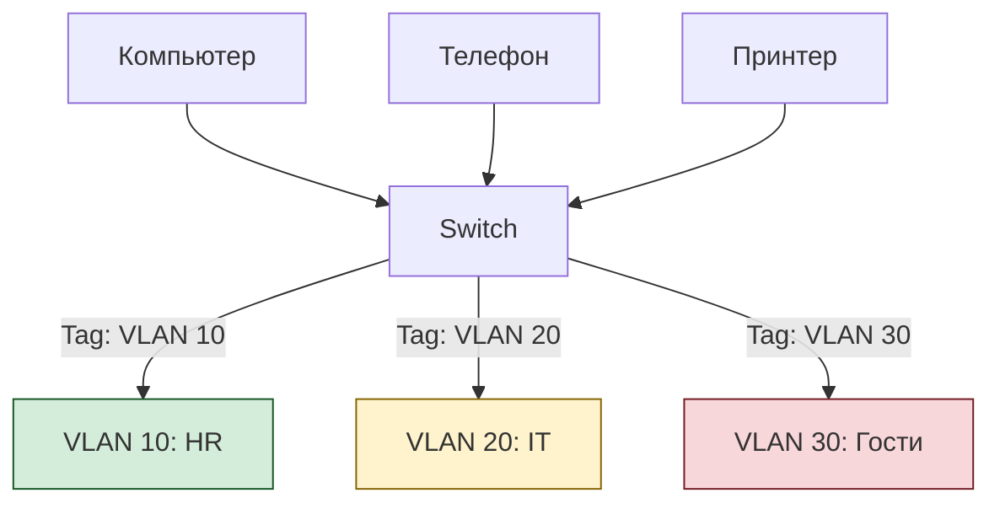

## ✅ 2. Что такое **VLAN (Virtual LAN)**?

> **VLAN** — это технология, которая позволяет **логически разделить одну физическую сеть на несколько изолированных сегментов**.

🔹 Уровень: **OSI Layer 2 (Data Link)**
🔹 Стандарт: **IEEE 802.1Q**
🔹 Где применяется: Коммутаторы (switches)

---

💡 Пример:

```plaintext
Один коммутатор → три VLAN'а:

VLAN 10: HR
VLAN 20: IT
VLAN 30: Guests
```

→ Даже если все устройства подключены к одному switch’у — они **не видят друг друга**, если не сконфигурирован маршрутизатор

---

✅ Зачем нужен VLAN?

| Проблема | Решение через VLAN |
|----------|-------------------|
| ❌ Все в одной сети → можно прослушивать трафик | ✅ Разделение по отделам |
| ❌ Широковещательный шторм (broadcast storm) | ✅ Каждый VLAN — свой broadcast domain |
| ❌ Гость получает доступ ко всему | ✅ Guest VLAN → только интернет |
| ❌ Сложно управлять доступом | ✅ Можно применять политики по VLAN |

---

🔄 Как работает VLAN?



- Каждый порт на switch’е может быть:
  - `access` (принадлежит одному VLAN)
  - `trunk` (передаёт тегированный трафик всех VLAN)

---

✅ Преимущества VLAN:

| Плюс | Объяснение |
|------|------------|
| ✅ **Изоляция** | HR не видит IT, гость — никого |
| ✅ **Безопасность** | Уменьшает поверхность атаки |
| ✅ **Гибкость** | Можно изменить VLAN без перекладки кабелей |
| ✅ **Broadcast Domain Control** | Меньше мусора в сети |
| ✅ **Легко масштабировать** | Добавьте VLAN 40 → никто не заметит |

---

⚠️ Ограничения и риски:

| Проблема | Решение |
|----------|---------|
| ❌ Трафик между VLAN требует router | Используйте **Router-on-a-Stick** или L3 Switch |
| ❌ VLAN Hopping | Отключите Native VLAN на trunk |
| ❌ Неправильная настройка trunk | Ограничьте разрешённые VLAN |
| ❌ Безопасность | Используйте ACL, firewall между VLAN |

---
