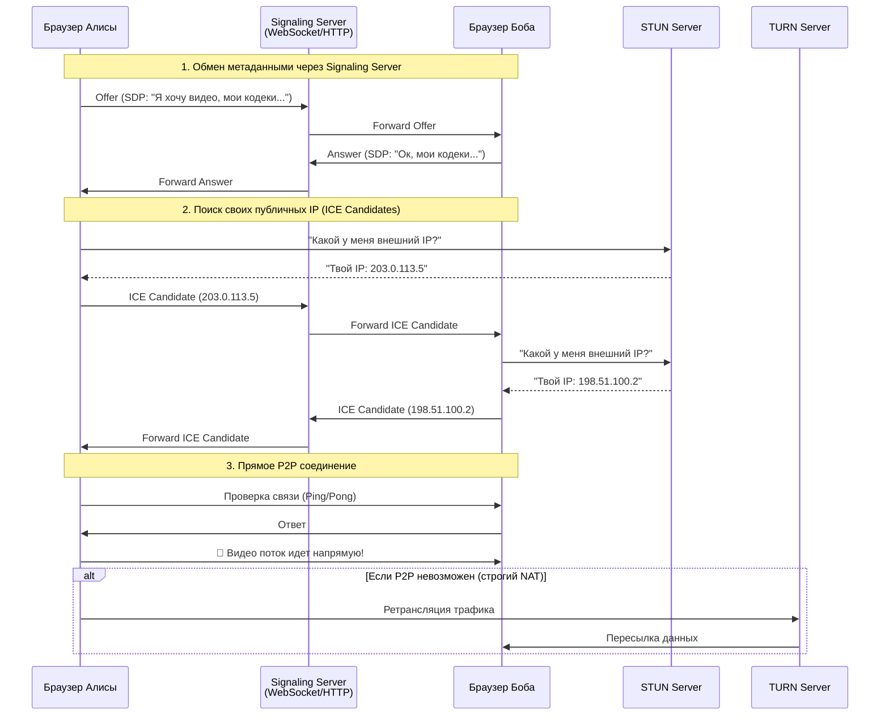

---
aliases:
  - WebRTC
---
## 📹 Что такое WebRTC?

**WebRTC** (Web Real-Time Communication) — это открытый стандарт и набор технологий, позволяющий браузерам и мобильным приложениям обмениваться **аудио, видео и данными** напрямую друг с другом (P2P — Peer-to-Peer) без необходимости установки плагинов или промежуточных серверов для передачи медиапотока.

> 💡 **Простыми словами**:  
> *«Это технология, которая позволяет двум людям видеть и слышать друг друга прямо в браузере, как в Skype или Zoom, но без скачивания приложений.»*

---

## 🔑 Три главных компонента WebRTC

### 1. **MediaStream (getUserMedia)**
Отвечает за доступ к камере и микрофону устройства.
```javascript
// Запрос доступа к камере и микрофону
const stream = await navigator.mediaDevices.getUserMedia({ 
  video: true, 
  audio: true 
});
```

### 2. **RTCPeerConnection**
«Сердце» WebRTC. Отвечает за:
- Установление P2P-соединения между двумя браузерами.
- Шифрование трафика (DTLS/SRTP).
- Адаптацию качества под скорость сети (если интернет падает, видео становится хуже, но звонок не рвется).

### 3. **RTCDataChannel**
Позволяет передавать **произвольные данные** (текст, файлы, бинарные данные) с низкой задержкой поверх того же соединения, что и видео/аудио.
- *Пример:* Чат в видеозвонке, передача файлов, синхронизация состояния игры.

---

## 🧩 Как работает соединение? (Проблема NAT и STUN/TURN)

Браузеры находятся за роутерами и фаерволами (NAT). Чтобы они нашли друг друга в интернете, нужна помощь внешних серверов.

### Схема работы:



### Роль серверов:
| Сервер | Назначение | Трафик через него? |
|--------|------------|-------------------|
| **Signaling Server** | Обмен SDP (описание сессии) и ICE кандидатами до начала звонка. | ❌ Нет (только мета-данные) |
| **STUN Server** | Помогает узнать свой публичный IP-адрес. Бесплатные и открытые (например, от Google). | ❌ Нет (только запрос ответа) |
| **TURN Server** | Ретранслирует трафик, если прямое P2P-соединение невозможно (из-за корпоративных фаерволов). Платный ресурс (трафик дорогой). | ✅ Да (весь медиапоток) |

---

## ✅ Преимущества WebRTC

1. **Низкая задержка (Low Latency):** 20–200 мс (против 2–10 сек в HLS/DASH стриминге).
2. **Нет плагинов:** Работает нативно в Chrome, Firefox, Safari, Edge.
3. **Безопасность:** Весь трафик шифруется по умолчанию (DTLS для данных, SRTP для медиа).
4. **Адаптивность:** Автоматически снижает битрейт при плохом интернете.
5. **Кроссплатформенность:** Работает на ПК, iOS, Android, IoT-устройствах.

---

## ⚠️ Ограничения и сложности

1. **Сложность реализации:** Нужно писать логику обработки состояний (подключение, разрыв, повторное подключение).
2. **Зависимость от TURN:** В корпоративных сетях ~15–20% соединений требуют TURN-сервер, который стоит денег за трафик.
3. **Масштабирование P2P:**
   - 1→1 (видеозвонок): Идеально.
   - 1→N (вебинар на 1000 человек): P2P не подойдет (компьютер стримера не выдержит 1000 исходящих потоков). Нужна архитектура **SFU** (Selective Forwarding Unit) — сервер, который принимает один поток и рассылает его всем.

---

## 🛠️ Где используется?

| Сфера | Примеры |
|-------|---------|
| **Видеосвязь** | Google Meet, Discord (браузерная версия), Jitsi, Whereby |
| **Стриминг** | Трансляции игр с минимальной задержкой, облачный гейминг |
| **IoT и телеметрия** | Передача видео с дронов, камер наблюдения в реальном времени |
| **Совместная работа** | Доски (Miro), совместное редактирование кода, удаленная поддержка (screen sharing) |
| **Финтех** | Верификация личности через видео-звонок (KYC) |

---

## 💻 Минимальный пример кода (JavaScript)

```javascript
// 1. Создаем соединение
const peerConnection = new RTCPeerConnection({
  iceServers: [{ urls: 'stun:stun.l.google.com:19302' }]
});

// 2. Добавляем локальный поток (камера)
const localStream = await navigator.mediaDevices.getUserMedia({ video: true, audio: true });
localStream.getTracks().forEach(track => {
  peerConnection.addTrack(track, localStream);
});

// 3. Когда приходит удаленный поток — показываем его в <video>
peerConnection.ontrack = event => {
  remoteVideoElement.srcObject = event.streams[0];
};

// 4. Логика обмена SDP и ICE кандидатами реализуется через ваш WebSocket сервер (Signaling)
```

---

## 💬 Итог

> **WebRTC — это стандарт де-факто для реального времени в вебе.**  
> Он превращает браузер из средства просмотра страниц в полноценную платформу для коммуникаций, стирая грань между веб-приложением и нативным софтом вроде Zoom или Skype.

> 📌 **Главное правило**:  
> Для простых чатов 1-на-1 используйте чистый WebRTC (P2P).  
> Для конференций > 5 человек или трансляций — используйте WebRTC + **SFU-сервер** (например, Mediasoup, Janus, Jitsi Videobridge).