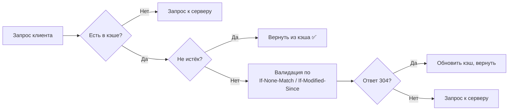

---
aliases:
  - RFC 9110 HTTP Caching
  - RFC 9110
  - HTTP Caching
---
# RFC 9110 HTTP Caching (кратко)

## 🎯 Суть
RFC 9110 описывает **правила кэширования в HTTP** — как клиенты и промежуточные серверы (прокси, CDN) должны сохранять и переиспользовать ранее полученные ответы.

> **Важно:** RFC 9110 заменил старые RFC 7230-7235. Секции про кэширование ранее были в RFC 7234.

## 📦 Основные заголовки кэширования

| Заголовок | Назначение | Пример |
|-----------|------------|--------|
| `Cache-Control` | Главный заголовок, управляет кэшированием | `max-age=3600, public` |
| `ETag` | Уникальный идентификатор версии ресурса | `"abc123"` |
| `Last-Modified` | Дата последнего изменения | `Wed, 21 Oct 2015 07:28:00 GMT` |
| `Age` | Сколько времени ответ уже в кэше (в секундах) | `120` |
| `Vary` | По каким заголовкам различать кэш | `Accept-Encoding` |

## 🔄 Алгоритм работы кэша



## 📋 Cache-Control директивы (основные)

### Для ответа сервера:
| Директива | Значение |
|-----------|----------|
| `max-age=N` | Кэшировать на N секунд |
| `public` | Можно кэшировать где угодно (CDN, прокси) |
| `private` | Только для браузера (не для прокси) |
| `no-cache` | Требовать валидацию перед каждым использованием |
| `no-store` | Вообще не кэшировать (для секретных данных) |
| `must-revalidate` | При истечении срока обязательно проверять на сервере |

### Для запроса клиента:
| Директива | Значение |
|-----------|----------|
| `max-age=N` | Принимать кэш не старше N секунд |
| `no-cache` | Требовать валидацию у сервера |
| `no-store` | Не сохранять ответ в кэш |
| `only-if-cached` | Использовать только кэш (не ходить на сервер) |

## 🚦 Примеры использования

### 1. Статические ресурсы (кэшируем надолго)
```http
HTTP/1.1 200 OK
Content-Type: image/png
Cache-Control: public, max-age=31536000, immutable
ETag: "abc123"
```

### 2. API-ответы (кэшируем недолго с валидацией)
```http
HTTP/1.1 200 OK
Content-Type: application/json
Cache-Control: private, max-age=60, must-revalidate
ETag: "xyz789"
Last-Modified: Wed, 10 Apr 2025 10:00:00 GMT
```

### 3. Секретные данные (никакого кэша)
```http
HTTP/1.1 200 OK
Content-Type: application/json
Cache-Control: no-store, private
```

## 🔍 Валидация (conditional requests)

Клиент проверяет актуальность кэша с помощью:

```http
GET /resource HTTP/1.1
If-None-Match: "abc123"           # ETag из кэша
If-Modified-Since: Wed, 10 Apr 2025 10:00:00 GMT
```

Если ресурс не изменился, сервер отвечает:
```http
HTTP/1.1 304 Not Modified
Cache-Control: max-age=3600
```

## 🌐 Vary (важный, но часто забываемый)

Указывает, что кэш зависит от других заголовков запроса:

```http
Vary: Accept-Encoding, Accept-Language
```
- Одна версия для gzip, другая для brotli
- Одна версия для ru, другая для en

## ⚠️ Частые ошибки

| Ошибка | Правильное решение |
|--------|-------------------|
| `Cache-Control: no-cache, max-age=3600` | `no-cache` отключает `max-age` |
| `Cache-Control: private, max-age=86400` | Ок, но CDN не закэширует |
| Отсутствие `Vary: Accept-Encoding` | Gzip-версии не разделяются |
| `Cache-Control: no-store` с `ETag` | Бессмысленно, `no-store` запрещает кэш полностью |

## 📊 Сравнение со старым RFC 7234

| Аспект | RFC 7234 (старый) | RFC 9110 (новый) |
|--------|-------------------|------------------|
| Статус | Obsolete | Current |
| Структура | Отдельный RFC | Часть общего RFC 9110 |
| `immutable` | Нет | ✅ Есть |
| Уточнения | — | Чётче описан `Vary` |

## 💎 Итог

**RFC 9110** — это современное руководство по HTTP-кэшированию. Ключевые принципы:

1. **`Cache-Control`** — главный инструмент (используйте его, а не устаревший `Expires`)
2. **`ETag` + `If-None-Match`** — точная валидация
3. **`Vary`** — обязателен для контента с разными кодировками/языками
4. **Статику** кэшируем надолго (`max-age=31536000, immutable`)
5. **API** кэшируем осторожно (`max-age=N, must-revalidate`)

**Практический совет:** Для большинства кэшируемых ресурсов достаточно:
```http
Cache-Control: public, max-age=3600
ETag: W/"hash"
Vary: Accept-Encoding
```