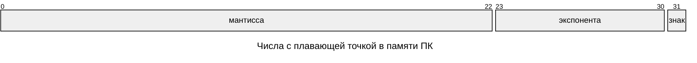

---
aliases:
  - hex
  - адресация
  - адресация памяти
  - Память ЭВМ
  - Адресация
  - bin
  - Числа с плавающей точкой
  - мантисса
  - экспонента
  - float
  - Октет
---
## Виды физической памяти

| Тип память                 | Скорость | Размер |
| -------------------------- | -------- | -----: |
| регистры ядра (процессора) | ⭐⭐⭐⭐     |      ⭐ |
| кэш ядра (процессора)      | ⭐⭐⭐      |     ⭐⭐ |
| ОЗУ (RAM)                  | ⭐⭐       |    ⭐⭐⭐ |
| ПЗУ (HDD, flash)           | ⭐        |   ⭐⭐⭐⭐ |

## Октет ~= байт

минимальная ячека памяти, в которую обращается процессов. Чаще всего 8 бит = байт. Поэтому буулеан чаще всего занимает 1 байт.

Байт мог быть любого размера. Исторически сложилось, что он = 8 бит, так как большинство задач на ПК были связаны с текстом, а для кодировки текста используются 8-битные кодировки такие как UTF-8, ASCII

### Адресация памяти

Представляет собой номер октета, в который мы обращаемся

### Байтовая адресация

если минимальный октет на ядре = 1 байт. Лучше подходит для работы с текстом, так как текст состоит из букв, фиксированного размера в кодировке

### Словесная адресация

если минимальный октет любой другой, например 32 или 64 бит. Лучше подходит для работы с числами.

### 0x01 — hex, 0b01 — bin

`0x` — обозначает что число записывается в 16-ричном представлении. Оно же hex = hexadecimal

- 0X or 0-X (zero X) may refer to: `0x`, a prefix for hexadecimal numeric constants in computing. ex: `0xFF`
- **`0b`** — binary. ex: `0b10101`

Тип данных byte, short, int, long, etc. определяет какой размер памяти будет выделен под переменную

### Отрицательные числа

- unsigned byte : 0..255 — _not supported in java_
- byte : -128..127

Чтобы представить в двоичной системе отрицательное число

1. Берем двоичной представление числа,
2. добавляем бит знака (обычно 1 для обозначения знака минус)
    1. `биты знака` ставится перед числом и во все предшествующие (левые) регистры
        1. получается что половина области памяти выделяемой под хранение числа заполняется битами знака. Обычно 0 для положительных и 1 для отрицательных
3. инвертируем двоичное представле числа (то, что после битов знака) с 0 на 1 и с 1 на 0
4. в конце к полученному добавляем 1

Такое представление удобно, так как позволяет корректно складываеть положительные и отрицательные числа в двоичной системе

## Числа с плавающей точкой, как хранятся

Согласно стандарта `IEEE 754` обычный float занимает в памяти 4 байта, которые делят на 3 блока:

1. S — Бит знака
2. М — Мантисса
	1. **Ман­тисса** — это, по сути, чис­ло, записан­ное без точ­ки
3. E — Экспонента числа
	1. **Экспо­нен­та** — это сте­пень, в которую нуж­но воз­вести некое чис­ло N (как пра­вило, N = 2), что­бы при перем­ножении на ман­тиссу получить иско­мое чис­ло. Т.е. макимальная степень может быть 255





Как конвертировать
$FloatNum \ \ \ = (-1)^S * 2^{E-127} \ * (1+M/2^{23})$
$DoubleNum = (-1)^S * 2^{E-1023} * (1+M/2^{52})$


> Пример перевода из стандарта IEEE 754 из double в десятичное


**Представление числа в формате с плавающей точкой**

Схема структуры числа:
- **Знак** (1 бит)
- **Экспонента (порядок)** — 11 бит
- **Мантисса** — 52+1 бит

Визуализация структуры (биты):
```
[Знак][Экспонента (11 бит)][Мантисса (52+1 бит)] 
0000000000001.00000000000000000000000000000000000000000000000000
```


**Пример расчёта для числа:**  
`0100000010111011011011010010111100011010100111110111110011110111`

1. **Порядок (экспонента):**  
   Двоичное значение: `10000000101₂`  
   Переводим в десятичную систему: `1029₁₀`  
   Вычитаем смещение (1023): `1029₁₀ – 1023₁₀ = 6₁₀`  
   **Результат:** порядок = `6`.

2. **Мантисса:**  
   Двоичное значение: `1.1110110111010010111100011010100111111011111101111₂`  
   Переводим в десятичную систему: ≈ `1.929`.  
   **Результат:** мантисса = `1.929`.

3. **Итоговое число:**  
   Формула: `мантисса × 2^(порядок)`  
   Подставляем значения: `1.929 × 2⁶`  
   Рассчитываем: `1.929 × 64 = 123.456`  
   **Результат:** число = `123.456`.


## Сколько памяти используют примитивные типы java

| **Название** | **Размер, байт** | **Диапазон значений**             | **Описание**                        | **Пример**                   |
| ------------ | ---------------- | --------------------------------- | ----------------------------------- | ---------------------------- |
| `byte`       | 1                | $-128\ ..\ 127$                   | целое число                         | `byte b = -5`                |
| `short`      | 2                | $-32\ 768\ ..\ 32\ 767$           | целое число                         | `short s = 42`               |
| `int`        | 4                | $-2\ * 10^{9}\ ..\ 2\ * 10^{9}$   | целое число                         | `int i = -12345`             |
| `long`       | 8                | $-9\ * 10^{18}\ ..\ 9\ * 10^{18}$ | целое число                         | `long l = 1122334455`        |
| `float`      | 4                | $±1.4E–45\ .. \ ±3.4E+38$         | вещественное число                  | `float f = 3.141592f`        |
| `double`     | 8                | $±4.5E–324\ .. ±1.8E+308$         | вещественное число двойной точности | `double d = 3.141592653589d` |
| `char`       | 2                | $0\ ..\ 65\ 535$                  | символ                              | `char c = 'Z'`               |
| `boolean`    | 1 бит            | `true` или `false`                | логическое значение                 | `boolean b = true`           |

### точные диапазоны

| **Название** | **Размер, байт** | **Диапазон значений**                                                                                         |
| ------------ | ---------------- | ------------------------------------------------------------------------------------------------------------- |
| `int`        | 4                | $-2^{31}\ ..\ 2³¹\ -\ 1$<br>$-2\ 147\ 483\ 648\ ..\ 2\ 147\ 483\ 647$                                         |
| `long`       | 8                | $-2^{63}\ ..\ 2^{63}-1$<br>$-9\ 223\ 372\ 036\ 854\ 775\ 808\ ..$<br>   $9\ 223\ 372\ 036\ 854\ 775\ 807$<br> |
| `float`      | 4                | $±1.4E–45\ .. \ ±3.4028235E+38$                                                                               |
| `double`     | 8                | $±4.49E–324\ ..$<br>$±1.7976931348623157E+308$                                                                |

# E-нотация
Буква **«E» (или «e»)** в записи типа **4.49E–324** — это **сокращение от «exponent» (показатель степени)**. Она используется в **E-нотации (экспоненциальной записи)** — удобной для компьютеров форме научной нотации.

**Суть E-нотации:**
- Вместо записи «умножить на 10 в степени» (например, 3,5 × 10⁸) пишут **3.5E8** или **3.5e8**.
- Формат: **aEn** или **aen**, где:
  - **a** — коэффициент (мантисса), число, для которого 1 ≤ |a| < 10;
  - **n** — показатель степени (целое число);
  - **E/e** означает «умножить на 10 в степени».

**Пример разбора 4.49E–324:**
- **4.49** — коэффициент (мантисса);
- **E** — означает «× 10^» (умножить на 10 в степени);
- **–324** — показатель степени (отрицательный).
- Итого: **4.49E–324 = 4.49 × 10^(-324)** — это очень маленькое число (почти нулевое, но не ноль).

**Где используется E-нотация?**
- в языках программирования (Python, JavaScript, C++);
- в электронных таблицах (Excel, Google Таблицы);
- в научном ПО и калькуляторах;
- для компактной записи очень больших или малых чисел (например, в физике, химии, астрономии).

**Примеры других записей:**
- 6.022E23 = 6.022 × 10²³ (число Авогадро);
- 1.6E–19 = 1.6 × 10^(-19) (заряд электрона);
- 2.998E8 = 2.998 × 10⁸ (скорость света в м/с).

**Вывод:** «E» — это способ кратко записать степень числа 10, делая запись чисел более компактной и удобной для вычислений.