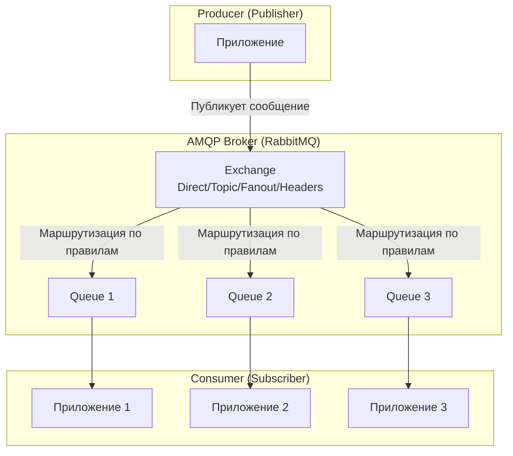

---
aliases:
  - Advanced Message Queuing Protocol
  - AMQP
---
## 📡 Что такое AMQP (Advanced Message Queuing Protocol)?

**AMQP** — это **открытый стандарт сетевого протокола** для надёжного обмена сообщениями между приложениями в распределённых системах. Он определяет не только формат сообщений, но и **полный набор правил взаимодействия** между отправителями, брокером и получателями.

> 💡 **Ключевая идея**:  
> AMQP — это не конкретная технология (как RabbitMQ), а **спецификация**, которую реализуют различные брокеры сообщений.

---

## 🔑 Основные характеристики AMQP

| Характеристика               | Описание                                                                     |
| ---------------------------- | ---------------------------------------------------------------------------- |
| **Открытый стандарт**        | Управляется [[OASIS]], не привязан к вендору                                 |
| **Бинарный протокол**        | Эффективен для передачи (меньше накладных расходов, чем текстовые протоколы) |
| **Гарантированная доставка** | Поддержка подтверждений (acknowledgements), persistence                      |
| **Маршрутизация**            | Гибкие правила доставки через обменники (exchanges) и очереди (queues)       |
| **Транзакционность**         | Поддержка транзакций для атомарных операций                                  |
| **Безопасность**             | Встроенная поддержка SASL и TLS                                              |

---

## 🧩 Архитектура AMQP 0.9.1 (самая распространённая версия)



### 🔹 Ключевые компоненты:

| Компонент | Роль | Пример |
|-----------|------|--------|
| **Producer** | Отправляет сообщения в брокер | Веб-сервер, генерирующий заказы |
| **Exchange** | Принимает сообщения и маршрутизирует их в очереди | `orders.exchange` (тип: `topic`) |
| **Binding** | Правило связи между exchange и queue | `orders.*` → `orders.queue` |
| **Queue** | Хранит сообщения до обработки | `orders.queue`, `payments.queue` |
| **Consumer** | Получает и обрабатывает сообщения | Микросервис обработки заказов |

---

## 🆚 Сравнение с другими протоколами/технологиями

| Технология | Тип | Гарантии доставки | Сложность | Использование |
|------------|-----|-------------------|-----------|---------------|
| **AMQP** | Протокол | Да (ACK, persistence) | Средняя | Микросервисы, надёжная доставка |
| **MQTT** | Протокол | Да (3 уровня QoS) | Низкая | IoT, мобильные устройства |
| **Kafka** | Платформа | Да (лог репликации) | Высокая | Стриминг, аналитика в реальном времени |
| **HTTP/REST** | Протокол | Нет (только 200 OK) | Низкая | Синхронные вызовы, простые интеграции |
| **gRPC** | Фреймворк | Нет (только потоки) | Средняя | Высокопроизводительные синхронные вызовы |

> 💡 **Главное отличие**:  
> - **AMQP** — асинхронная очередь с гарантиями  
> - **HTTP/gRPC** — синхронные запросы без очередей  
> - **Kafka** — лог событий (не очередь), ориентированный на стриминг

---

## 💻 Пример на Java (с использованием RabbitMQ)

```java
import com.rabbitmq.client.*;

public class AMQPExample {
    private static final String QUEUE_NAME = "orders.queue";
    private static final String EXCHANGE_NAME = "orders.exchange";
    private static final String ROUTING_KEY = "orders.create";

    public static void main(String[] args) throws Exception {
        // 1. Подключение к брокеру
        ConnectionFactory factory = new ConnectionFactory();
        factory.setHost("localhost");
        factory.setUsername("guest");
        factory.setPassword("guest");
        Connection connection = factory.newConnection();
        Channel channel = connection.createChannel();

        // 2. Создание обменника и очереди
        channel.exchangeDeclare(EXCHANGE_NAME, BuiltinExchangeType.TOPIC, true); // durable
        channel.queueDeclare(QUEUE_NAME, true, false, false, null);
        channel.queueBind(QUEUE_NAME, EXCHANGE_NAME, ROUTING_KEY);

        // 3. Публикация сообщения (Producer)
        String message = "{\"order_id\": 123, \"customer\": \"John\"}";
        AMQP.BasicProperties props = new AMQP.BasicProperties.Builder()
            .contentType("application/json")
            .deliveryMode(2) // persistent
            .build();
        
        channel.basicPublish(EXCHANGE_NAME, ROUTING_KEY, props, message.getBytes());
        System.out.println(" [x] Sent '" + message + "'");

        // 4. Потребление сообщения (Consumer)
        DeliverCallback deliverCallback = (consumerTag, delivery) -> {
            String received = new String(delivery.getBody(), "UTF-8");
            System.out.println(" [x] Received '" + received + "'");
            
            // Подтверждение обработки
            channel.basicAck(delivery.getEnvelope().getDeliveryTag(), false);
        };
        
        channel.basicConsume(QUEUE_NAME, false, deliverCallback, consumerTag -> { });

        // Закрытие соединения (в реальном приложении — при завершении)
        // channel.close();
        // connection.close();
    }
}
```

---

## 🌐 Реальные сценарии использования

| Сценарий | Как работает | Преимущество AMQP |
|----------|--------------|-------------------|
| **Обработка заказов** | Веб → очередь → сервис обработки → сервис оплаты | Отказоустойчивость: если сервис упал — сообщения ждут в очереди |
| **Асинхронная аналитика** | Приложение → очередь событий → сервис аналитики | Не блокирует основной поток пользователя |
| **Микросервисная архитектура** | Сервисы общаются через очереди вместо прямых вызовов | Снижение связанности, изоляция сбоев |
| **Распределённые транзакции** | Сага-паттерн через очереди компенсации | Гарантия согласованности без распределённых транзакций |
| **Очереди задач** | Веб → очередь → воркеры обработки | Горизонтальное масштабирование воркеров |

---

## ⚙️ Версии протокола

| Версия | Статус | Особенности |
|--------|--------|-------------|
| **AMQP 0.8** | Устаревшая | Первая версия, несовместима с 0.9.1 |
| **AMQP 0.9.1** | **Самая распространённая** | Используется в RabbitMQ, Apache Qpid |
| **AMQP 1.0** | Современный стандарт (OASIS) | Упрощённая модель, поддержка в Azure Service Bus, ActiveMQ Artemis |

> ⚠️ **Важно**:  
> - **RabbitMQ** поддерживает **0.9.1** (и частично 1.0 через плагин)  
> - **Azure Service Bus**, **ActiveMQ Artemis** используют **1.0**  
> - Версии **не совместимы** между собой!

---

## ✅ Преимущества AMQP

| Преимущество | Объяснение |
|--------------|------------|
| **Надёжность** | Гарантированная доставка даже при сбоях |
| **Масштабируемость** | Легко добавлять потребителей для обработки нагрузки |
| **Гибкость маршрутизации** | Один обменник → множество очередей по правилам |
| **Языковая независимость** | Клиенты на любом языке (Java, Python, Go, .NET) |
| **Интероперабельность** | Можно заменить брокер без изменения приложений |

---

## ⚠️ Ограничения

| Ограничение | Обходное решение |
|-------------|------------------|
| **Сложность настройки** | Использовать готовые решения (RabbitMQ, CloudAMQP) |
| **Нет встроенной аналитики** | Интеграция с инструментами мониторинга (Prometheus, Grafana) |
| **Не для стриминга** | Для потоковой обработки использовать Kafka + AMQP для оркестрации |
| **Требует брокера** | Использовать управляемые сервисы (AWS MQ, Azure Service Bus) |

---

## 🛠️ Популярные реализации

| Брокер | Поддержка AMQP | Особенности |
|--------|----------------|-------------|
| **RabbitMQ** | 0.9.1 (основная), 1.0 (плагин) | Самый популярный, богатая экосистема |
| **Apache Qpid** | 0.9.1, 1.0 | Enterprise-ориентированный |
| **Azure Service Bus** | 1.0 | Управляемый сервис от Microsoft |
| **AWS MQ** | 0.9.1 (RabbitMQ) | Управляемый сервис от Amazon |
| **ActiveMQ Artemis** | 1.0 | Высокая производительность |

---

## 💬 Итог

> **AMQP — это «почтовая система» для распределённых приложений**:  
> - Отправитель кладёт письмо (сообщение) в почтовый ящик (очередь)  
> - Почтальон (брокер) доставляет его получателю  
> - Получатель подтверждает получение (ACK)  
> - Если получатель недоступен — письмо ждёт в ящике

> 💡 **Когда использовать**:  
> ➤ Когда нужна **гарантированная асинхронная доставка**  
> ➤ Для построения **микросервисной архитектуры**  
> ➤ Для **декуплинга** компонентов системы

> ❌ **Когда не использовать**:  
> ➤ Для синхронных вызовов (лучше HTTP/gRPC)  
> ➤ Для стриминга больших объёмов данных в реальном времени (лучше Kafka)  
> ➤ Для простых сценариев без требований к надёжности (лучше REST)

---

✅ **AMQP — не просто протокол, а философия надёжного асинхронного взаимодействия в распределённых системах.**