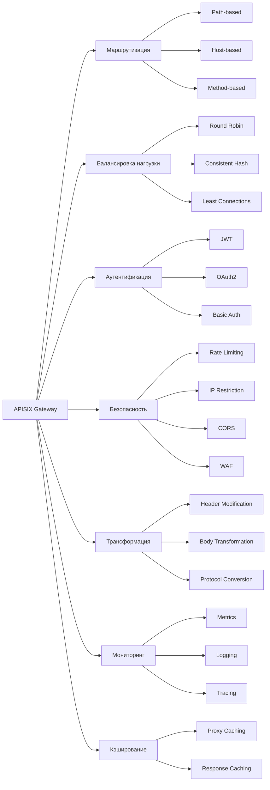

**APISIX Gateway** — это динамический, высокопроизводительный cloud-native API шлюз, построенный на основе etcd. Он может выполнять множество задач для управления API трафиком.

## Основные возможности APISIX Gateway



## 1. **Динамическая маршрутизация и балансировка**

### Конфигурация маршрутов:
```yaml
# routes.yaml
routes:
  - uri: /api/v1/products/*
    upstream:
      service_name: product-service
      type: roundrobin
      nodes:
        - host: 192.168.1.10
          port: 8080
          weight: 100
        - host: 192.168.1.11  
          port: 8080
          weight: 100
    plugins:
      proxy-rewrite:
        uri: "/products$1"
```

### Service Discovery с Consul:
```yaml
routes:
  - uri: /api/users/*
    upstream:
      service_name: user-service
      type: consul
      discovery_type: consul
      discovery_args:
        group_name: production
```

## 2. **Аутентификация и авторизация**

### JWT аутентификация:
```yaml
plugins:
  jwt-auth:
    secret: "your-jwt-secret-key"
    exp: 86400
    payload:
      - "username"
      - "email"
```

### Key Authentication:
```yaml
plugins:
  key-auth:
    key: "user-key"
    hide_credentials: true
```

## 3. **Rate Limiting и защита**

### Ограничение запросов:
```yaml
plugins:
  limit-req:
    rate: 1000
    burst: 2000
    key: remote_addr
    rejected_code: 503

  limit-count:
    count: 100
    time_window: 60
    key: remote_addr
    policy: local
```

### IP Whitelist/Blacklist:
```yaml
plugins:
  ip-restriction:
    whitelist:
      - "192.168.1.0/24"
      - "10.0.0.1"
    blacklist:
      - "192.168.2.100"
```

## 4. **Трансформация запросов/ответов**

### Proxy Rewrite:
```yaml
plugins:
  proxy-rewrite:
    uri: "/v2$1"
    method: "POST"
    headers:
      X-API-Version: "v2"
      X-User-ID: "$user_id"
```

### Response Rewrite:
```yaml
plugins:
  response-rewrite:
    status_code: 200
    headers:
      X-Server: "APISIX"
      X-Request-ID: "$request_id"
    body: '{"status": "success", "data": $response_body}'
```

## 5. **Кэширование**

### Proxy Caching:
```yaml
plugins:
  proxy-cache:
    cache_key:
      - "$uri"
      - "$args"
    cache_bypass:
      - "$arg_bypass"
    cache_method:
      - "GET"
      - "POST"
    cache_http_status:
      - 200
      - 304
    cache_ttl: 300
```

## 6. **Мониторинг и логирование**

### Prometheus Metrics:
```yaml
plugins:
  prometheus:
    prefer_name: true
    metrics:
      - name: "http_requests_total"
        type: "counter"
        desc: "Total HTTP requests"
      - name: "http_request_duration_seconds"
        type: "histogram"
        desc: "HTTP request duration in seconds"
```

### Логирование в Kafka:
```yaml
plugins:
  kafka-logger:
    broker_list:
      - "kafka1:9092"
      - "kafka2:9092"
    kafka_topic: "api-logs"
    key: "apisix-logs"
    timeout: 3
```

## 7. **Canary Release и A/B тестирование**

### Canary deployments:
```yaml
upstream:
  service_name: user-service
  type: chash
  key: remote_addr
  nodes:
    - host: 192.168.1.10  # v1 - 90% трафика
      port: 8080
      weight: 90
    - host: 192.168.1.11  # v2 - 10% трафика
      port: 8080  
      weight: 10
```

### Traffic Splitting по заголовкам:
```yaml
plugins:
  traffic-split:
    rules:
      - match:
          - vars:
              - ["http_x_version", "==", "v2"]
        weighted_upstreams:
          - upstream_id: "v2-upstream"
            weight: 100
      - match:
          - vars: 
              - ["http_x_version", "==", "v1"]
        weighted_upstreams:
          - upstream_id: "v1-upstream" 
            weight: 100
```

## 8. **gRPC и WebSocket поддержка**

### gRPC прокси:
```yaml
routes:
  - uri: /helloworld.Greeter/*
    plugins:
      grpc-transcode:
        proto_id: "1"
        service: "helloworld.Greeter"
        method: "SayHello"
```

### WebSocket:
```yaml
routes:
  - uri: /ws/*
    plugins:
      websocket:
        idle_timeout: 60
        max_payload_len: 65535
```

## 9. **Serverless функции**

### AWS Lambda интеграция:
```yaml
plugins:
  aws-lambda:
    function_name: "my-function"
    qualifier: "1"
    host: "lambda.us-east-1.amazonaws.com"
    timeout: 3000
```

### Azure Functions:
```yaml
plugins:
  azure-functions:
    function_uri: "https://my-function.azurewebsites.net/api/HttpExample"
    authorization: "abc123"
```

## 10. **Custom plugins**

### Пример кастомного плагина на Lua:
```lua
local plugin_name = "custom-auth"

local schema = {
    type = "object",
    properties = {
        header_name = {type = "string", default = "X-API-Key"},
        secret_key = {type = "string"}
    }
}

function _M.access(conf, ctx)
    local api_key = core.request.header(conf.header_name)
    
    if not api_key then
        return 401, {message = "Missing API key"}
    end
    
    if api_key ~= conf.secret_key then
        return 403, {message = "Invalid API key"}  
    end
    
    -- Добавляем пользовательский заголовок
    core.request.set_header("X-User-Authenticated", "true")
end

return _M
```

## 11. **Динамическая конфигурация через etcd**

### Hot-reload конфигурации:
```bash
# Добавление маршрута через API
curl "http://127.0.0.1:9080/apisix/admin/routes/1" \
-H "X-API-KEY: edd1c9f034335f136f87ad84b625c8f1" \
-X PUT -d '
{
  "uri": "/api/users/*",
  "upstream": {
    "type": "roundrobin",
    "nodes": {
      "user-service-1:8080": 1,
      "user-service-2:8080": 1
    }
  },
  "plugins": {
    "limit-count": {
      "count": 100,
      "time_window": 60,
      "key": "remote_addr"
    }
  }
}'
```

## 12. **Health Checking**

### Активные проверки здоровья:
```yaml
upstream:
  service_name: product-service
  type: roundrobin
  nodes:
    - host: 192.168.1.10
      port: 8080
      weight: 100
    - host: 192.168.1.11
      port: 8080
      weight: 100
  checks:
    active:
      type: http
      http_path: /health
      healthy:
        interval: 5
        successes: 2
      unhealthy:
        interval: 2
        http_failures: 3
```

## 13. **Security Features**

### WAF (Web Application Firewall):
```yaml
plugins:
  wolf-rbac:
    username: "admin"
    password: "admin"
    
  cors:
    allow_origins: "https://example.com"
    allow_methods: "GET,POST,PUT,DELETE"
    allow_headers: "*"
    expose_headers: "*"
    max_age: 3600
```

## 14. **Производительность и масштабирование**

### Конфигурация для high-load:
```yaml
# config.yaml
apisix:
  node_listen: 9080
  enable_admin: true
  admin_key:
    - name: "admin"
      key: edd1c9f034335f136f87ad84b625c8f1
      role: admin
  
  proxy_cache:
    cache_ttl: 300s
    zones:
      - name: disk_cache_one
        memory_size: 50m
        disk_size: 1G
        disk_path: "/tmp/disk_cache_one"
        
  etcd:
    host:
      - "http://etcd1:2379"
      - "http://etcd2:2379"
      - "http://etcd3:2379"
    prefix: "/apisix"
    timeout: 30
```

## Практические сценарии использования

### 1. **Микросервисная архитектура**
```yaml
routes:
  - uri: /api/users/*
    upstream:
      service_name: user-service
      discovery_type: consul
      
  - uri: /api/products/*  
    upstream:
      service_name: product-service
      discovery_type: consul
      
  - uri: /api/orders/*
    upstream:
      service_name: order-service  
      discovery_type: consul
```

### 2. **API Versioning**
```yaml
routes:
  - uri: /v1/api/*
    plugins:
      proxy-rewrite:
        uri: "/api$1"
    upstream:
      service_name: api-v1
      
  - uri: /v2/api/*
    plugins:
      proxy-rewrite: 
        uri: "/api$1"
    upstream:
      service_name: api-v2
```

### 3. **Географическая маршрутизация**
```yaml
plugins:
  geoip-match:
    rules:
      - match: 
          - ["geoip_country_code", "==", "US"]
        upstream_id: "us-upstream"
      - match:
          - ["geoip_country_code", "==", "EU"]  
        upstream_id: "eu-upstream"
```

## Итог

**APISIX Gateway может выполнять:**

- ✅ **Динамическую маршрутизацию** и service discovery
- ✅ **Балансировку нагрузки** с различными алгоритмами
- ✅ **Аутентификацию и авторизацию** (JWT, OAuth2, Key Auth)
- ✅ **Rate limiting** и защиту от DDoS
- ✅ **Трансформацию запросов/ответов**
- ✅ **Кэширование** на уровне шлюза
- ✅ **Мониторинг** и observability
- ✅ **Canary deployments** и A/B тестирование
- ✅ **gRPC, WebSocket, GraphQL** поддержку
- ✅ **Serverless** интеграции
- ✅ **Custom plugins** на Lua

**Преимущества APISIX:**
- 🚀 Высокая производительность (меньшая задержка чем Nginx)
- 🔧 Динамическая конфигурация без перезагрузки
- 📊 Богатая экосистема плагинов
- ☁️ Cloud-native архитектура
- 🛠️ Extensibility через Lua плагины

APISIX идеально подходит для современных микросервисных архитектур и API-ориентированных приложений.