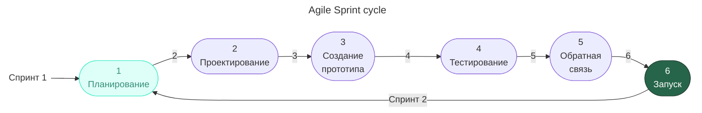
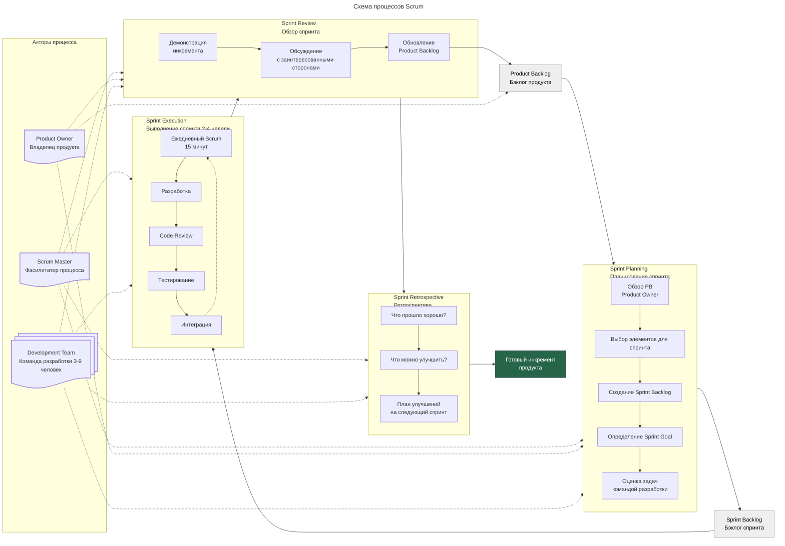
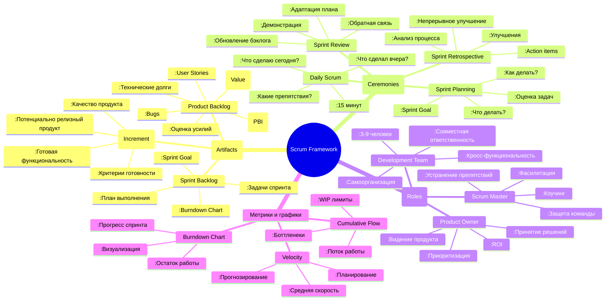
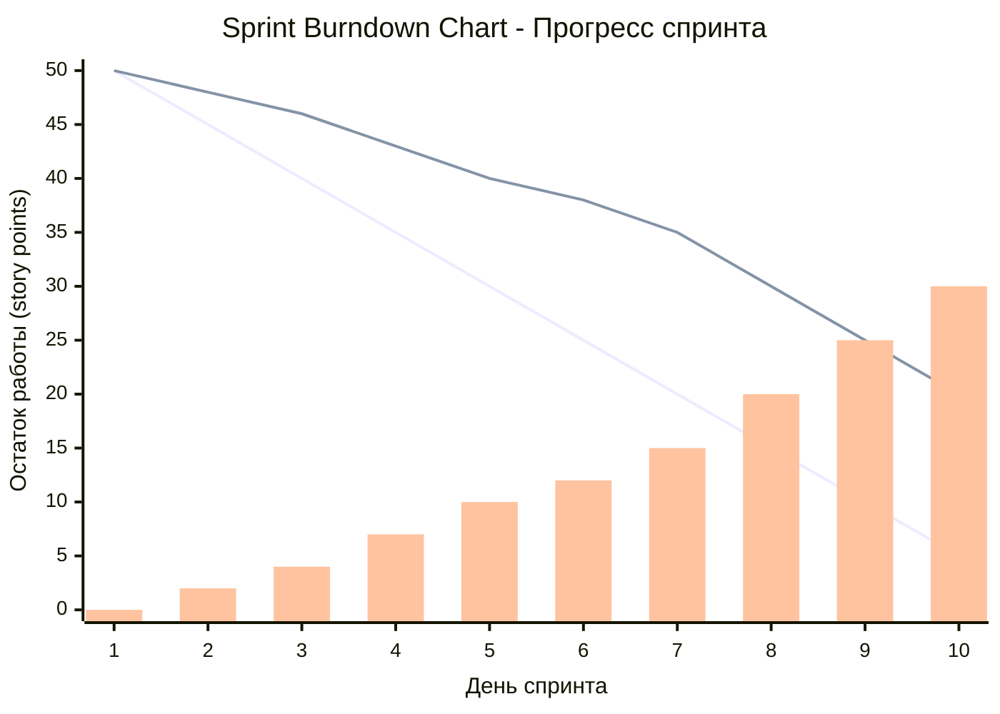
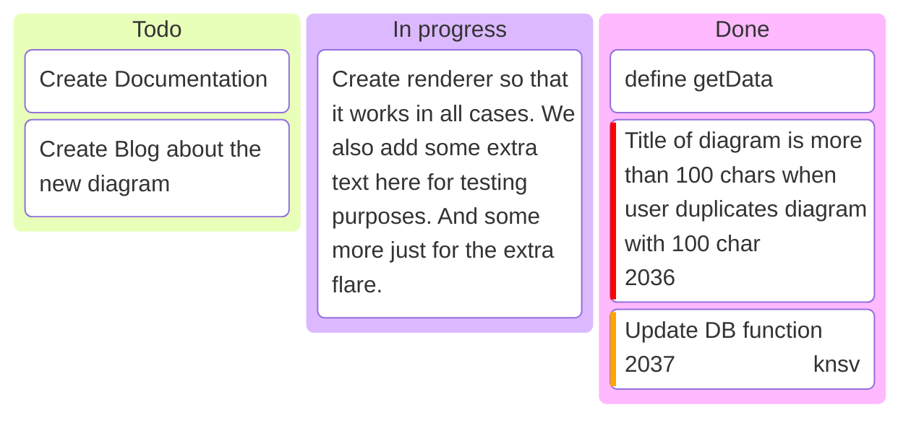

---
aliases:
  - Agile
  - Scrum
  - Kanban
---
## Agile software development

Agile (agile software development) — подход к управлению проектами по разработке программного обеспечения (ПО), который часто применяют в небольших командах.
Как правило, для гибкого подхода Agile характерна работа короткими итерациями по две-три недели. Внутри каждой итерации собрана серия задач: анализ, проектирование, непосредственно работа и тестирование. После каждой итерации команда анализирует результаты и меняет приоритеты для следующего цикла.

Старт Agile в 2001 с **манифеста Agile** от 17 разработчиков в США, Юта. Включает в себя 12 принципов

Основные понятия:
- Ретро совещание
- Дэйли совещание
- Покер-планинг совещание
- Юзерстори — набор декомпозированных задач объединенный общим смыслом
- Спринт
- Релиз
- Эпик

### Манифест Agile
1. **Удовлетворение клиентов** — приоритетная задача при разработке продукта. Клиенты должны своевременно и в полном объёме получать качественное программное обеспечение и его обновления.
2. **Изменения в процессе разработки приветствуются**. Гибкие процессы позволяют наделить продукт конкурентными преимуществами для клиентов.
3. **Рабочее ПО нужно доставлять клиенту часто**, в рамках 2–16 недель.
4. **Руководители и разработчики должны трудиться вместе** на протяжении всего рабочего процесса.
5. **В основе проекта — мотивированные люди**. Обеспечьте им необходимые условия работы, поддержку и доверие.
6. Лучший способ передачи информации в команде — **личная беседа**.
7. **Основное мерило прогресса — работающее ПО**. А не часы, трудозатраты и другие критерии.
8. **Гибкие процессы — основа устойчивого развития**. Они позволяют поддерживать нужный рабочий темп как на спринтерской, так и на марафонской дистанции.
9. Важно уделять внимание **техническому совершенству и качественному дизайну продукта**.
10. Важно **сокращать до минимума лишнюю работу** и не переусложнять проект и рабочие процессы.
11. Самые лучшие продукты рождаются у **самоорганизующихся команд**. Нет микроменеджменту, да — свободе управления.
12. Команда должна **регулярно оценивать работу и корректировать своё поведение**.
### Ценности Agile
Из этих двенадцати принципов выделяют четыре ценности системы Agile:
1. **Люди и взаимодействия важнее процессов** и инструментов.
2. Работающий **продукт важнее подробной документации**.
3. **Сотрудничество с заказчиком** важнее условий договора.
4. **Готовность к изменениям** важнее следования изначальному плану.
## Scrum
Scrum — это методология (==имплементация)== Agile. Скрам – это процессный фреймворк.

Основные термины:
- Роли
    - Product owner
    - Скрам-мастер
- Backlog — список задач для спринтов
- Спринт - цикл разработки с обратной связью и корректировкой задач

Sprint Burndown Chart - Прогресс спринта

## Kanban
Методология Agile. Которая сводится к ведению доски задач

### 6 принципов Kanban
1. **Визуализируйте все задачи на специальной Kanban-доске**. Если появляется новая задача — сразу добавляйте на доску.
2. **Ограничьте количество работы в процессе** — в каждом столбике доски должно быть не больше определённого количества задач.
3. Управляйте потоком работы — ==**отслеживайте, как задачи движутся по доске**==.
4. ==**Используйте только явные правила добавления и движения задач**==, понятные всем участникам.
5. ==Вводите петли обратной связи — наборы встреч==, помогающие лучше понимать процесс работы.
6. ==Улучшайте процессы== везде, где это возможно.