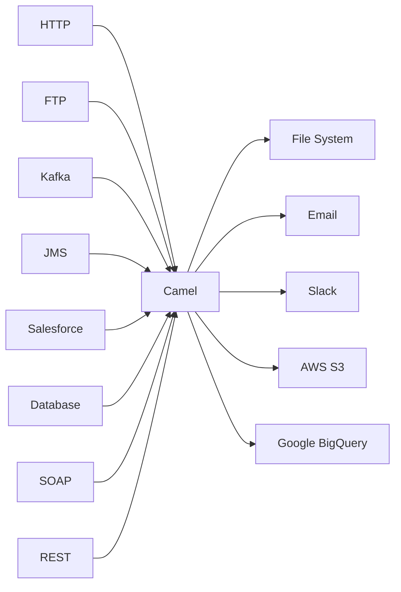

---
aliases:
  - Camel
  - Apache Camel
---
# Apache Camel
## 🐫 Что такое Apache Camel?

**Apache Camel** — это **фреймворк с открытым исходным кодом для интеграции систем**, основанный на паттерне **Enterprise Integration Patterns (EIP)**. Он позволяет легко подключать различные системы, протоколы и форматы данных друг к другу.

> 💡 **Простыми словами**:  
> *«Apache Camel — это универсальный адаптер для ИТ-систем. Как переходник для разных розеток, но для программ.»*

---

## 📊 К какой категории ИТ-инструментов относится?

| Категория | Подкатегория | Объяснение |
|-----------|--------------|------------|
| **Интеграционные платформы** | **ESB (Enterprise Service Bus) / iPaaS (Integration Platform as a Service)** | Camel — это **легковесный ESB**, реализующий паттерны интеграции |
| **Middleware** | **Message-oriented middleware** | Обеспечивает обмен сообщениями между системами |
| **Фреймворки** | **Интеграционные фреймворки** | Предоставляет API и DSL для построения интеграций |

> 🔑 **Ключевая категория**: **Интеграционная платформа уровня предприятия (Enterprise Integration Platform)**

---

## 🧩 Архитектурные принципы

### 1. **Enterprise Integration Patterns (EIP)**
Camel реализует более **65 стандартных паттернов интеграции** из книги Грега Хоппа и Бобби Вулфа:

- **Message Router** — маршрутизация сообщений
- **Splitter/Aggregator** — разбиение и объединение сообщений
- **Content-Based Router** — маршрутизация по содержимому
- **Dead Letter Channel** — обработка ошибок
- **Throttler** — ограничение скорости

### 2. **Component Model**
Camel поддерживает **более 300 компонентов** для подключения к различным системам:



---

## 💻 Примеры использования

### 🔹 Пример 1: Простая маршрутизация (Java DSL)

```java
// Читаем файлы из входной директории
// Конвертируем XML в JSON
// Отправляем в REST API
from("file:input?delete=true")
    .unmarshal().xmljson()           // XML → JSON
    .to("http://api.example.com/data") // Отправка в REST API
    .to("file:output");              // Сохранение результата
```

### 🔹 Пример 2: Интеграция с Kafka и базой данных

```java
// Читаем сообщения из Kafka
// Фильтруем по условию
// Сохраняем в PostgreSQL
from("kafka:orders-topic")
    .filter(header("amount").isGreaterThan(1000))
    .to("jdbc:postgresqlDS?statement=INSERT INTO orders VALUES (?, ?)")
    .to("log:processed-orders");
```

### 🔹 Пример 3: Обработка ошибок

```java
// Настройка обработки ошибок
errorHandler(deadLetterChannel("jms:queue:error-queue"));

from("ftp:server/incoming")
    .to("bean:orderProcessor")       // Обработка заказа
    .to("jms:queue:confirmed-orders"); // Отправка в очередь
```

---

## 🛠️ Ключевые возможности

| Возможность | Описание |
|-------------|----------|
| **Единый DSL** | Java, XML, YAML, Kotlin — один синтаксис для всех интеграций |
| **Более 300 коннекторов** | Поддержка практически любых систем и протоколов |
| **Трансформация данных** | Автоматическая конвертация между форматами (XML, JSON, CSV, Avro) |
| **Маршрутизация** | Умная маршрутизация на основе содержимого, заголовков, времени |
| **Обработка ошибок** | Встроенные механизмы retry, dead letter channel, circuit breaker |
| **Мониторинг** | Интеграция с Prometheus, Grafana, JMX |
| **Тестирование** | Встроенные средства для unit и integration тестирования |

---

## 🆚 Сравнение с другими инструментами

| Инструмент | Тип | Отличия от Camel |
|------------|-----|------------------|
| **Apache Kafka** | Message Broker | Kafka — транспорт, Camel — логика маршрутизации поверх Kafka |
| **MuleSoft** | Коммерческий iPaaS | MuleSoft — enterprise решение с GUI, Camel — open source фреймворк |
| **Spring Integration** | Фреймворк | Spring Integration — часть Spring, Camel — независимый фреймворк |
| **Talend** | ETL/iPaaS | Talend — визуальный инструмент, Camel — код-ориентированный |
| **Zapier** | Low-code iPaaS | Zapier — для бизнес-пользователей, Camel — для разработчиков |

> 💡 **Camel часто используется вместе с Kafka**:  
> Kafka как транспорт + Camel как процессор сообщений

---

## 🏥 Реальные сценарии использования

### 🏢 Корпоративная интеграция
- **Сценарий**: Интеграция ERP-системы с CRM и почтовым сервером
- **Решение**:  
  ```java
  from("sap:idoc:ORDERS")
      .to("salesforce:createAccount")
      .to("smtp://notifications@company.com");
  ```

### 🌐 Микросервисная архитектура
- **Сценарий**: Оркестрация вызовов между микросервисами
- **Решение**:  
  ```java
  from("rest:get:/orders/{id}")
      .to("http://inventory-service/stock")
      .to("http://pricing-service/calculate")
      .aggregate(constant(true), new OrderAggregationStrategy());
  ```

### ☁️ Облачная интеграция
- **Сценарий**: Перемещение данных между AWS S3 и Google BigQuery
- **Решение**:  
  ```java
  from("aws-s3://my-bucket/input")
      .unmarshal().csv()
      .to("google-bigquery://dataset/table");
  ```

### 📡 IoT-интеграция
- **Сценарий**: Сбор данных с датчиков через MQTT и сохранение в базу
- **Решение**:  
  ```java
  from("paho:iot/sensors")
      .filter(body().regex("TEMP.*"))
      .to("mongodb:iotDB?collection=sensorData");
  ```

---

## 📦 Архитектурные стили

### 1. **Standalone Application**
```java
public class MyCamelApp {
    public static void main(String[] args) throws Exception {
        CamelContext context = new DefaultCamelContext();
        context.addRoutes(new MyRouteBuilder());
        context.start();
        Thread.sleep(5000);
        context.stop();
    }
}
```

### 2. **Spring Boot Integration**
```java
@SpringBootApplication
public class CamelApplication {
    public static void main(String[] args) {
        SpringApplication.run(CamelApplication.class, args);
    }
}

@Component
public class MyRoute extends RouteBuilder {
    @Override
    public void configure() {
        from("timer:hello?period=10000")
            .setBody(constant("Hello World"))
            .to("log:info");
    }
}
```

### 3. **Kubernetes Deployment**
```yaml
# camel-app.yaml
apiVersion: apps/v1
kind: Deployment
spec:
  template:
    spec:
      containers:
      - name: camel-app
        image: my-camel-app:latest
        ports:
        - containerPort: 8080
```

---

## ✅ Преимущества Apache Camel

| Преимущество | Объяснение |
|--------------|------------|
| **Открытый исходный код** | Бесплатно, активное сообщество, прозрачная разработка |
| **Гибкость** | Работает standalone, в Spring Boot, в Kubernetes, в облаке |
| **Богатая экосистема** | 300+ компонентов для любых систем |
| **Стандарты** | Реализация Enterprise Integration Patterns |
| **Производительность** | Легковесный, минимальные накладные расходы |
| **Тестируемость** | Встроенные средства для тестирования маршрутов |

---

## ⚠️ Ограничения

| Ограничение | Как обойти |
|-------------|------------|
| **Требует Java-знаний** | Использовать Camel K для Kubernetes или Camel Quarkus |
| **Сложность для новичков** | Начинать с простых маршрутов, использовать документацию |
| **Нет визуального редактора** | Использовать сторонние инструменты (Fuse Tooling, IDEA plugins) |
| **Ограниченный low-code** | Для бизнес-пользователей лучше подойдут MuleSoft или Zapier |

---

## 🚀 Современные направления развития

### **Camel K** — Serverless Camel для Kubernetes
```bash
# Запуск Camel-маршрута в Kubernetes одной командой
kamel run hello.groovy
```

### **Camel Quarkus** — Ultra-fast Camel для GraalVM
```java
// Native-приложение размером ~50MB, запускается за 10ms
@Path("/hello")
public class HelloResource {
    @Inject
    CamelContext context;
}
```

### **Camel JBang** — Запуск маршрутов без компиляции
```bash
# Запуск Camel-скрипта напрямую
jbang camel@apache/camel hello.java
```

---

## 💬 Итог

> **Apache Camel — это «швейцарский нож» для интеграции систем**:  
> - Поддерживает **любые протоколы и форматы**  
> - Реализует **стандартные паттерны интеграции**  
> - Работает **везде**: от embedded устройств до облака  
> - **Открытый и бесплатный**

> 💡 **Когда использовать**:  
> ➤ При необходимости интегрировать разнородные системы  
> ➤ Для построения ESB или iPaaS решения  
> ➤ В микросервисной архитектуре для оркестрации  
> ➤ Когда нужна гибкость и контроль над интеграцией

> ❌ **Когда не использовать**:  
> ➤ Для простых REST API без сложной логики  
> ➤ Если нужен low-code/no-code подход для бизнес-пользователей  
> ➤ Для pure streaming-сценариев (лучше Kafka Streams)

---

✅ **Apache Camel остаётся одним из самых мощных и гибких инструментов интеграции в мире Java-экосистемы.**