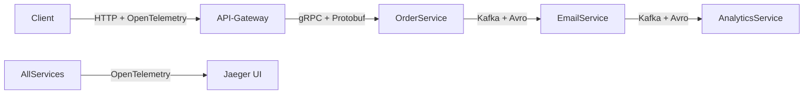

---
aliases:
  - Distributed Tracing
---
## ✅ Что такое **Distributed Tracing**?

### 🔹 Определение:
> **Distributed Tracing** — это метод мониторинга и отладки **распределённых систем**, при котором **каждый запрос (или событие)** проходит через множество сервисов, и **его путь полностью записывается** — от начала до конца.

Это как **GPS-трекер для HTTP-запроса или события**:
> *«Запрос от клиента прошёл через Gateway → Order Service → Payment Service → Email Service → Analytics — все шаги зафиксированы».*

---

### 🔧 Почему он нужен?

В обычной системе:
```plaintext
Client → [Order Service] → [Payment Service] → [Email Service]
```
→ Если что-то пошло не так — вы видите только ошибку в `EmailService`.  
→ Но **почему** она возникла?  
→ Было ли проблема в `OrderService`?  
→ Запрос вообще дошёл до `PaymentService`?  
→ Сколько времени занял каждый шаг?

**Без трассировки — вы слепы.**

---

### 🔍 Как это работает? (Принцип)

Каждый запрос получает уникальный **Trace ID** — идентификатор всей цепочки.

Каждый сервис:
1. Получает `Trace ID` из заголовка (например, `X-B3-TraceId`)
2. Генерирует собственный **Span ID** — единицу работы внутри сервиса
3. Добавляет метаданные: время начала, время окончания, статус, метки
4. Передаёт `Trace ID` и `Span ID` следующему сервису через HTTP-заголовки или сообщения

Результат — **дерево вызовов**:

```plaintext
TraceID: abc123
├── Span: gateway (10ms) → OK
│   └── Span: order-service (20ms) → OK
│       ├── Span: payment-service (15ms) → OK
│       └── Span: inventory-service (8ms) → OK
└── Span: email-service (500ms) → ERROR (SMTP timeout)
```

→ Вы сразу видите: **email-сервис тормозит — 500мс! И упал.**

---

### 🛠️ Ключевые термины

| Термин | Описание |
|--------|----------|
| **Trace** | Полная цепочка запроса через все сервисы |
| **Span** | Единица работы в одном сервисе (например, вызов DB, HTTP-запрос) |
| **Trace ID** | Уникальный ID всей цепочки |
| **Span ID** | Уникальный ID конкретного шага |
| **Parent Span ID** | Указывает, откуда пришёл этот span |
| **Tags / Logs** | Дополнительные данные: `user_id=123`, `error=timeout` |

---

### 📦 Популярные инструменты Distributed Tracing

| Инструмент                                  | Особенности                                                                                               |
| ------------------------------------------- | --------------------------------------------------------------------------------------------------------- |
| **[[OpenTelemetry\|OpenTelemetry]] (OTel)** | **Стандарт де-факто** — объединяет OpenTracing и OpenCensus. Поддерживает 10+ языков. Рекомендуется CNCF. |
| **Jaeger**                                  | От Uber — популярный сборщик и UI для OTel/Zipkin                                                         |
| **Zipkin**                                  | От Twitter — один из первых, прост в настройке                                                            |
| **Datadog / New Relic / Splunk**            | Коммерческие платформы с tracing + мониторинг + логами                                                    |
| **AWS X-Ray**                               | Managed-сервис AWS для трассировки в облаке                                                               |

---

### 💡 Пример: Trace в действии

Вы делаете заказ в интернет-магазине:

1. **Frontend** → `POST /order` → генерирует `TraceID: abc123`
2. **API Gateway** → получает запрос → создаёт `Span: gateway` → передаёт `TraceID`
3. **Order Service** → создаёт заказ → создаёт `Span: create_order` → отправляет `OrderCreated` в Kafka
4. **Kafka Consumer (Email Service)** → получает событие → создаёт `Span: send_email` → падает с ошибкой
5. **Analytics Service** → получает событие → создаёт `Span: log_event`

→ В Jaeger/OTel вы видите:

```plaintext
TraceID: abc123
├── gateway (5ms) ✔️
├── create_order (12ms) ✔️
├── send_email (480ms) ❌ [ERROR: SMTP connection timeout]
└── log_event (3ms) ✔️
```

→ Вы знаете: **проблема в Email Service — он не может подключиться к SMTP**.  
→ Не нужно лазить в логи 5 сервисов — **всё на одном экране**.

---

### ✅ Преимущества Distributed Tracing

| Плюс                                   | Объяснение                                                                 |
| -------------------------------------- | -------------------------------------------------------------------------- |
| **Быстрая диагностика ошибок**         | Видите, где именно упало — даже если это 7-й сервис                        |
| **Измерение задержек**                 | Видите, какой сервис тормозит — например, 80% времени занимает внешний API |
| **Анализ зависимостей**                | Узнаёте, какие сервисы зависят друг от друга                               |
| **Поддержка [[Event-Driven Architecture]]**                  | Отслеживает путь события через Kafka → Consumers → Producers               |
| **Интеграция с Prometheus/Grafana**    | Можно строить графики latency по сервисам                                  |
| **Поддержка контейнеров и Kubernetes** | Работает с Istio, Envoy, Linkerd                                           |

---

### ⚠️ Недостатки и сложности

| Проблема | Решение |
|---------|---------|
| **Накладные расходы** | Трассировка увеличивает нагрузку на сеть и CPU → включайте только для production-трассировок |
| **Сложность настройки** | Нужно интегрировать библиотеки в каждый сервис → OpenTelemetry помогает стандартизировать |
| **Хранение данных** | Трассировки занимают много места → настраивайте sampling (например, 10% запросов) |
| **Не для всех** | Для простых CRUD-систем — перебор. Нужен при масштабе > 5 сервисов |

---

## 🔗 Как Avro/Protobuf и Distributed Tracing связаны?

| Технология              | Роль в системе                                    | Связь                                                                                                |
| ----------------------- | ------------------------------------------------- | ---------------------------------------------------------------------------------------------------- |
| **Protobuf / Avro**     | Формат **данных** внутри сообщений (events, gRPC) | Эти данные передаются между сервисами — и должны быть корректно сериализованы                        |
| **Distributed Tracing** | Формат **метаданных** (TraceID, SpanID)           | Эти метаданные передаются в **HTTP-заголовках** или **внутри сообщений** (например, в Kafka headers) |

> ✅ **Идеальная комбинация:**
> - **gRPC + Protobuf** — для внутренних вызовов (высокая скорость, типизация)  
> - **Kafka + Avro + Schema Registry** — для событий (надёжность, совместимость)  
> - **OpenTelemetry + Jaeger** — для трассировки всего пути (от frontend до kafka consumer)



---