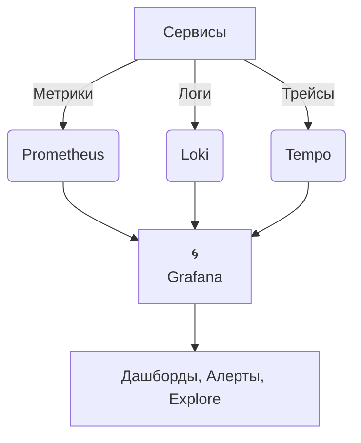

## Grafana: что это и для чего нужно

**Grafana** — это открытая платформа для визуализации, мониторинга и анализа данных с поддержкой множества источников. Её ключевая особенность — гибкие дашборды, позволяющие наглядно отображать метрики из разных систем в едином интерфейсе.

**🌐 Как Grafana работает в архитектуре?**

→ Grafana **агрегирует данные** из разных систем в единый интерфейс.

### Основные возможности

- **Визуализация данных**: графики, гистограммы, тепловые карты, таблицы, индикаторы, геокарты и др.
- **Многоисточниковая интеграция**: подключение к базам данных, мониторинговым системам, облачным сервисам.
- **Интерактивные дашборды**: масштабирование, фильтрация, переходы между панелями.
- **Алерты и уведомления**: настройка триггеров и отправка оповещений (email, Slack, Telegram и др.).
- **Совместная работа**: общие дашборды, роли доступа, аннотации событий.
- **Экспорт и отчётность**: сохранение в PDF, PNG, CSV; планирование отчётов.

### Как работает

1. **Подключение источников данных**
 Через плагины Grafana подключается к системам хранения ([[Prometheus]], InfluxDB, MySQL и др.).

2. **Создание запросов**
 В редакторе задаётся запрос к источнику (на языке PromQL, SQL, InfluxQL и т. п.).

3. **Выбор визуализации**
 Для каждого запроса выбирается тип графика/таблицы и настраиваются параметры отображения.

4. **Сборка дашборда**
 Панели группируются на странице, добавляются фильтры, переменные, аннотации.

5. **Настройка алертинга**
 Задаются условия срабатывания (например, «CPU > 90 % в течение 5 мин») и каналы уведомлений.

6. **Публикация и доступ**
 Дашборд публикуется для команды, настраиваются права доступа.

### Ключевые компоненты интерфейса

- **Дашборды** — страницы с набором панелей.
- **Панели** — отдельные виджеты (график, таблица, индикатор).
- **Переменные** — динамические фильтры (например, выбор сервера или периода).
- **Аннотации** — метки событий на графиках (например, релиз или инцидент).
- **Строка состояния** — индикаторы загрузки, ошибок, времени отклика.
- **Панель поиска** — быстрый доступ к дашбордам и источникам.

### Поддерживаемые источники данных (примеры)

- **Мониторинг**: [[Prometheus]], Graphite, Loki, Zabbix.
- **[[TSDB]]**: InfluxDB, TimescaleDB, VictoriaMetrics.
- **SQL‑БД**: MySQL, PostgreSQL, Microsoft SQL Server.
- **Облака**: AWS CloudWatch, Google Cloud Monitoring, Azure Monitor.
- **Логи**: Elasticsearch, OpenSearch.
- **API**: JSON, REST, GraphQL (через плагин Simple JSON).

### Типичные сценарии использования

1. **Мониторинг инфраструктуры**
 - Графики CPU, памяти, сети, диска.
 - Алерты на перегрузку.

2. **Анализ производительности приложений**
 - Latency, RPS, ошибки.
 - Трассировка запросов (с Jaeger/Zipkin).

3. **Бизнес‑аналитика**
 - Конверсия, активные пользователи, транзакции.
 - Отчёты по KPI.

4. **Безопасность и логи**
 - Визуализация логов (например, число неудачных входов).
 - Детекция аномалий.

5. **IoT и телеметрия**
 - Показания датчиков (температура, влажность).
 - Тренды потребления ресурсов.

### Преимущества

- **Гибкость**: настраиваемые дашборды под любые задачи.
- **Открытость**: бесплатный core‑продукт + экосистема плагинов.
- **Масштабируемость**: поддержка тысяч панелей и источников.
- **Интеграция**: работает с большинством мониторинговых систем.
- **Сообщество**: обширная документация, шаблоны, форумы.

### Ограничения

- Не хранит данные — только визуализирует.
- Для сложных преобразований может потребоваться предварительная агрегация в источнике.
- Настройка алертинга менее мощная, чем в специализированных системах (например, PagerDuty).

### Версии и развёртывание

- **Grafana OSS** — открытая версия (бесплатно).
- **Grafana Enterprise** — платная версия с дополнительными функциями (аудит, расширенный алертинг).
- **Развёртывание**: Docker, Kubernetes, Linux/Windows‑пакеты, облачные сервисы (Grafana Cloud).

### Пример рабочего процесса

1. Подключить Prometheus как источник данных.
2. Создать дашборд «Kubernetes Cluster».
3. Добавить панели:
 - График CPU по нодам.
 - Таблица с pod’ами в состоянии `CrashLoopBackOff`.
 - Индикатор доступности сервисов.
4. Настроить переменную `cluster` для переключения между кластерами.
5. Задать алерты: «CPU > 95 % на 10 мин → Slack».
6. Поделиться дашбордом с командой.

### Итог

Grafana — это **универсальный «фронтенд» для мониторинга и аналитики**, который:
- объединяет данные из разнородных источников;
- превращает сырые метрики в понятные визуализации;
- помогает оперативно реагировать на инциденты через алерты;
- масштабируется от малого проекта до enterprise‑решений.

Её сила — в гибкости и экосистеме плагинов, что делает её стандартом де‑факто для визуализации метрик.

___

