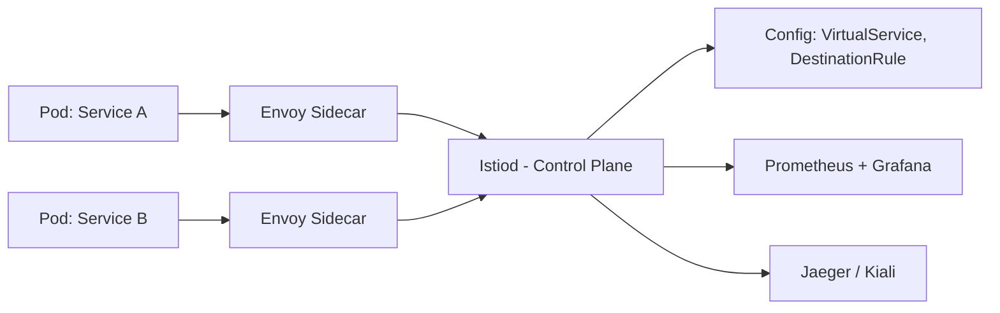
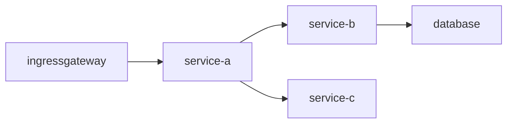

# Istio

Istio — это открытая платформа для подключения, управления и защиты микросервисов. Она обеспечивает многочисленные функции: маршрутизацию трафика, балансировку нагрузки, аутентификацию и авторизацию, мониторинг и трассировку запросов.

У Istio два ключевых компонента:
- **[[Envoy]] Proxy** — это прокси-сервер на основе паттерна [[sidecar]], который размещается рядом с каждым микросервисом. Он отвечает за маршрутизацию трафика, балансировку нагрузки, мониторинг и безопасность. Среди его функций:
    - управление сетевым трафиком между сервисами,
    - отслеживание запросов и ответов,
    - установка политик безопасности и шифрование трафика.
- **Istiod** — это основной сервис управления в архитектуре Istio. Он объединяет функции нескольких ключевых компонентов системы в единое целое. Istiod появился в версии Istio 1.5 и заменил отдельные сервисы, такие как Pilot, Citadel и Galley. Он упрощает установку, управление и эксплуатацию Istio. Среди его функций:
    - **Управление трафиком.** Конфигурирует и управляет прокси-серверами Envoy, обеспечивая маршрутизацию, балансировку нагрузки, и отказоустойчивость для сетевого трафика между микросервисами.
    - **Безопасность.** Управляет безопасностью сетевого взаимодействия, включая выдачу и ротацию сертификатов X.509, обеспечивая шифрование трафика с использованием mTLS (mutual TLS).
    - **Валидация конфигураций.** Проверяет и валидирует конфигурации Istio, гарантируя их корректность и соответствие политикам безопасности и маршрутизации.
    - **Мониторинг и телеметрия.** Обеспечивает сбор метрик и логов для мониторинга состояния системы и диагностики проблем

# Service Mesh vs Istio

**Service Mesh** и **Istio** находятся на **разных уровнях абстракции**. 

| Термин               | Что это?                                                                                                 |
| -------------------- | -------------------------------------------------------------------------------------------------------- |
| **[[Service Mesh]]** | **Архитектурный паттерн** — способ управления микросервисной коммуникацией через сторонний слой (прокси) |
| **[[Istio]]**        | **Конкретная реализация** [[Service Mesh]] для [[software-engineer/технологии/kubernetes/Kubernetes]]                                            |

> 🔑 **Service Mesh — это концепция. Istio — один из самых популярных инструментов для её реализации.**  
> Как **HTTP — это протокол**, а **Nginx — его реализация**.  
> Или: **Pub/Sub — это паттерн**, а **Kafka — его реализация**.


---

## ✅ 2. Что такое **Istio**?

### 🔹 Определение:
> **Istio** — это **открытая платформа Service Mesh**, разработанная Google, IBM и Lyft, специально для **Kubernetes**.  
> Она реализует **паттерн Service Mesh** с помощью **Envoy** (data plane) и собственного **control plane**.

### 📦 Архитектура Istio



#### 🔸 Основные компоненты Istio:
| Компонент                | Роль                                                                                                                                                                                                         |
| ------------------------ | ------------------------------------------------------------------------------------------------------------------------------------------------------------------------------------------------------------ |
| **Envoy**                | [[sidecar]]-прокси (data plane). Отвечает за: <br> • HTTP/gRPC-проксирование <br> • mTLS <br> • Логирование <br> • Retry, timeout, circuit breaker                                                           |
| **Istiod**               | Control Plane. Состоит из: <br> • `Pilot` — генерирует конфигурацию для Envoy <br> • `Citadel` — управление mTLS и сертификатами <br> • `Galley` — валидация конфигураций <br> • `Policy` — политики доступа |
| **Kiali**                | UI для визуализации трафика между сервисами (граф зависимостей)                                                                                                                                              |
| **Prometheus + Grafana** | Метрики (latency, error rate, requests/sec)                                                                                                                                                                  |
| **Jaeger**               | Distributed tracing (трассировка запросов)                                                                                                                                                                   |

### ✅ Пример: [[Canary release]] с Istio

Вы хотите **поэтапно запустить новую версию сервиса** (`v2`) для 5% пользователей.

#### Без Istio:
Нужно писать сложную логику в ingress-шлюзе, менять вес реплик, отслеживать метрики — много ручной работы.

#### С Istio:
Создаёте YAML-файл:

```yaml
# VirtualService
apiVersion: networking.istio.io/v1alpha3
kind: VirtualService
metadata:
  name: reviews
spec:
  hosts:
  - reviews
  http:
  - route:
    - destination:
        host: reviews
        subset: v1
      weight: 95
    - destination:
        host: reviews
        subset: v2
      weight: 5  # Только 5% трафика на v2
---
# DestinationRule
apiVersion: networking.istio.io/v1alpha3
kind: DestinationRule
metadata:
  name: reviews
spec:
  host: reviews
  subsets:
  - name: v1
    labels:
      version: v1
  - name: v2
    labels:
      version: v2
```

→ Istio автоматически:
- Перенаправляет 5% трафика на `reviews:v2`
- Мониторит ошибки
- Если ошибка > 1% → можно откатить одним `kubectl apply`

---

## 🆚 Сравнение: Service Mesh vs Istio

| Критерий | **Service Mesh** | **Istio** |
|----------|------------------|-----------|
| **Тип** | Архитектурный паттерн | Конкретная реализация |
| **Цель** | Управлять микросервисной коммуникацией | Реализовать Service Mesh в Kubernetes |
| **Реализация** | Может быть любой: Istio, Linkerd, Consul, SMR | Одна из реализаций |
| **Прокси** | Может использовать Envoy, HAProxy, Nginx | Использует **Envoy** по умолчанию |
| **Поддержка** | Теоретическая концепция | Полноценная OSS-платформа с документацией, сообществом, поддержкой |
| **Зависимость** | Не требует Kubernetes | Оптимизирована для **Kubernetes** (хотя может работать и на VM) |
| **Функциональность** | Общие принципы: наблюдаемость, безопасность, трафик | Конкретные инструменты: VirtualService, Gateway, PeerAuthentication, etc. |
| **Легкость установки** | Нет — это идея | ✅ Есть Helm-чарты, `istioctl install` — легко запустить |
| **Использование вне Kubernetes** | Возможно | Можно, но не рекомендуется — лучше Consul или Linkerd |
| **Сложность** | Нет — это концепция | Высокая — много CRD, сложная диагностика |

> ⚠️ **Istio — это не Service Mesh. Istio — это *инструмент*, который делает вашу систему Service Mesh.**

---

## 🔄 Другие реализации Service Mesh (в сравнении с Istio)

| Сервис | Преимущества | Минусы | Подходит для |
|--------|--------------|--------|---------------|
| **Istio** | Мощный, богатая функциональность, отличная интеграция с Kubernetes, огромное сообщество | Сложен в освоении, высокий расход ресурсов, много CRD | Enterprise, большие команды, сложные системы |
| **Linkerd** | Очень легковесный, прост в установке, низкие накладные расходы, хороший UX | Меньше возможностей, нет встроенной интеграции с SaaS | Небольшие команды, стремящиеся к простоте |
| **Consul Connect** | Интегрируется с HashiCorp Stack (Vault, Nomad), работает на VM и Kubernetes | Менее мощный, чем Istio, меньше инструментов для трафика | Гибридные среды (VM + K8s) |
| **AWS App Mesh** | Полностью управляемый, интеграция с AWS, нет необходимости управлять control plane | Ограниченная функциональность, только для AWS | Команды, полностью в AWS |

> 💬 **Linkerd — это “Tesla Model 3”**: просто, быстро, эффективно.  
> **Istio — это “BMW X7”**: всё есть, всё можно настроить, но сложнее в управлении.

---

## 🔧 Пример: Как выглядит Service Mesh без Istio?

Возможно ли иметь Service Mesh **без Istio**?

✅ Да! Вот пример:

```plaintext
[Service A] ──[Envoy]──┐
                       ├─> [Envoy] ──> [Service B]
[Service C] ──[Envoy]──┘
```

→ Все прокси настроены **ручными конфигами** (JSON/YAML)  
→ Управление — через **Ansible** или **Custom Controller**  
→ Метрики собираются через **Prometheus + Grafana**  
→ mTLS — через **Cert-Manager + CA**

👉 Это тоже **Service Mesh** — просто **без Istio**.

> Но кто будет поддерживать 100+ Envoy-конфигов?  
> Кто будет делать canary-развертывание?  
> Кто будет видеть граф зависимостей?

→ Именно здесь **Istio** берёт на себя всю эту сложность.

---

## ✅ Когда использовать Service Mesh?

| Сценарий | Рекомендация |
|----------|--------------|
| ✅ У вас **больше 10–20 микросервисов** | → Да, нужен Service Mesh |
| ✅ Вам нужны **canary-развертывания, A/B тесты** | → Istio — лучший выбор |
| ✅ Вам важно **безопасное взаимодействие сервисов** (mTLS) | → Istio или Linkerd |
| ✅ Вы используете **Kubernetes** | → Istio или Linkerd |
| ✅ Вы хотите **наблюдаемость без изменения кода** | → Да, Service Mesh — идеально |
| ✅ Ваша система — маленькая MVP (< 5 сервисов) | → ❌ Не нужен — усложняете |
| ✅ Вы работаете в **облаке AWS** | → Рассмотрите **AWS App Mesh** |
| ✅ Вам нужна **максимальная простота** | → **Linkerd** вместо Istio |

---

## 🛠️ Как проверить, что Istio работает?

После установки:

```bash
# Проверьте компоненты
kubectl get pods -n istio-system

# Проверьте sidecar-прокси в вашем поде
kubectl get pods
kubectl describe pod <your-pod> -n <namespace> | grep -A 5 "Containers"

# Посмотрите граф трафика
kubectl port-forward -n istio-system svc/kiali 20001:20001
# Откройте http://localhost:20001
```

В Kiali вы увидите красивый граф:



→ Это **реальная карта ваших сервисов**, с метриками, ошибками, задержками — **без единой строки кода**.

---

## 💬 Финальный вывод: Чем отличаются?

| Вопрос | Ответ |
|--------|-------|
| **Что такое Service Mesh?** | Архитектурный стиль, где **все сетевые функции вынесены в отдельный слой** (sidecar-прокси) |
| **Что такое Istio?** | **Одна из реализаций** Service Mesh — самый популярный open-source инструмент для Kubernetes |
| **Можно ли иметь Service Mesh без Istio?** | ✅ Да — через Linkerd, Consul, Envoy вручную, AWS App Mesh |
| **Можно ли иметь Istio без Service Mesh?** | ❌ Нет — Istio **является** Service Mesh |
| **Нужен ли мне Istio?** | Если вы в Kubernetes, у вас >10 сервисов, и вы хотите **управление трафиком, безопасность и наблюдаемость без кода** — **да, вам нужен Istio (или Linkerd)** |

---

## 📌 Запомните это правило:

> **Service Mesh — это то, что вы хотите.**  
> **Istio — это то, как вы это получаете.**

> 💡 **Если вы строите современную микросервисную систему на Kubernetes — Service Mesh (особенно Istio) — это не опция. Это стандарт.**

---

## 📚 Где учиться дальше?

- [Istio Official Docs](https://istio.io/latest/docs/)
- [Service Mesh Patterns — CNCF](https://github.com/cncf/servicemesh)
- Book: **“The Istio Service Mesh” by Andrew Block**
- YouTube: *“Istio Explained in 10 Minutes”* — канал *TechWorld with Nana*
- Lab: [Istio Hands-on Lab on Katacoda](https://www.katacoda.com/courses/istio)

---

💡 **Service Mesh — это когда ваши сервисы больше не «знают», как общаться. Они просто говорят: “Я отправил запрос”. А прокси решает, как его доставить.**  
**Istio — это тот самый прокси, который делает это идеально.**

---
[[service-discovery]]