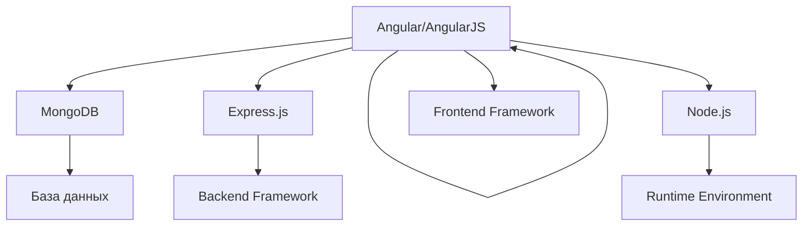
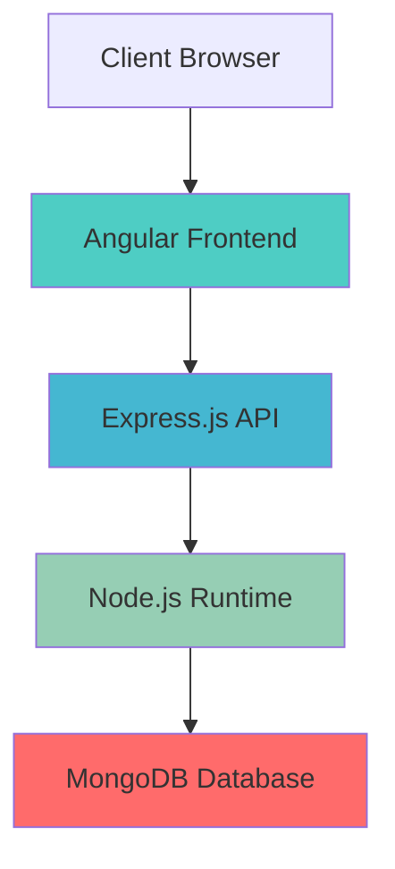

---
aliases:
  - MEAN
  - MERN
  - MEVN
---
**MEAN** в контексте хранения данных — это не статистическое "среднее значение", а **стек технологий** для веб-разработки. Давайте разберем подробно.

## Что такое MEAN стек



## Детальное объяснение компонентов

### 1. **M - MongoDB**
```javascript
// Документо-ориентированная NoSQL база данных
{
  "_id": "507f1f77bcf86cd799439011",
  "name": "John Doe",
  "email": "john@example.com",
  "orders": [
    {
      "orderId": "ORD123",
      "amount": 99.99,
      "products": ["product1", "product2"]
    }
  ]
}
```

**Характеристики MongoDB:**
- ✅ **JSON-подобные документы** - естественное представление данных
- ✅ **Горизонтальное масштабирование** - шардирование
- ✅ **Гибкая схема** - не требует предопределенной структуры
- ✅ **Агрегации** - сложные операции обработки данных

### 2. **E - Express.js**
```javascript
// Минималистичный веб-фреймворк для Node.js
const express = require('express');
const app = express();

// REST API endpoints
app.get('/api/users', (req, res) => {
    User.find().then(users => res.json(users));
});

app.post('/api/users', (req, res) => {
    const user = new User(req.body);
    user.save().then(() => res.status(201).json(user));
});

app.listen(3000);
```

### 3. **A - Angular/AngularJS**
```typescript
// Современный фронтенд-фреймворк
@Component({
  selector: 'app-user-list',
  template: `
    <div *ngFor="let user of users">
      {{ user.name }} - {{ user.email }}
    </div>
  `
})
export class UserListComponent {
  users: User[] = [];
  
  constructor(private userService: UserService) {}
  
  ngOnInit() {
    this.userService.getUsers().subscribe(users => {
      this.users = users;
    });
  }
}
```

### 4. **N - Node.js**
```javascript
// JavaScript runtime на движке V8
const http = require('http');
const mongoose = require('mongoose');

// Подключение к MongoDB
mongoose.connect('mongodb://localhost:27017/myapp');

// Асинхронная обработка запросов
const server = http.createServer(async (req, res) => {
    const users = await User.find();
    res.end(JSON.stringify(users));
});

server.listen(3000);
```

## Архитектура MEAN приложения



## Преимущества MEAN стека

### 🚀 **Единый язык программирования:**
```javascript
// Full-stack JavaScript
// Frontend: TypeScript/JavaScript (Angular)
// Backend: JavaScript (Node.js, Express.js)
// Database: BSON/JSON (MongoDB)
```

### 📊 **Эффективная работа с данными:**
```javascript
// От клиента до базы данных - везде JSON
// Frontend -> JSON -> Backend -> JSON -> Database
```

### 🔧 **Быстрая разработка:**
```bash
# Один язык - меньше контекстных переключений
# Большое количество готовых пакетов npm
# Гибкая схема данных - легко вносить изменения
```

## Практический пример MEAN приложения

### Структура проекта:
```
my-mean-app/
├── client/                 # Angular frontend
│   ├── src/
│   ├── package.json
│   └── angular.json
├── server/                 # Node.js backend
│   ├── models/            # MongoDB модели
│   ├── routes/            # Express.js маршруты
│   ├── app.js
│   └── package.json
└── database/              # MongoDB
    └── mongod.conf
```

### Модель данных (MongoDB + Mongoose):
```javascript
// server/models/User.js
const mongoose = require('mongoose');

const userSchema = new mongoose.Schema({
    name: { type: String, required: true },
    email: { type: String, required: true, unique: true },
    profile: {
        age: Number,
        location: String,
        interests: [String]
    },
    createdAt: { type: Date, default: Date.now }
});

module.exports = mongoose.model('User', userSchema);
```

### API endpoint (Express.js + Node.js):
```javascript
// server/routes/users.js
const express = require('express');
const router = express.Router();
const User = require('../models/User');

// GET /api/users - получить всех пользователей
router.get('/', async (req, res) => {
    try {
        const users = await User.find();
        res.json(users);
    } catch (error) {
        res.status(500).json({ message: error.message });
    }
});

// POST /api/users - создать пользователя
router.post('/', async (req, res) => {
    const user = new User({
        name: req.body.name,
        email: req.body.email,
        profile: req.body.profile
    });
    
    try {
        const newUser = await user.save();
        res.status(201).json(newUser);
    } catch (error) {
        res.status(400).json({ message: error.message });
    }
});

module.exports = router;
```

### Angular сервис для работы с API:
```typescript
// client/src/app/user.service.ts
import { Injectable } from '@angular/core';
import { HttpClient } from '@angular/common/http';
import { Observable } from 'rxjs';

export interface User {
    _id?: string;
    name: string;
    email: string;
    profile?: {
        age?: number;
        location?: string;
        interests?: string[];
    };
}

@Injectable({
    providedIn: 'root'
})
export class UserService {
    private apiUrl = 'http://localhost:3000/api/users';
    
    constructor(private http: HttpClient) {}
    
    getUsers(): Observable<User[]> {
        return this.http.get<User[]>(this.apiUrl);
    }
    
    createUser(user: User): Observable<User> {
        return this.http.post<User>(this.apiUrl, user);
    }
}
```

## Варианты MEAN стека

### MERN (React вместо Angular):
```javascript
// React компонент вместо Angular
import React, { useState, useEffect } from 'react';
import axios from 'axios';

function UserList() {
    const [users, setUsers] = useState([]);
    
    useEffect(() => {
        axios.get('/api/users')
            .then(response => setUsers(response.data));
    }, []);
    
    return (
        <div>
            {users.map(user => (
                <div key={user._id}>
                    {user.name} - {user.email}
                </div>
            ))}
        </div>
    );
}
```

### MEVN (Vue.js вместо Angular):
```javascript
// Vue.js компонент
export default {
    data() {
        return {
            users: []
        }
    },
    async created() {
        const response = await fetch('/api/users');
        this.users = await response.json();
    }
}
```

## Сравнение с другими стеками

| Аспект | MEAN | LAMP | MERN |
|--------|------|------|------|
| **Язык** | JavaScript | PHP | JavaScript |
| **База данных** | MongoDB | MySQL | MongoDB |
| **Frontend** | Angular | - | React |
| **Производительность** | Высокая | Средняя | Высокая |
| **Кривая обучения** | Средняя | Низкая | Средняя |

## Когда использовать MEAN

### ✅ **Идеальные сценарии:**
- **Single Page Applications (SPA)**
- **Приложения реального времени** (чаты, уведомления)
- **Проекты с часто меняющимися требованиями**
- **Команды с экспертизой в JavaScript**

### ❌ **Когда лучше другие решения:**
- **Высоконагруженные транзакционные системы** (лучше SQL)
- **Строгая схема данных** (лучше реляционные БД)
- **Команды без JavaScript экспертизы**

## Итог

**MEAN в контексте хранения данных — это:**
- 🗄️ **MongoDB** - документо-ориентированная NoSQL база данных
- 🌐 **Express.js** - веб-фреймворк для построения API
- ⚡ **Angular** - фронтенд-фреймворк для SPA
- 🚀 **Node.js** - серверная платформа

**Ключевые преимущества для данных:**
- ✅ **Единый формат** JSON от клиента до БД
- ✅ **Гибкая схема** - легко изменять структуру данных
- ✅ **Горизонтальное масштабирование** через шардирование MongoDB
- ✅ **Быстрая разработка** благодаря единому языку

MEAN стек отлично подходит для современных веб-приложений, где важны гибкость данных и скорость разработки!