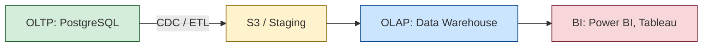

---
aliases:
  - OLTP
  - OLAP**
---
**OLTP vs OLAP** — это **два противоположных типа систем управления базами данных**, которые решают разные задачи:

|     | **OLTP**                          | **OLAP**                         |
| --- | --------------------------------- | -------------------------------- |
|     | **OnLine Transaction Processing** | **OnLine Analytical Processing** |

---

## ✅ 1. Что такое **OLTP**?

> **OLTP (Online Transaction Processing)** — это **операционная система**, где происходят **ежедневные бизнес-транзакции**: покупки, переводы, заказы.

### 🔹 Характеристики:
| Признак | Описание |
|--------|----------|
| **Тип операций** | Много коротких: `INSERT`, `UPDATE`, `DELETE` |
| **Количество строк за запрос** | 1–10 (например, `UPDATE users SET balance = ... WHERE id = 123`) |
| **Частота запросов** | Очень высокая (1000+ в секунду) |
| **Цель** | Поддержка бизнес-процессов в реальном времени |
| **Примеры** | Банковские системы, интернет-магазины, CRM |
| **Базы данных** | PostgreSQL, MySQL, SQL Server, Oracle |
| **Схема** | Нормализованная (3NF) → минимум дублей |
| **Индексация** | По ID, внешним ключам |
| **Масштабирование** | Вертикальное (мощнее сервер) или шардинг |

---

### 💡 Пример OLTP-запроса:
```sql
UPDATE accounts 
SET balance = balance - 100 
WHERE user_id = 'Alice' AND currency = 'USD';
```

→ Быстрый, точечный, часто повторяется

---

## ✅ 2. Что такое **OLAP**?

> **OLAP (Online Analytical Processing)** — это **аналитическая система**, где выполняются **сложные запросы по историческим данным**.

### 🔹 Характеристики:
| Признак | Описание |
|--------|----------|
| **Тип операций** | Редкие, но сложные: `SELECT`, `JOIN`, `GROUP BY`, `SUM`, `COUNT` |
| **Количество строк** | Миллионы/миллиарды |
| **Задержка** | Высокая (секунды, минуты)
| **Цель** | Анализ, BI, ML, принятие решений |
| **Примеры** | Отчёт о продажах за квартал, прогноз спроса |
| **Системы** | Snowflake, BigQuery, Redshift, ClickHouse |
| **Схема** | Денормализованная (звезда, снежинка) |
| **Хранение** | Columnar storage (не row-based!) |
| **Обновления** | Пачками (ETL), не в реальном времени |

---

### 💡 Пример OLAP-запроса:
```sql
SELECT 
    region,
    SUM(revenue),
    AVG(order_value)
FROM sales 
WHERE year = 2024 AND product_category = 'Electronics'
GROUP BY region
ORDER BY revenue DESC;
```

→ Затрагивает миллионы строк → медленный → нужен для анализа

---

## 🆚 Сравнение: OLTP vs OLAP

| Критерий                    | **OLTP**                 | **OLAP**                            |
| --------------------------- | ------------------------ | ----------------------------------- |
| **Назначение**              | Транзакции, операции     | Анализ, отчёты                      |
| **Пользователи**            | Кассир, клиент, API      | Аналитик, CEO, Data Scientist       |
| **Частота запросов**        | Очень высокая            | Низкая / умеренная                  |
| **Типичная задержка**       | < 100 мс                 | > 1 сек (до минут)                  |
| **Размер данных на запрос** | 1–10 строк               | 1M+ строк                           |
| **Структура БД**            | Нормализованная          | Денормализованная                   |
| **Сложность запроса**       | Простой (`WHERE id = ?`) | Сложный (`JOIN`, `ROLLUP`, `PIVOT`) |
| **Время обновления**        | Реальное время           | Batch (каждые 5 мин, час, день)     |
| **Типичная нагрузка**       | Write-heavy              | Read-heavy                          |
| **Пример использования**    | «Оплатить заказ»         | «Какие товары продаются лучше?»     |

---

## ✅ Как они связаны?



### 🔧 Процесс:
1. **OLTP** — принимает каждый заказ
2. **CDC (Change Data Capture)** — вычитывает изменения (Kafka, Debezium)
3. Данные попадают в **S3** или **Staging**
4. **ETL/ELT** — чистка, агрегация
5. Загрузка в **OLAP (DWH)** — например, Snowflake
6. **Аналитик** строит отчёт

---

## ✅ Современный подход: ELT вместо ETL

| Этап | Описание |
|------|----------|
| **Extract** | Из OLTP в S3 |
| **Load** | В DWH (Snowflake, BigQuery) |
| **Transform** | Через SQL в самом DWH |

> ✅ Преимущество: гибкость, масштабируемость

---

## ✅ Где используется?

| Система             | OLTP или OLAP?                      |
| ------------------- | ----------------------------------- |
| **PostgreSQL**      | ✅ OLTP                              |
| **MySQL**           | ✅ OLTP                              |
| **MongoDB**         | ✅ OLTP (частично)                   |
| **Snowflake**       | ✅ OLAP                              |
| **Google BigQuery** | ✅ OLAP                              |
| **Amazon Redshift** | ✅ OLAP                              |
| **ClickHouse**      | ✅ OLAP (очень быстрый)              |
| **Oracle RAC**      | ✅ OLTP                              |
| **Apache Druid**    | ✅ OLAP + real-time                  |
| **Apache Kafka**    | ✅ Источник данных между OLTP → OLAP |

---

## ❌ Почему нельзя использовать одну БД для всего?

| Проблема | Объяснение |
|----------|------------|
| ❌ **Медленные отчёты блокируют транзакции** | Аналитический запрос грузит CPU → пользователи не могут оплатить |
| ❌ **Разные схемы** | OLTP — нормализованная, OLAP — денормализованная (звезда) |
| ❌ **Разные индексы** | OLTP: по ID<br>OLAP: по дате, категории |
| ❌ **Разные SLA** | OLTP: p95 ≤ 100ms<br>OLAP: p95 ≤ 10s — нормально |

> ✅ Поэтому **разделяют**:
> - **OLTP** — для бизнеса
> - **OLAP** — для аналитики

---

## ✅ Финальный вывод

| OLTP | OLAP |
|------|-------|
| ✅ **"Что происходит?"** | ✅ **"Почему это произошло?"** |
| ✅ **Сейчас** | ✅ **Прошлое** |
| ✅ **Операции** | ✅ **Анализ** |
| ✅ **1000+ TPS** | ✅ **1–10 запросов/мин** |
| ✅ **Row-oriented** | ✅ **Column-oriented** |
| ✅ **ACID** | ✅ **Eventual Consistency / Bulk Load** |

> 💬 _“OLTP answers ‘what’. OLAP answers ‘why’.”_

---

## 💡 Цитата от Google:

> _“You can’t run analytics on a transactional database. You’ll kill it."_  
> — Google Cloud Architecture

---

## ✅ Когда что использовать?

| Ваша цель | Используйте |
|----------|-------------|
| ✅ Пользователь оформляет заказ | ➤ **OLTP** |
| ✅ Вы хотите понять, какие товары продаются лучше | ➤ **OLAP** |
| ✅ Нужна надёжность и скорость | ➤ **OLTP** |
| ✅ Прогноз спроса, KPI, ROI | ➤ **OLAP** |
| ✅ Реальное время | ➤ **OLTP + CDC → OLAP** |

---

## 📚 Где учиться дальше?

- Book: *“Designing Data-Intensive Applications”* — Martin Kleppmann
- [Snowflake Docs](https://docs.snowflake.com/)
- [AWS Redshift](https://aws.amazon.com/redshift/)
- YouTube: *“OLTP vs OLAP Explained”* — TechWorld with Nana

---

✅ **OLTP и OLAP — не конкуренты. Это команда.**  
Они работают вместе, чтобы ваш бизнес был **и живым, и умным**.

> 💡 **OLTP делает деньги. OLAP показывает, как их делать больше.**

---

📌 **Готово!**  
Теперь вы можете объяснить любой команде, **почему нельзя писать отчёты прямо в production-БД**.