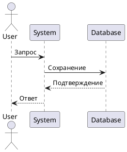
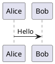
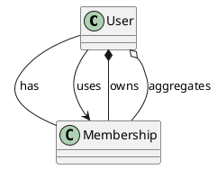

---
aliases:
  - PlantUML
  - puml
---
# PlantUML

**PlantUML** — это инструмент для создания диаграмм и визуализаций на основе текстового описания. Вместо рисования мышью вы пишете код, который автоматически преобразуется в диаграммы.

Поддерживаемые диаграммы: https://plantuml.com/

**Что такое PlantUML?**
Это **язык описания диаграмм** и одновременно **инструмент для их генерации**. Вы описываете диаграмму в текстовом формате, а PlantUML превращает это в графическое изображение.

**Пример кода:**


**Результат:** генерация диаграммы последовательности.



**Типы связей**



**Документация как код**
используется подход «Документация как код». Он подразумевает, что изменения в коде и документации происходят синхронно.

Рассмотрим как использовать инструменты PlantUML и MkDocs для создания и поддержания документации, которая всегда будет актуальной и синхронизированной с вашим проектом.

>[!tip] в Obsidian требуется плагин PlantUML

Пример в дерве 
```
FitLife/
├── .gitignore
├── README.md
├── docs/
│   └── ...
├── diagrams/
│   ├── context/
│   │   └── FitLife_Context.puml
│   ├── container/
│   │   └── FitLife_Container.puml
│   ├── component/
│   │   └── FitLife_Component_WebApp.puml
│   └── code/
│       └── FitLife_Code_Membership.puml
└── src/
    ├── main/
    │   └── ...
    └── test/
        └── ... 
```

___

# Как пользоваться

1. найди утилиту puml
2. создай файл разметки диаграммы `myDiagram.puml`
3. выполни команду `puml myDiagram.puml` – получишь в этой же папке `myDiagram.png`