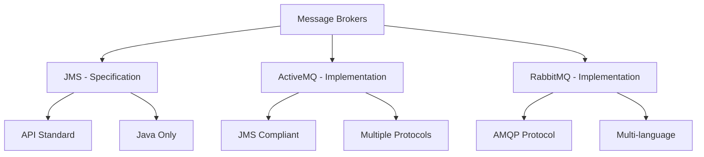
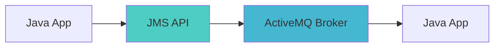
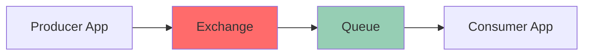
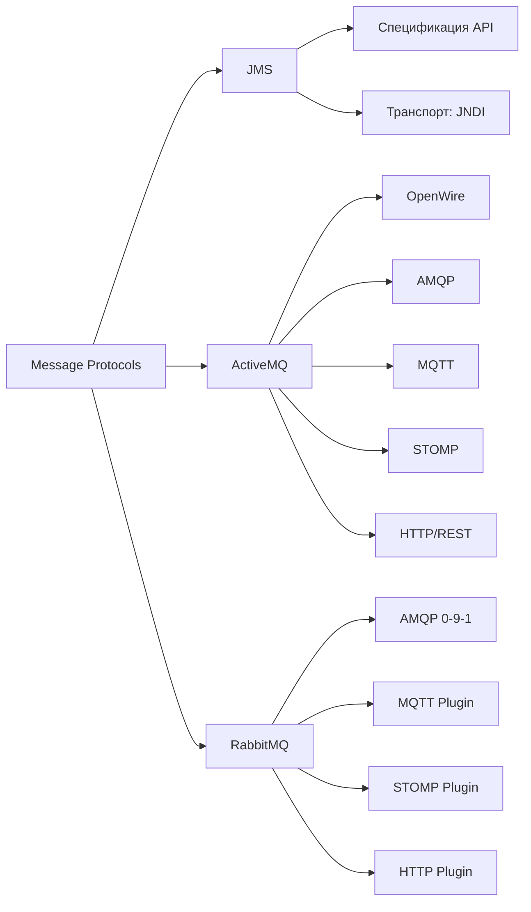

---
aliases:
  - ActiveMQ
  - RabbitMQ
  - JMS
---
## ActiveMQ vs RabbitMQ vs JMS


Отличный вопрос! Давайте разберем различия между ActiveMQ, RabbitMQ и JMS.

## Основные концепции



## 1. **JMS (Java Message Service)**

### Что это:
**JMS - это API стандарт**, а не конкретная реализация.

```java
// JMS API пример
public class JmsExample {
    public void sendMessage() throws JMSException {
        // 1. Создаем ConnectionFactory
        ConnectionFactory factory = new ActiveMQConnectionFactory("tcp://localhost:61616");
        
        // 2. Создаем Connection
        Connection connection = factory.createConnection();
        connection.start();
        
        // 3. Создаем Session
        Session session = connection.createSession(false, Session.AUTO_ACKNOWLEDGE);
        
        // 4. Создаем Destination (Queue или Topic)
        Destination destination = session.createQueue("MY_QUEUE");
        
        // 5. Создаем Producer
        MessageProducer producer = session.createProducer(destination);
        
        // 6. Создаем и отправляем сообщение
        TextMessage message = session.createTextMessage("Hello JMS!");
        producer.send(message);
        
        // 7. Закрываем ресурсы
        connection.close();
    }
}
```

### Характеристики JMS:
- ✅ **Стандарт API** - интерфейсы, а не реализация
- ✅ **Только для Java** 
- ✅ **Две модели messaging**: Point-to-Point (Queues) и Pub/Sub (Topics)
- ✅ **Поддержка транзакций**
- ✅ **Поддержка acknowledge modes**

## 2. **ActiveMQ**

### Что это:
**ActiveMQ - это JMS-совместимый message broker**, реализующий JMS спецификацию.

```java
// ActiveMQ с Spring JMS
@Component
public class ActiveMQProducer {
    
    @Autowired
    private JmsTemplate jmsTemplate;
    
    public void sendOrder(Order order) {
        jmsTemplate.convertAndSend("ORDER_QUEUE", order);
    }
}

@Component
public class ActiveMQConsumer {
    
    @JmsListener(destination = "ORDER_QUEUE")
    public void processOrder(Order order) {
        // Обработка заказа
        System.out.println("Processing order: " + order.getId());
    }
}
```

### Характеристики ActiveMQ:
- ✅ **Полная JMS 1.1 и 2.0 поддержка**
- ✅ **Множество протоколов**: OpenWire, [[AMQP]], MQTT, STOMP, WS
- ✅ **Поддержка кластеризации**
- ✅ **Persistence**: KahaDB, JDBC
- ✅ **Интеграция с Spring**
- ✅ **Мониторинг через JMX и Web Console**

## 3. **RabbitMQ**

### Что это:
**RabbitMQ - это message broker на основе [[AMQP]] протокола**, не связанный с JMS.

```java
// RabbitMQ с Spring AMQP
@Configuration
public class RabbitMQConfig {
    
    @Bean
    public Queue orderQueue() {
        return new Queue("ORDER_QUEUE", true); // durable queue
    }
    
    @Bean
    public DirectExchange exchange() {
        return new DirectExchange("ORDER_EXCHANGE");
    }
    
    @Bean
    public Binding binding(Queue orderQueue, DirectExchange exchange) {
        return BindingBuilder.bind(orderQueue)
               .to(exchange)
               .with("order.routing.key");
    }
}

@Component
public class RabbitMQProducer {
    
    @Autowired
    private AmqpTemplate amqpTemplate;
    
    public void sendOrder(Order order) {
        amqpTemplate.convertAndSend("ORDER_EXCHANGE", "order.routing.key", order);
    }
}

@Component
public class RabbitMQConsumer {
    
    @RabbitListener(queues = "ORDER_QUEUE")
    public void processOrder(Order order) {
        System.out.println("Processing order: " + order.getId());
    }
}
```

### Характеристики RabbitMQ:
- ✅ **AMQP 0-9-1 протокол**
- ✅ **Мультиязычность** (Java, Python, .NET, Go, etc.)
- ✅ **Гибкая маршрутизация** через Exchanges
- ✅ **Высокая производительность**
- ✅ **Кластеризация и HA**
- ✅ **Plugin система**

## Сравнительная таблица

| Характеристика | **JMS** | **ActiveMQ** | **RabbitMQ** |
|----------------|---------|--------------|--------------|
| **Тип** | API Спецификация | Message Broker | Message Broker |
| **Протокол** | - | Multiple (OpenWire, AMQP, MQTT) | AMQP |
| **Язык** | Java Only | Java + Multi-protocol | Multi-language |
| **Модели** | Queue, Topic | Queue, Topic | Exchange + Queue |
| **Производительность** | - | Хорошая | **Очень высокая** |
| **Кластеризация** | - | Хорошая | **Отличная** |
| **Управление** | - | Web Console, JMX | **Web UI, CLI** |
| **Популярность** | Стандарт в Java | Высокая в Java | **Очень высокая** |

## Архитектурные различия

### JMS + ActiveMQ архитектура:


### RabbitMQ архитектура:


## Детальное сравнение

### 1. **Протоколы и совместимость**

#### ActiveMQ:
```yaml
Supported Protocols:
  - OpenWire (native)
  - AMQP 1.0
  - MQTT
  - STOMP  
  - WebSockets
  - REST

Interoperability: ✅ Хорошая
```

#### RabbitMQ:
```yaml
Primary Protocol: AMQP 0-9-1
Additional Protocols:
  - MQTT (via plugin)
  - STOMP (via plugin)
  - HTTP (via plugin)

Interoperability: ✅ Отличная
```

### 2. **Модели сообщений**

#### JMS/ActiveMQ:
```java
// Point-to-Point (Queue)
Queue queue = session.createQueue("ORDER_QUEUE");

// Pub/Sub (Topic)
Topic topic = session.createTopic("PRICE_UPDATES");

// Временные очереди
TemporaryQueue tempQueue = session.createTemporaryQueue();
```

#### RabbitMQ:
```java
// Exchange types:
// - Direct: routing key точное совпадение
// - Topic: routing key pattern matching  
// - Fanout: broadcast всем очередям
// - Headers: по заголовкам сообщений

@Bean
public TopicExchange topicExchange() {
    return new TopicExchange("topic.exchange");
}
```

### 3. **Производительность**

#### Тестовые показатели:
```yaml
ActiveMQ:
  - Сообщений в секунду: 10,000 - 50,000
  - Задержка: 1-10ms
  - Потребление памяти: Среднее

RabbitMQ:
  - Сообщений в секунду: 50,000 - 100,000+
  - Задержка: 0.1-5ms  
  - Потребление памяти: Низкое
```

### 4. **Надежность и Persistence**

#### ActiveMQ Persistence:
```java
// Конфигурация KahaDB (по умолчанию)
<persistenceAdapter>
    <kahaDB directory="${activemq.data}/kahadb"/>
</persistenceAdapter>

// Или JDBC persistence
<persistenceAdapter>
    <jdbcPersistenceAdapter dataSource="#mysql-ds"/>
</persistenceAdapter>
```

#### RabbitMQ Persistence:
```yaml
Persistence Options:
  - Transient: в памяти
  - Durable: на диск
  - Lazy Queues: отложенная запись

HA Strategies:
  - Mirroring queues
  - Clustering
  - Federation
```

## Практические примеры использования

### Когда выбирать ActiveMQ:
```java
// Сценарий: Унаследованные Java приложения
@JmsListener(destination = "LEGACY_QUEUE")
public void processLegacyMessage(Message message) {
    // Интеграция с существующими JMS системами
    // Требуется поддержка multiple protocols
    // Java-центричная экосистема
}
```

### Когда выбирать RabbitMQ:
```java
// Сценарий: Микросервисная архитектура
@RabbitListener(queues = "payment.queue")
public void processPayment(Payment payment) {
    // Мультиязычные микросервисы
    // Сложная маршрутизация
    // Высокие требования к производительности
}
```

## Конфигурационные примеры

### ActiveMQ Spring конфигурация:
```java
@Configuration
@EnableJms
public class ActiveMQConfig {
    
    @Bean
    public ConnectionFactory connectionFactory() {
        return new ActiveMQConnectionFactory("tcp://localhost:61616");
    }
    
    @Bean
    public JmsTemplate jmsTemplate() {
        return new JmsTemplate(connectionFactory());
    }
}
```

### RabbitMQ Spring конфигурация:
```java
@Configuration
@EnableRabbit
public class RabbitMQConfig {
    
    @Bean
    public ConnectionFactory connectionFactory() {
        CachingConnectionFactory factory = new CachingConnectionFactory();
        factory.setHost("localhost");
        factory.setUsername("guest");
        factory.setPassword("guest");
        return factory;
    }
    
    @Bean
    public RabbitTemplate rabbitTemplate() {
        return new RabbitTemplate(connectionFactory());
    }
}
```

## Мониторинг и управление

### ActiveMQ Web Console:
```bash
# Доступно по: http://localhost:8161/admin
# Возможности:
# - Просмотр очередей и топиков
# - Мониторинг сообщений
# - Управление подключениями
# - Статистика производительности
```

### RabbitMQ Management UI:
```bash
# Доступно по: http://localhost:15672
# Возможности:
# - Управление очередями и exchanges
# - Мониторинг сообщений
# - Управление пользователями
# - Просмотр статистики
# - Plugin management
```

## Рекомендации по выбору

### ✅ **Выбирайте JMS/ActiveMQ если:**
- Работаете в чисто Java экосистеме
- Нужна поддержка multiple protocols
- Интегрируетесь с существующими JMS системами
- Используете Enterprise Java приложения

### ✅ **Выбирайте RabbitMQ если:**
- Строите микросервисную архитектуру
- Нужна мультиязычная поддержка
- Требуется высокая производительность
- Нужна гибкая маршрутизация сообщений
- Работаете в cloud-native окружении

### 🔄 **Гибридный подход:**
```yaml
# Использование обоих решений
Legacy Systems: ActiveMQ + JMS
New Microservices: RabbitMQ + AMQP
API Gateway: Преобразование между протоколами
```

## Итог

- **JMS** - это стандарт API для Java messaging
- **ActiveMQ** - JMS-совместимый брокер с поддержкой multiple protocols  
- **RabbitMQ** - высокопроизводительный AMQP брокер для мультиязычных сред

**Ключевой выбор зависит от:** требований к производительности, используемых языков программирования, существующей инфраструктуры и необходимости интероперабельности.

Отличный вопрос! Давайте детально сравним протоколы передачи данных и форматы сообщений для ActiveMQ, RabbitMQ и JMS.

## Сравнительная таблица протоколов и форматов



## Детальное сравнение

### 1. **JMS (Java Message Service)**

#### Поддерживаемые протоколы передачи:
```java
// JMS - это API, а не протокол. Использует различные транспорты:
ConnectionFactory factory = new ActiveMQConnectionFactory("tcp://localhost:61616");        // TCP
ConnectionFactory factory = new ActiveMQConnectionFactory("ssl://localhost:61617");       // SSL
ConnectionFactory factory = new ActiveMQConnectionFactory("vm://localhost");              // VM Transport
ConnectionFactory factory = new ActiveMQConnectionFactory("http://localhost:8080");       // HTTP
```

#### Форматы сообщений JMS:
```java
// 1. TextMessage - текстовые сообщения
TextMessage textMsg = session.createTextMessage();
textMsg.setText("Hello World");
producer.send(textMsg);

// 2. BytesMessage - бинарные данные
BytesMessage bytesMsg = session.createBytesMessage();
bytesMsg.writeUTF("String data");
bytesMsg.writeInt(123);
bytesMsg.writeBytes(fileData);

// 3. MapMessage - key-value пары
MapMessage mapMsg = session.createMapMessage();
mapMsg.setString("name", "John");
mapMsg.setInt("age", 30);

// 4. ObjectMessage - сериализованные Java объекты
ObjectMessage objMsg = session.createObjectMessage();
objMsg.setObject(new User("John", "john@email.com"));

// 5. StreamMessage - поток данных
StreamMessage streamMsg = session.createStreamMessage();
streamMsg.writeString("text");
streamMsg.writeInt(123);

// 6. Message (без тела) - только заголовки и свойства
Message msg = session.createMessage();
msg.setStringProperty("type", "ALERT");
```

### 2. **ActiveMQ**

#### Поддерживаемые протоколы:

##### **OpenWire (Native)**
```yaml
Протокол: OpenWire (бинарный, оптимизированный для ActiveMQ)
Порт: 61616
Особенности:
  - Высокая производительность
  - Поддержка всех JMS функций
  - Нативный для ActiveMQ
Использование:
  activemq://localhost:61616
```

##### **AMQP 1.0**
```yaml
Протокол: AMQP 1.0 (Advanced Message Queuing Protocol)
Порт: 5672
Особенности:
  - Стандартизированный протокол
  - Межъязыковая совместимость
  - Поддержка транзакций
Клиенты:
  - Qpid JMS
  - .NET, Python, C++ AMQP клиенты
```

##### **MQTT**
```yaml
Протокол: MQTT (Message Queuing Telemetry Transport)
Порт: 1883 (TCP), 8883 (SSL)
Особенности:
  - Легковесный для IoT
  - Publish/Subscribe модель
  - Quality of Service уровни
Использование:
  - IoT устройства
  - Мобильные приложения
  - Real-time уведомления
```

##### **STOMP**
```yaml
Протокол: STOMP (Simple Text Oriented Messaging Protocol)
Порт: 61613
Особенности:
  - Текстовый протокол (HTTP-like)
  - Простая реализация клиентов
  - Поддержка разных языков
Команды:
  CONNECT, SEND, SUBSCRIBE, UNSUBSCRIBE
```

##### **HTTP/REST**
```yaml
Протокол: HTTP/REST
Порт: 8161
Особенности:
  - REST API для отправки/получения сообщений
  - Легкая интеграция с веб-сервисами
  - Поддержка CORS
Методы:
  POST /api/message - отправить сообщение
  GET /api/message - получить сообщение
```

#### Форматы сообщений в ActiveMQ:
```java
// Поддерживает все JMS форматы плюс:
// 1. JSON через TextMessage
TextMessage jsonMsg = session.createTextMessage();
jsonMsg.setText("{\"name\":\"John\", \"age\":30}");

// 2. XML через TextMessage  
TextMessage xmlMsg = session.createTextMessage();
xmlMsg.setText("<user><name>John</name><age>30</age></user>");

// 3. Protocol Buffers/Avro через BytesMessage
BytesMessage protoMsg = session.createBytesMessage();
protoMsg.writeBytes(protobufData);
```

### 3. **RabbitMQ**

#### Основной протокол:

##### **AMQP 0-9-1**
```yaml
Протокол: AMQP 0-9-1
Порт: 5672 (TCP), 5671 (SSL)
Особенности модели:
  - Exchanges (типы: direct, topic, fanout, headers)
  - Queues (durable, transient, exclusive)
  - Bindings (маршрутизация)
  - Channels (виртуальные соединения)
Качество обслуживания:
  - Basic.Qos (prefetch count)
  - Acknowledge modes
  - Publisher confirms
```

#### Plugin-протоколы:

##### **MQTT Plugin**
```bash
# Активация плагина
rabbitmq-plugins enable rabbitmq_mqtt

# Порт: 1883
# Особенности:
#   - Полная поддержка MQTT 3.1/3.1.1
#   - Mapping MQTT topics to AMQP exchanges
```

##### **STOMP Plugin**
```bash
# Активация плагина  
rabbitmq-plugins enable rabbitmq_stomp

# Порт: 61613
# Особенности:
#   - STOMP 1.0/1.1/1.2
#   - Поддержка receipts и transactions
```

##### **HTTP API Plugin**
```bash
# Management plugin (включает HTTP API)
rabbitmq-plugins enable rabbitmq_management

# Порт: 15672
# REST API для:
#   - Управления очередями, exchanges, bindings
#   - Мониторинга
#   - Отправки/получения сообщений
```

#### Форматы сообщений в RabbitMQ:
```java
// RabbitMQ работает с бинарными payload, формат определяется приложением

// 1. JSON
@Bean
public MessageConverter jsonMessageConverter() {
    return new Jackson2JsonMessageConverter();
}

// 2. XML
public class XmlMessageConverter implements MessageConverter {
    public Message toMessage(Object object, MessageProperties messageProperties) {
        // Конвертация в XML
        messageProperties.setContentType("application/xml");
        return new Message(xmlData.getBytes(), messageProperties);
    }
}

// 3. Protocol Buffers
messageProperties.setContentType("application/x-protobuf");

// 4. Avro
messageProperties.setContentType("application/avro");

// 5. Пользовательские форматы
messageProperties.setContentType("application/custom-format");
messageProperties.setHeader("format-version", "1.0");
```

## Сравнительная таблица

| Протокол | **JMS** | **ActiveMQ** | **RabbitMQ** |
|----------|---------|--------------|--------------|
| **OpenWire** | ❌ | ✅ Нативный | ❌ |
| **AMQP 1.0** | ❌ | ✅ Полная поддержка | ❌ |
| **AMQP 0-9-1** | ❌ | ✅ Через plugin | ✅ Нативный |
| **MQTT** | ❌ | ✅ Полная поддержка | ✅ Через plugin |
| **STOMP** | ❌ | ✅ Полная поддержка | ✅ Через plugin |
| **HTTP/REST** | ❌ | ✅ Встроенный | ✅ Через plugin |
| **VM Transport** | ✅ | ✅ | ❌ |

## Форматы сообщений

| Формат | **JMS** | **ActiveMQ** | **RabbitMQ** |
|--------|---------|--------------|--------------|
| **Text** | ✅ TextMessage | ✅ TextMessage | ✅ Content-Type: text/plain |
| **JSON** | ✅ TextMessage | ✅ TextMessage | ✅ Content-Type: application/json |
| **XML** | ✅ TextMessage | ✅ TextMessage | ✅ Content-Type: application/xml |
| **Binary** | ✅ BytesMessage | ✅ BytesMessage | ✅ application/octet-stream |
| **Java Objects** | ✅ ObjectMessage | ✅ ObjectMessage | ❌ (только сериализация) |
| **Key-Value** | ✅ MapMessage | ✅ MapMessage | ❌ (через headers) |
| **Stream** | ✅ StreamMessage | ✅ StreamMessage | ❌ |
| **Protocol Buffers** | ✅ BytesMessage | ✅ BytesMessage | ✅ Custom content-type |
| **Avro** | ✅ BytesMessage | ✅ BytesMessage | ✅ Custom content-type |

## Примеры использования протоколов

### ActiveMQ с разными протоколами:
```java
// 1. OpenWire (Java клиент)
ConnectionFactory factory = new ActiveMQConnectionFactory("tcp://localhost:61616");

// 2. AMQP (межъязыковой)
ConnectionFactory factory = new JmsConnectionFactory("amqp://localhost:5672");

// 3. MQTT (IoT клиент)
MqttClient client = new MqttClient("tcp://localhost:1883", "clientId");

// 4. STOMP (JavaScript/Web)
// Используется WebSockets + STOMP
var client = Stomp.client('ws://localhost:61614/stomp');

// 5. HTTP/REST
HttpClient httpClient = HttpClient.newHttpClient();
HttpRequest request = HttpRequest.newBuilder()
    .uri(URI.create("http://localhost:8161/api/message/TEST.QUEUE?type=queue"))
    .POST(HttpRequest.BodyPublishers.ofString("Hello REST"))
    .build();
```

### RabbitMQ с разными протоколами:
```java
// 1. AMQP (нативный)
ConnectionFactory factory = new ConnectionFactory();
factory.setHost("localhost");
factory.setPort(5672);

// 2. MQTT через plugin
MqttClient client = new MqttClient("tcp://localhost:1883", "clientId");

// 3. STOMP через plugin
// JavaScript: Stomp.client('ws://localhost:61614/stomp')

// 4. HTTP API
HttpClient client = HttpClient.newHttpClient();
HttpRequest request = HttpRequest.newBuilder()
    .uri(URI.create("http://localhost:15672/api/exchanges/%2F/amq.default/publish"))
    .POST(HttpRequest.BodyPublishers.ofString(
        "{\"properties\":{},\"routing_key\":\"test.queue\",\"payload\":\"Hello\",\"payload_encoding\":\"string\"}"))
    .build();
```

## Производительность по протоколам

### ActiveMQ:
```yaml
OpenWire:
  - Пропускная способность: ~50,000 msg/sec
  - Задержка: 1-5ms
  - Память: Средняя

AMQP 1.0:
  - Пропускная способность: ~30,000 msg/sec  
  - Задержка: 2-8ms
  - Память: Выше чем OpenWire

MQTT:
  - Пропускная способность: ~20,000 msg/sec
  - Задержка: 5-15ms
  - Память: Низкая
```

### RabbitMQ:
```yaml
AMQP 0-9-1:
  - Пропускная способность: ~80,000 msg/sec
  - Задержка: 0.1-2ms
  - Память: Очень низкая

MQTT Plugin:
  - Пропускная способность: ~25,000 msg/sec
  - Задержка: 3-10ms
  - Память: Низкая
```

## Рекомендации по выбору

### Для Java-экосистемы:
```yaml
Лучший выбор: ActiveMQ + OpenWire
Причины:
  - Максимальная производительность в Java
  - Полная поддержка JMS
  - Все форматы сообщений JMS
  - Интеграция с Spring JMS
```

### Для межъязыковой связи:
```yaml
Лучший выбор: RabbitMQ + AMQP
Причины:
  - Единый протокол для всех языков
  - Высокая производительность
  - Гибкая маршрутизация
  - Широкая экосистема клиентов
```

### Для IoT и мобильных приложений:
```yaml
Лучший выбор: ActiveMQ/RabbitMQ + MQTT
Причины:
  - Легковесный протокол
  - Экономное использование батареи
  - Поддержка QoS
  - Широкая поддержка в устройствах
```

### Для веб-приложений:
```yaml
Лучший выбор: STOMP over WebSockets
Причины:
  - Нативная поддержка в браузерах
  - Простая интеграция с JavaScript
  - Поддержка в Spring WebSocket
```

## Итог

- **JMS** - стандарт API с поддержкой богатых форматов сообщений, но ограничен Java
- **ActiveMQ** - поддерживает наибольшее количество протоколов и форматов, идеален для гетерогенных сред
- **RabbitMQ** - фокусируется на AMQP с высочайшей производительностью, лучший для межъязыковой коммуникации

**Ключевой выбор зависит от:** требований к производительности, разнородности клиентов, необходимых форматов сообщений и существующей инфраструктуры.