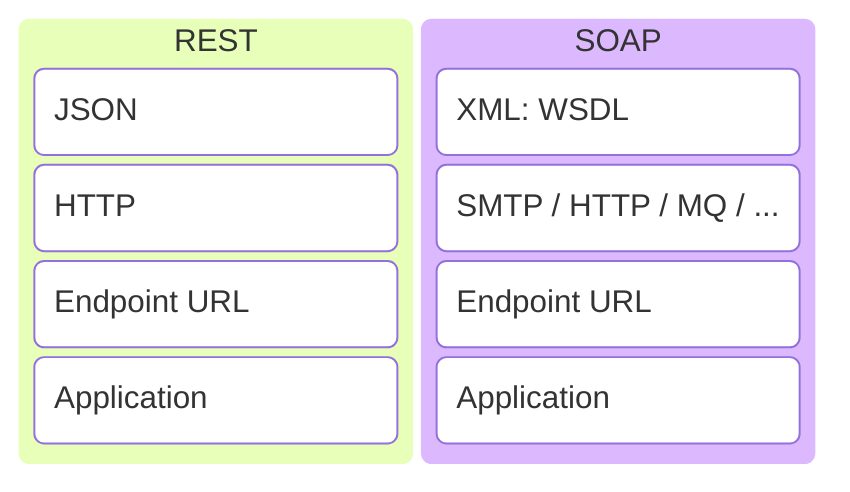

# SOAP
Специфика SOAP — это формат обмена данными. С SOAP это всегда SOAP-XML, который представляет собой XML, включающий:
- **Envelope (конверт)** – корневой элемент, который определяет сообщение и пространство имен, использованное в документе,
- **Header (заголовок)** – содержит атрибуты сообщения, например: информация о безопасности или о сетевой маршрутизации,
- **Body (тело)** – содержит сообщение, которым обмениваются приложения,
- **Fault (ошибка)** — необязательный элемент, который предоставляет информацию об ошибках, которые произошли при обработке сообщений. И запрос, и ответ должны соответствовать структуре SOAP.
SOAP использует **==WSDL (Web Services Description Language)==** — язык описания веб-сервисов и доступа к ним, основанный на языке XML.
SOAP использует чаще всего HTTP, либо MQ для транспорта
# Rest vs SOAP
### REST и SOAP
REST и SOAP на самом деле не сопоставимы. REST — это архитектурный  
стиль. SOAP — это формат обмена сообщениями. Давайте сравним популярные  
реализации стилей REST и SOAP.  
- Пример реализации **RESTful**: JSON через HTTP
- Пример реализации **SOAP**: XML поверх SOAP через HTTP



# Representational State Transfer — REST
REST — Representational State Transfer — «передача репрезентативного состояния» — архитектурный стиль взаимодействия компонентов распределённого приложения в сети. REST — это набор правил того, как программисту организовать написание кода серверного приложения, чтобы все системы легко обменивались данными и приложение можно было масштабировать
- REST является альтернативой RPC
    - Удалённый вызов процедур — RPC — **R**emote **P**rocedure **C**all
**Формат обмена данными**: здесь нет никаких ограничений. JSON — очень популярный формат, хотя можно использовать и другие, такие как XML
**Транспорт**: всегда HTTP. REST полностью построен на основе HTTP.
**Определение сервиса**: не существует стандарта для этого, а REST является гибким. Однако широко используются такие языки определения веб-приложений, как **WADL (Web Application Definition Language)** и **Swagger**.
# RESTfull API
## Компоненты HTTP
- строка запроса (**request line**) — определяет тип сообщения
- заголовки запроса (**header fields**) — характеризуют тело сообщения, параметры передачи и прочие сведения
- тело сообщения (**body**) — необязательное
## HTTP requst methods
### GET — получить данные
GET: получить подробную информацию о ресурсе
```Java
// get by id
/api/{version}/items/{id}
// filtering collections, when [...] returned
/api/{version}/items/?name={name} 
// get dto by unique name
/api/{version}/items/name:{name}
```
### POST — создать новый ресурс
POST: создать новый ресурс
### PUT: обновить ресурс
PUT: обновить существующий ресурс
### DELETE — удалить ресурс
DELETE: Удалить ресурс


# SOAP

**WS-*** в контексте SOAP — это обозначение группы стандартов (спецификаций) для веб-сервисов (Web Services), расширяющих функциональность протокола SOAP. Буква «WS» расшифровывается как **Web Services** .

Эти спецификации решают отдельные задачи, связанные с безопасностью, доставкой, адресацией и транзакциями в SOAP-сообщениях. Примеры WS-* спецификаций:

1. **WS-Security** — обеспечивает безопасность SOAP-сообщений:
    
    - шифрование сообщений (XML Encryption);
    - цифровые подписи (XML Signature) для проверки целостности и подлинности;
    - использование токенов безопасности (SAML, Kerberos) для аутентификации и авторизации . Применяется в системах с высокими требованиями к защите данных (например, финансовые транзакции).
2. **WS-ReliableMessaging** — гарантирует надёжную доставку сообщений:
    
    - подтверждение доставки;
    - сохранение порядка сообщений;
    - исключение дублирования . Критично для приложений, где важен порядок и гарантия доставки (например, ERP-системы).
3. **WS-AtomicTransaction** — обеспечивает атомарность транзакций в распределённых системах:
    
    - все операции транзакции выполняются полностью или не выполняются вовсе (принцип «всё или ничего»);
    - поддерживает ACID-свойства (Atomicity, Consistency, Isolation, Durability) . Используется в корпоративных системах (CRM, ERP) для обеспечения целостности данных.
4. **WS-Addressing** — стандартизирует адресацию веб-сервисов:
    
    - добавляет в SOAP-заголовки метаданные о маршрутизации (URI, конечные точки);
    - поддерживает асинхронные операции (через заголовок `wsa:ReplyTo`);
    - позволяет разделять время жизни SOAP-запроса/ответа и HTTP-соединения . Полезно для длительных взаимодействий и межпротокольной маршрутизации (например, запрос по HTTP, ответ по SMTP) .
5. **Другие спецификации WS-***:
    
    - **WS-Policy** — описывает политики безопасности и поведения сервисов;
    - **WS-MetadataExchange** — обмен метаданными между сервисами;
    - **WS-Trust** — управление доверенностью и сеансами безопасности;
    - **WS-Eventing** — поддержка событийной модели взаимодействия.

**Итог:** WS-* — это набор модульных расширений для SOAP, позволяющих добавлять функции безопасности, надёжности, транзакционности и адресации в веб-сервисы. Разработчик может комбинировать нужные спецификации в зависимости от требований системы.