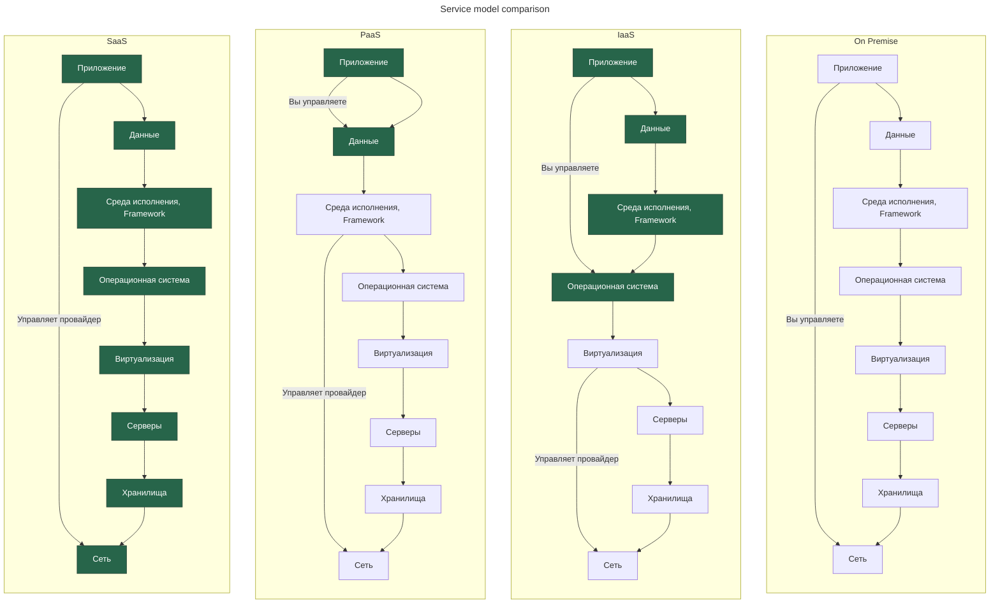

---
aliases:
  - SaaS
  - PaaS
  - IaaS
  - On-Prem
  - On Premise
  - Service Model
  - Модель услуги
---

**On-premise инфраструктура** (On Premise, On-Prem) — это модель развёртывания IT-инфраструктуры, «ИТ в офисе».

Сравнение SaaS, PaaS, IaaS, инфраструктура в офисе

---

## Сравнение моделей сервиса

| **Тип сервиса**                         | **Интерфейс взаимодействия**             | **Содержимое сервиса**                                                                                                                                  |
| --------------------------------------- | ---------------------------------------- | ------------------------------------------------------------------------------------------------------------------------------------------------------- |
| **SaaS** Software as a Service       | Браузер                                  | Облачное приложение:&#10; — социальные сети;&#10; — офисные пакеты;&#10; — CRM;&#10; — обработка видео.                                                 |
| **PaaS** Platform as a Service       | Облачная среда разработки                | Облачная платформа:&#10; — инструменты разработки;&#10; — аутентификация и авторизация;&#10; — среды исполнения (frameworks);&#10; — API;&#10; — CI/CD. |
| **IaaS** Infrastructure as a Service | Администратор виртуальной инфраструктуры | Облачное приложение:&#10; — аппаратная инфраструктура;&#10; — хранилища данных;&#10; — межсетевой экран (firewall);&#10; — балансировщики нагрузки.     |
