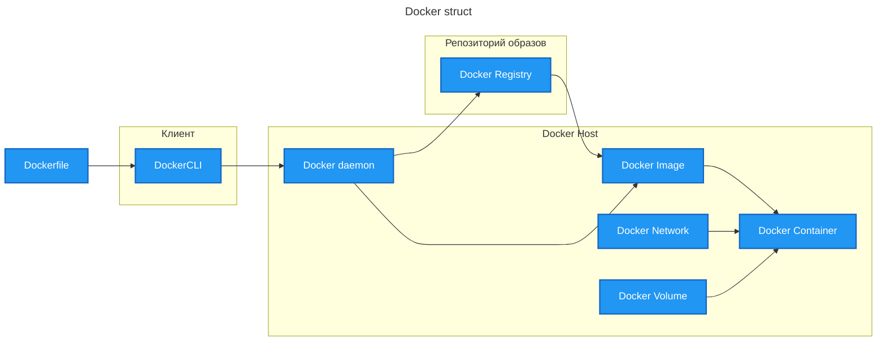

Docker — это современный стандарт для работы с контейнерами. С его помощью разработчики могут создавать и разворачивать контейнеры, а ещё управлять ими с минимальными усилиями. Это значительно упрощает процессы разработки и эксплуатации.


## docker
```bash
start "C:\Program Files\Docker\Docker\Docker Desktop.exe" # запустить платформу
docker ps                                                 # активные контейнеры
docker ps -a                                              # все контейнеры
docker start 51d1cf640d05                                 # запустить контейнер
```
### Развернуть из docker-compose.yaml
```shell
cd c:\h\a\dev\p\gorteh\lawn\tools\
docker compose up -d
```
### Список запущенных контейнеров
`docker ps -a`
## Docker — это система контейнеризации!
рефы:
[https://habr.com/ru/articles/310460/](https://habr.com/ru/articles/310460/#faq)
[https://docker-curriculum.com/](https://docker-curriculum.com/)
## [[контейнеризация]] — containerization
Упаковка приложения в предустановленную среду.
## Контейнер приложения
Контейнер приложения — некоторая песочница, аналогичная виртуальной машине, в которой разработчик деплоит приложение.
Конейнеры предоставляют схожий с виртуальными машинами уровень изоляции, но благодаря правильному задействованию низкоуровневых механизмов основной операционной системы делают это с в разы меньшей нагрузкой.
Контейнеров может быть много. Над ними используется **система оркестарции** напр. **`Kubernetes`**.
## Основные понятия Docker

### Dockerfile – инструкций создания Docker-образа
**Dockerfile** — это текстовый файл, который содержит набор инструкций для создания Docker-образа. Он определяет, какие базовые образы использовать, какие установить зависимости и какие файлы скопировать. А ещё — какие команды нужно выполнить при запуске контейнера.
### Docker Registry
**Docker Registry (реестр)** — это централизованное хранилище образов. Сам Docker предоставляет публичный реестр Docker Hub. Но можно использовать и частные реестры — например, Amazon ECR, Google Container Registry, Yandex Container Registry, Cloud.ru Container Apps или самоуправляемые реестры.
### Docker Volume
**Docker Volume (том)** — это механизм для хранения данных. Тома используют, чтобы хранить данные между перезапусками контейнеров и обеспечить совместный доступ к данным для нескольких контейнеров.
### Docker Network
**Docker Network (сеть)** — это виртуальная сеть, которая позволяет контейнерам взаимодействовать друг с другом. Docker создаёт несколько типов сетей, которые можно использовать для подключения контейнеров: bridge, host, overlay и другие.
### images — образы
Images (образы) - Схемы нашего приложения, которые являются основой контейнеров. В примере выше мы использовали команду docker pull чтобы скачать образ busybox.
#### base images — базовые образы
Base images (базовые образы) — это образы, которые не имеют родительского образа. Обычно это образы с операционной системой, такие как ubuntu, busybox или debian.
#### child images — дочерние образы
Child images (дочерние образы) — это образы, построенные на базовых образах и обладающие дополнительной функциональностью.
### containers — контейнеры
Containers (контейнеры) - Создаются на основе образа и запускают само приложение. Мы создали контейнер командой docker run, и использовали образ busybox, скачанный ранее. Список запущенных контейнеров можно увидеть с помощью команды docker ps.
### Docker Daemon — демон Докера
Docker Daemon (демон Докера) - Фоновый сервис, запущенный на хост-машине, который отвечает за создание, запуск и уничтожение Докер-контейнеров. Демон — это процесс, который запущен на операционной системе, с которой взаимодействует клиент.
### Docker client — клиент
Docker Client (клиент Докера) - Утилита командной строки, которая позволяет пользователю взаимодействовать с демоном. Существуют другие формы клиента, например, Kitematic, с графическим интерфейсом.
### Docker Hub — реестр Докер-образов
Docker Hub - Регистр Докер-образов. Грубо говоря, архив всех доступных образов. Если нужно, то можно содержать собственный регистр и использовать его для получения образов. Локация: [https://hub.docker.com/search](https://hub.docker.com/search?q=)
### Dockerfile
[Dockerfile](https://docs.docker.com/engine/reference/builder/) — это простой текстовый файл, в котором содержится список команд Докер-клиента. Это простой способ автоматизировать процесс создания образа. Самое классное, что [команды](https://docs.docker.com/engine/reference/builder/#from) в Dockerfile _почти_ идентичны своим аналогам в Linux.
```Bash
# start from base
FROM ubuntu:14.04
MAINTAINER Prakhar Srivastav <prakhar@prakhar.me>
# install system-wide deps for python and node
RUN apt-get -yqq update
RUN apt-get -yqq install python-pip python-dev
RUN apt-get -yqq install nodejs npm
RUN ln -s /usr/bin/nodejs /usr/bin/node
# copy our application code
ADD flask-app /opt/flask-app
WORKDIR /opt/flask-app
# fetch app specific deps
RUN npm install
RUN npm run build
RUN pip install -r requirements.txt
# expose port
EXPOSE 5000
# start app
CMD [ "python", "./app.py" ]
```
## Основные команды
### docker pull — скачать образ из хаба
`docker pull busybox` — Команда `pull` скачивает ==образ== напр. busybox из регистра Докера
### docker images — список образов в системе
`docker images` — список ==образов== в системе
### docker run — запустить контейнер из образа
`docker run` — запустим Докер-контейнер с этим образом
`docker run --rm` — автоматическое удаление контейнеров при завершении работы
### docker ps — список контейнеров
`docker ps` — список запущенных контейнеров
`docker ps -a` — список всех контейнеров с их статусами
### docker rm — удаление контейнеров
`docker rm` — удаление контейнеров
```Bash
# удалить конейнеры по ID
$ docker rm 305297d7a235 ff0a5c3750b9
305297d7a235
ff0a5c3750b9
# удалить все exited~отработанные контейнеры
docker rm $(docker ps -a -q -f status=exited)
# удаление ненужных образов
docker rmi
```

### Шаги работы с Docker

**1. Создание и запуск контейнера:**
- **Написание Dockerfile** → `docker build` → **Создание Docker-образа** → `docker run` → **Запуск контейнера**.

**2. Управление работающими контейнерами:**
- **Просмотр работающих контейнеров** → `docker ps` → **Остановка контейнера** → `docker stop` → **Удаление контейнера** → `docker rm`.

**3. Управление Docker-образами:**
- **Просмотр Docker-образов** → `docker images` → **Удаление Docker-образа** → `docker rmi`.

**4. Работа с логами контейнера:**
- `docker logs` → **Работа с логами контейнера**.

**5. Выполнение команд внутри контейнера:**
- `docker exec` → **Выполнение команды внутри контейнера**.

**6. Управление томами и сетями:**
- **Создание и управление томами**.
- **Создание и управление сетями**.

**7. Работа с Docker Registry:**
- **Авторизация в Docker Registry**.
- **Отправка Docker-образа в реестр**.
- **Загрузка Docker-образа из реестра**.

#### Схема в виде списка с этапами:

1. **Начальный этап:** написание `Dockerfile` — основа для создания Docker-образа.
2. **Сборка образа:** использование команды `docker build` для компиляции Dockerfile в образ.
3. **Запуск контейнера:** с помощью `docker run` созданный образ запускается как контейнер.
4. **Мониторинг контейнеров:** `docker ps` позволяет увидеть список всех работающих контейнеров.
5. **Остановка контейнера:** команда `docker stop` завершает работу выбранного контейнера.
6. **Удаление контейнера:** после остановки контейнер можно удалить с помощью `docker rm`.
7. **Просмотр образов:** `docker images` выводит список всех скачанных и созданных Docker-образов.
8. **Удаление образа:** `docker rmi` удаляет ненужный Docker-образ из локального хранилища.
9. **Анализ логов:** `docker logs` даёт доступ к журналам работы контейнера для отладки.
10. **Выполнение команд:** `docker exec` позволяет запускать команды непосредственно внутри работающего контейнера.
11. **Работа с томами:** создание и управление томами для сохранения данных вне контейнера.
12. **Настройка сетей:** создание и управление сетями для взаимодействия контейнеров.
13. **Взаимодействие с Docker Registry:**
   - авторизация в реестре;
   - загрузка образа в реестр (`push`);
   - скачивание образа из реестра (`pull`).

Если нужна дополнительная детализация по какому-то этапу — дайте знать!

## Docker Compose – управление многоконтейнерным приложением

**Docker Compose** — это инструмент для определения и запуска многоконтейнерных Docker-приложений. С помощью Docker Compose можно легко управлять зависимостями между контейнерами, запускать их в правильной последовательности и обеспечить взаимодействие между ними.

Docker Compose — инструмент для определения и управления многоконтейнерными Docker-приложениями. С его помощью можно описать всю инфраструктуру приложения в одном YAML-файле и упростить процессы разработки, тестирования и развёртывания.

Docker Compose — это инструмент для запуска мультиконтейнерного приложения, которое не зависит от платформы и содержит все необходимые для работы технологии и библиотеки. Конфигурация такого приложения записывается в одном текстовом файле в формате YAML. Запускается приложение одной командой в терминале.

Docker Compose нужен для упрощения процесса разработки и тестирования многоконтейнерных приложений. Он позволяет:
- определять конфигурацию всех сервисов в одном файле `docker-compose.yml`;
- запускать все сервисы одной командой;
- управлять зависимостями между сервисами;
- обеспечивать сетевое взаимодействие между контейнерами;
- сохранять данные с помощью томов.

### Services (Сервисы)
Сервисы в Docker Compose представляют собой отдельные контейнеры, которые нужно запускать. Каждый сервис описывается в файле docker-compose.yml и включает в себя инструкции по созданию и запуску контейнера. Сервисы могут зависеть друг от друга и взаимодействовать между собой.

### Networks (Сети)
Сети в Docker Compose позволяют контейнерам взаимодействовать друг с другом. По умолчанию, Docker Compose создаёт отдельную сеть для каждого проекта, но вы можете определить собственные сети и подключать контейнеры к ним.

### Volumes (Тома)
Тома в Docker Compose используются для хранения данных, которые должны сохраняться между перезапусками контейнеров. Тома могут быть определены в файле docker-compose.yml и подключены к контейнерам для обеспечения долговременного хранения данных.

### Переменные окружения в Docker Compose
**Переменные окружения** позволяют настраивать контейнеры без изменения их конфигурации. Они помогают управлять параметрами, которые могут изменяться в различных средах (например, базы данных, API-ключи и другие конфигурационные значения). В Docker Compose переменные окружения можно задавать в самом файле docker-compose.yml или в отдельном файле `.env`.

Преимущества использования файла .env
- **безопасность:** конфиденциальные данные не хранятся прямо в файле docker-compose.yml;
- **удобство:** легче управлять и изменять конфигурации среды, просто обновляя файл .env;
- **гибкость:** возможность быстро переключаться между различными конфигурациями среды (например, разработка, тестирование, продакшн) без изменения основного файла конфигурации.
### docker-compose.yml
**docker-compose.yml** – это файл, который управляет последовательностью развертывания мультконтейнерного приложения, обеспечивает разделяемый доступ к сетям, томам и конфигурации контейнеров

```yaml
version: '3.8'

services:
  order-service:
    build: ./order-service
    container_name: order-service
    ports:
      - "5000:5000"
    environment:
      - DATABASE_URL=postgresql://postgres:${POSTGRES_PASSWORD}@db:5432/orders
    depends_on:
      - db
    networks:
      - quickdelivery-network

  logistics-service:
    build: ./logistics-service
    container_name: logistics-service
    ports:
      - "5001:5001"
    environment:
      - DATABASE_URL=postgresql://postgres:${POSTGRES_PASSWORD}@db:5432/logistics
    depends_on:
      - db
    networks:
      - quickdelivery-network

  db:
    image: postgres:13
    container_name: postgres
    environment:
      POSTGRES_USER: postgres
      POSTGRES_PASSWORD: ${POSTGRES_PASSWORD}
      POSTGRES_DB: orders
    ports:
      - "5432:5432"
    volumes:
      - postgres-data:/var/lib/postgresql/data
    networks:
      - quickdelivery-network

networks:
  quickdelivery-network:

volumes:
  postgres-data:
```
**.env**
```toml
POSTGRES_PASSWORD=mysecretpassword 
```


Описание docker-compose.yml
- **version** Определяет версию Docker Compose.
- **services** Описывает сервисы.
    - **order-service** Сервис обработки заказов.
        - **build** Указывает на текущую директорию для сборки Docker-образа.
        - **container_name** Имя контейнера.
        - **ports** Перенаправление порта 5000 на хосте на порт 5000 в контейнере.
        - **environment** Переменные окружения, используемые сервисом. В данном случае, мы задаём URL для подключения к базе данных.
        - **depends_on** Указывает на зависимость от сервиса базы данных.
    - **db** Сервис базы данных PostgreSQL.
        - **image** Указывает на образ PostgreSQL версии 13.
        - **container_name** Имя контейнера.
        - **environment** Переменные окружения для настройки базы данных.
        - **ports** Перенаправление порта 5432 на хосте на порт 5432 в контейнере.

[https://docs.docker.com/compose/#common-use-cases](https://docs.docker.com/compose/#common-use-cases)
`docker-compose up --build` — запуск приложения
## [[Orchestration|Оркестарция контейнеров]]
Оркестрация - возможность управлять группой контейнеров, как одной сущностью.
При деплое приложения разработчик должен думать не о запуске контейнеров, а о запуске оркестрированного кластера контейнеров.
Примеры систем оркестрации: Docker Compose, Kubernetes
### Docker Swarm

swarm — рой

> [!info] Docker Swarm — это оркестратор от компании Docker, который позволяет объединять несколько Docker-хостов в единый кластер и автоматически управлять запуском и масштабированием контейнеров. С помощью данного инструмента компания может с легкостью развертывать требуемые службы, управлять ими, масштабировать в процессе развития и мониторить стабильность и производительность.

# история

Идея контейнеризации возникла ещё в 1970-х годах с появлением chroot в Unix. Однако современные контейнеры в их нынешнем виде начали развиваться с появлением технологий LXC (Linux Containers) и Docker в начале 2010-х годов. Docker принёс контейнеризацию в массы, предоставив простой и удобный интерфейс для работы с контейнерами. Как вы уже знаете из первого спринта, сегодня Docker — это современный стандарт для работы с контейнерами.

Появление [[software-engineer/технологии/kubernetes/Kubernetes]] в 2014 году стало поворотным моментом для оркестрации контейнеров. Kubernetes быстро превратился в стандарт для управления контейнеризированными приложениями благодаря своей гибкости, масштабируемости и мощным функциям.

Сегодня [[Orchestration]] продолжает активно развиваться. Появляются новые инструменты и технологии, например, сервис-меши ([[Istio]]), которые помогают управлять сетевым взаимодействием между микросервисами и обеспечивать безопасность. Развитие облачных технологий и рост популярности DevOps тоже способствуют распространению и совершенствованию оркестрационных систем.