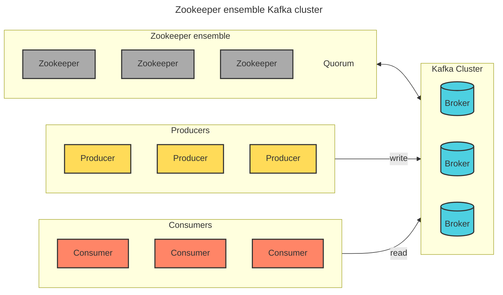
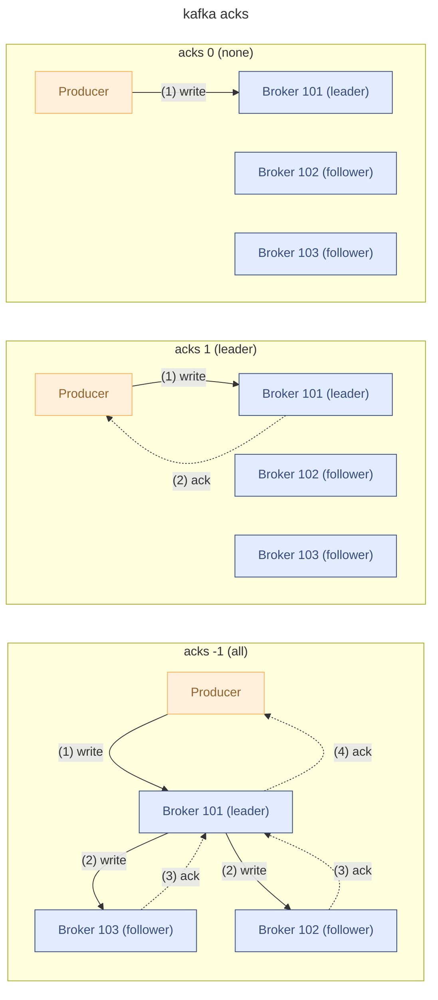
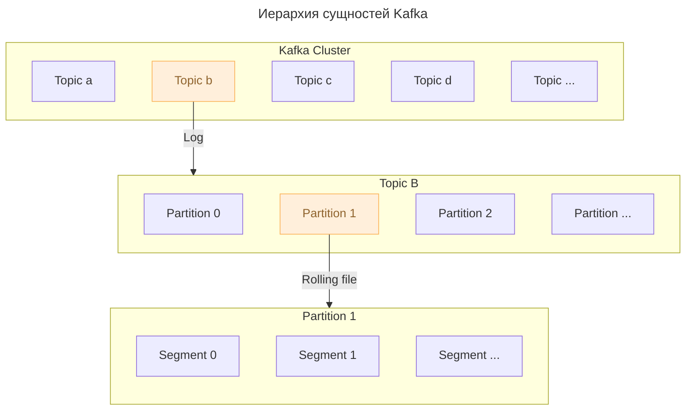

# Kafka

[Apache Kafka](https://kafka.apache.org/documentation/) — это распределённая стриминговая платформа, разработанная для публикации, подписки, хранения и обработки потоков данных в реальном времени.
* применятся для построения [[Event-Driven Architecture|EDA]] **event-driven architecture**

Apache Kafka — один из ключевых инструментов для обработки больших данных. Она широко используется во многих крупных компаниях и организациях для создания реалтаймовых дата-пайплайнов и стриминговых приложений.

**Преимущества Apache Kafka**

1. **Высокая производительность:** Kafka может обрабатывать миллионы сообщений в секунду — идеально для систем с большим объёмом данных.
2. **Масштабируемость:** Kafka позволяет горизонтально масштабировать кластер, добавляя новые брокеры, что обеспечивает высокую производительность и надёжность даже при увеличении нагрузки.
3. **Надёжность:** Kafka поддерживает репликацию данных между брокерами, что обеспечивает устойчивость к сбоям и высокую доступность системы.
4. **Долговременное хранение:** Kafka хранит сообщения в течение определённого времени, что позволяет воспроизводить данные и анализировать события задним числом.
5. **Поддержка различных моделей взаимодействия:** Kafka поддерживает модели [[Publish-Subscribe|Publish/Subscribe]], [[Event Sourcing]] и [[message-queueing]]. Это универсальный инструмент для различных сценариев использования.
## Apache Kafka
**Apache Kafka** — ==распределенная система обмена сообщениями==, узлы которой содержатся на нескольких кластерах. Принимая сообщение от продюсера, она реплицирует (копирует) его, а копии сохраняет на разных узлах. При этом один из брокеров назначается ведомым в секции, через него потребители будут обращаться к записям.



c _Kafka 3.4 необходимость в использовании Zookeeper отпала: для арбитража появился собственный протокол_ `**_KRaft_**`_. Он решает те же задачи, но на уровне брокеров_
## producers — поставщики данных
```Java
превый тип сообщений - требуются 2 потребитялем
второй тип сообщений - требуется всем потребителям
третий тип сообщений - требуется только третьему потребителю
```
### acks — подтверждение доставки
При отправке сообщений можно указать режим подтверждения доставки до брокера. определяется параметров `acks`
- `**acks=0**` **—** не ждем подтверждения доставки. ненадежный режим
- `**acks=1**` **—** ждем подтверждения доставки до Leader-реплики. Компромисный режим
- `**acks=-1|all**` **—** ждем подтверждения доставки до Leader-реплики и всех ISR-реплик. Надежный режим

### acks

## comsumers — потребители данных
Kafka consumer читает только из Leader-реплики.
### Consumer Group
Возможность в кафке читать разные топики паралельным способом. Для этого можно создать группу консумеров и каждого отправить за выкачивакнем данных по теме. Для этого для каждого члена группы надо задать общий параметр `group.id`. Это имеет смысл, когда хотим распаралелить обработку сообщений.
#### __consumer_offsets
В Kafka есть топик `__consumer_offsets`, который хранит информацию о том, какие сообщения консюмером уже были прочитаны данной `**Consumer Group**`**.** Это нужно для того, что бы если консюмеры упал, новый консюмер по данным в топике `__consumer_offsets`, смог определить какие данные были обработаны предшественником. Для того, чтобы обновлять данные в `__consumer_offsets`, консюмер периодичест отправиляет коммиты, с информацией о даных, которые были обработаны.
Коммиты можно отправлять в автоматическом, либо в ручном режиме. Автокоммит проще, но менее надежный.
В Kafka защищается информация об offset-е Consumer Group-ы в __consumer_offsets, если группа не обращалась к брокеру более 7 дней. Этот параметр настраивается.
## broker — брокер доставки сообщений
Kafka broker берет на себя функцию консолидации сообщений от продюсеров и гаранта доставки потребителям
Функции:
- прием сообщений
- хранение сообщений
- выдача сообщений
Брокер берет сообщения о продюсеров, упаковывается их в ==топки==, консюмеры читают сообщения согласно ящика? на который подписались ранее.
#### Kafka cluster
набор брокеров можно объединить в кластер для обеспечения масштабируемости и репликации.
#### Kafka controller
специальный брокер, который обеспечивает консистентность(согласованность) данных (сообщений)
Kafka controller назначает leader-реплики
## message/record — сообщение
Сообщение включает в себя поля
- **[key]** — используется для распределения сообщений по кластеру
- **value**
- **timestamp**
- **headers —** набор key-value пар с пользовательским атрибутами
Все сообщения упорядочены FIFO.
При чтении сообщения из топика не пропадают. Это обеспечивает широковещательный режим. Новый потребитель пришел и заново все прочитал.



#### topic — топик сообщений
Kafka topic — поток данных в рамках темы которая логически объединяет сообщения
#### partition — партиция топика сообщений
так как сообщений может быть слишком много и они не удаляются, имеет смысл поделить сообщения одного топика на партиции фиксированного размера.
FIFO выдерживается в пределах партиции
#### segment — сегмент партиции топика сообщений

> [!important] **Сообщения хранятся**
> 
> в LOG файлах, **в файловой системе**!  
> Имя папки: **_eg ./A-0_** — имя топка - номер партиции.
Внутри каждой папки есть **сегменты**.
Сегмент это 3 файла с одинаковым именем и разными расширениями:
- .LOG — содержит сообщения
- .INDEX — служит для навигации в LOG по номерам сообщений
- .TIMEINDEX — служит для навигации в INDEX по времени. Слабая консистентность данных из-за того, что timestamp могу устанавливаться вручную, либо сообщения могут приходить с задержкой.
Имя сегмента включает в себя номер сообщения с которого начинается. Стандартный размер сегмента - 1Гб.
Удалять данные вручную нельзя. Но, можно настроить удаление сегментов по TTL.
### балансировка и партицирование
## zookeeper

Сервис для координации и управления кластером Kafka. ZooKeeper используется для хранения метаданных о топиках, брокерах и смещениях консьюмеров.

Кластер Zookeeper (_работник зоопарка_) сохраняет ссылку на выбранный им узел-контроллер Kafka, который копирует всю информацию о топологии узлов, разделов, топиков и групп получателей и управляет процессом репликации по другим узлам (брокерам).
zookeeper - база данных, которая хранит информацию о
- состоянии кластера
- конфигурации
- адресная книга (data)
## replicas — реплики данных
Копии партиций сохрняются в нескольких экземплярах между разными брокерами. Количество реплик задается через параметр `replicant factor`.
### replicant factor

> [!important] replicant factor > 1 !
borker data **replicant factor** указывает, что каждый сколько реплик топиков должен хнанится на всех брокерах. Важно чтобы было > 1, для отказоустойчивости системы.
### leader — follower replicas
Для гарантии консистентности данных, реплики организованы как master-slave система. Поэтому реплики делятся на одного лидера, и многих последователей.
Операции чтения и записи производятся только на leader-репликах. Поэтому надо следить за балансировкой лидеров, фолловеров между разными брокерами.
### in-sync replicas
Некоторые из реплиr-последователей являются ISR-Follower (in-sync replicas). Это говорит, что каждое изменение в лидере, синхронно реплицируется на ISR-fallower. Это нужно для того, что если лидер-реплика упадет, то ISR-Follower сможет гарантировать консистентность данных и автоматически станет лидером. После чего будет назначен новый ISR-Follower
количество ISR-Follower регулируется через параметр `min.insync.replicas`. Обычно ставят равным на (количество топиков - 1), т.к. предполагается что не может упасть более 1 брокера за раз.

## история
Apache Kafka была создана в LinkedIn в 2010 году. Компании была нужна высокопроизводительная платформа, чтобы обрабатывать большой объём данных в режиме реального времени. *Джей Крепс*, *Неха Нархеде* и *Джун Рао* #👨 разработали Kafka для обработки потока событий и журналирования активности пользователей в LinkedIn. 

В 2011 году LinkedIn открыла исходный код Kafka и передала его в фонд Apache Software Foundation, где Kafka быстро завоевала популярность благодаря своей производительности, масштабируемости и надёжности. В 2014 году Kafka получила статус Apache топ-уровня (Apache Top-Level Project), что подтвердило её зрелость и значимость для сообщества.