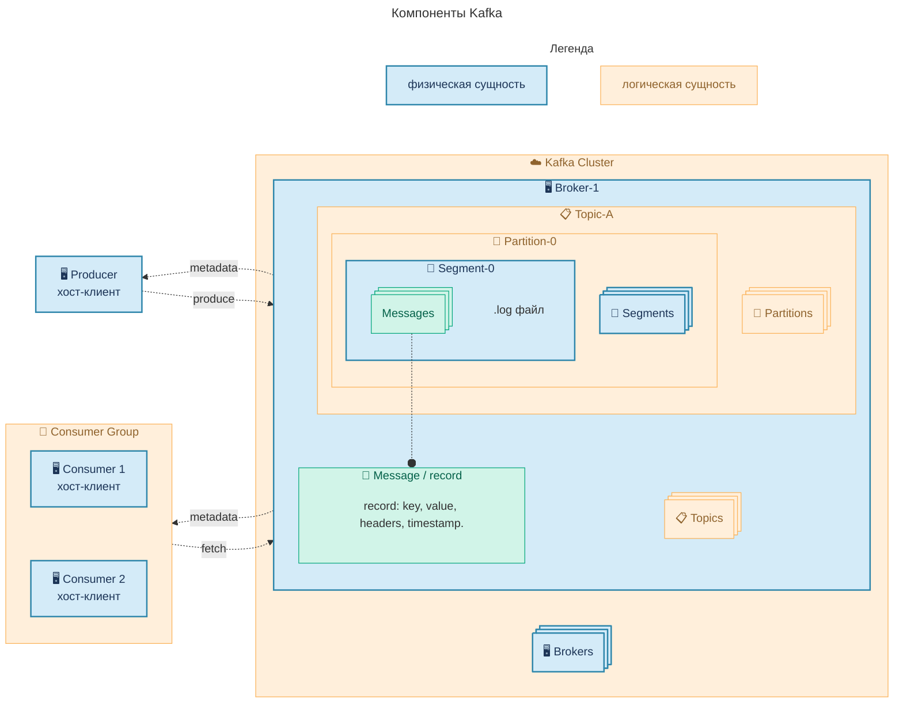
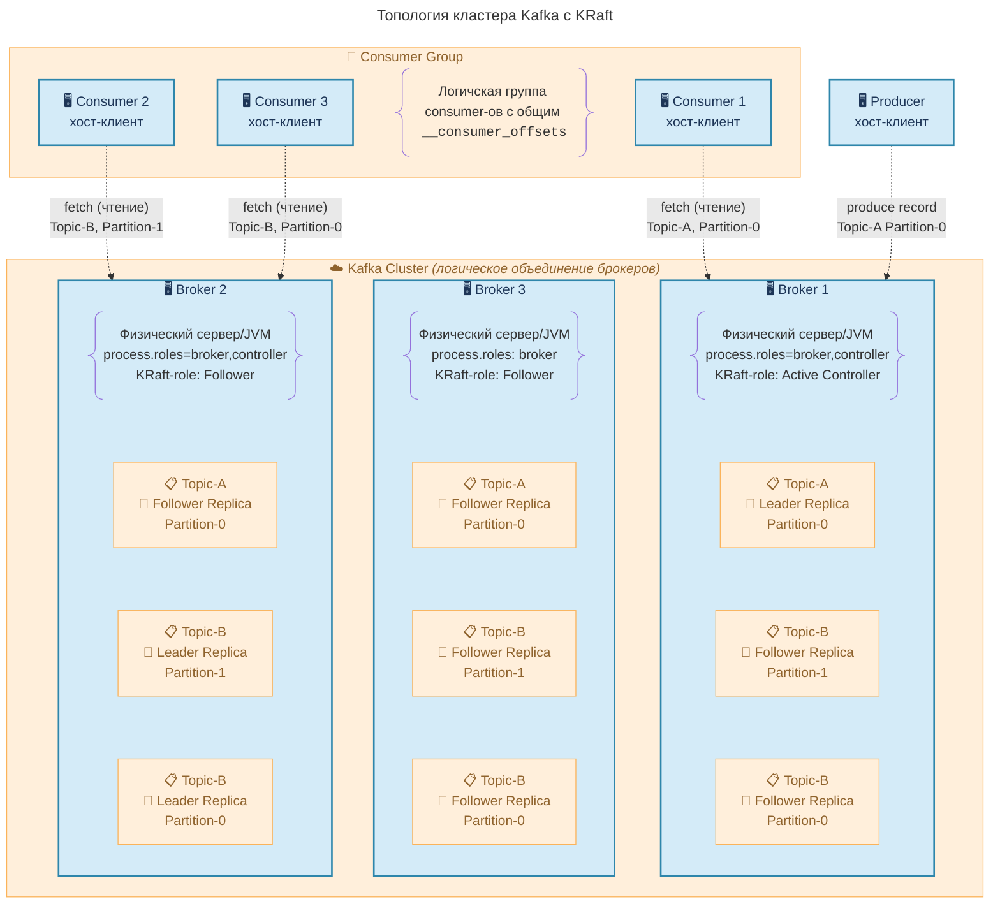
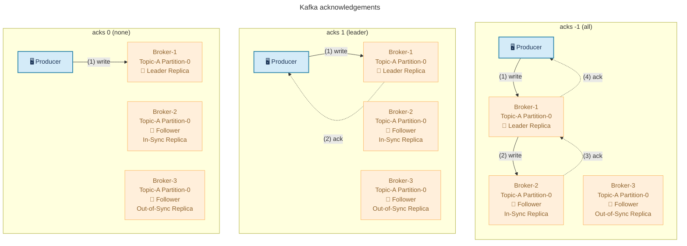

---
aliases:
  - Kafka без Zooker
  - kafka
  - kraft
  - ISR
  - OSR
  - Segment
  - partition
  - topic
  - broker
  - Apache Kafka
  - Offset
---
## Структура кафки

Apache Kafka – это шина событий на базе неизменяемого лога. Обеспечивает слабую связанность сервисов, хранение истории и упорядоченную доставку сообщений.

Кафка стала популярной за счет возможностей масштабирования и устойчивости к потерям данных. Кафка вошла в технологический ландшафт таких компаний как [LinkedIn](https://engineering.linkedin.com/teams/data/data-infrastructure/streams/kafka), [Netflix](https://factorhouse.io/articles/netflix-kafka-architecture), [Slack](https://slack.engineering/building-self-driving-kafka-clusters-using-open-source-components/), [Uber](https://factorhouse.io/articles/uber-kafka-architecture),..

Масштабирование кафки достигается за счет системы партиционирования, а устойчивость за счет распределенных репликаций.

Как устроена Кафка?


`Kafka Cluster` — логическое объединение кафка брокеров.

`Broker` — сервер Kafka, который хранит партиции, может обрабатывает запросы клиентов, может участвовать в выборах лидера кластера

`Topic` — канал, куда отправляются сообщения (например, «логи», «заказы»).

`Partition` — часть топика, упорядоченный журнал сообщений.  
Предназначен для параллельной обработки сообщений. В идеальной ситуации число партиций совпадает с числом потребителей Consumer Group-ы

`Offset` — номер сообщения внутри партиции. Позволяет консюмеру помнить, где остановился.

`Producer / Consumer` –- клиент, который отправляет / потребляет сообщение топика.

`Consumer Group` — Группа консюмеров, которые совместно читают один топик для балансировки нагрузки. С гарантией того, что 2 консюмера одной группы не прочитают одно сообщение.

> [!important] Consumer может существовать вне Consumer Group
> В этом случае кластер не будет хранить оффсет такого консюмера. Эта задача ляжет на разработчиков консюмера.

`Record` - Единица данных, отправляемая в Kafka. Содержит ключ, значение, временную метку и заголовки сообщения.

### Kafka Metadata

`Kafka Metadata` — это «карта» кластера: какие топики есть, сколько у них партиций, кто лидер каждой партиции, какие реплики синхронизированы (In-Sync Replicas). Без неё клиенты не знают, куда слать сообщения или откуда читать.

Обмен данными `Metadata Request` происходит в бинарном формате. При запросе клиент может указать фильтр, по параметрам `include_cluster_info`, `topics`.

Пример десериализованного Kafka Cluster Metadata response body:
```json
{
  "brokers": [
    {"id": 1, "host": "broker1.example.com", "port": 9092},
    {"id": 2, "host": "broker2.example.com", "port": 9092},
    {"id": 3, "host": "broker3.example.com", "port": 9092}
  ],
  "topics": [
    {
      "name": "orders",
      "partitions": [
        {
          "partition": 0,
          "leader": 1,
          "replicas": [1, 2, 3],
          "isr": [1, 2]
        },
        {
          "partition": 1,
          "leader": 2,
          "replicas": [2, 3, 1],
          "isr": [2, 3]
        }
      ]
    },
    {
      "name": "users",
      "partitions": [
        {
          "partition": 0,
          "leader": 3,
          "replicas": [3, 1, 2],
          "isr": [3]
        }
      ]
    }
  ]
}
```

Список активных брокеров, число реплик и их типы могут меняться. Например, из‑за ребаланса, сбоев или масштабирования кластера. Поэтому клиенты регулярно опрашивают брокеров (Metadata Request), чтобы получать актуальную карту кластера.

> [!important] Kafka Metadata при старте клиента
> Список активных брокеров может меняться. Для того, чтобы клиент получил адреса и статус актуальный брокеров и партиций, при конфигурировании клиента задается список адресов брокеров (`bootstrap servers`). Если хотя бы 1 из них активен – клиент получит актуальную карту кластера

#### In-Sync Replica

**ISR (In‑Sync Replica)** — это «надёжные копии» данных в Kafka. Список реплик партиции, которые успевают за лидером и хранят актуальные данные.

В Kafka данные хранятся в нескольких копиях (партициях) на разных брокерах. Если какой‑то брокер сильно отстаёт по синхронизации лога, доверять ему нельзя. Лидер партиции исключает такую реплику из ISR.

Список ISR нужен для:

- **Скорости** — если продюсер требует «запиши надёжно» (`acks=all`), Kafka подтвердит запись только после того, как её сохранят все участники ISR.
    
- **Устойчивости** — в случае сбоя лидера партиции, новым лидером станет кто‑то из ISR.

### Ребаланс Kafka

`Kafka Rebalance` — процесс перераспределения партиций между потребителями внутри одной Consumer Group. Он нужен, чтобы при изменении состава группы нагрузка распределялась равномерно и все партиции оставались обработанными.

Когда происходит ребаланс:

- Изменилось число консюмеров группы — всем нужно выделить leader replica партицию.
- Изменилась топология топика: добавлены новые партиции — их нужно распределить по группе.

### Kafka Segments

Сообщения хранятся в бинарном формате в файловой системе.
* Имя папки:  `<имя топка>–<номер партиции>`

Внутри каждой папки есть **сегменты**.

Сегмент это 3 файла с одинаковым именем и разными расширениями:
- `.LOG` — содержит сообщения
- `.INDEX` — служит для навигации в LOG по номерам сообщений
- `.TIMEINDEX` — служит для навигации в INDEX по времени. Слабая консистентность данных из-за того, что timestamp могу устанавливаться вручную, либо сообщения могут приходить с задержкой.

Имя сегмента включает в себя номер сообщения с которого начинается. Стандартный размер сегмента - 1Гб.

Удалять данные вручную нельзя. Но, можно настроить удаление сегментов по TTL.

## Как работает Kafka

Для обеспечения компетентности состояния кластера требуется координатор. 

Ранее (до v.3.3) координатором выступал Zookeeper. Сегодня такая конфигурация является устаревшей. Роль координатора (`Active controller`) передается между брокерами при помощи алгоритма консенсуса КRaft.




Чтение/запись происходит только в `Leader Replica` партиции.

Брокеры взаимодействуют друг с другом для:
- репликации записей из Leader replica партиций в Follower replica партиции
- выбора Active Controller (голосуют брокеры с ролью controller)
- синхронизации Metadata (карты кластера)

> [!important] Leader replica failure
> В случае сбоя Leader реплики, Active Controller смотрит на последний актуальный список ISR и назначает нового лидера.

Leader реплики следит за Follower-ами репликации, отслеживает их отставание по LEO (Log End Offset) и ведет локальный список In-Sync Replicas.

### Broker roles

Каждому брокеру назначается 1 из 3 ролей (параметр `process.roles`):
- **broker** — обслуживает клиентов: принимает, хранит, отдаёт сообщения.
- **controller** — управляет кластером: выбирает лидеров партиций, обрабатывает ребалансы, хранит и синхронизирует метаданные (в режиме [[KRaft]]).
- **broker, controller** — обе роли на одном узле. Типично для небольших кластеров.

> [!important] Passive broker
> При некоторых обстоятельствах может образоваться брокер, который содержит только Follower replica партиции. Чаще всего это временное, но штатное состояние системы. Таких брокеров так же называют `cold replica broker`

#### KRaft Active Controller
`Active Controller` выбирается брокерами с ролью `controller` при наличии KRaft‑кворума.

Active Controller делает:

- оркестрирует изменение метаданных (например добавление топика)
- назначает лидеров партиций
- обновляет метаданные на всех брокерах
- следит за ISR/OSR

### Управление доставкой

При отправке сообщения Producer устанавливает требование к уровню подтверждения доставки. Брокер должен выполнить требование, чтобы продюсер счёл отправку успешной.

Параметр `acks` (_acknowledgements_) может принимать 3 значения:



Уровень гарантии влияет на надёжность и длительность доставки сообщения. Поэтому следует задавать значение с учетом бизнес-требований:

- `acks=0` : Без подтверждения доставки, риски потери данных, оптимально для телеметрии, логов, метрик. [Fire-and-forget паттерн](https://www.enterpriseintegrationpatterns.com/patterns/conversation/FireAndForget.html).
- `acks=1` : Подтверждение от Leader Replica, потеря данных возможна при сбое лидера, оптимально для большинства сценариев. Значение по-умолчанию.
- `acks=-1` : подтверждения доставки от всех ISR реплик. Данные сохраняться даже при сбое лидера, снижение пропускной способности, оптимально для критических данных (напр. платежи, заказы).
