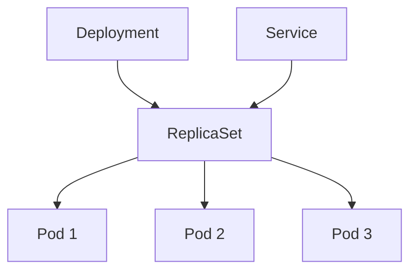

Отличный вопрос!  
**ReplicaSet** — это **ключевой компонент Kubernetes**, отвечающий за **поддержание нужного количества запущенных подов (pods)**. Он обеспечивает **стабильность, отказоустойчивость и масштавируемость** ваших приложений.

---

## ✅ Что такое ReplicaSet?

> **ReplicaSet** — это объект в Kubernetes, который **гарантирует, что заданное количество экземпляров Pod'ов работает в кластере** в любой момент времени.

Если:
- Под падает → ReplicaSet создаст новый
- Кто-то удалил под → ReplicaSet восстановит его
- Нагрузка растёт → можно увеличить `replicas` → появятся новые поды

> 💡 Это **основа надёжности** в Kubernetes.

---

## ✅ Пример: Зачем нужен ReplicaSet?

```yaml
apiVersion: apps/v1
kind: ReplicaSet
metadata:
  name: frontend-rs
spec:
  replicas: 3
  selector:
    matchLabels:
      app: frontend
  template:
    metadata:
      labels:
        app: frontend
    spec:
      containers:
      - name: nginx
        image: nginx:latest
```

### 🔍 Что делает этот ReplicaSet?
- Создаёт и поддерживает **3 пода** с Nginx
- Если один под падает → ReplicaSet автоматически создаёт новый
- Все поды помечены как `app: frontend`
- Можно использовать с Service для балансировки

---

## ✅ Основные функции ReplicaSet

| Функция                      | Объяснение                                                    |
| ---------------------------- | ------------------------------------------------------------- |
| **Гарантия числа реплик**    | Всегда будет `replicas: 3`, даже если вы удалите один под     |
| **Самовосстановление**       | Если node упал → контроллер создаёт поды на других нодах      |
| **Базовая масштабируемость** | Меняете `replicas: 3` → `5` → Kubernetes сам добавит два пода |
| **Работает с Deployment**    | Чаще используется через `Deployment`, а не напрямую           |

---

## 🆚 ReplicaSet vs ReplicationController (устаревший)

| Характеристика | **ReplicationController** | **ReplicaSet** |
|----------------|--------------------------|--------------|
| **Поддержка label selectors** | Только простые (`key=value`) | ✅ Да — `matchLabels`, `matchExpressions` |
| **Обновления** | ❌ Сложные | ✅ Лучше — совместим с Deployment |
| **Использование** | Устарел | ✅ Рекомендуется |
| **API** | `v1` | `apps/v1` |

> ⚠️ **ReplicationController** — из ранних версий K8s — **не используйте**.
>
> ✅ **Всегда используйте `ReplicaSet` или `Deployment`**

---

## 🔄 Как связан с другими объектами?



### 🔹 **Deployment** → управляет ReplicaSet'ом
- Делает **обновления без простоя**
- Позволяет **откатиться**
- Использует ReplicaSet под капотом

### 🔹 **Service** → направляет трафик к подам через ReplicaSet
```yaml
selector:
  app: frontend
```
→ Точно такой же, как у ReplicaSet → трафик распределяется между всеми 3 подами

---

## ✅ Когда использовать ReplicaSet напрямую?

✅ **Почти никогда.**

### ❌ Не рекомендуется использовать ReplicaSet напрямую, потому что:

- Нет стратегии обновления (`RollingUpdate`)
- Нет возможности отката
- Нет контроля за процессом деплоя

### ✅ Вместо этого — используйте **Deployment**

```yaml
apiVersion: apps/v1
kind: Deployment
metadata:
  name: frontend
spec:
  replicas: 3
  strategy:
    type: RollingUpdate
    rollingUpdate:
      maxSurge: 1
      maxUnavailable: 0
  selector:
    matchLabels:
      app: frontend
  template:
    metadata:
      labels:
        app: frontend
    spec:
      containers:
      - name: nginx
        image: nginx:latest
```

> ✅ **Deployment использует ReplicaSet под капотом**, но добавляет:
> - Безопасные обновления
> - Откаты
> - Паузы, проверки

---

## ✅ Зачем тогда знать про ReplicaSet?

| Причина | Объяснение |
|--------|------------|
| ✅ Чтобы понимать, как работает `Deployment` | Deployment создаёт ReplicaSet при каждом обновлении |
| ✅ Для диагностики | `kubectl get rs` — покажет все replica set'ы |
| ✅ Иногда нужно вручную | Например, для временной нагрузки, тестирования |

---

## ✅ Команды для работы с ReplicaSet

```bash
# Посмотреть все ReplicaSet'ы
kubectl get rs

# Описать конкретный
kubectl describe rs/frontend-rs

# Удалить (осторожно!)
kubectl delete rs/frontend-rs

# Масштабировать
kubectl scale rs/frontend-rs --replicas=5
```

---

## ✅ Пример: Что видно после деплоя

```bash
$ kubectl get deployments
NAME       READY   UP-TO-DATE   AVAILABLE
frontend   3/3     3           3

$ kubectl get rs
NAME                  DESIRED   CURRENT   READY
frontend-7c649d69f8   3         3         3

$ kubectl get pods
NAME                        READY
frontend-7c649d69f8-abc12   1/1
frontend-7c649d69f8-def34   1/1
frontend-7c649d69f8-ghi56   1/1
```

→ `Deployment` → создаёт `ReplicaSet` → тот создаёт `Pods`

---

## ✅ Преимущества ReplicaSet

| Плюс | Объяснение |
|------|------------|
| ✅ **Автоматическое восстановление** | Если под упал — сразу пересоздаётся |
| ✅ **Масштабирование** | Простое изменение числа реплик |
| ✅ **Стабильность** | Гарантирует, что приложение "живо" |
| ✅ **Часть стандартной цепочки** | Deployment → ReplicaSet → Pods |

---

## ❌ Недостатки (почти нет)
- Единственный "минус" — **не используется напрямую** → лучше `Deployment`
- Сам по себе **не умеет обновляться безопасно**

---

## ✅ Финальный вывод

| ReplicaSet — это... | Это не... |
|--------------------|-----------|
| ✅ **Контроллер, поддерживающий нужное число подов** | ❌ Независимый объект |
| ✅ **Основа для масштабирования и отказоустойчивости** | ❌ Главный способ деплоя |
| ✅ **Технический слой под Deployment'ом** | ❌ То, что вы пишете вручную каждый раз |

> 🔑 **Вызываете `kubectl apply -f deployment.yaml` → Kubernetes создаёт ReplicaSet → ReplicaSet создаёт поды.**

---

## 💬 Цитата

> _“A ReplicaSet is to a Pod as a Deployment is to a ReplicaSet.”_  
> — **Kubernetes Documentation**

---

## ✅ Итог: Что нужно знать?

| Вы должны понимать | Но используйте |
|--------------------|------------------|
| Как ReplicaSet поддерживает стабильность | ✅ `Deployment` — он использует ReplicaSet |
| Что такое `rs` в `kubectl get rs` | ✅ Развертывайте через `Deployment` |
| Как масштабируется приложение | ✅ Настройкой `replicas` в Deployment |

---

## 📚 Где учиться дальше?

- [Официальная документация](https://kubernetes.io/docs/concepts/workloads/controllers/replicaset/)
- YouTube: *“Kubernetes ReplicaSet Explained”* — TechWorld with Nana
- Book: *“Kubernetes in Action”* — Marko Luksa

---

✅ **ReplicaSet — это невидимый герой Kubernetes.**  
Вы почти не взаимодействуете с ним напрямую, но **без него ваше приложение упадёт при первом сбое.**

> ✅ **Знайте о нём. Уважайте его. Используйте через `Deployment`.**