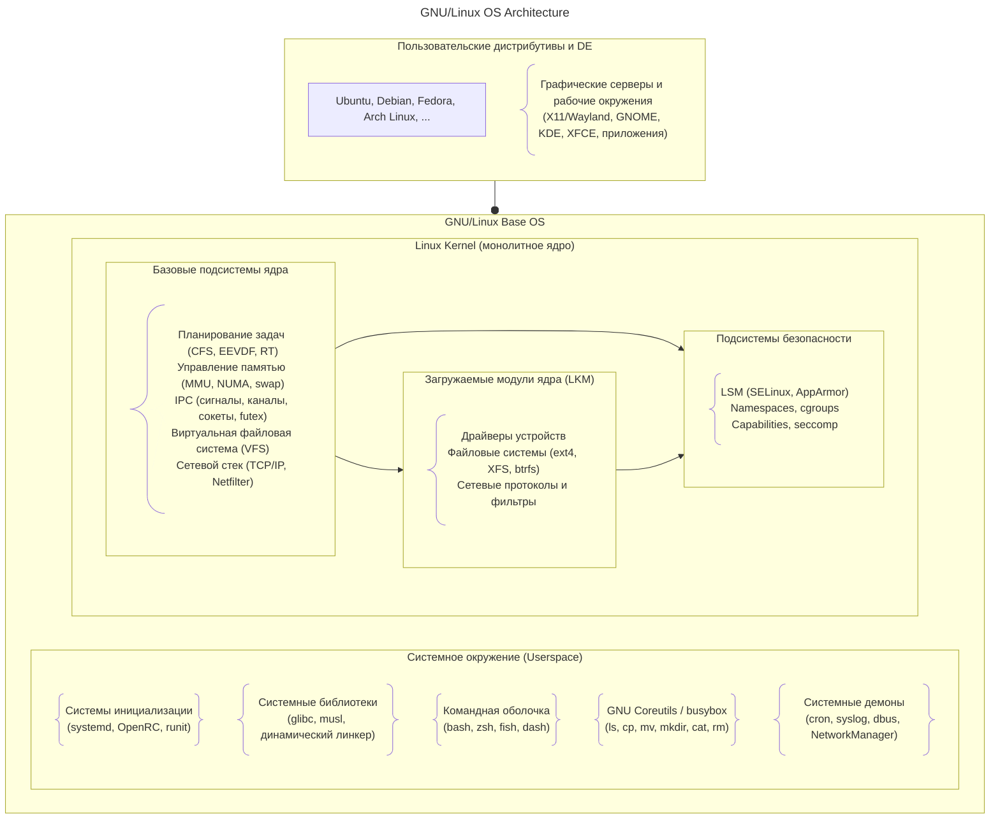
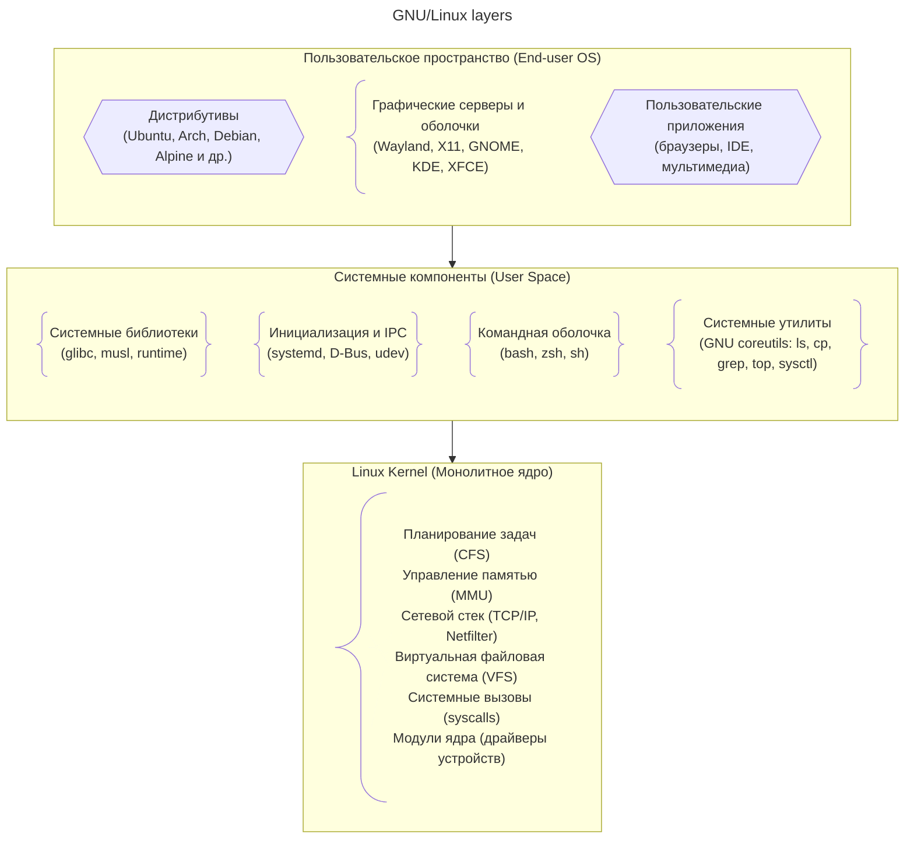

# GNU/Linux OS Architecture

**Пояснения к элементам схемы:**

- **Пользовательские дистрибутивы и DE** – конечные продукты (Ubuntu, Fedora и др.) вместе с графическими серверами (X11/Wayland) и рабочими окружениями (GNOME, KDE). 
- **GNU/Linux Base** – полноценная операционная система, объединяющая ядро Linux и системное окружение пользователя (утилиты, библиотеки, демоны). Аналог Darwin: так же включает ядро и системный userspace.
- **Linux Kernel** – монолитное ядро, включающее базовые подсистемы (планировщик, память, IPC, VFS, сеть), загружаемые модули (драйверы, ФС) и подсистемы безопасности (LSM, cgroups). В отличие от XNU, нет чёткого разделения на микроядро и BSD-слой – всё работает в одном адресном пространстве.
- **Системное окружение (Userspace)** – библиотеки, оболочки, coreutils и системные демоны. Аналог «Darwin System Components» на схеме macOS.

---
# GNU/Linux layers

