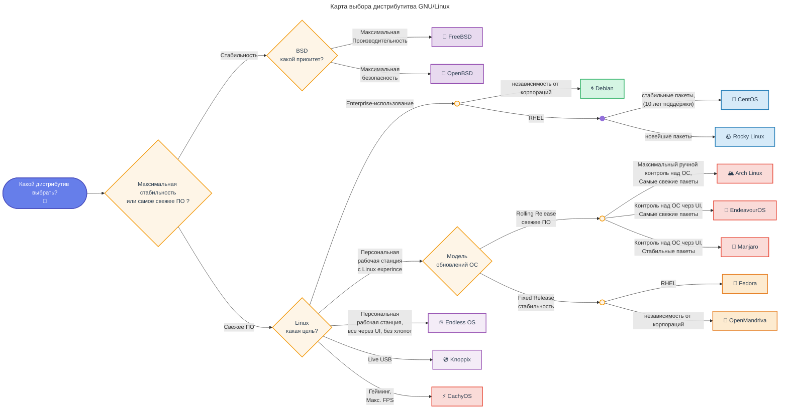

---
aliases:
  - linux-distros-roadmap
---
# какой дистрибутив выбрать?

```mermaid
---
title: Карта выбора дистрибутитва GNU/Linux
---
flowchart LR

Start@{ label: "Какой дистрибутив выбрать?<br><span style=\"padding-left:\">🎯</span>" } --> Q1{"Максимальная стабильность<br>или самое свежее ПО ?"}

Q1 -- Стабильность --> BSD_Q{"BSD<br>какой приоитет?"}

BSD_Q -- Максимальная<br>Производительность --> FreeBSD["🐉 FreeBSD"]

BSD_Q -- Максимальная<br>безопасность --> OpenBSD["🐡 OpenBSD"]

Q1 -- Свежее ПО --> Q2{"Linux<br>какая цель?"}

Q2 -- "Enterprise-использование" --> Server_Q["Какая модель?"]

Server_Q -- независимость от корпораций --> Debian["🌀 Debian"]

Q2 -- Персональная<br>рабочая станция<br>с Linux experince --> Desktop_Q{"Модель<br>обновлений ОС"}

Desktop_Q -- Rolling Release<br>свежее ПО --> Arch_Fam["Какой Arch-дистрибутив?"]

Arch_Fam -- Максимальный ручной контроль над ОС,<br>Самые свежие пакеты --> Arch["🏔️ Arch Linux"]

Arch_Fam -- "<span style=padding-left:>Контроль над ОС черз UI,<br>Самые свежие пакеты</span>" --> EndeavourOS["🌌 EndeavourOS"]

Arch_Fam -- "<span style=padding-left:><span style=padding-left:>Контроль над ОС черз UI,<br>Стабильные пакеты</span></span>" --> Manjaro["🦊 Manjaro"]

Desktop_Q -- Fixed Release<br>стабильность --> Fixed_Q["Какая база?"]

Fixed_Q -- "<span style=padding-left:>RHEL</span>" --> Fedora["🎩 Fedora"]

Fixed_Q -- "<span style=padding-left:>независимость от корпораций</span>" --> OpenMandriva["🌟 OpenMandriva"]

Q2 -- "<span style=padding-left:>Персональная<br>рабочая станция,<br>все через UI, без хлопот</span>" --> Endless["♾️ Endless OS"]

Q2 -- Live USB --> Knoppix["💿 Knoppix"]

Q2 -- "Гейминг,<br>Макс. FPS" --> CachyOS2["⚡ CachyOS"]

Server_Q -- RHEL --> n1["Untitled Node"]

n1 -- "<span style=padding-left:>стабильные пакеты,<br>(10 лет поддержки)</span>" --> CentOS["🎯 CentOS"]

n1 -- новейшие пакеты --> Rocky["🪨 Rocky Linux"]

  

Start@{ shape: stadium}

Server_Q@{ shape: f-circ}

Arch_Fam@{ shape: f-circ}

Fixed_Q@{ shape: f-circ}

n1@{ shape: f-circ}

Start:::startNode

Q1:::question

BSD_Q:::question

FreeBSD:::bsd

OpenBSD:::bsd

Q2:::question

Server_Q:::question

Debian:::debianFamily

Desktop_Q:::question

Arch_Fam:::question

Arch:::archFamily

EndeavourOS:::archFamily

Manjaro:::archFamily

Fixed_Q:::question

Fedora:::fedoraFamily

OpenMandriva:::fedoraFamily

Endless:::special

Knoppix:::special

CachyOS2:::archFamily

CentOS:::rhelFamily

Rocky:::rhelFamily

classDef startNode fill:#667eea,stroke:#4c51bf,color:#fff,stroke-width:2px

classDef question fill:#fef5e7,stroke:#f39c12,stroke-width:2px,color:#2c3e50

classDef bsd fill:#e8daef,stroke:#8e44ad,stroke-width:2px,color:#2c3e50

classDef archFamily fill:#fadbd8,stroke:#e74c3c,stroke-width:2px,color:#2c3e50

classDef rhelFamily fill:#d6eaf8,stroke:#2980b9,stroke-width:2px,color:#2c3e50

classDef debianFamily fill:#d5f5e3,stroke:#27ae60,stroke-width:2px,color:#2c3e50

classDef fedoraFamily fill:#fdebd0,stroke:#e67e22,stroke-width:2px,color:#2c3e50

classDef special fill:#f4ecf7,stroke:#9b59b6,stroke-width:2px,color:#2c3e50
```