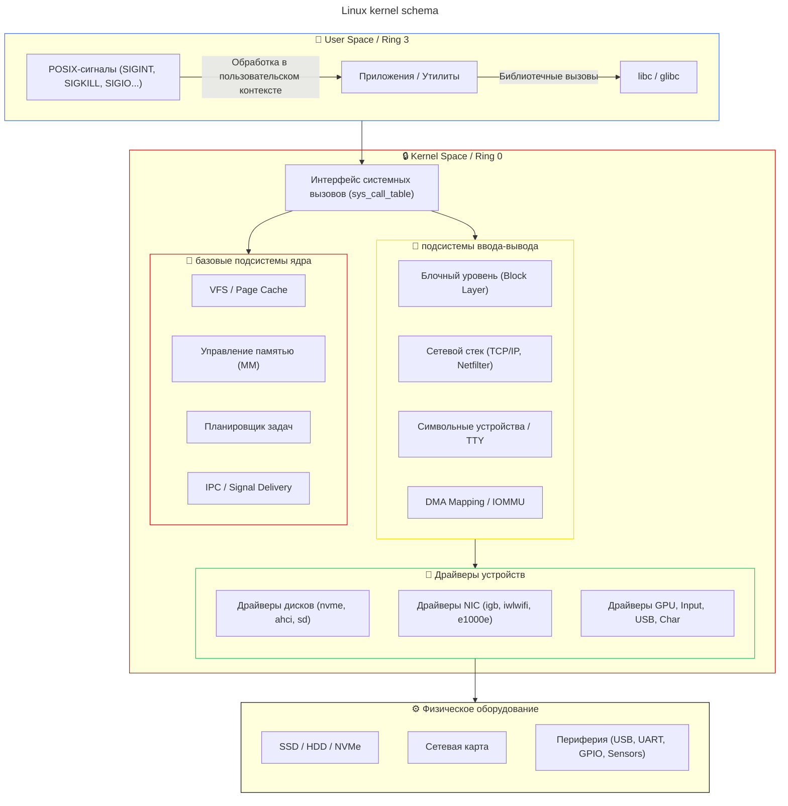

---
aliases:
  - linux-kernel
  - kernel
  - linux
---
# 🖼️ Linux Kernel I/O Schema



---

## ❓ Как называются «процессы ядра»?

**Важное уточнение:** Linux Kernel **не является процессом** в пользовательском понимании. Он работает в **привилегированном режиме (Ring 0)**, имеет прямой доступ к памяти и оборудованию, и не планировается сам собой.

Однако в выводе `ps` или `top` вы видите сущности, которые **выполняют код ядра**:

| Сущность | PID | Роль | Контекст выполнения |
|----------|-----|------|---------------------|
| `swapper` / `idle` | `0` | Задача простоя. Выполняется, когда нет готовых к выполнению процессов. Запускает `kthreadd`. | Ядерный (Kernel Context) |
| `kthreadd` | `2` | «Родитель» всех ядерных потоков. Создаёт рабочие потоки по запросу подсистем. | Ядерный поток (Kernel Thread) |
| `kworker/u:x:y` | `>2` | Фоновые задачи: обработка прерываний, I/O completion, timers, workqueues. | Ядерный поток |
| `rcu_sched`, `rcu_bh` | — | Механизм синхронизации Read-Copy-Update. | Ядерный поток |
| `migration/0`, `watchdog/0` | — | Балансировка нагрузки между ядрами, детекция зависаний. | Ядерный поток |

🔹 **Почему они выглядят как процессы?**  
Потому что планировщик ядра (`CFS`) ставит их в очередь задач так же, как и пользовательские процессы. В `ps` они отмечены квадратными скобками: `[kworker/0:1-events]`, `[kthreadd]`.

🔹 **В каком контексте выполняется код ядра?**
1. **Process Context** – во время системного вызова (выполняется в рамках конкретного PID пользователя).
2. **Interrupt Context** – при обработке IRQ (нет доступа к пользовательской памяти, нельзя спать).
3. **Kernel Thread Context** – фоновые задачи от имени `kthreadd`.

---

## 💻 Пример вызова в Linux Kernel (Syscall)

### 1. Код приложения (User Space)
```c
#include <stdio.h>
#include <unistd.h>
#include <fcntl.h>

int main() {
    int fd = open("/tmp/test.txt", O_RDONLY);
    if (fd < 0) { perror("open"); return 1; }

    char buf[128];
    ssize_t n = read(fd, buf, sizeof(buf)); // 🔥 СИСТЕМНЫЙ ВЫЗОВ

    if (n > 0) write(STDOUT_FILENO, buf, n);
    close(fd);
    return 0;
}
```

### 2. Что происходит на уровне ядра?
```
1. libc(glibc) готовит аргументы в регистрах CPU:
   RAX = 0 (sys_read)
   RDI = fd
   RSI = указатель на buf
   RDX = размер буфера

2. Инструкция syscall / int 0x80 → CPU переключается в Ring 0

3. Ядро: entry_SYSCALL_64() → sys_call_table[0] → sys_read()
   → VFS: vfs_read() → ext4_file_read_iter()
   → Page Cache: проверка наличия страницы в памяти
   → Block Layer: bio_alloc() → submit_bio()
   → Driver: nvme_queue_rq() → DMA в буфер контроллера
   → Hardware: NVMe читает сектора → прерывание (IRQ)

4. Ядро: top-half → softirq → blk_mq_complete_request()
   → разблокировка процесса → возврат из syscall

5. CPU переключается обратно в Ring 3, RAX = количество прочитанных байт (или -errno)
```

### 3. Как увидеть это вживую?
```bash
# Запуск программы с трассировкой системных вызовов
strace -e trace=openat,read,write ./a.out

# Вывод:
# openat(AT_FDCWD, "/tmp/test.txt", O_RDONLY) = 3
# read(3, "Hello Arch Linux!\n", 128)    = 18
# write(1, "Hello Arch Linux!\n", 18)    = 18
```

---

## 📌 Краткий итог
| Вопрос | Ответ |
|--------|-------|
| **Кто «ядро» в ps?** | Это не процессы, а **ядерные потоки** (`kthreadd`, `kworker`, `rcu_*`), работающие в Ring 0. |
| **Какие сигналы принимает ядро?** | POSIX-сигналы от процессов (`SIGKILL`, `SIGINT`, `SIGIO`) + аппаратные **IRQ** от устройств + исключения CPU (`#PF`, `#GP`). |
| **Как происходит вызов?** | Приложение → `libc` → `syscall` → `sys_call_table` → VFS/Net/Block → Driver → Hardware → возврат с результатом. |

Если нужно детализировать конкретную подсистему (например, Network Stack, eBPF, или DMA-цепочку для NVMe), напишите — нарисую отдельную схему с точными структурами ядра (`sk_buff`, `bio`, `task_struct`). 🛠️