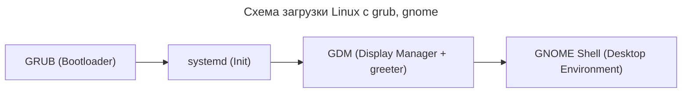
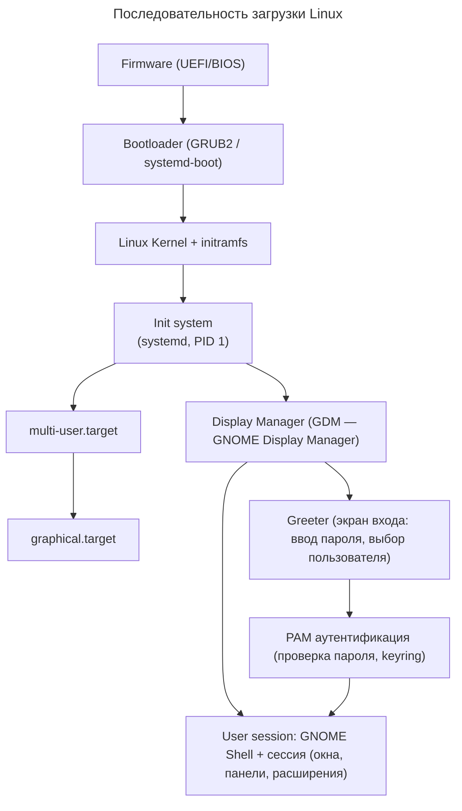
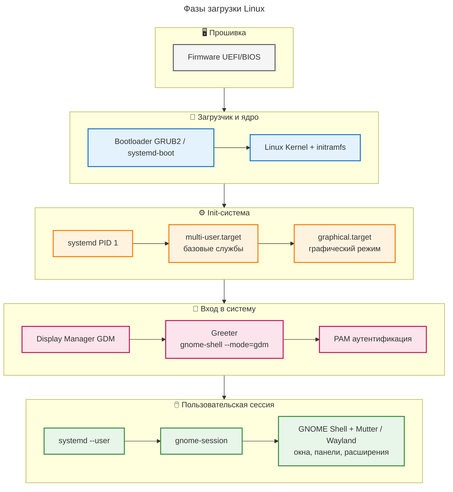

### ✅ Правильная последовательность загрузки

**🧩 Общая схема загрузки**



**🧩 Детальная схема загрузки**




 **📚 Глоссарий терминов**

| Термин | Что это | Примечание |
|--------|---------|------------|
| **GPT** | GUID Partition Table — формат таблицы разделов диска | Не участвует в рантайме, только разметка при установке |
| **GRUB2** | Загрузчик, загружает ядро и initramfs | На UEFI-системах обычно `grub-x86_64-efi` |
| **initramfs** | Временная корневая ФС в RAM для загрузки драйверов | Позволяет смонтировать настоящий root |
| **systemd** | Init-система и менеджер сервисов в Arch Linux | Управляет таргетами: `multi-user.target`, `graphical.target` |
| **GDM** | GNOME Display Manager — служба графического входа | Запускает `greeter` (экран логина) |
| **Greeter** | UI-компонент GDM: поле ввода логина/пароля | Не отдельный процесс, часть `gdm` |
| **GNOME Shell** | Композитор, панель, управление окнами | Основной компонент Desktop Environment |
| **GNOME Session** | Менеджер сессии: запускает приложения, хранит состояние | Запускается после аутентификации |

---

### 🔧 Как проверить каждый этап на своей системе

```bash
# Тип прошивки (UEFI или BIOS)
[ -d /sys/firmware/efi ] && echo "UEFI" || echo "BIOS"
# Версия загрузчика
grub-install --version
# Активный init-система (напр. systemd)
ps -p 1 -o comm=
# Статус графического таргета
systemctl status graphical.target
# Какой Display Manager используется
systemctl status display-manager.service
# или
cat /etc/X11/default-display-manager 2>/dev/null
# Версия GNOME
gnome-shell --version
```

---
---
Ваша схема уже очень близка к реальности. Ниже указаны **минимальные, но важные технические уточнения**, после чего приведён готовый Mermaid-код.

### 🔍 Что стоит уточнить
| Ваш элемент                                      | Уточнение                                                                                                                                                                                                                                                                          |
| ------------------------------------------------ | ---------------------------------------------------------------------------------------------------------------------------------------------------------------------------------------------------------------------------------------------------------------------------------- |
| `systemd → multi-user.target → graphical.target` | Это не строгая очередь, а **цепочка зависимостей**. `graphical.target` объявляет `Requires=multi-user.target`, поэтому systemd сначала поднимает базовые службы, а затем активирует графический режим. В схеме стрелка допустима, но важно понимать, что это именно `зависимость`. |
| Пропущен между Greeter и Сессией                 | Обязательно проходит **PAM-аутентификация** (проверка пароля, `pam_gnome_keyring`, установка сессионных переменных). Без неё переход к пользовательской сессии невозможен.                                                                                                         |
| `User session: GNOME Shell...`                   | После PAM контроль передаётся **`systemd --user`** (изолированный менеджер процессов пользователя), который запускает `gnome-session`, а уже он стартует `GNOME Shell` (Mutter/Wayland).                                                                                           |


### 🎨 Фазы загрузки Linux


Отличный вопрос! Вы очень точно описали стандартное поведение GNOME в Arch Linux. Да, нажатие `Ctrl+Alt+F1`, `F2` и `F3` приводит к трем разным экранам, и у этого есть простое объяснение. Каждая комбинация ведет на свой виртуальный терминал (TTY), где работают разные компоненты системы.

---

### 🧭 Карта виртуальных терминалов (TTY) в GNOME

Чтобы понять, что происходит, нужно знать, что ваш экран — это не одно "место", а переключатель между несколькими независимыми каналами связи с системой, которые называются TTY. Вот как они распределены в GNOME по умолчанию:

| Комбинация клавиш | На какой TTY попадаете | Что там запущено |
| :--- | :--- | :--- |
| **`Ctrl + Alt + F1`** | **TTY1** | **Дисплейный менеджер (GDM)**. Это экран входа в систему (лог-ин), работающий как отдельная служба. |
| **`Ctrl + Alt + F2`** | **TTY2** | **Ваша текущая графическая сессия GNOME**. Здесь работает ваш рабочий стол со всеми окнами. |
| **`Ctrl + Alt + F3`** | **TTY3** | **Чистая текстовая консоль**. Только черный экран и приглашение командной строки (`login:`), без графики. |

---

### 🤔 Почему произошло именно такое разделение?

Такое поведение является результатом эволюции системы и решений, принятых разработчиками GNOME и systemd. Вот основные причины:

1.  **GDM использует отдельный TTY**: GDM — это не просто картинка, а полноценное приложение со своим собственным графическим сервером. Чтобы изолировать его от пользовательской сессии и сделать переключение пользователей и вход в систему более стабильным, он работает на своем выделенном TTY — как правило, на `tty1` .

2.  **Современный подход systemd**: Исторически сложилось, что графическая среда могла запускаться на `tty7`. Однако systemd (современная система инициализации в Arch Linux) отказался от жесткой привязки к конкретным номерам TTY. Теперь графическая сессия (GNOME) просто запускается на первом свободном терминале. В вашей конфигурации им стал `tty2` .

3.  **Остальные TTY — для консоли**: TTY3, TTY4, TTY5 и TTY6 по умолчанию остаются для текстовых консолей. Они нужны для администрирования, отладки или просто для работы в командной строке без графики. Они остаются чистыми, чтобы вы могли попасть в систему, даже если графический интерфейс полностью зависнет .

### 💎 В итоге

Такая схема очень продумана и удобна. Вы имеете три ключевых "слоя" системы, которые независимы и не мешают друг другу:
*   **Слой входа** (TTY1) для безопасной аутентификации.
*   **Рабочий слой** (TTY2) для вашей обычной работы.
*   **Слой управления** (TTY3-6) для "аварийного доступа" или текстовых задач.

Это правильное и ожидаемое поведение для современных дистрибутивов Linux на systemd с GNOME . Если захотите узнать, как изменить количество TTY или перенастроить их, дайте знать