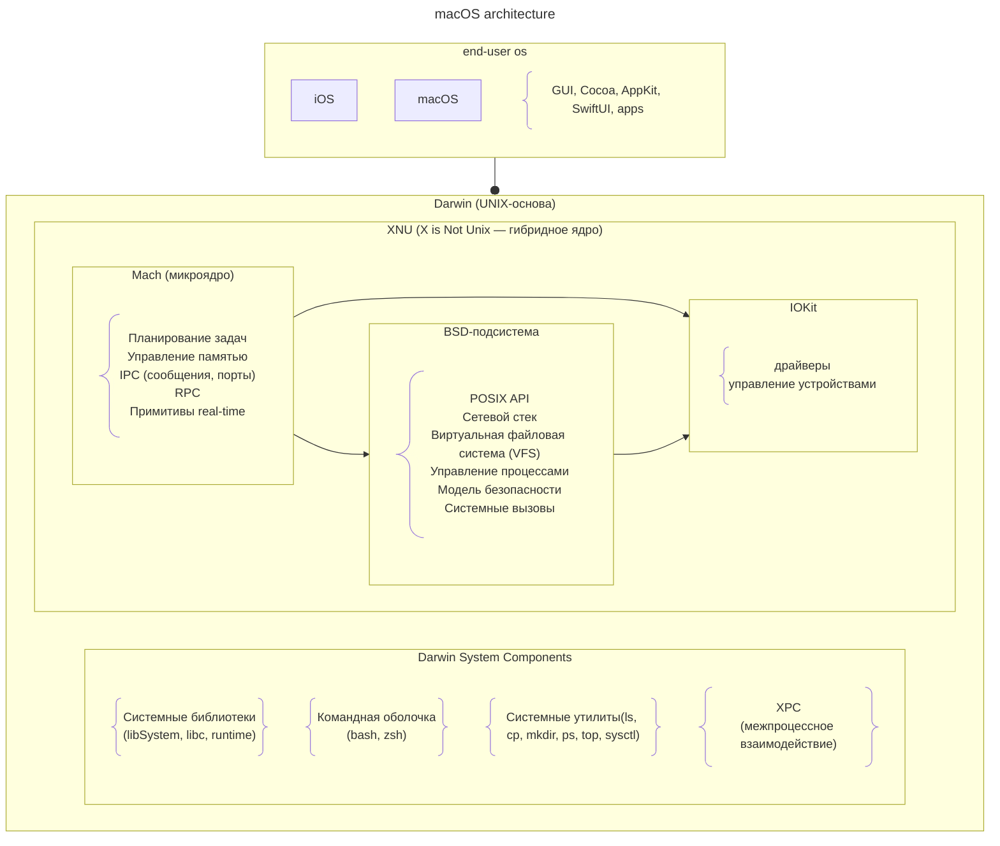

---
aliases:
  - iOS
  - macOS
  - Darwin
  - IPC
  - XNU
  - IOKit
  - BSD
  - Mach
  - kernel
  - os
---
# Darwin Architecture

---

**Пояснения к схеме:**

- **macOS** и **iOS** — пользовательские операционные системы от Apple, надстроенные над общей базой Darwin.
- **Пользовательский интерфейс и фреймворки** — графические слои и API: Cocoa/AppKit для macOS, Cocoa Touch/UIKit для iOS, а также общий SwiftUI и Swift-экосистема; на этом же уровне работают все сторонние приложения.
- **Darwin** — открытая UNIX-подобная основа, включающая как ядро, так и системный пользовательский ландшафт: библиотеки, рантайм (libSystem объединяет libc, dispatch, dyld и др.), командные оболочки, утилиты и XPC (лёгкий межпроцессный транспорт).
- **Ядро XNU** — гибридное ядро, сердце Darwin; имя означает «X is Not Unix». Собирается из трёх основных частей: Mach, BSD-подсистемы и IOKit.
- **Mach** — микроядро, отвечающее за фундаментальные механизмы: планирование потоков и задач, управление виртуальной памятью, межпроцессное взаимодействие (сообщения/порты Mach), удалённые вызовы процедур (RPC), real-time и QoS-примитивы.
- **BSD-подсистема** — UNIX-среда внутри XNU: реализует системные вызовы POSIX, сетевой стек, виртуальную файловую систему (VFS), управление POSIX-процессами, модель прав и безопасности (sandbox, entitlements, MAC Framework).
- **IOKit** — объектно-ориентированная среда драйверов на C++, тесно интегрированная с Mach (через IPC) и BSD (через интерфейсы устройств /dev и стек ввода-вывода).
- **Связь Mach, BSD и IOKit** внутри XNU — все три компонента работают в одном адресном пространстве ядра и активно взаимодействуют: BSD-слой базируется на сервисах Mach (потоки, память, IPC), а IOKit использует Mach-сообщения для событий и BSD-интерфейсы для доступа к устройствам из пользовательского пространства.

---
**Раньше появился GNU — в 1983 году. Ядро XNU появилось позже, в начале 1990‑х.** Разберу подробно.

# GNU vs XNU
## История GNU

* **Год запуска:** 1983. Ричард Столлман объявил о начале проекта GNU («GNU’s Not Unix»).
* **Цель:** создать полностью свободную UNIX‑подобную операционную систему — с открытым кодом, доступным для использования, изучения, изменения и распространения.
* **Ключевые достижения к началу 1990‑х:**
    * компилятор GCC;
    * отладчик GDB;
    * текстовый редактор Emacs;
    * командная оболочка bash;
    * стандартная библиотека C (glibc);
    * множество утилит командной строки (cp, mv, ls, grep и т. д.).
* **Проблема на рубеже 1980–1990‑х:** к началу 1990‑х у проекта GNU был почти полный набор компонентов ОС, **кроме ядра**. Без ядра нельзя было запустить полноценную систему.

## История XNU

* **Период разработки:** начало 1990‑х годов.
* **Происхождение:** разработано компанией NeXT для операционной системы NeXTSTEP.
* **Архитектура:** гибридное ядро, объединяющее:
    * микроядро **Mach** (разработано в Университете Карнеги — Меллон, базовые функции управления процессами, памятью, межпроцессным взаимодействием);
    * компоненты из **BSD** (сетевой стек, модель процессов, файловая система, POSIX‑совместимость);
    * позже добавлен фреймворк для драйверов **I/O Kit**.
* **Дальнейшая судьба:** после того как Apple приобрела NeXT в 1997 году, XNU стало ядром операционных систем Apple — сначала Mac OS X (позже macOS), а затем iOS, tvOS, watchOS и др.

---

## Хронологическая таблица

| Год | Событие |
|----|-------|
| 1983 | Ричард Столлман объявляет о проекте GNU |
| 1984–1991 | Активная разработка компонентов GNU (GCC, Emacs, bash, glibc и т. д.) |
| Начало 1990‑х | Разработка ядра XNU для NeXTSTEP |
| 1991 | Линус Торвальдс начинает работу над ядром Linux |
| 1994 | Выпуск NeXTSTEP 3.3 с ядром XNU |
| 1997 | Apple приобретает компанию NeXT |
| 2000 | Выпуск Mac OS X Server 1.0 на базе Darwin (включает ядро XNU) |

---

## Ключевые различия и итог

| Параметр | GNU | XNU |
|--------|---------|---------|
| **Что это** | Проект по созданию свободной UNIX‑подобной ОС (набор компонентов) | Ядро операционной системы |
| **Год появления** | 1983 | Начало 1990‑х (первый стабильный выпуск — 1994) |
| **Цель** | Создать полностью свободную ОС | Обеспечить работу NeXTSTEP (а позже macOS и других ОС Apple) |
| **Статус** | Компоненты GNU используются в разных ОС (в т. ч. GNU/Linux, Darwin) | Привязано к экосистеме Apple (macOS, iOS и т. д.) |
| **Ядро** | Не было своего ядра на момент запуска; позже появились GNU Hurd (не стало массовым) | Самодостаточное гибридное ядро |

**Вывод:** проект GNU стартовал в 1983 году и стал основой для множества свободных программ. Ядро XNU было разработано позже — в начале 1990‑х — и легло в основу операционных систем Apple. Таким образом, **GNU появился раньше XNU примерно на десятилетие**.

Хотите, я раскрою какой‑то аспект подробнее — например, про развитие GNU без ядра или про эволюцию XNU в macOS?

# Darwin

**Darwin** — это открытая Unix‑подобная операционная система, разработанная Apple Inc. и выпущенная в 2000 году. Она служит **базовым слоем** для ряда операционных систем Apple.

**Ключевые характеристики:**

* **Совместимость:** POSIX‑совместима (унаследовала поддержку POSIX API от BSD), начиная с macOS Leopard (10.5) сертифицирована как совместимая с единой спецификацией UNIX (SUSv3).
* **Исходный код:** распространяется под лицензией Apple Public Source License (APSL), т. е. частично с открытым исходным кодом (драйверы и некоторые компоненты — закрытые).
* **Происхождение:** основана на коде:
    * NeXTSTEP (операционная система компании NeXT, которую Apple приобрела в 1997 году);
    * FreeBSD (элементы ядра и пользовательского пространства);
    * микроядра Mach (разработка Университета Карнеги — Меллон);
    * других проектов свободного ПО.
* **Ядро:** XNU — гибридное ядро, сочетающее:
    * микроядро Mach (управление процессами, памятью, IPC);
    * компоненты FreeBSD (модель процессов, сетевой стек, виртуальная файловая система);
    * IOKit — объектно‑ориентированный фреймворк для разработки драйверов устройств.
* **Формат исполняемых файлов:** Mach‑O (поддерживает несколько архитектур в одном файле).
* **Поддержка архитектур:** PowerPC (32‑ и 64‑разрядные), Intel x86 (32‑ и 64‑разрядные), ARM (32‑ и 64‑разрядные).

**Что Darwin *не* включает:**
* графические интерфейсы Aqua и Quartz Compositor;
* API‑фреймворки Cocoa и Carbon;
* большинство пользовательских приложений macOS.

Поэтому Darwin сам по себе **не может запускать обычные приложения macOS**.

---

### Какие ОС используют Darwin

Darwin является основой для следующих операционных систем Apple:

1. **macOS** (ранее — Mac OS X / OS X): основная настольная ОС для компьютеров Mac. Darwin обеспечивает её ядро и базовые Unix‑сервисы.
2. **iOS:** мобильная ОС для iPhone и iPod touch.
3. **iPadOS:** ОС для планшетов iPad (выделилась из iOS).
4. **watchOS:** ОС для Apple Watch.
5. **tvOS:** ОС для Apple TV.
6. **visionOS:** ОС для гарнитуры Apple Vision Pro.
7. **bridgeOS:** специализированная ОС для управления сопроцессорами безопасности и компонентами T2/M‑серии в Mac.
8. **audioOS:** внутренняя ОС для HomePod (умной колонки Apple).

---

### Историческая справка и связанные проекты

* **OpenDarwin** (2002–2006): сообщество‑ориентированный проект по созданию автономной ОС на базе Darwin (совместная инициатива Apple и Internet Systems Consortium). Закрыт из‑за отсутствия интереса и технических сложностей.
* **PureDarwin:** попытка возродить Darwin как автономную ОС с открытым кодом (выпущены экспериментальные версии с X11 и командной строкой).
* **GNU‑Darwin:** проект по переносу пакетов свободного ПО на Darwin и macOS.
* **MacPorts** (ранее DarwinPorts), **Fink**, **Homebrew:** менеджеры пакетов для установки Unix‑программ на Darwin/macOS.

---

### Краткий итог

| Параметр          | Значение                                                                                           |
| ----------------- | -------------------------------------------------------------------------------------------------- |
| **Тип**           | Unix‑подобная ОС с открытым ядром                                                                  |
| **Разработчик**   | Apple Inc.                                                                                         |
| **Ядро**          | XNU (гибридное: Mach + FreeBSD + IOKit)                                                            |
| **Лицензия**      | APSL (частично открытый код)                                                                       |
| **Совместимость** | POSIX (без сертификации), UNIX (для macOS с версии 10.5)                                           |
| **Основа для**    | macOS, iOS, iPadOS, watchOS, tvOS, visionOS, bridgeOS, audioOS                                     |
| **Статус**        | Развивается как ядровый слой для продуктов Apple (отдельные ISO‑образы не выпускаются с 2005 года) |

Хотите, я раскрою какой‑то аспект подробнее — например, устройство ядра XNU, историю NeXTSTEP или работу с пакетами на Darwin?